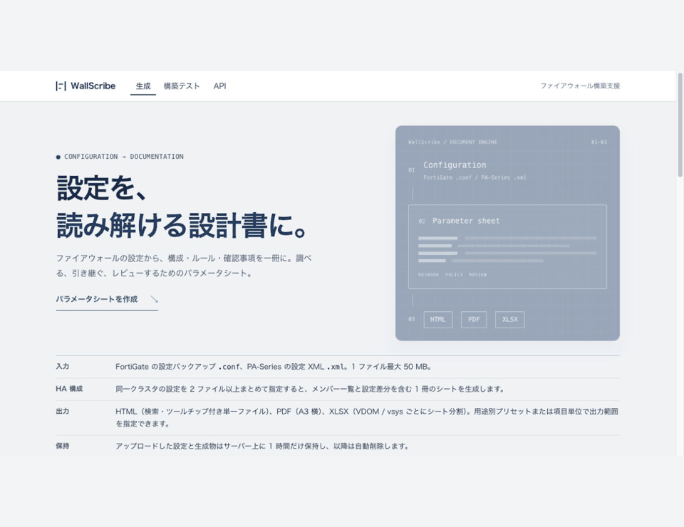
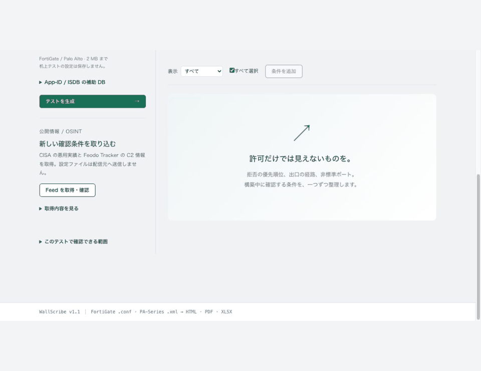

# WallScribe

FortiGate / Palo Alto の設定ファイルから、レビューと引き継ぎに使うパラメータシートを作成するファイアウォール構築支援ツールです。HTML・Excel・PDF の出力と、構築中の設定を確認する机上テストを用意しています。

## 動作イメージ

設定の取り込みから、パラメータシートの生成・閲覧まで。



テストケースの生成と実行、該当ポリシーとルーティングの確認。



GIF は公開用の架空設定で撮影しています。実機の通信や攻撃を実行する機能はありません。

## できること

- FortiGate の VDOM、Palo Alto の vsys・仮想ルーターを含め、インターフェース、ルート、オブジェクト、VPN、セキュリティプロファイルを整理。
- ひとつのネットワーク図で接続関係を確認。ノード選択、検索、拡大、通信条件の調査に対応。
- ISDB、App-ID、application-default を考慮してポリシー候補を調査。カタログや設定だけでは確定できない条件は「要確認」と表示。
- 許可・境界・攻撃を想定した机上ケースを生成。ポリシー不一致、ルート不足、next-vr の循環などを確認。
- CISA KEV / Feodo Tracker の固定 Feed を取得し、公開情報に基づくケースを追加。

パラメータシートが成果物です。構築テストは設定レビューの補助であり、実機の動作・脆弱性・安全性を保証しません。動的ルーティング、実際の App-ID 判定、NAT 後の経路などは実機検証と組み合わせてください。対応範囲と判定条件は [構築テスト](docs/CONSTRUCTION_LAB.md) を参照してください。

## 起動する

Docker Compose を推奨します。PDF に必要なネイティブライブラリも含まれます。

```bash
git clone https://github.com/negitanu/WallScribe.git
cd WallScribe
cp .env.example .env
# .env の SECRET_KEY に、次のコマンドで生成した値を設定
python3 -c 'import secrets; print(secrets.token_hex(32))'
docker compose up --build -d
```

ブラウザで http://127.0.0.1:8080 を開きます。停止は `docker compose down`。ポートは `.env` の `WALLSCRIBE_PORT` で変更できます。初期設定はローカルホストのみで公開します。チームで利用する場合は認証付きリバースプロキシの配下に配置してください。

### ローカル開発

Python 3.12 以降を使用します。

```bash
python3 -m venv .venv
source .venv/bin/activate
pip install -r requirements.txt
pip install -e ".[dev]"
WALLSCRIBE_DISABLE_CLEANUP_THREAD=1 UPLOAD_FOLDER=/tmp/wallscribe-dev python app.py
```

既定ポートは 8080。`FLASK_PORT` で変更できます。PDF 出力には Pango 等が別途必要です。依存関係の揃った Docker で検証できます。

### CLI でシートを生成

```bash
python main.py examples/fortigate-vdom.conf -o /tmp/fortigate.html
python main.py examples/paloalto-vsys.xml --format excel -o /tmp/paloalto.xlsx
python main.py --help
```

[examples](examples/) には架空設定を収録しています。複数ファイルによる HA 構成や診断 JSON の出力は `--help` を参照してください。

## 設定ファイルの扱い

Web のシート生成ではファイルを `uploads/` に保存し、期限切れのファイルを定期削除します。構築テストの設定はメモリ上で解析します。Feed への取得要求に設定ファイルは送信しません。生成されたシートにも内部アドレスや構成情報が含まれるため、元の設定と同じ管理範囲で扱ってください。

Web アップロード上限は既定 50 MB。構築テストは設定 2 MB・ケース 200 件を上限にしています。上限や保存期間は [仕様](docs/SPECIFICATION.md) と [構築テスト](docs/CONSTRUCTION_LAB.md) を参照してください。

## テストと変更

```bash
WALLSCRIBE_DISABLE_CLEANUP_THREAD=1 UPLOAD_FOLDER=/tmp/wallscribe-tests pytest -q
# PDF を含むコンテナテスト
docker compose --profile test run --rm test
```

テストでは利用中の `uploads/` を指定しないでください。GitHub Actions でもテストを実行します。開発手順と責務の分け方は [CONTRIBUTING.md](CONTRIBUTING.md) を参照してください。

## 詳細資料

- [構築テスト・Feed・判定の限界](docs/CONSTRUCTION_LAB.md)
- [ネットワーク図](docs/NETWORK_EXPLORER.md) / [通信調査](docs/NETWORK_INVESTIGATION.md)
- [パーサー](docs/PARSER_ENHANCEMENTS.md)
- [アーキテクチャ](docs/ARCHITECTURE.md) / [仕様](docs/SPECIFICATION.md)
- [デザイン共通ルール](docs/DESIGN_SYSTEM.md)

MIT License。バグ報告には機密情報を除いた最小設定、期待した結果、実際の結果を添えてください。
