# Python セキュリティ構造マップ (Deep Analyzer V4)

> 生成元: `/Users/tkobayashi/src/WallScribe` — 82 ファイル解析

> ⚠️ このレポートはソースコードを一切含みません。
> AIはこの構造情報のみで脆弱性を特定できます。

## 📊 サマリー

| 項目 | 件数 |
|:---|---:|
| 解析ファイル数 | 82 |
| クラス数 | 166 |
| 関数数 | 684 |
| テイントフロー検出 (CRITICAL) | 🔴 0 |
| テイントフロー検出 (HIGH) | 🟠 30 |
| 静的スキャン指摘 (CRITICAL) | 🔴 0 |
| 脆弱パッケージ | ⚠️ 2 |

---
## 1. クラス構造

```mermaid
classDiagram
    class AddressGroup {
    }
    class AddressObject {
    }
    class AdminUser {
    }
    class Alignment {
    }
    class AntivirusProfile {
    }
    class AppControlEntry {
    }
    class AppControlProfile {
    }
    class AppSettings {
        +from_env() 'AppSettings'
        +apply_to_flask(app) None
    }
    class BGPNeighbor {
    }
    class BGPNetwork {
    }
    class BGPRedistribute {
    }
    class BGPSettings {
    }
    ABC <|-- BaseConfigParser
    class BaseConfigParser {
        +__init__() None
        +parse(file_path) ConfigModel
        +parse_content(content, filename) ConfigModel
        +detect_file_type() bool
        +detect_content_type() bool
        +read_file(file_path) Optional[str]
        +add_error(message) None
    }
    class Border {
    }
    class CacheManager {
        +__new__() 'CacheManager'
        +get(key) Optional[Any]
        +set(key, value) None
        +clear(key) None
        +reset_instance() None
    }
    class ClusterConfig {
        +get_config() Optional[ConfigModel]
        +get_summary() Dict[str, Any]
        +has_differences() bool
    }
    class ConfigDifference {
    }
    class ConfigModel {
        +get_summary() Dict[str, Any]
    }
    class DHCPServer {
    }
    class DeviceInfo {
    }
    Enum <|-- DeviceType
    class DeviceType {
    }
    class ExcelCommonMixin {
        +_uses_legacy_sheet_names(vdom) bool
        +_create_sheet(title, vdom) Worksheet
        +_set_header_row(ws, headers, row) None
        +_set_cell(ws, row, col, value, fill, font, center, is_status, status_value) None
        +_set_status_cell(ws, row, col, enabled, enabled_text, disabled_text) None
        +_set_action_cell(ws, row, col, action) None
        +_set_section_title(ws, row, col, title, colspan) None
        +_auto_column_width(ws, min_width, max_width) None
        +_list_to_str(items, separator) str
    }
    ExcelCommonMixin <|-- ExcelExporter
    ExcelGlobalSheetsMixin <|-- ExcelExporter
    ExcelVdomSheetsMixin <|-- ExcelExporter
    class ExcelExporter {
        +__init__(config, sections, cluster_config) None
        +_build_vdom_color_map() None
        +_get_vdom_list() List[str]
        +_get_vdom_label() str
        +_filter_by_vdom(items, vdom) List[Any]
        +_get_vdom_color(vdom) dict
        +_set_vdom_context(vdom) None
        +_get_vdom_styles(vdom) dict
        +_section_selected(key) bool
        +export(output_path, sections) Workbook
        +_create_interfaces_sheet() None
        +_create_routes_sheet() None
        +_create_objects_sheet() None
        +_create_policies_sheet() None
        +_create_local_in_policies_sheet() None
        +_create_nat_sheet() None
        +_create_vpn_sheet() None
        +_create_security_profiles_sheet() None
    }
    class ExcelGlobalSheetsMixin {
        +_annotate_default(value, field_path) str
        +_create_cluster_overview_sheet() None
        +_create_overview_sheet() None
        +_create_system_sheet() None
        +_create_ha_sheet() None
        +_create_logging_sheet() None
    }
    class ExcelVdomSheetsMixin {
        +_create_vdom_sheets() None
        +_create_interfaces_sheet_for_vdom(vdom) None
        +_create_routes_sheet_for_vdom(vdom) None
        +_add_ospf_section(ws, row_idx, ospf, title) int
        +_add_bgp_section(ws, row_idx, bgp) int
        +_create_objects_sheet_for_vdom(vdom) None
        +_create_policies_sheet_for_vdom(vdom) None
        +_create_nat_sheet_for_vdom(vdom) None
        +_create_vpn_sheet_for_vdom(vdom) None
        +_create_security_profiles_sheet_for_vdom(vdom) None
        +_create_dhcp_sheet_for_vdom(vdom) None
    }
    class ExportCapabilities {
    }
    RuntimeError <|-- ExportDependencyMissing
    class ExportDependencyMissing {
    }
    WallScribeError <|-- ExportError
    class ExportError {
        +__init__(message, details) None
    }
    WallScribeError <|-- FileError
    class FileError {
        +__init__(message, details) None
    }
    class FirewallPolicy {
    }
    class Font {
    }
    BaseConfigParser <|-- FortiGateParser
    class FortiGateParser {
        +__init__() None
        +detect_file_type() bool
        +detect_content_type() bool
        +parse(file_path) ConfigModel
        +parse_content(content, filename) ConfigModel
        +_separate_config(lines) None
        +_parse_header_line(line) None
        +_parse_header() None
        +_parse_config_tree(config_lines, line_count) Tuple[Dict[str, Any], int]
        +_parse_value(value_str) Any
        +_parse_global_config() None
        +_parse_vdom_configs() None
        +_convert_to_model() None
    }
    class HAClusterInfo {
        +get_primary() Optional[HAMemberInfo]
        +get_secondary() Optional[HAMemberInfo]
        +get_member_count() int
    }
    class HAHeartbeatInterface {
    }
    class HAManagementInterface {
    }
    class HAMemberInfo {
        +get_display_role() str
    }
    Enum <|-- HAMode
    class HAMode {
    }
    Enum <|-- HARole
    class HARole {
    }
    class HASettings {
    }
    class HTMLExporter {
        +__init__(config, sections, for_pdf) None
        +_with_default(value, default_key) str
        +_list_with_default(items, default_key) str
        +_resolve_isdb_name(isdb_id) str
        +_resolve_isdb_names(items) List[str]
        +_security_profiles_to_badges(profiles) str
        +_services_to_badges(services) str
        +_get_vdom_list() List[str]
        +_filter_by_vdom(items, vdom) List[Any]
        +_with_default_annotation(value, field_path) str
        +_format_protocol_number() str
        +_build_object_lookups() None
        +_format_tooltip_table(rows) str
        +_get_interface_tooltip(name, vdom) str
        +_is_internet_service(name) bool
        +_get_internet_service_tooltip(name) str
        +_get_address_tooltip(name, vdom) str
        +_get_service_tooltip(name, vdom) str
        +_with_tooltip(text, tooltip) str
        +_interface_with_tooltip(name, vdom) str
        +_address_with_tooltip(name, vdom) str
        +_service_with_tooltip(name, vdom) str
        +_interfaces_to_lines_with_tooltip(interfaces, vdom) str
        +_addresses_to_lines_with_tooltip(addresses, vdom) str
        +_services_to_badges_with_tooltip(services, vdom) str
        +_get_security_profile_tooltip(profile_str, vdom) str
        +_security_profiles_to_badges_with_tooltip(profiles, vdom) str
        +_get_vdom_label() str
        +export(output_path) str
        +_generate_toc() str
        +_generate_sections() str
        +_generate_html() str
        +_generate_device_info_section(section_num, section_id) str
        +_generate_system_settings_section(section_num, section_id) str
        +_generate_network_section(section_num, section_id, vdom) str
        +_generate_ospf_html(ospf_settings) str
        +_generate_bgp_html(bgp_settings) str
        +_get_zone_class(zone) str
        +_format_allowed_access(allowed_access) str
        +_generate_objects_section(section_num, section_id, vdom) str
        +_generate_policies_section(section_num, section_id, vdom) str
        +_get_action_class(action) str
        +_generate_nat_section(section_num, section_id, vdom) str
        +_generate_vpn_section(section_num, section_id, vdom) str
        +_generate_security_profiles_section(section_num, section_id, vdom) str
        +_generate_cluster_overview_section(section_num, section_id) str
        +_generate_ha_section(section_num, section_id) str
        +_generate_logging_section(section_num, section_id) str
    }
    class HtmlFormatter {
        +escape() str
        +list_to_str(separator) str
        +list_to_lines(items) str
        +with_default(value, default) str
        +list_with_default(items, default) str
        +with_default_annotation(value, is_default) str
        +to_badges(items, color_map, extract_key) str
    }
    class IPSProfile {
    }
    class IPSecPhase1 {
    }
    class IPSecPhase2 {
    }
    class IdentifiedDevice {
    }
    class InputContent {
    }
    class Interface {
    }
    logging_Formatter <|-- JSONFormatter
    class JSONFormatter {
        +format(record) str
    }
    class JobProcessor {
        +__init__() None
        +process_job_multi(file_id, input_paths, original_filenames, output_format, sections, upload_folder, output_path, output_filename, ha_mode) None
    }
    class LicenseInfo {
    }
    class LocalInPolicy {
    }
    class LoggingSettings {
    }
    class NATPolicy {
    }
    class OSPFArea {
    }
    class OSPFInterface {
    }
    class OSPFRedistribute {
    }
    class OSPFSettings {
    }
    class Objects {
    }
    Enum <|-- OperationMode
    class OperationMode {
    }
    class PDFExporter {
        +__init__(config, sections) None
        +export(output_path) str
        +_generate_header_css() str
        +_get_pdf_css() str
        +_get_pdf_css_object() CSS
        +_get_font_config() FontConfiguration
        +_get_fallback_pdf_css() str
    }
    BaseConfigParser <|-- PaloAltoParser
    class PaloAltoParser {
        +__init__() None
        +detect_file_type() bool
        +detect_content_type() bool
        +parse(file_path) ConfigModel
        +parse_content(content, filename) ConfigModel
        +_get_text(element, path, default) str
        +_get_members(element, path) List[str]
        +_parse_device_info() None
        +_parse_system_settings() None
        +_parse_interfaces() None
        +_parse_interface_entry(entry, iface_type) Optional[Interface]
        +_parse_zones() None
        +_get_first_vsys_name() str
        +_parse_routes() None
        +_parse_dhcp() None
        +_parse_objects() None
        +_parse_objects_for_vsys(vsys, vsys_name) None
        +_parse_policies() None
        +_parse_nat() None
        +_parse_vpn() None
        +_parse_security_profiles() None
        +_parse_ha() None
        +_parse_logging() None
    }
    WallScribeError <|-- ParseError
    class ParseError {
        +__init__(message, details) None
    }
    class ParseResult {
        +summary() dict
    }
    ValueError <|-- PathValidationError
    class PathValidationError {
    }
    class PatternFill {
    }
    Enum <|-- PolicyAction
    class PolicyAction {
    }
    class PolicyRoute {
    }
    class Route {
    }
    class RoutingSettings {
    }
    class RuntimeDependencies {
    }
    class SNMPSettings {
    }
    class SSLInspectionProfile {
    }
    class SSLVPNSettings {
    }
    class SecurityProfile {
    }
    class SecurityProfiles {
    }
    class ServiceGroup {
    }
    class ServiceObject {
    }
    class Side {
    }
    class StructuredLogger {
        +setup_logging(format_type, output_stream) None
    }
    class SyslogServer {
    }
    class SystemSettings {
    }
    class TestAPISpecs {
        +test_api_spec_structure() None
        +test_api_info() None
        +test_api_tags() None
        +test_api_schemas() None
        +test_error_schema() None
        +test_upload_response_schema() None
    }
    class TestAllowedFile {
        +test_allowed_conf() None
        +test_allowed_xml() None
        +test_not_allowed_txt() None
        +test_not_allowed_exe() None
        +test_no_extension() None
    }
    class TestBuildClusterConfig {
        +test_empty_configs() None
        +test_non_ha_cluster() None
        +test_ha_cluster_with_two_members() None
    }
    class TestCIDRNotation {
        +test_address_object_cidr() None
        +test_interface_cidr() None
        +test_route_cidr() None
    }
    class TestCacheManager {
        +test_singleton() None
        +test_set_and_get() None
        +test_get_nonexistent() None
        +test_clear_specific_key() None
        +test_internet_service_display(sample_config_model) None
        +test_tooltip_generation(sample_config_model) None
        +test_tooltip_in_html(sample_config_model) None
        +test_sections_filtering(sample_config_model) None
        +test_pdf_exporter(sample_config_model) None
        +test_pdf_exporter_header_css_with_cluster_config(sample_config_model) None
        +test_excel_export_with_sections(sample_config_model) None
    }
    class TestConfigModel {
        +test_default_values() None
        +test_default_fields_tracking() None
        +test_get_summary(sample_config_model) None
        +test_summary_counts(sample_config_model) None
    }
    class TestDeleteJob {
        +test_delete_job_invalid_id(client) None
        +test_delete_job_success(client, sample_file_id) None
        +test_delete_job_no_files(client, sample_file_id) None
    }
    class TestDetectConfigDifferences {
        +test_single_member() None
        +test_hostname_difference() None
        +test_policy_count_difference() None
    }
    class TestDetectEncoding {
        +test_detect_utf8() None
        +test_detect_utf8_bom() None
        +test_detect_cp932() None
        +test_detect_ascii() None
    }
    class TestDetectHaCluster {
        +test_single_config() None
        +test_same_group_id() None
        +test_different_group_id_same_ha_mode() None
        +test_mixed_ha_modes() None
        +test_same_ha_mode_no_group_id() None
        +test_standalone_mode() None
    }
    class TestDetermineHaRoles {
        +test_priority_based_role_assignment() None
        +test_invalid_priority_handled() None
    }
    class TestDeviceInfo {
        +test_default_values() None
        +test_custom_values() None
    }
    class TestDownloadRoute {
        +test_download_invalid_file_id(client) None
        +test_download_nonexistent_file(client) None
    }
    class TestErrorHandlers {
        +test_404_error(client) None
        +test_large_file_error(client) None
    }
    class TestExcelCommonMixin {
        +test_import_common() None
        +test_mixin_has_required_methods() None
    }
    class TestExcelExporter {
        +test_export_to_file(sample_config_model) None
        +test_export_creates_sheets(sample_config_model) None
        +test_overview_sheet_content(sample_config_model) None
        +test_policies_sheet_content(sample_config_model) None
        +test_routes_sheet_contains_blackhole_gateway_label(sample_config_model) None
    }
    class TestExcelExporterIntegration {
        +test_exporter_import() None
        +test_exporter_initialization(sample_config) None
        +test_exporter_with_cluster(sample_config, sample_cluster_config) None
        +test_export_to_file(sample_config, tmp_path) None
        +test_export_with_sections(sample_config, tmp_path) None
        +test_export_cluster(sample_config, sample_cluster_config, tmp_path) None
    }
    class TestExcelGlobalSheetsMixin {
        +test_import_global_sheets() None
        +test_mixin_has_required_methods() None
    }
    class TestExcelStyles {
        +test_vdom_colors_count() None
        +test_vdom_colors_structure() None
        +test_global_color_structure() None
        +test_colors_structure() None
        +test_header_font() None
        +test_header_fill() None
        +test_action_fills() None
        +test_action_fonts() None
    }
    class TestExcelStylesIntegration {
        +test_import_styles() None
        +test_vdom_colors_count() None
        +test_color_structure() None
    }
    class TestExcelVdomSheetsMixin {
        +test_import_vdom_sheets() None
        +test_mixin_has_required_methods() None
    }
    class TestExportError {
        +test_export_error() None
    }
    class TestFileError {
        +test_file_error() None
    }
    class TestFirewallPolicy {
        +test_default_values() None
        +test_custom_policy() None
    }
    class TestFortiGateParser {
        +test_parse_content(sample_fortigate_config) None
        +test_parse_model_compact_code() None
        +test_parse_fortios_80_header() None
        +test_parse_interfaces(sample_fortigate_config) None
        +test_parse_dns(sample_fortigate_config) None
        +test_parse_ha_hbdev_list() None
        +test_parse_addresses(sample_fortigate_config) None
        +test_parse_policies(sample_fortigate_config) None
        +test_parse_policy_action_default_deny() None
        +test_detect_file_type() None
        +test_detect_content_type(sample_fortigate_config) None
        +test_parse_internet_service_name() None
        +test_parse_fortios_80_policy_ipv6_and_tags() None
        +test_parse_fortios_80_address_tags_and_telemetry() None
        +test_parse_ipsec_non_interface_sections() None
        +test_parse_cidr_conversion_address() None
        +test_parse_cidr_conversion_interface() None
        +test_parse_cidr_conversion_route() None
        +test_parse_interface_ipv6() None
        +test_parse_interface_dual_stack() None
        +test_parse_route_static6() None
        +test_parse_route_blackhole() None
        +test_parse_route_blackhole6() None
        +test_parse_address6_object() None
    }
    class TestGetFileExtension {
        +test_conf_extension() None
        +test_xml_extension() None
        +test_uppercase_extension() None
    }
    class TestGetHaMgmtInfo {
        +test_no_ha_mgmt_interfaces() None
        +test_single_ha_mgmt_interface() None
        +test_multiple_ha_mgmt_interfaces() None
    }
    class TestGetJob {
        +test_get_job_invalid_id(client) None
        +test_get_job_not_found(mock_load, client, sample_file_id) None
        +test_get_job_success(mock_load, client, sample_file_id, sample_metadata) None
    }
    class TestGetNested {
        +test_simple_key() None
        +test_nested_keys() None
        +test_nonexistent_key() None
        +test_default_value() None
        +test_partial_path() None
    }
    class TestGetParserForContent {
        +test_fortigate_detection(sample_fortigate_config) None
        +test_paloalto_detection(sample_paloalto_config) None
        +test_unknown_format() None
    }
    class TestHASettings {
        +test_standalone() None
        +test_active_passive() None
    }
    class TestHTMLExporter {
        +test_export_to_string(sample_config_model) None
        +test_export_to_file(sample_config_model) None
        +test_export_contains_device_info(sample_config_model) None
        +test_export_contains_interfaces(sample_config_model) None
        +test_export_contains_policies(sample_config_model) None
        +test_export_contains_blackhole_route(sample_config_model) None
        +test_export_for_pdf(sample_config_model) None
        +test_pdf_css_preserves_header_styles() None
        +test_pdf_css_preserves_toc_styles() None
        +test_export_contains_nat_mode(sample_config_model) None
        +test_export_contains_central_nat_mode(sample_config_model) None
        +test_export_contains_central_snat_section(sample_config_model) None
        +test_export_default_annotation_in_ha(sample_config_model) None
        +test_escape_special_characters(sample_config_model) None
    }
    class TestHealthCheck {
        +test_health_check(client) None
        +test_liveness_check(client) None
        +test_readiness_check(client) None
    }
    class TestHtmlFormatter {
        +test_escape_html() None
        +test_list_to_str() None
        +test_list_to_lines() None
        +test_with_default() None
        +test_to_badges() None
        +test_with_default_annotation_is_default() None
        +test_with_default_annotation_not_default() None
    }
    class TestIPToCIDR {
        +test_ip_to_cidr_basic() None
        +test_ip_to_cidr_host() None
        +test_ip_to_cidr_already_cidr() None
        +test_ip_to_cidr_list() None
        +test_ip_to_cidr_ipv6_prefixlen() None
        +test_ip_to_cidr_invalid() None
        +test_ip_to_cidr_empty() None
        +test_ip_to_cidr_various_masks() None
    }
    class TestISDBData {
        +test_load_isdb() None
        +test_isdb_data_structure() None
    }
    class TestIndexRoute {
        +test_index_page(client) None
    }
    class TestIntegration {
        +test_logging_config_import() None
        +test_metrics_import() None
        +test_styles_import() None
        +test_exceptions_import() None
        +test_validation_import() None
        +test_app_optional_imports() None
        +test_config_files_exist() None
        +test_github_workflows_exist() None
    }
    class TestInterface {
        +test_default_values() None
        +test_custom_interface() None
    }
    class TestInternetService {
        +test_policy_with_internet_service() None
        +test_policy_default_internet_service() None
    }
    class TestInternetServiceDisplay {
        +test_internet_service_tooltip(sample_config_model) None
        +test_internet_service_display_in_html(sample_config_model) None
        +test_internet_service_with_destination_address(sample_config_model) None
    }
    class TestInternetServiceParsing {
        +test_parse_internet_service_name() None
        +test_parse_internet_service_with_dstaddr() None
    }
    class TestJSONFormatter {
        +test_format_basic() None
        +test_format_with_exception() None
    }
    class TestListJobs {
        +test_list_jobs_empty(client) None
        +test_list_jobs_with_data(mock_load, client, sample_file_id, sample_metadata) None
        +test_list_jobs_with_limit(client) None
        +test_list_jobs_with_invalid_limit(client) None
    }
    class TestLoggingIntegration {
        +test_log_levels() None
    }
    class TestMetrics {
        +test_get_metrics() None
        +test_record_request() None
        +test_record_file_upload() None
        +test_record_error() None
        +test_set_active_jobs() None
        +test_record_processed_file() None
        +test_metrics_format() None
    }
    class TestObjects {
        +test_default_values() None
        +test_add_address_object() None
    }
    class TestPaloAltoHAPriority {
        +test_paloalto_lower_priority_is_primary() None
        +test_fortigate_higher_priority_is_primary() None
        +test_paloalto_cluster_name_empty() None
    }
    class TestPaloAltoParser {
        +test_parse_content(sample_paloalto_config) None
        +test_parse_system_settings(sample_paloalto_config) None
        +test_parse_interfaces(sample_paloalto_config) None
        +test_parse_addresses(sample_paloalto_config) None
        +test_parse_policies(sample_paloalto_config) None
        +test_parse_ha_more_details() None
        +test_parse_policy_action_default_deny() None
        +test_detect_file_type() None
        +test_detect_content_type(sample_paloalto_config) None
        +test_detect_content_type_set_cli() None
        +test_parse_set_cli_format(sample_paloalto_cli_set) None
        +test_parse_set_cli_format_ip_range_and_mask_notation() None
        +test_invalid_xml() None
        +test_parse_cidr_conversion_address() None
        +test_parse_cidr_conversion_route() None
        +test_parse_route_discard() None
    }
    class TestPaloAltoParserEnhanced {
        +test_parse_detail_version() None
        +test_parse_detail_version_fallback() None
        +test_parse_management_interface_default() None
        +test_parse_interface_management_profile() None
        +test_parse_default_protocols_when_no_profile() None
        +test_parse_permitted_ip_to_trust_hosts() None
        +test_parse_nat_enhanced() None
        +test_parse_vpn_crypto_profiles() None
        +test_parse_security_profiles_extended() None
        +test_parse_profile_group() None
    }
    class TestParseError {
        +test_parse_error() None
    }
    class TestParseHaCluster {
        +test_empty_file_paths() None
        +test_single_file_success(mock_parse) None
        +test_single_file_failure(mock_parse) None
        +test_multiple_files_no_valid(mock_parse) None
    }
    class TestParseHaClusterFromContents {
        +test_empty_contents() None
        +test_single_content_success(mock_parse) None
        +test_single_content_failure(mock_parse) None
        +test_multiple_contents_all_fail(mock_parse) None
    }
    class TestParseProposal {
        +test_simple_proposal() None
        +test_list_proposal() None
        +test_encryption_only() None
        +test_empty_proposal() None
    }
    class TestPolicyAction {
        +test_enum_values() None
    }
    class TestPreviewRoute {
        +test_preview_invalid_file_id(client) None
        +test_preview_nonexistent_file(client) None
    }
    class TestRateLimiting {
        +test_limiter_optional_import() None
        +test_rate_limit_configuration() None
    }
    class TestSecurityHeaders {
        +test_security_headers(client) None
    }
    class TestStatusRoute {
        +test_status_invalid_file_id(client) None
        +test_status_nonexistent_file(client) None
    }
    class TestStructuredLogger {
        +test_setup_logging_json() None
        +test_setup_logging_text() None
        +test_get_logger() None
    }
    class TestSystemSettings {
        +test_default_values() None
        +test_central_nat_enabled() None
    }
    class TestToList {
        +test_list_input() None
        +test_string_input() None
        +test_none_input() None
        +test_empty_string() None
    }
    class TestUploadDependencyCheck {
        +test_upload_pdf_without_weasyprint(mock_thread, client, sample_fortigate_content) None
        +test_upload_excel_format(mock_thread, client, sample_fortigate_content) None
    }
    class TestUploadFileAsync {
        +test_upload_no_file(client) None
        +test_upload_empty_filename(client) None
        +test_upload_unsupported_format(client) None
        +test_upload_invalid_output_format(client, sample_fortigate_content) None
        +test_upload_invalid_ha_mode(client, sample_fortigate_content) None
        +test_upload_invalid_file_content(client) None
        +test_upload_fortigate_success(mock_thread, client, sample_fortigate_content) None
        +test_upload_paloalto_success(mock_thread, client, sample_paloalto_content) None
        +test_upload_multiple_files(mock_thread, client, sample_fortigate_content) None
        +test_upload_with_sections(mock_thread, client, sample_fortigate_content) None
        +test_upload_with_invalid_sections_json(mock_thread, client, sample_fortigate_content) None
        +test_upload_legacy_endpoint(mock_thread, client, sample_fortigate_content) None
        +test_upload_with_single_file_field(mock_thread, client, sample_fortigate_content) None
    }
    class TestUploadRoute {
        +test_upload_no_file(client) None
        +test_upload_empty_filename(client) None
        +test_upload_unsupported_format(client) None
        +test_upload_invalid_content(client) None
        +test_upload_valid_fortigate(client, sample_fortigate_config) None
        +test_upload_valid_paloalto(client, sample_paloalto_config) None
        +test_upload_excel_format(client, sample_fortigate_config) None
        +test_upload_pdf_format(client, sample_fortigate_config) None
        +test_upload_with_sections(client, sample_fortigate_config) None
        +test_upload_with_internet_service(client) None
        +test_upload_unsupported_output_format(client, sample_fortigate_config) None
    }
    class TestVPNSettings {
        +test_default_values() None
        +test_with_ipsec(sample_config_model) None
    }
    class TestValidateFileContent {
        +test_fortigate_valid() None
        +test_fortigate_valid_alternative() None
        +test_fortigate_invalid() None
        +test_paloalto_valid() None
        +test_paloalto_invalid() None
        +test_unsupported_format() None
    }
    class TestValidateFileSize {
        +test_valid_size() None
        +test_invalid_size() None
    }
    class TestValidateHaMode {
        +test_valid_modes() None
        +test_invalid_mode() None
    }
    class TestValidateOutputFormat {
        +test_valid_formats() None
        +test_invalid_format() None
    }
    class TestValidationError {
        +test_validation_error() None
    }
    class TestWallScribeError {
        +test_basic_error() None
        +test_error_with_code() None
        +test_error_with_details() None
        +test_to_dict() None
        +test_to_dict_without_details() None
    }
    ValueError <|-- UnsupportedConfigFormat
    class UnsupportedConfigFormat {
    }
    ValueError <|-- UnsupportedOutputFormat
    class UnsupportedOutputFormat {
    }
    class VPNSettings {
    }
    WallScribeError <|-- ValidationError
    class ValidationError {
        +__init__(message, details) None
    }
    Exception <|-- WallScribeError
    class WallScribeError {
        +__init__(message, code, details) None
        +to_dict() Dict[str, Any]
    }
    class WebFilterProfile {
    }
    class Workbook {
        +__init__() None
    }
    class Worksheet {
    }
    class _MockCounter {
        +__init__() None
        +labels() None
        +inc(value) None
    }
    class _MockGauge {
        +__init__() None
        +set(value) None
    }
    class _MockHistogram {
        +__init__() None
        +labels() None
        +observe(value) None
    }
    class _MockLimiter {
        +__init__() None
        +limit() None
        +decorator() None
    }
    class _ThreadingProxy {
    }
```

---
## 2. 呼び出しグラフ

```mermaid
graph TD
    module["module"] --> AppSettings_from_env["AppSettings.from_env"]
    module["module"] --> configure_logging["configure_logging"]
    module["module"] --> load_runtime_dependencies["load_runtime_dependencies"]
    module["module"] --> logging_getLogger["logging.getLogger"]
    create_app["create_app"] --> Flask["Flask"]
    create_app["create_app"] --> SETTINGS_apply_to_flask["SETTINGS.apply_to_flask"]
    create_app["create_app"] --> set_upload_folder["set_upload_folder"]
    create_app["create_app"] --> Path["Path"]
    create_app["create_app"] --> swagger_setup["swagger_setup"]
    create_app["create_app"] --> RUNTIME_limiter_cls["RUNTIME.limiter_cls"]
    create_app["create_app"] --> limiter_request_filter["limiter.request_filter"]
    create_app["create_app"] --> bool["bool"]
    create_app["create_app"] --> JobProcessor["JobProcessor"]
    create_app["create_app"] --> register_job_routes["register_job_routes"]
    create_app["create_app"] --> register_system_routes["register_system_routes"]
    create_app["create_app"] --> register_page_routes["register_page_routes"]
    create_app["create_app"] --> register_file_routes["register_file_routes"]
    create_app["create_app"] --> register_status_routes["register_status_routes"]
    create_app["create_app"] --> register_upload_async_routes["register_upload_async_routes"]
    create_app["create_app"] --> register_upload_sync_routes["register_upload_sync_routes"]
    create_app["create_app"] --> register_error_handlers["register_error_handlers"]
    create_app["create_app"] --> register_request_hooks["register_request_hooks"]
    create_app["create_app"] --> start_cleanup_thread["start_cleanup_thread"]
    allowed_file["allowed_file"] --> Path_filename__suffix_lower["Path(filename).suffix.lower"]
    allowed_file["allowed_file"] --> Path["Path"]
    get_file_extension["get_file_extension"] --> Path_filename__suffix_lower["Path(filename).suffix.lower"]
    get_file_extension["get_file_extension"] --> Path["Path"]
    module["module"] --> create_app["create_app"]
    module["module"] --> logger_info["logger.info"]
    module["module"] --> app_run["app.run"]
    WallScribeError___init__["WallScribeError.__init__"] --> super_____init__["super().__init__"]
    WallScribeError___init__["WallScribeError.__init__"] --> super["super"]
    ParseError___init__["ParseError.__init__"] --> super_____init__["super().__init__"]
    ParseError___init__["ParseError.__init__"] --> super["super"]
    ExportError___init__["ExportError.__init__"] --> super_____init__["super().__init__"]
    ExportError___init__["ExportError.__init__"] --> super["super"]
    ValidationError___init__["ValidationError.__init__"] --> super_____init__["super().__init__"]
    ValidationError___init__["ValidationError.__init__"] --> super["super"]
    FileError___init__["FileError.__init__"] --> super_____init__["super().__init__"]
    FileError___init__["FileError.__init__"] --> super["super"]
    Workbook___init__["Workbook.__init__"] --> ImportError["ImportError"]
    get_column_letter["get_column_letter"] --> ImportError["ImportError"]
    ExcelExporter___init__["ExcelExporter.__init__"] --> ImportError["ImportError"]
    ExcelExporter___init__["ExcelExporter.__init__"] --> isinstance["isinstance"]
    ExcelExporter___init__["ExcelExporter.__init__"] --> ConfigModel["ConfigModel"]
    ExcelExporter___init__["ExcelExporter.__init__"] --> Workbook["Workbook"]
    ExcelExporter___init__["ExcelExporter.__init__"] --> self_workbook_remove["self.workbook.remove"]
    ExcelExporter___init__["ExcelExporter.__init__"] --> self__build_vdom_color_map["self._build_vdom_color_map"]
    ExcelExporter__build_vdom_color_map["ExcelExporter._build_vdom_color_map"] --> self__get_vdom_list["self._get_vdom_list"]
    ExcelExporter__build_vdom_color_map["ExcelExporter._build_vdom_color_map"] --> enumerate["enumerate"]
    ExcelExporter__filter_by_vdom["ExcelExporter._filter_by_vdom"] --> getattr["getattr"]
    ExcelExporter__set_vdom_context["ExcelExporter._set_vdom_context"] --> self__get_vdom_color["self._get_vdom_color"]
    ExcelExporter__get_vdom_styles["ExcelExporter._get_vdom_styles"] --> self__get_vdom_color["self._get_vdom_color"]
    ExcelExporter__get_vdom_styles["ExcelExporter._get_vdom_styles"] --> Font["Font"]
    ExcelExporter__get_vdom_styles["ExcelExporter._get_vdom_styles"] --> PatternFill["PatternFill"]
    ExcelExporter__get_vdom_styles["ExcelExporter._get_vdom_styles"] --> Border["Border"]
    ExcelExporter__get_vdom_styles["ExcelExporter._get_vdom_styles"] --> Side["Side"]
    ExcelExporter_export["ExcelExporter.export"] --> self__get_vdom_list["self._get_vdom_list"]
    ExcelExporter_export["ExcelExporter.export"] --> self__set_vdom_context["self._set_vdom_context"]
    ExcelExporter_export["ExcelExporter.export"] --> self__section_selected["self._section_selected"]
    ExcelExporter_export["ExcelExporter.export"] --> getattr["getattr"]
    ExcelExporter_export["ExcelExporter.export"] --> method["method"]
    ExcelExporter_export["ExcelExporter.export"] --> self_workbook_save["self.workbook.save"]
    ExcelExporter_export["ExcelExporter.export"] --> logger_info["logger.info"]
    ExcelExporter__create_interfaces_sheet["ExcelExporter._create_interfaces_sheet"] --> self__create_sheet["self._create_sheet"]
    ExcelExporter__create_interfaces_sheet["ExcelExporter._create_interfaces_sheet"] --> self__set_header_row["self._set_header_row"]
    ExcelExporter__create_interfaces_sheet["ExcelExporter._create_interfaces_sheet"] --> enumerate["enumerate"]
    ExcelExporter__create_interfaces_sheet["ExcelExporter._create_interfaces_sheet"] --> self__set_cell["self._set_cell"]
    ExcelExporter__create_interfaces_sheet["ExcelExporter._create_interfaces_sheet"] --> self__list_to_str["self._list_to_str"]
    ExcelExporter__create_interfaces_sheet["ExcelExporter._create_interfaces_sheet"] --> iface_status_lower["iface.status.lower"]
    ExcelExporter__create_interfaces_sheet["ExcelExporter._create_interfaces_sheet"] --> self__set_status_cell["self._set_status_cell"]
    ExcelExporter__create_interfaces_sheet["ExcelExporter._create_interfaces_sheet"] --> self__auto_column_width["self._auto_column_width"]
    ExcelExporter__create_routes_sheet["ExcelExporter._create_routes_sheet"] --> self__create_sheet["self._create_sheet"]
    ExcelExporter__create_routes_sheet["ExcelExporter._create_routes_sheet"] --> self__set_header_row["self._set_header_row"]
    ExcelExporter__create_routes_sheet["ExcelExporter._create_routes_sheet"] --> enumerate["enumerate"]
    ExcelExporter__create_routes_sheet["ExcelExporter._create_routes_sheet"] --> getattr["getattr"]
    ExcelExporter__create_routes_sheet["ExcelExporter._create_routes_sheet"] --> self__set_cell["self._set_cell"]
    ExcelExporter__create_routes_sheet["ExcelExporter._create_routes_sheet"] --> self__auto_column_width["self._auto_column_width"]
    ExcelExporter__create_objects_sheet["ExcelExporter._create_objects_sheet"] --> self__create_sheet["self._create_sheet"]
    ExcelExporter__create_objects_sheet["ExcelExporter._create_objects_sheet"] --> self__set_section_title["self._set_section_title"]
    ExcelExporter__create_objects_sheet["ExcelExporter._create_objects_sheet"] --> self__set_header_row["self._set_header_row"]
    ExcelExporter__create_objects_sheet["ExcelExporter._create_objects_sheet"] --> self__set_cell["self._set_cell"]
    ExcelExporter__create_objects_sheet["ExcelExporter._create_objects_sheet"] --> self__list_to_str["self._list_to_str"]
    ExcelExporter__create_objects_sheet["ExcelExporter._create_objects_sheet"] --> self__auto_column_width["self._auto_column_width"]
    ExcelExporter__create_policies_sheet["ExcelExporter._create_policies_sheet"] --> self__create_sheet["self._create_sheet"]
    ExcelExporter__create_policies_sheet["ExcelExporter._create_policies_sheet"] --> self__set_header_row["self._set_header_row"]
    ExcelExporter__create_policies_sheet["ExcelExporter._create_policies_sheet"] --> enumerate["enumerate"]
    ExcelExporter__create_policies_sheet["ExcelExporter._create_policies_sheet"] --> self__set_cell["self._set_cell"]
    ExcelExporter__create_policies_sheet["ExcelExporter._create_policies_sheet"] --> self__list_to_str["self._list_to_str"]
    ExcelExporter__create_policies_sheet["ExcelExporter._create_policies_sheet"] --> self__set_action_cell["self._set_action_cell"]
    ExcelExporter__create_policies_sheet["ExcelExporter._create_policies_sheet"] --> self__set_status_cell["self._set_status_cell"]
    ExcelExporter__create_policies_sheet["ExcelExporter._create_policies_sheet"] --> self__auto_column_width["self._auto_column_width"]
    ExcelExporter__create_policies_sheet["ExcelExporter._create_policies_sheet"] --> self__create_local_in_policies_sheet["self._create_local_in_policies_sheet"]
    ExcelExporter__create_local_in_policies_sheet["ExcelExporter._create_local_in_policies_sheet"] --> self__create_sheet["self._create_sheet"]
    ExcelExporter__create_local_in_policies_sheet["ExcelExporter._create_local_in_policies_sheet"] --> self__set_header_row["self._set_header_row"]
    ExcelExporter__create_local_in_policies_sheet["ExcelExporter._create_local_in_policies_sheet"] --> enumerate["enumerate"]
    ExcelExporter__create_local_in_policies_sheet["ExcelExporter._create_local_in_policies_sheet"] --> isinstance["isinstance"]
    ExcelExporter__create_local_in_policies_sheet["ExcelExporter._create_local_in_policies_sheet"] --> self__list_to_str["self._list_to_str"]
    ExcelExporter__create_local_in_policies_sheet["ExcelExporter._create_local_in_policies_sheet"] --> self__set_cell["self._set_cell"]
    ExcelExporter__create_local_in_policies_sheet["ExcelExporter._create_local_in_policies_sheet"] --> self__set_action_cell["self._set_action_cell"]
    ExcelExporter__create_local_in_policies_sheet["ExcelExporter._create_local_in_policies_sheet"] --> self__set_status_cell["self._set_status_cell"]
    ExcelExporter__create_local_in_policies_sheet["ExcelExporter._create_local_in_policies_sheet"] --> self__auto_column_width["self._auto_column_width"]
    ExcelExporter__create_nat_sheet["ExcelExporter._create_nat_sheet"] --> self__create_sheet["self._create_sheet"]
    ExcelExporter__create_nat_sheet["ExcelExporter._create_nat_sheet"] --> self__set_header_row["self._set_header_row"]
    ExcelExporter__create_nat_sheet["ExcelExporter._create_nat_sheet"] --> enumerate["enumerate"]
    ExcelExporter__create_nat_sheet["ExcelExporter._create_nat_sheet"] --> self__set_cell["self._set_cell"]
    ExcelExporter__create_nat_sheet["ExcelExporter._create_nat_sheet"] --> self__set_status_cell["self._set_status_cell"]
    ExcelExporter__create_nat_sheet["ExcelExporter._create_nat_sheet"] --> self__auto_column_width["self._auto_column_width"]
    ExcelExporter__create_vpn_sheet["ExcelExporter._create_vpn_sheet"] --> self__create_sheet["self._create_sheet"]
    ExcelExporter__create_vpn_sheet["ExcelExporter._create_vpn_sheet"] --> self__set_section_title["self._set_section_title"]
    ExcelExporter__create_vpn_sheet["ExcelExporter._create_vpn_sheet"] --> self__set_header_row["self._set_header_row"]
    ExcelExporter__create_vpn_sheet["ExcelExporter._create_vpn_sheet"] --> self__set_cell["self._set_cell"]
    ExcelExporter__create_vpn_sheet["ExcelExporter._create_vpn_sheet"] --> self__set_status_cell["self._set_status_cell"]
    ExcelExporter__create_vpn_sheet["ExcelExporter._create_vpn_sheet"] --> bool["bool"]
    ExcelExporter__create_vpn_sheet["ExcelExporter._create_vpn_sheet"] --> self__list_to_str["self._list_to_str"]
    ExcelExporter__create_vpn_sheet["ExcelExporter._create_vpn_sheet"] --> self__auto_column_width["self._auto_column_width"]
    ExcelExporter__create_security_profiles_sheet["ExcelExporter._create_security_profiles_sheet"] --> self__create_sheet["self._create_sheet"]
    ExcelExporter__create_security_profiles_sheet["ExcelExporter._create_security_profiles_sheet"] --> self__set_header_row["self._set_header_row"]
    ExcelExporter__create_security_profiles_sheet["ExcelExporter._create_security_profiles_sheet"] --> enumerate["enumerate"]
    ExcelExporter__create_security_profiles_sheet["ExcelExporter._create_security_profiles_sheet"] --> self__set_cell["self._set_cell"]
    ExcelExporter__create_security_profiles_sheet["ExcelExporter._create_security_profiles_sheet"] --> self__set_status_cell["self._set_status_cell"]
    ExcelExporter__create_security_profiles_sheet["ExcelExporter._create_security_profiles_sheet"] --> self__auto_column_width["self._auto_column_width"]
    ExcelCommonMixin__uses_legacy_sheet_names["ExcelCommonMixin._uses_legacy_sheet_names"] --> self__get_vdom_list["self._get_vdom_list"]
    ExcelCommonMixin__uses_legacy_sheet_names["ExcelCommonMixin._uses_legacy_sheet_names"] --> getattr["getattr"]
    ExcelCommonMixin__create_sheet["ExcelCommonMixin._create_sheet"] --> self__uses_legacy_sheet_names["self._uses_legacy_sheet_names"]
    ExcelCommonMixin__create_sheet["ExcelCommonMixin._create_sheet"] --> self_workbook_create_sheet["self.workbook.create_sheet"]
    ExcelCommonMixin__create_sheet["ExcelCommonMixin._create_sheet"] --> self__get_vdom_color["self._get_vdom_color"]
    ExcelCommonMixin__create_sheet["ExcelCommonMixin._create_sheet"] --> RGB["RGB"]
    ExcelCommonMixin__set_header_row["ExcelCommonMixin._set_header_row"] --> self__get_vdom_styles["self._get_vdom_styles"]
    ExcelCommonMixin__set_header_row["ExcelCommonMixin._set_header_row"] --> enumerate["enumerate"]
    ExcelCommonMixin__set_header_row["ExcelCommonMixin._set_header_row"] --> ws_cell["ws.cell"]
    ExcelCommonMixin__set_header_row["ExcelCommonMixin._set_header_row"] --> getattr["getattr"]
    ExcelCommonMixin__set_cell["ExcelCommonMixin._set_cell"] --> self__get_vdom_styles["self._get_vdom_styles"]
    ExcelCommonMixin__set_cell["ExcelCommonMixin._set_cell"] --> ws_cell["ws.cell"]
    ExcelCommonMixin__set_status_cell["ExcelCommonMixin._set_status_cell"] --> self__set_cell["self._set_cell"]
    ExcelCommonMixin__set_action_cell["ExcelCommonMixin._set_action_cell"] --> ws_cell["ws.cell"]
    ExcelCommonMixin__set_section_title["ExcelCommonMixin._set_section_title"] --> self__get_vdom_styles["self._get_vdom_styles"]
    ExcelCommonMixin__set_section_title["ExcelCommonMixin._set_section_title"] --> ws_cell["ws.cell"]
    ExcelCommonMixin__set_section_title["ExcelCommonMixin._set_section_title"] --> Alignment["Alignment"]
    ExcelCommonMixin__set_section_title["ExcelCommonMixin._set_section_title"] --> Border["Border"]
    ExcelCommonMixin__set_section_title["ExcelCommonMixin._set_section_title"] --> Side["Side"]
    ExcelCommonMixin__set_section_title["ExcelCommonMixin._set_section_title"] --> ws_merge_cells["ws.merge_cells"]
    ExcelCommonMixin__auto_column_width["ExcelCommonMixin._auto_column_width"] --> isinstance["isinstance"]
    ExcelCommonMixin__auto_column_width["ExcelCommonMixin._auto_column_width"] --> getattr["getattr"]
    ExcelCommonMixin__auto_column_width["ExcelCommonMixin._auto_column_width"] --> sum["sum"]
    ExcelCommonMixin__auto_column_width["ExcelCommonMixin._auto_column_width"] --> ord["ord"]
    ExcelCommonMixin__auto_column_width["ExcelCommonMixin._auto_column_width"] --> max["max"]
    ExcelCommonMixin__auto_column_width["ExcelCommonMixin._auto_column_width"] --> min["min"]
    ExcelGlobalSheetsMixin__create_cluster_overview_sheet["ExcelGlobalSheetsMixin._create_cluster_overview_sheet"] --> self__create_sheet["self._create_sheet"]
    ExcelGlobalSheetsMixin__create_cluster_overview_sheet["ExcelGlobalSheetsMixin._create_cluster_overview_sheet"] --> ws_merge_cells["ws.merge_cells"]
    ExcelGlobalSheetsMixin__create_cluster_overview_sheet["ExcelGlobalSheetsMixin._create_cluster_overview_sheet"] --> ws_cell["ws.cell"]
    ExcelGlobalSheetsMixin__create_cluster_overview_sheet["ExcelGlobalSheetsMixin._create_cluster_overview_sheet"] --> PatternFill["PatternFill"]
    ExcelGlobalSheetsMixin__create_cluster_overview_sheet["ExcelGlobalSheetsMixin._create_cluster_overview_sheet"] --> data_extend["data.extend"]
    ExcelGlobalSheetsMixin__create_cluster_overview_sheet["ExcelGlobalSheetsMixin._create_cluster_overview_sheet"] --> cluster_info_get_member_count["cluster_info.get_member_count"]
    ExcelGlobalSheetsMixin__create_cluster_overview_sheet["ExcelGlobalSheetsMixin._create_cluster_overview_sheet"] --> enumerate["enumerate"]
    ExcelGlobalSheetsMixin__create_cluster_overview_sheet["ExcelGlobalSheetsMixin._create_cluster_overview_sheet"] --> self__set_section_title["self._set_section_title"]
    ExcelGlobalSheetsMixin__create_cluster_overview_sheet["ExcelGlobalSheetsMixin._create_cluster_overview_sheet"] --> self__set_header_row["self._set_header_row"]
    ExcelGlobalSheetsMixin__create_cluster_overview_sheet["ExcelGlobalSheetsMixin._create_cluster_overview_sheet"] --> self__set_cell["self._set_cell"]
    ExcelGlobalSheetsMixin__create_cluster_overview_sheet["ExcelGlobalSheetsMixin._create_cluster_overview_sheet"] --> Path["Path"]
    ExcelGlobalSheetsMixin__create_cluster_overview_sheet["ExcelGlobalSheetsMixin._create_cluster_overview_sheet"] --> self__auto_column_width["self._auto_column_width"]
    ExcelGlobalSheetsMixin__create_overview_sheet["ExcelGlobalSheetsMixin._create_overview_sheet"] --> self__create_sheet["self._create_sheet"]
    ExcelGlobalSheetsMixin__create_overview_sheet["ExcelGlobalSheetsMixin._create_overview_sheet"] --> datetime_now___strftime["datetime.now().strftime"]
    ExcelGlobalSheetsMixin__create_overview_sheet["ExcelGlobalSheetsMixin._create_overview_sheet"] --> datetime_now["datetime.now"]
    ExcelGlobalSheetsMixin__create_overview_sheet["ExcelGlobalSheetsMixin._create_overview_sheet"] --> ws_merge_cells["ws.merge_cells"]
    ExcelGlobalSheetsMixin__create_overview_sheet["ExcelGlobalSheetsMixin._create_overview_sheet"] --> ws_cell["ws.cell"]
    ExcelGlobalSheetsMixin__create_overview_sheet["ExcelGlobalSheetsMixin._create_overview_sheet"] --> Path["Path"]
    ExcelGlobalSheetsMixin__create_overview_sheet["ExcelGlobalSheetsMixin._create_overview_sheet"] --> self__set_section_title["self._set_section_title"]
    ExcelGlobalSheetsMixin__create_overview_sheet["ExcelGlobalSheetsMixin._create_overview_sheet"] --> PatternFill["PatternFill"]
    ExcelGlobalSheetsMixin__create_overview_sheet["ExcelGlobalSheetsMixin._create_overview_sheet"] --> enumerate["enumerate"]
    ExcelGlobalSheetsMixin__create_overview_sheet["ExcelGlobalSheetsMixin._create_overview_sheet"] --> Alignment["Alignment"]
    ExcelGlobalSheetsMixin__create_overview_sheet["ExcelGlobalSheetsMixin._create_overview_sheet"] --> Font["Font"]
    ExcelGlobalSheetsMixin__create_overview_sheet["ExcelGlobalSheetsMixin._create_overview_sheet"] --> self__auto_column_width["self._auto_column_width"]
    ExcelGlobalSheetsMixin__create_system_sheet["ExcelGlobalSheetsMixin._create_system_sheet"] --> self__create_sheet["self._create_sheet"]
    ExcelGlobalSheetsMixin__create_system_sheet["ExcelGlobalSheetsMixin._create_system_sheet"] --> self__set_section_title["self._set_section_title"]
    ExcelGlobalSheetsMixin__create_system_sheet["ExcelGlobalSheetsMixin._create_system_sheet"] --> PatternFill["PatternFill"]
    ExcelGlobalSheetsMixin__create_system_sheet["ExcelGlobalSheetsMixin._create_system_sheet"] --> self__annotate_default["self._annotate_default"]
    ExcelGlobalSheetsMixin__create_system_sheet["ExcelGlobalSheetsMixin._create_system_sheet"] --> self__list_to_str["self._list_to_str"]
    ExcelGlobalSheetsMixin__create_system_sheet["ExcelGlobalSheetsMixin._create_system_sheet"] --> enumerate["enumerate"]
    ExcelGlobalSheetsMixin__create_system_sheet["ExcelGlobalSheetsMixin._create_system_sheet"] --> ws_cell["ws.cell"]
    ExcelGlobalSheetsMixin__create_system_sheet["ExcelGlobalSheetsMixin._create_system_sheet"] --> self__set_header_row["self._set_header_row"]
    ExcelGlobalSheetsMixin__create_system_sheet["ExcelGlobalSheetsMixin._create_system_sheet"] --> self__set_cell["self._set_cell"]
    ExcelGlobalSheetsMixin__create_system_sheet["ExcelGlobalSheetsMixin._create_system_sheet"] --> self__auto_column_width["self._auto_column_width"]
    ExcelGlobalSheetsMixin__create_ha_sheet["ExcelGlobalSheetsMixin._create_ha_sheet"] --> self__create_sheet["self._create_sheet"]
    ExcelGlobalSheetsMixin__create_ha_sheet["ExcelGlobalSheetsMixin._create_ha_sheet"] --> ws_cell["ws.cell"]
    ExcelGlobalSheetsMixin__create_ha_sheet["ExcelGlobalSheetsMixin._create_ha_sheet"] --> Alignment["Alignment"]
    ExcelGlobalSheetsMixin__create_ha_sheet["ExcelGlobalSheetsMixin._create_ha_sheet"] --> ws_merge_cells["ws.merge_cells"]
    ExcelGlobalSheetsMixin__create_ha_sheet["ExcelGlobalSheetsMixin._create_ha_sheet"] --> self__set_section_title["self._set_section_title"]
    ExcelGlobalSheetsMixin__create_ha_sheet["ExcelGlobalSheetsMixin._create_ha_sheet"] --> PatternFill["PatternFill"]
    ExcelGlobalSheetsMixin__create_ha_sheet["ExcelGlobalSheetsMixin._create_ha_sheet"] --> self__annotate_default["self._annotate_default"]
    ExcelGlobalSheetsMixin__create_ha_sheet["ExcelGlobalSheetsMixin._create_ha_sheet"] --> self__set_status_cell["self._set_status_cell"]
    ExcelGlobalSheetsMixin__create_ha_sheet["ExcelGlobalSheetsMixin._create_ha_sheet"] --> self__list_to_str["self._list_to_str"]
    ExcelGlobalSheetsMixin__create_ha_sheet["ExcelGlobalSheetsMixin._create_ha_sheet"] --> self__set_header_row["self._set_header_row"]
    ExcelGlobalSheetsMixin__create_ha_sheet["ExcelGlobalSheetsMixin._create_ha_sheet"] --> self__set_cell["self._set_cell"]
    ExcelGlobalSheetsMixin__create_ha_sheet["ExcelGlobalSheetsMixin._create_ha_sheet"] --> self__auto_column_width["self._auto_column_width"]
    ExcelGlobalSheetsMixin__create_logging_sheet["ExcelGlobalSheetsMixin._create_logging_sheet"] --> self__create_sheet["self._create_sheet"]
    ExcelGlobalSheetsMixin__create_logging_sheet["ExcelGlobalSheetsMixin._create_logging_sheet"] --> self__set_section_title["self._set_section_title"]
    ExcelGlobalSheetsMixin__create_logging_sheet["ExcelGlobalSheetsMixin._create_logging_sheet"] --> self__set_header_row["self._set_header_row"]
    ExcelGlobalSheetsMixin__create_logging_sheet["ExcelGlobalSheetsMixin._create_logging_sheet"] --> self__set_cell["self._set_cell"]
    ExcelGlobalSheetsMixin__create_logging_sheet["ExcelGlobalSheetsMixin._create_logging_sheet"] --> syslog_status_lower["syslog.status.lower"]
    ExcelGlobalSheetsMixin__create_logging_sheet["ExcelGlobalSheetsMixin._create_logging_sheet"] --> self__set_status_cell["self._set_status_cell"]
    ExcelGlobalSheetsMixin__create_logging_sheet["ExcelGlobalSheetsMixin._create_logging_sheet"] --> self__list_to_str["self._list_to_str"]
    ExcelGlobalSheetsMixin__create_logging_sheet["ExcelGlobalSheetsMixin._create_logging_sheet"] --> PatternFill["PatternFill"]
    ExcelGlobalSheetsMixin__create_logging_sheet["ExcelGlobalSheetsMixin._create_logging_sheet"] --> ws_cell["ws.cell"]
    ExcelGlobalSheetsMixin__create_logging_sheet["ExcelGlobalSheetsMixin._create_logging_sheet"] --> self__auto_column_width["self._auto_column_width"]
    ExcelVdomSheetsMixin__create_vdom_sheets["ExcelVdomSheetsMixin._create_vdom_sheets"] --> self__get_vdom_list["self._get_vdom_list"]
    ExcelVdomSheetsMixin__create_vdom_sheets["ExcelVdomSheetsMixin._create_vdom_sheets"] --> self__set_vdom_context["self._set_vdom_context"]
    ExcelVdomSheetsMixin__create_vdom_sheets["ExcelVdomSheetsMixin._create_vdom_sheets"] --> getattr_self__method_name_["getattr(self, method_name)"]
    ExcelVdomSheetsMixin__create_vdom_sheets["ExcelVdomSheetsMixin._create_vdom_sheets"] --> getattr["getattr"]
    ExcelVdomSheetsMixin__create_interfaces_sheet_for_vdom["ExcelVdomSheetsMixin._create_interfaces_sheet_for_vdom"] --> self__filter_by_vdom["self._filter_by_vdom"]
    ExcelVdomSheetsMixin__create_interfaces_sheet_for_vdom["ExcelVdomSheetsMixin._create_interfaces_sheet_for_vdom"] --> self__create_sheet["self._create_sheet"]
    ExcelVdomSheetsMixin__create_interfaces_sheet_for_vdom["ExcelVdomSheetsMixin._create_interfaces_sheet_for_vdom"] --> self__set_header_row["self._set_header_row"]
    ExcelVdomSheetsMixin__create_interfaces_sheet_for_vdom["ExcelVdomSheetsMixin._create_interfaces_sheet_for_vdom"] --> enumerate["enumerate"]
    ExcelVdomSheetsMixin__create_interfaces_sheet_for_vdom["ExcelVdomSheetsMixin._create_interfaces_sheet_for_vdom"] --> self__set_cell["self._set_cell"]
    ExcelVdomSheetsMixin__create_interfaces_sheet_for_vdom["ExcelVdomSheetsMixin._create_interfaces_sheet_for_vdom"] --> self__list_to_str["self._list_to_str"]
    ExcelVdomSheetsMixin__create_interfaces_sheet_for_vdom["ExcelVdomSheetsMixin._create_interfaces_sheet_for_vdom"] --> iface_status_lower["iface.status.lower"]
    ExcelVdomSheetsMixin__create_interfaces_sheet_for_vdom["ExcelVdomSheetsMixin._create_interfaces_sheet_for_vdom"] --> self__set_status_cell["self._set_status_cell"]
    ExcelVdomSheetsMixin__create_interfaces_sheet_for_vdom["ExcelVdomSheetsMixin._create_interfaces_sheet_for_vdom"] --> self__auto_column_width["self._auto_column_width"]
    ExcelVdomSheetsMixin__create_routes_sheet_for_vdom["ExcelVdomSheetsMixin._create_routes_sheet_for_vdom"] --> self__filter_by_vdom["self._filter_by_vdom"]
    ExcelVdomSheetsMixin__create_routes_sheet_for_vdom["ExcelVdomSheetsMixin._create_routes_sheet_for_vdom"] --> any["any"]
    ExcelVdomSheetsMixin__create_routes_sheet_for_vdom["ExcelVdomSheetsMixin._create_routes_sheet_for_vdom"] --> self__create_sheet["self._create_sheet"]
    ExcelVdomSheetsMixin__create_routes_sheet_for_vdom["ExcelVdomSheetsMixin._create_routes_sheet_for_vdom"] --> self__set_section_title["self._set_section_title"]
    ExcelVdomSheetsMixin__create_routes_sheet_for_vdom["ExcelVdomSheetsMixin._create_routes_sheet_for_vdom"] --> self__set_header_row["self._set_header_row"]
    ExcelVdomSheetsMixin__create_routes_sheet_for_vdom["ExcelVdomSheetsMixin._create_routes_sheet_for_vdom"] --> getattr["getattr"]
    ExcelVdomSheetsMixin__create_routes_sheet_for_vdom["ExcelVdomSheetsMixin._create_routes_sheet_for_vdom"] --> self__set_cell["self._set_cell"]
    ExcelVdomSheetsMixin__create_routes_sheet_for_vdom["ExcelVdomSheetsMixin._create_routes_sheet_for_vdom"] --> self__add_ospf_section["self._add_ospf_section"]
    ExcelVdomSheetsMixin__create_routes_sheet_for_vdom["ExcelVdomSheetsMixin._create_routes_sheet_for_vdom"] --> self__add_bgp_section["self._add_bgp_section"]
    ExcelVdomSheetsMixin__create_routes_sheet_for_vdom["ExcelVdomSheetsMixin._create_routes_sheet_for_vdom"] --> self__set_status_cell["self._set_status_cell"]
    ExcelVdomSheetsMixin__create_routes_sheet_for_vdom["ExcelVdomSheetsMixin._create_routes_sheet_for_vdom"] --> self__auto_column_width["self._auto_column_width"]
    ExcelVdomSheetsMixin__add_ospf_section["ExcelVdomSheetsMixin._add_ospf_section"] --> self__set_section_title["self._set_section_title"]
    ExcelVdomSheetsMixin__add_ospf_section["ExcelVdomSheetsMixin._add_ospf_section"] --> PatternFill["PatternFill"]
    ExcelVdomSheetsMixin__add_ospf_section["ExcelVdomSheetsMixin._add_ospf_section"] --> ws_cell["ws.cell"]
    ExcelVdomSheetsMixin__add_ospf_section["ExcelVdomSheetsMixin._add_ospf_section"] --> self__set_header_row["self._set_header_row"]
    ExcelVdomSheetsMixin__add_ospf_section["ExcelVdomSheetsMixin._add_ospf_section"] --> self__set_cell["self._set_cell"]
    ExcelVdomSheetsMixin__add_ospf_section["ExcelVdomSheetsMixin._add_ospf_section"] --> self__set_status_cell["self._set_status_cell"]
    ExcelVdomSheetsMixin__add_bgp_section["ExcelVdomSheetsMixin._add_bgp_section"] --> self__set_section_title["self._set_section_title"]
    ExcelVdomSheetsMixin__add_bgp_section["ExcelVdomSheetsMixin._add_bgp_section"] --> PatternFill["PatternFill"]
    ExcelVdomSheetsMixin__add_bgp_section["ExcelVdomSheetsMixin._add_bgp_section"] --> ws_cell["ws.cell"]
    ExcelVdomSheetsMixin__add_bgp_section["ExcelVdomSheetsMixin._add_bgp_section"] --> self__set_header_row["self._set_header_row"]
    ExcelVdomSheetsMixin__add_bgp_section["ExcelVdomSheetsMixin._add_bgp_section"] --> self__set_cell["self._set_cell"]
    ExcelVdomSheetsMixin__add_bgp_section["ExcelVdomSheetsMixin._add_bgp_section"] --> self__set_status_cell["self._set_status_cell"]
    ExcelVdomSheetsMixin__create_objects_sheet_for_vdom["ExcelVdomSheetsMixin._create_objects_sheet_for_vdom"] --> self__filter_by_vdom["self._filter_by_vdom"]
    ExcelVdomSheetsMixin__create_objects_sheet_for_vdom["ExcelVdomSheetsMixin._create_objects_sheet_for_vdom"] --> any["any"]
    ExcelVdomSheetsMixin__create_objects_sheet_for_vdom["ExcelVdomSheetsMixin._create_objects_sheet_for_vdom"] --> self__create_sheet["self._create_sheet"]
    ExcelVdomSheetsMixin__create_objects_sheet_for_vdom["ExcelVdomSheetsMixin._create_objects_sheet_for_vdom"] --> self__set_section_title["self._set_section_title"]
    ExcelVdomSheetsMixin__create_objects_sheet_for_vdom["ExcelVdomSheetsMixin._create_objects_sheet_for_vdom"] --> self__set_header_row["self._set_header_row"]
    ExcelVdomSheetsMixin__create_objects_sheet_for_vdom["ExcelVdomSheetsMixin._create_objects_sheet_for_vdom"] --> self__set_cell["self._set_cell"]
    ExcelVdomSheetsMixin__create_objects_sheet_for_vdom["ExcelVdomSheetsMixin._create_objects_sheet_for_vdom"] --> self__list_to_str["self._list_to_str"]
    ExcelVdomSheetsMixin__create_objects_sheet_for_vdom["ExcelVdomSheetsMixin._create_objects_sheet_for_vdom"] --> self__auto_column_width["self._auto_column_width"]
    ExcelVdomSheetsMixin__create_policies_sheet_for_vdom["ExcelVdomSheetsMixin._create_policies_sheet_for_vdom"] --> self__filter_by_vdom["self._filter_by_vdom"]
    ExcelVdomSheetsMixin__create_policies_sheet_for_vdom["ExcelVdomSheetsMixin._create_policies_sheet_for_vdom"] --> self__create_sheet["self._create_sheet"]
    ExcelVdomSheetsMixin__create_policies_sheet_for_vdom["ExcelVdomSheetsMixin._create_policies_sheet_for_vdom"] --> self__uses_legacy_sheet_names["self._uses_legacy_sheet_names"]
    ExcelVdomSheetsMixin__create_policies_sheet_for_vdom["ExcelVdomSheetsMixin._create_policies_sheet_for_vdom"] --> self__set_header_row["self._set_header_row"]
    ExcelVdomSheetsMixin__create_policies_sheet_for_vdom["ExcelVdomSheetsMixin._create_policies_sheet_for_vdom"] --> self__set_section_title["self._set_section_title"]
    ExcelVdomSheetsMixin__create_policies_sheet_for_vdom["ExcelVdomSheetsMixin._create_policies_sheet_for_vdom"] --> enumerate["enumerate"]
    ExcelVdomSheetsMixin__create_policies_sheet_for_vdom["ExcelVdomSheetsMixin._create_policies_sheet_for_vdom"] --> self__set_cell["self._set_cell"]
    ExcelVdomSheetsMixin__create_policies_sheet_for_vdom["ExcelVdomSheetsMixin._create_policies_sheet_for_vdom"] --> self__list_to_str["self._list_to_str"]
    ExcelVdomSheetsMixin__create_policies_sheet_for_vdom["ExcelVdomSheetsMixin._create_policies_sheet_for_vdom"] --> self__set_action_cell["self._set_action_cell"]
    ExcelVdomSheetsMixin__create_policies_sheet_for_vdom["ExcelVdomSheetsMixin._create_policies_sheet_for_vdom"] --> self__set_status_cell["self._set_status_cell"]
    ExcelVdomSheetsMixin__create_policies_sheet_for_vdom["ExcelVdomSheetsMixin._create_policies_sheet_for_vdom"] --> isinstance["isinstance"]
    ExcelVdomSheetsMixin__create_policies_sheet_for_vdom["ExcelVdomSheetsMixin._create_policies_sheet_for_vdom"] --> self__auto_column_width["self._auto_column_width"]
    ExcelVdomSheetsMixin__create_nat_sheet_for_vdom["ExcelVdomSheetsMixin._create_nat_sheet_for_vdom"] --> self__filter_by_vdom["self._filter_by_vdom"]
    ExcelVdomSheetsMixin__create_nat_sheet_for_vdom["ExcelVdomSheetsMixin._create_nat_sheet_for_vdom"] --> self__create_sheet["self._create_sheet"]
    ExcelVdomSheetsMixin__create_nat_sheet_for_vdom["ExcelVdomSheetsMixin._create_nat_sheet_for_vdom"] --> self__set_header_row["self._set_header_row"]
    ExcelVdomSheetsMixin__create_nat_sheet_for_vdom["ExcelVdomSheetsMixin._create_nat_sheet_for_vdom"] --> enumerate["enumerate"]
    ExcelVdomSheetsMixin__create_nat_sheet_for_vdom["ExcelVdomSheetsMixin._create_nat_sheet_for_vdom"] --> self__set_cell["self._set_cell"]
    ExcelVdomSheetsMixin__create_nat_sheet_for_vdom["ExcelVdomSheetsMixin._create_nat_sheet_for_vdom"] --> self__set_status_cell["self._set_status_cell"]
    ExcelVdomSheetsMixin__create_nat_sheet_for_vdom["ExcelVdomSheetsMixin._create_nat_sheet_for_vdom"] --> str_nat_protocol__strip["str(nat.protocol).strip"]
    ExcelVdomSheetsMixin__create_nat_sheet_for_vdom["ExcelVdomSheetsMixin._create_nat_sheet_for_vdom"] --> self__auto_column_width["self._auto_column_width"]
    ExcelVdomSheetsMixin__create_vpn_sheet_for_vdom["ExcelVdomSheetsMixin._create_vpn_sheet_for_vdom"] --> getattr["getattr"]
    ExcelVdomSheetsMixin__create_vpn_sheet_for_vdom["ExcelVdomSheetsMixin._create_vpn_sheet_for_vdom"] --> any["any"]
    ExcelVdomSheetsMixin__create_vpn_sheet_for_vdom["ExcelVdomSheetsMixin._create_vpn_sheet_for_vdom"] --> self__create_sheet["self._create_sheet"]
    ExcelVdomSheetsMixin__create_vpn_sheet_for_vdom["ExcelVdomSheetsMixin._create_vpn_sheet_for_vdom"] --> self__set_section_title["self._set_section_title"]
    ExcelVdomSheetsMixin__create_vpn_sheet_for_vdom["ExcelVdomSheetsMixin._create_vpn_sheet_for_vdom"] --> self__set_header_row["self._set_header_row"]
    ExcelVdomSheetsMixin__create_vpn_sheet_for_vdom["ExcelVdomSheetsMixin._create_vpn_sheet_for_vdom"] --> self__set_cell["self._set_cell"]
    ExcelVdomSheetsMixin__create_vpn_sheet_for_vdom["ExcelVdomSheetsMixin._create_vpn_sheet_for_vdom"] --> self__set_status_cell["self._set_status_cell"]
    ExcelVdomSheetsMixin__create_vpn_sheet_for_vdom["ExcelVdomSheetsMixin._create_vpn_sheet_for_vdom"] --> bool["bool"]
    ExcelVdomSheetsMixin__create_vpn_sheet_for_vdom["ExcelVdomSheetsMixin._create_vpn_sheet_for_vdom"] --> self__list_to_str["self._list_to_str"]
    ExcelVdomSheetsMixin__create_vpn_sheet_for_vdom["ExcelVdomSheetsMixin._create_vpn_sheet_for_vdom"] --> self__auto_column_width["self._auto_column_width"]
    ExcelVdomSheetsMixin__create_security_profiles_sheet_for_vdom["ExcelVdomSheetsMixin._create_security_profiles_sheet_for_vdom"] --> self__filter_by_vdom["self._filter_by_vdom"]
    ExcelVdomSheetsMixin__create_security_profiles_sheet_for_vdom["ExcelVdomSheetsMixin._create_security_profiles_sheet_for_vdom"] --> self__create_sheet["self._create_sheet"]
    ExcelVdomSheetsMixin__create_security_profiles_sheet_for_vdom["ExcelVdomSheetsMixin._create_security_profiles_sheet_for_vdom"] --> self__set_header_row["self._set_header_row"]
    ExcelVdomSheetsMixin__create_security_profiles_sheet_for_vdom["ExcelVdomSheetsMixin._create_security_profiles_sheet_for_vdom"] --> enumerate["enumerate"]
    ExcelVdomSheetsMixin__create_security_profiles_sheet_for_vdom["ExcelVdomSheetsMixin._create_security_profiles_sheet_for_vdom"] --> self__set_cell["self._set_cell"]
    ExcelVdomSheetsMixin__create_security_profiles_sheet_for_vdom["ExcelVdomSheetsMixin._create_security_profiles_sheet_for_vdom"] --> self__set_status_cell["self._set_status_cell"]
    ExcelVdomSheetsMixin__create_security_profiles_sheet_for_vdom["ExcelVdomSheetsMixin._create_security_profiles_sheet_for_vdom"] --> self__auto_column_width["self._auto_column_width"]
    ExcelVdomSheetsMixin__create_dhcp_sheet_for_vdom["ExcelVdomSheetsMixin._create_dhcp_sheet_for_vdom"] --> self__filter_by_vdom["self._filter_by_vdom"]
    ExcelVdomSheetsMixin__create_dhcp_sheet_for_vdom["ExcelVdomSheetsMixin._create_dhcp_sheet_for_vdom"] --> self__create_sheet["self._create_sheet"]
    ExcelVdomSheetsMixin__create_dhcp_sheet_for_vdom["ExcelVdomSheetsMixin._create_dhcp_sheet_for_vdom"] --> self__set_header_row["self._set_header_row"]
    ExcelVdomSheetsMixin__create_dhcp_sheet_for_vdom["ExcelVdomSheetsMixin._create_dhcp_sheet_for_vdom"] --> enumerate["enumerate"]
    ExcelVdomSheetsMixin__create_dhcp_sheet_for_vdom["ExcelVdomSheetsMixin._create_dhcp_sheet_for_vdom"] --> self__set_cell["self._set_cell"]
    ExcelVdomSheetsMixin__create_dhcp_sheet_for_vdom["ExcelVdomSheetsMixin._create_dhcp_sheet_for_vdom"] --> self__list_to_str["self._list_to_str"]
    ExcelVdomSheetsMixin__create_dhcp_sheet_for_vdom["ExcelVdomSheetsMixin._create_dhcp_sheet_for_vdom"] --> self__set_status_cell["self._set_status_cell"]
    ExcelVdomSheetsMixin__create_dhcp_sheet_for_vdom["ExcelVdomSheetsMixin._create_dhcp_sheet_for_vdom"] --> hasattr["hasattr"]
    ExcelVdomSheetsMixin__create_dhcp_sheet_for_vdom["ExcelVdomSheetsMixin._create_dhcp_sheet_for_vdom"] --> self__auto_column_width["self._auto_column_width"]
    module["module"] --> Font["Font"]
    module["module"] --> PatternFill["PatternFill"]
    module["module"] --> Alignment["Alignment"]
    module["module"] --> Border["Border"]
    module["module"] --> Side["Side"]
    HTMLExporter___init__["HTMLExporter.__init__"] --> isinstance["isinstance"]
    HTMLExporter___init__["HTMLExporter.__init__"] --> ConfigModel["ConfigModel"]
    HTMLExporter___init__["HTMLExporter.__init__"] --> load_isdb["load_isdb"]
    HTMLExporter___init__["HTMLExporter.__init__"] --> getattr["getattr"]
    HTMLExporter___init__["HTMLExporter.__init__"] --> self__build_object_lookups["self._build_object_lookups"]
    Class_HTMLExporter["Class:HTMLExporter"] --> staticmethod["staticmethod"]
    HTMLExporter__with_default["HTMLExporter._with_default"] --> HtmlFormatter_with_default["HtmlFormatter.with_default"]
    HTMLExporter__list_with_default["HTMLExporter._list_with_default"] --> HtmlFormatter_list_with_default["HtmlFormatter.list_with_default"]
    HTMLExporter__resolve_isdb_name["HTMLExporter._resolve_isdb_name"] --> str_isdb_id__strip["str(isdb_id).strip"]
    HTMLExporter__resolve_isdb_names["HTMLExporter._resolve_isdb_names"] --> self__resolve_isdb_name["self._resolve_isdb_name"]
    HTMLExporter__security_profiles_to_badges["HTMLExporter._security_profiles_to_badges"] --> HtmlFormatter_to_badges["HtmlFormatter.to_badges"]
    HTMLExporter__services_to_badges["HTMLExporter._services_to_badges"] --> HtmlFormatter_to_badges["HtmlFormatter.to_badges"]
    HTMLExporter__filter_by_vdom["HTMLExporter._filter_by_vdom"] --> getattr["getattr"]
    HTMLExporter__with_default_annotation["HTMLExporter._with_default_annotation"] --> HtmlFormatter_with_default_annotation["HtmlFormatter.with_default_annotation"]
    HTMLExporter__format_protocol_number["HTMLExporter._format_protocol_number"] --> str_protocol__strip["str(protocol).strip"]
    HTMLExporter__format_tooltip_table["HTMLExporter._format_tooltip_table"] --> self_escape["self.escape"]
    HTMLExporter__get_interface_tooltip["HTMLExporter._get_interface_tooltip"] --> self__format_tooltip_table["self._format_tooltip_table"]
    HTMLExporter__is_internet_service["HTMLExporter._is_internet_service"] --> name_lower["name.lower"]
    HTMLExporter__is_internet_service["HTMLExporter._is_internet_service"] --> name_lower_startswith["name_lower.startswith"]
    HTMLExporter__is_internet_service["HTMLExporter._is_internet_service"] --> name_strip___isdigit["name.strip().isdigit"]
    HTMLExporter__is_internet_service["HTMLExporter._is_internet_service"] --> name_strip["name.strip"]
    HTMLExporter__is_internet_service["HTMLExporter._is_internet_service"] --> getattr["getattr"]
    HTMLExporter__get_internet_service_tooltip["HTMLExporter._get_internet_service_tooltip"] --> app_name_lower["app_name.lower"]
    HTMLExporter__get_internet_service_tooltip["HTMLExporter._get_internet_service_tooltip"] --> service_name_lower["service_name.lower"]
    HTMLExporter__get_internet_service_tooltip["HTMLExporter._get_internet_service_tooltip"] --> name_strip___isdigit["name.strip().isdigit"]
    HTMLExporter__get_internet_service_tooltip["HTMLExporter._get_internet_service_tooltip"] --> name_strip["name.strip"]
    HTMLExporter__get_internet_service_tooltip["HTMLExporter._get_internet_service_tooltip"] --> part_isdigit["part.isdigit"]
    HTMLExporter__get_internet_service_tooltip["HTMLExporter._get_internet_service_tooltip"] --> self__format_tooltip_table["self._format_tooltip_table"]
    HTMLExporter__get_address_tooltip["HTMLExporter._get_address_tooltip"] --> name_lower["name.lower"]
    HTMLExporter__get_address_tooltip["HTMLExporter._get_address_tooltip"] --> self__format_tooltip_table["self._format_tooltip_table"]
    HTMLExporter__get_address_tooltip["HTMLExporter._get_address_tooltip"] --> self__is_internet_service["self._is_internet_service"]
    HTMLExporter__get_address_tooltip["HTMLExporter._get_address_tooltip"] --> self__get_internet_service_tooltip["self._get_internet_service_tooltip"]
    HTMLExporter__get_service_tooltip["HTMLExporter._get_service_tooltip"] --> name_lower["name.lower"]
    HTMLExporter__get_service_tooltip["HTMLExporter._get_service_tooltip"] --> self__format_tooltip_table["self._format_tooltip_table"]
    HTMLExporter__get_service_tooltip["HTMLExporter._get_service_tooltip"] --> name_upper["name.upper"]
    HTMLExporter__get_service_tooltip["HTMLExporter._get_service_tooltip"] --> svc_protocol_upper["svc.protocol.upper"]
    HTMLExporter__with_tooltip["HTMLExporter._with_tooltip"] --> self_escape["self.escape"]
    HTMLExporter__interface_with_tooltip["HTMLExporter._interface_with_tooltip"] --> self_escape["self.escape"]
    HTMLExporter__interface_with_tooltip["HTMLExporter._interface_with_tooltip"] --> self__get_interface_tooltip["self._get_interface_tooltip"]
    HTMLExporter__interface_with_tooltip["HTMLExporter._interface_with_tooltip"] --> self__with_tooltip["self._with_tooltip"]
    HTMLExporter__address_with_tooltip["HTMLExporter._address_with_tooltip"] --> self_escape["self.escape"]
    HTMLExporter__address_with_tooltip["HTMLExporter._address_with_tooltip"] --> self__get_address_tooltip["self._get_address_tooltip"]
    HTMLExporter__address_with_tooltip["HTMLExporter._address_with_tooltip"] --> self__with_tooltip["self._with_tooltip"]
    HTMLExporter__service_with_tooltip["HTMLExporter._service_with_tooltip"] --> self_escape["self.escape"]
    HTMLExporter__service_with_tooltip["HTMLExporter._service_with_tooltip"] --> self__get_service_tooltip["self._get_service_tooltip"]
    HTMLExporter__service_with_tooltip["HTMLExporter._service_with_tooltip"] --> self__with_tooltip["self._with_tooltip"]
    HTMLExporter__interfaces_to_lines_with_tooltip["HTMLExporter._interfaces_to_lines_with_tooltip"] --> self__interface_with_tooltip["self._interface_with_tooltip"]
    HTMLExporter__addresses_to_lines_with_tooltip["HTMLExporter._addresses_to_lines_with_tooltip"] --> self__is_internet_service["self._is_internet_service"]
    HTMLExporter__addresses_to_lines_with_tooltip["HTMLExporter._addresses_to_lines_with_tooltip"] --> addr_strip["addr.strip"]
    HTMLExporter__addresses_to_lines_with_tooltip["HTMLExporter._addresses_to_lines_with_tooltip"] --> isdb_id_isdigit["isdb_id.isdigit"]
    HTMLExporter__addresses_to_lines_with_tooltip["HTMLExporter._addresses_to_lines_with_tooltip"] --> part_isdigit["part.isdigit"]
    HTMLExporter__addresses_to_lines_with_tooltip["HTMLExporter._addresses_to_lines_with_tooltip"] --> self_escape["self.escape"]
    HTMLExporter__addresses_to_lines_with_tooltip["HTMLExporter._addresses_to_lines_with_tooltip"] --> self__get_internet_service_tooltip["self._get_internet_service_tooltip"]
    HTMLExporter__addresses_to_lines_with_tooltip["HTMLExporter._addresses_to_lines_with_tooltip"] --> self__address_with_tooltip["self._address_with_tooltip"]
    HTMLExporter__services_to_badges_with_tooltip["HTMLExporter._services_to_badges_with_tooltip"] --> svc_lower["svc.lower"]
    HTMLExporter__services_to_badges_with_tooltip["HTMLExporter._services_to_badges_with_tooltip"] --> self_escape["self.escape"]
    HTMLExporter__services_to_badges_with_tooltip["HTMLExporter._services_to_badges_with_tooltip"] --> self__get_service_tooltip["self._get_service_tooltip"]
    HTMLExporter__get_security_profile_tooltip["HTMLExporter._get_security_profile_tooltip"] --> profile_str_lower["profile_str.lower"]
    HTMLExporter__get_security_profile_tooltip["HTMLExporter._get_security_profile_tooltip"] --> profile_type_lower["profile_type.lower"]
    HTMLExporter__get_security_profile_tooltip["HTMLExporter._get_security_profile_tooltip"] --> self__format_tooltip_table["self._format_tooltip_table"]
    HTMLExporter__get_security_profile_tooltip["HTMLExporter._get_security_profile_tooltip"] --> hasattr["hasattr"]
    HTMLExporter__security_profiles_to_badges_with_tooltip["HTMLExporter._security_profiles_to_badges_with_tooltip"] --> profile_lower["profile.lower"]
    HTMLExporter__security_profiles_to_badges_with_tooltip["HTMLExporter._security_profiles_to_badges_with_tooltip"] --> self_escape["self.escape"]
    HTMLExporter__security_profiles_to_badges_with_tooltip["HTMLExporter._security_profiles_to_badges_with_tooltip"] --> self__get_security_profile_tooltip["self._get_security_profile_tooltip"]
    HTMLExporter_export["HTMLExporter.export"] --> self__generate_html["self._generate_html"]
    HTMLExporter_export["HTMLExporter.export"] --> f_write["f.write"]
    HTMLExporter__generate_toc["HTMLExporter._generate_toc"] --> self__get_vdom_label["self._get_vdom_label"]
    HTMLExporter__generate_toc["HTMLExporter._generate_toc"] --> self__get_vdom_list["self._get_vdom_list"]
    HTMLExporter__generate_toc["HTMLExporter._generate_toc"] --> enumerate["enumerate"]
    HTMLExporter__generate_toc["HTMLExporter._generate_toc"] --> self_escape["self.escape"]
    HTMLExporter__generate_sections["HTMLExporter._generate_sections"] --> self__get_vdom_label["self._get_vdom_label"]
    HTMLExporter__generate_sections["HTMLExporter._generate_sections"] --> getattr["getattr"]
    HTMLExporter__generate_sections["HTMLExporter._generate_sections"] --> method["method"]
    HTMLExporter__generate_sections["HTMLExporter._generate_sections"] --> self__get_vdom_list["self._get_vdom_list"]
    HTMLExporter__generate_sections["HTMLExporter._generate_sections"] --> enumerate["enumerate"]
    HTMLExporter__generate_sections["HTMLExporter._generate_sections"] --> self_escape["self.escape"]
    HTMLExporter__generate_html["HTMLExporter._generate_html"] --> datetime_now___strftime["datetime.now().strftime"]
    HTMLExporter__generate_html["HTMLExporter._generate_html"] --> datetime_now["datetime.now"]
    HTMLExporter__generate_html["HTMLExporter._generate_html"] --> load_search_js["load_search_js"]
    HTMLExporter__generate_html["HTMLExporter._generate_html"] --> load_tooltip_js["load_tooltip_js"]
    HTMLExporter__generate_html["HTMLExporter._generate_html"] --> load_css["load_css"]
    HTMLExporter__generate_html["HTMLExporter._generate_html"] --> self_escape["self.escape"]
    HTMLExporter__generate_html["HTMLExporter._generate_html"] --> Path["Path"]
    HTMLExporter__generate_html["HTMLExporter._generate_html"] --> self__generate_toc["self._generate_toc"]
    HTMLExporter__generate_html["HTMLExporter._generate_html"] --> self__generate_sections["self._generate_sections"]
    HTMLExporter__generate_device_info_section["HTMLExporter._generate_device_info_section"] --> self__get_vdom_label["self._get_vdom_label"]
    HTMLExporter__generate_device_info_section["HTMLExporter._generate_device_info_section"] --> self_escape["self.escape"]
    HTMLExporter__generate_device_info_section["HTMLExporter._generate_device_info_section"] --> self__get_vdom_list["self._get_vdom_list"]
    HTMLExporter__generate_system_settings_section["HTMLExporter._generate_system_settings_section"] --> self__get_vdom_label["self._get_vdom_label"]
    HTMLExporter__generate_system_settings_section["HTMLExporter._generate_system_settings_section"] --> self__list_to_str["self._list_to_str"]
    HTMLExporter__generate_system_settings_section["HTMLExporter._generate_system_settings_section"] --> self_escape["self.escape"]
    HTMLExporter__generate_system_settings_section["HTMLExporter._generate_system_settings_section"] --> self__format_allowed_access["self._format_allowed_access"]
    HTMLExporter__generate_system_settings_section["HTMLExporter._generate_system_settings_section"] --> self__with_default_annotation["self._with_default_annotation"]
    HTMLExporter__generate_system_settings_section["HTMLExporter._generate_system_settings_section"] --> self__with_default["self._with_default"]
    HTMLExporter__generate_system_settings_section["HTMLExporter._generate_system_settings_section"] --> self__list_with_default["self._list_with_default"]
    HTMLExporter__generate_network_section["HTMLExporter._generate_network_section"] --> self__filter_by_vdom["self._filter_by_vdom"]
    HTMLExporter__generate_network_section["HTMLExporter._generate_network_section"] --> self__get_zone_class["self._get_zone_class"]
    HTMLExporter__generate_network_section["HTMLExporter._generate_network_section"] --> self_escape["self.escape"]
    HTMLExporter__generate_network_section["HTMLExporter._generate_network_section"] --> iface_status_lower["iface.status.lower"]
    HTMLExporter__generate_network_section["HTMLExporter._generate_network_section"] --> self__format_allowed_access["self._format_allowed_access"]
    HTMLExporter__generate_network_section["HTMLExporter._generate_network_section"] --> getattr["getattr"]
    HTMLExporter__generate_network_section["HTMLExporter._generate_network_section"] --> self__list_to_str["self._list_to_str"]
    HTMLExporter__generate_network_section["HTMLExporter._generate_network_section"] --> self__list_with_default["self._list_with_default"]
    HTMLExporter__generate_network_section["HTMLExporter._generate_network_section"] --> self__with_default["self._with_default"]
    HTMLExporter__generate_network_section["HTMLExporter._generate_network_section"] --> self__generate_ospf_html["self._generate_ospf_html"]
    HTMLExporter__generate_network_section["HTMLExporter._generate_network_section"] --> self__generate_bgp_html["self._generate_bgp_html"]
    HTMLExporter__generate_ospf_html["HTMLExporter._generate_ospf_html"] --> self_escape["self.escape"]
    HTMLExporter__generate_bgp_html["HTMLExporter._generate_bgp_html"] --> self_escape["self.escape"]
    HTMLExporter__get_zone_class["HTMLExporter._get_zone_class"] --> zone_lower["zone.lower"]
    HTMLExporter__format_allowed_access["HTMLExporter._format_allowed_access"] --> access_lower["access.lower"]
    HTMLExporter__format_allowed_access["HTMLExporter._format_allowed_access"] --> self_escape["self.escape"]
    HTMLExporter__generate_objects_section["HTMLExporter._generate_objects_section"] --> self__filter_by_vdom["self._filter_by_vdom"]
    HTMLExporter__generate_objects_section["HTMLExporter._generate_objects_section"] --> hasattr["hasattr"]
    HTMLExporter__generate_objects_section["HTMLExporter._generate_objects_section"] --> self_escape["self.escape"]
    HTMLExporter__generate_policies_section["HTMLExporter._generate_policies_section"] --> self__filter_by_vdom["self._filter_by_vdom"]
    HTMLExporter__generate_policies_section["HTMLExporter._generate_policies_section"] --> enumerate["enumerate"]
    HTMLExporter__generate_policies_section["HTMLExporter._generate_policies_section"] --> self__addresses_to_lines_with_tooltip["self._addresses_to_lines_with_tooltip"]
    HTMLExporter__generate_policies_section["HTMLExporter._generate_policies_section"] --> self__get_internet_service_tooltip["self._get_internet_service_tooltip"]
    HTMLExporter__generate_policies_section["HTMLExporter._generate_policies_section"] --> self_escape["self.escape"]
    HTMLExporter__generate_policies_section["HTMLExporter._generate_policies_section"] --> self__interfaces_to_lines_with_tooltip["self._interfaces_to_lines_with_tooltip"]
    HTMLExporter__generate_policies_section["HTMLExporter._generate_policies_section"] --> self__services_to_badges_with_tooltip["self._services_to_badges_with_tooltip"]
    HTMLExporter__generate_policies_section["HTMLExporter._generate_policies_section"] --> self__get_action_class["self._get_action_class"]
    HTMLExporter__generate_policies_section["HTMLExporter._generate_policies_section"] --> self__security_profiles_to_badges_with_tooltip["self._security_profiles_to_badges_with_tooltip"]
    HTMLExporter__generate_policies_section["HTMLExporter._generate_policies_section"] --> isinstance["isinstance"]
    HTMLExporter__generate_policies_section["HTMLExporter._generate_policies_section"] --> self__interface_with_tooltip["self._interface_with_tooltip"]
    HTMLExporter__generate_nat_section["HTMLExporter._generate_nat_section"] --> self__filter_by_vdom["self._filter_by_vdom"]
    HTMLExporter__generate_nat_section["HTMLExporter._generate_nat_section"] --> self_escape["self.escape"]
    HTMLExporter__generate_nat_section["HTMLExporter._generate_nat_section"] --> self__format_protocol_number["self._format_protocol_number"]
    HTMLExporter__generate_vpn_section["HTMLExporter._generate_vpn_section"] --> self__get_vdom_list["self._get_vdom_list"]
    HTMLExporter__generate_vpn_section["HTMLExporter._generate_vpn_section"] --> self__filter_by_vdom["self._filter_by_vdom"]
    HTMLExporter__generate_vpn_section["HTMLExporter._generate_vpn_section"] --> self_escape["self.escape"]
    HTMLExporter__generate_vpn_section["HTMLExporter._generate_vpn_section"] --> self__list_to_str["self._list_to_str"]
    HTMLExporter__generate_security_profiles_section["HTMLExporter._generate_security_profiles_section"] --> self__filter_by_vdom["self._filter_by_vdom"]
    HTMLExporter__generate_security_profiles_section["HTMLExporter._generate_security_profiles_section"] --> self_escape["self.escape"]
    HTMLExporter__generate_security_profiles_section["HTMLExporter._generate_security_profiles_section"] --> self__list_to_str["self._list_to_str"]
    HTMLExporter__generate_cluster_overview_section["HTMLExporter._generate_cluster_overview_section"] --> self_escape["self.escape"]
    HTMLExporter__generate_cluster_overview_section["HTMLExporter._generate_cluster_overview_section"] --> Path["Path"]
    HTMLExporter__generate_cluster_overview_section["HTMLExporter._generate_cluster_overview_section"] --> cluster_info_get_member_count["cluster_info.get_member_count"]
    HTMLExporter__generate_ha_section["HTMLExporter._generate_ha_section"] --> self_escape["self.escape"]
    HTMLExporter__generate_ha_section["HTMLExporter._generate_ha_section"] --> self__with_default_annotation["self._with_default_annotation"]
    HTMLExporter__generate_ha_section["HTMLExporter._generate_ha_section"] --> self__list_to_str["self._list_to_str"]
    HTMLExporter__generate_logging_section["HTMLExporter._generate_logging_section"] --> self__list_to_str["self._list_to_str"]
    HTMLExporter__generate_logging_section["HTMLExporter._generate_logging_section"] --> self_escape["self.escape"]
    module["module"] --> ImportError["ImportError"]
    module["module"] --> Path["Path"]
    PDFExporter___init__["PDFExporter.__init__"] --> isinstance["isinstance"]
    PDFExporter___init__["PDFExporter.__init__"] --> ConfigModel["ConfigModel"]
    PDFExporter___init__["PDFExporter.__init__"] --> HTMLExporter["HTMLExporter"]
    PDFExporter_export["PDFExporter.export"] --> time_perf_counter["time.perf_counter"]
    PDFExporter_export["PDFExporter.export"] --> self_html_exporter_export["self.html_exporter.export"]
    PDFExporter_export["PDFExporter.export"] --> self__get_pdf_css_object["self._get_pdf_css_object"]
    PDFExporter_export["PDFExporter.export"] --> CSS["CSS"]
    PDFExporter_export["PDFExporter.export"] --> self__generate_header_css["self._generate_header_css"]
    PDFExporter_export["PDFExporter.export"] --> self__get_font_config["self._get_font_config"]
    PDFExporter_export["PDFExporter.export"] --> HTML["HTML"]
    PDFExporter_export["PDFExporter.export"] --> html_doc_write_pdf["html_doc.write_pdf"]
    PDFExporter_export["PDFExporter.export"] --> logger_info["logger.info"]
    PDFExporter_export["PDFExporter.export"] --> logger_error["logger.error"]
    PDFExporter__generate_header_css["PDFExporter._generate_header_css"] --> datetime_now___strftime["datetime.now().strftime"]
    PDFExporter__generate_header_css["PDFExporter._generate_header_css"] --> datetime_now["datetime.now"]
    PDFExporter__get_pdf_css["PDFExporter._get_pdf_css"] --> css_path_read_text["css_path.read_text"]
    PDFExporter__get_pdf_css["PDFExporter._get_pdf_css"] --> logger_debug["logger.debug"]
    PDFExporter__get_pdf_css["PDFExporter._get_pdf_css"] --> logger_warning["logger.warning"]
    PDFExporter__get_pdf_css["PDFExporter._get_pdf_css"] --> PDFExporter__get_fallback_pdf_css["PDFExporter._get_fallback_pdf_css"]
    PDFExporter__get_pdf_css_object["PDFExporter._get_pdf_css_object"] --> PDFExporter__get_pdf_css["PDFExporter._get_pdf_css"]
    PDFExporter__get_pdf_css_object["PDFExporter._get_pdf_css_object"] --> CSS["CSS"]
    PDFExporter__get_pdf_css_object["PDFExporter._get_pdf_css_object"] --> logger_debug["logger.debug"]
    PDFExporter__get_font_config["PDFExporter._get_font_config"] --> FontConfiguration["FontConfiguration"]
    PDFExporter__get_font_config["PDFExporter._get_font_config"] --> logger_debug["logger.debug"]
    Class_CacheManager["Class:CacheManager"] --> Lock["Lock"]
    CacheManager___new__["CacheManager.__new__"] --> super_____new__["super().__new__"]
    CacheManager___new__["CacheManager.__new__"] --> super["super"]
    CacheManager_clear["CacheManager.clear"] --> self__caches_clear["self._caches.clear"]
    load_isdb["load_isdb"] --> CacheManager["CacheManager"]
    load_isdb["load_isdb"] --> csv_DictReader["csv.DictReader"]
    load_isdb["load_isdb"] --> logger_debug["logger.debug"]
    load_isdb["load_isdb"] --> logger_warning["logger.warning"]
    load_css["load_css"] --> CacheManager["CacheManager"]
    load_css["load_css"] --> bootstrap_path_read_text["bootstrap_path.read_text"]
    load_css["load_css"] --> logger_warning["logger.warning"]
    load_css["load_css"] --> css_path_read_text["css_path.read_text"]
    load_css["load_css"] --> _get_fallback_css["_get_fallback_css"]
    load_css["load_css"] --> logger_debug["logger.debug"]
    load_css_for_pdf["load_css_for_pdf"] --> CacheManager["CacheManager"]
    load_css_for_pdf["load_css_for_pdf"] --> _get_minimal_bootstrap_for_pdf["_get_minimal_bootstrap_for_pdf"]
    load_css_for_pdf["load_css_for_pdf"] --> css_path_read_text["css_path.read_text"]
    load_css_for_pdf["load_css_for_pdf"] --> logger_warning["logger.warning"]
    load_css_for_pdf["load_css_for_pdf"] --> logger_debug["logger.debug"]
    load_search_js["load_search_js"] --> CacheManager["CacheManager"]
    load_search_js["load_search_js"] --> js_path_read_text["js_path.read_text"]
    load_search_js["load_search_js"] --> logger_warning["logger.warning"]
    load_search_js["load_search_js"] --> logger_debug["logger.debug"]
    load_tooltip_js["load_tooltip_js"] --> CacheManager["CacheManager"]
    load_tooltip_js["load_tooltip_js"] --> js_path_read_text["js_path.read_text"]
    load_tooltip_js["load_tooltip_js"] --> logger_warning["logger.warning"]
    load_tooltip_js["load_tooltip_js"] --> logger_debug["logger.debug"]
    HtmlFormatter_escape["HtmlFormatter.escape"] --> html_escape["html.escape"]
    HtmlFormatter_list_to_lines["HtmlFormatter.list_to_lines"] --> cls_escape["cls.escape"]
    HtmlFormatter_with_default["HtmlFormatter.with_default"] --> cls_escape["cls.escape"]
    HtmlFormatter_list_with_default["HtmlFormatter.list_with_default"] --> cls_escape["cls.escape"]
    HtmlFormatter_list_with_default["HtmlFormatter.list_with_default"] --> cls_list_to_str["cls.list_to_str"]
    HtmlFormatter_with_default_annotation["HtmlFormatter.with_default_annotation"] --> cls_escape["cls.escape"]
    HtmlFormatter_to_badges["HtmlFormatter.to_badges"] --> cls_escape["cls.escape"]
    HtmlFormatter_to_badges["HtmlFormatter.to_badges"] --> item_lower["item.lower"]
    module["module"] --> multiprocessing_cpu_count["multiprocessing.cpu_count"]
    JobProcessor_process_job_multi["JobProcessor.process_job_multi"] --> time_time["time.time"]
    JobProcessor_process_job_multi["JobProcessor.process_job_multi"] --> self_update_progress["self.update_progress"]
    JobProcessor_process_job_multi["JobProcessor.process_job_multi"] --> input_path_stat["input_path.stat"]
    JobProcessor_process_job_multi["JobProcessor.process_job_multi"] --> enumerate["enumerate"]
    JobProcessor_process_job_multi["JobProcessor.process_job_multi"] --> zip["zip"]
    JobProcessor_process_job_multi["JobProcessor.process_job_multi"] --> load_contents_from_paths["load_contents_from_paths"]
    JobProcessor_process_job_multi["JobProcessor.process_job_multi"] --> parse_contents["parse_contents"]
    JobProcessor_process_job_multi["JobProcessor.process_job_multi"] --> export_config["export_config"]
    JobProcessor_process_job_multi["JobProcessor.process_job_multi"] --> ExportCapabilities["ExportCapabilities"]
    JobProcessor_process_job_multi["JobProcessor.process_job_multi"] --> output_format_upper["output_format.upper"]
    JobProcessor_process_job_multi["JobProcessor.process_job_multi"] --> config_get_summary["config.get_summary"]
    JobProcessor_process_job_multi["JobProcessor.process_job_multi"] --> output_path_resolve["output_path.resolve"]
    JobProcessor_process_job_multi["JobProcessor.process_job_multi"] --> datetime_now["datetime.now"]
    JobProcessor_process_job_multi["JobProcessor.process_job_multi"] --> self_save_file_metadata["self.save_file_metadata"]
    JobProcessor_process_job_multi["JobProcessor.process_job_multi"] --> logger_info["logger.info"]
    JobProcessor_process_job_multi["JobProcessor.process_job_multi"] --> self_record_file_upload["self.record_file_upload"]
    JobProcessor_process_job_multi["JobProcessor.process_job_multi"] --> self_record_processed_file["self.record_processed_file"]
    JobProcessor_process_job_multi["JobProcessor.process_job_multi"] --> logger_error["logger.error"]
    JobProcessor_process_job_multi["JobProcessor.process_job_multi"] --> self_record_error["self.record_error"]
    module["module"] --> bool["bool"]
    module["module"] --> getattr["getattr"]
    module["module"] --> logging_basicConfig["logging.basicConfig"]
    parse_args["parse_args"] --> argparse_ArgumentParser["argparse.ArgumentParser"]
    parse_args["parse_args"] --> parser_add_argument["parser.add_argument"]
    parse_args["parse_args"] --> parser_parse_args["parser.parse_args"]
    main["main"] --> parse_args["parse_args"]
    main["main"] --> logging_getLogger___setLevel["logging.getLogger().setLevel"]
    main["main"] --> logging_getLogger["logging.getLogger"]
    main["main"] --> Path["Path"]
    main["main"] --> input_path_exists["input_path.exists"]
    main["main"] --> logger_error["logger.error"]
    main["main"] --> sys_exit["sys.exit"]
    main["main"] --> logger_info["logger.info"]
    main["main"] --> parse_paths["parse_paths"]
    main["main"] --> cluster_info_get_member_count["cluster_info.get_member_count"]
    main["main"] --> config_get_summary["config.get_summary"]
    main["main"] --> export_config["export_config"]
    main["main"] --> ExportCapabilities["ExportCapabilities"]
    main["main"] --> RuntimeError["RuntimeError"]
    main["main"] --> output_path_suffix_lower["output_path.suffix.lower"]
    main["main"] --> output_path_with_suffix["output_path.with_suffix"]
    module["module"] --> main["main"]
    Class_HAClusterInfo["Class:HAClusterInfo"] --> field["field"]
    Class_ClusterConfig["Class:ClusterConfig"] --> field["field"]
    ClusterConfig_get_summary["ClusterConfig.get_summary"] --> self_primary_config_get_summary["self.primary_config.get_summary"]
    ClusterConfig_get_summary["ClusterConfig.get_summary"] --> self_cluster_info_get_member_count["self.cluster_info.get_member_count"]
    Class_DeviceInfo["Class:DeviceInfo"] --> field["field"]
    Class_AdminUser["Class:AdminUser"] --> field["field"]
    Class_SystemSettings["Class:SystemSettings"] --> field["field"]
    Class_Interface["Class:Interface"] --> field["field"]
    Class_OSPFArea["Class:OSPFArea"] --> field["field"]
    Class_OSPFSettings["Class:OSPFSettings"] --> field["field"]
    Class_BGPSettings["Class:BGPSettings"] --> field["field"]
    Class_RoutingSettings["Class:RoutingSettings"] --> field["field"]
    Class_DHCPServer["Class:DHCPServer"] --> field["field"]
    Class_AddressObject["Class:AddressObject"] --> field["field"]
    Class_AddressGroup["Class:AddressGroup"] --> field["field"]
    Class_ServiceObject["Class:ServiceObject"] --> field["field"]
    Class_ServiceGroup["Class:ServiceGroup"] --> field["field"]
    Class_Objects["Class:Objects"] --> field["field"]
    Class_FirewallPolicy["Class:FirewallPolicy"] --> field["field"]
    Class_LocalInPolicy["Class:LocalInPolicy"] --> field["field"]
    Class_SSLVPNSettings["Class:SSLVPNSettings"] --> field["field"]
    Class_VPNSettings["Class:VPNSettings"] --> field["field"]
    Class_AntivirusProfile["Class:AntivirusProfile"] --> field["field"]
    Class_WebFilterProfile["Class:WebFilterProfile"] --> field["field"]
    Class_AppControlProfile["Class:AppControlProfile"] --> field["field"]
    Class_IPSProfile["Class:IPSProfile"] --> field["field"]
    Class_SecurityProfiles["Class:SecurityProfiles"] --> field["field"]
    Class_HASettings["Class:HASettings"] --> field["field"]
    Class_SyslogServer["Class:SyslogServer"] --> field["field"]
    Class_SNMPSettings["Class:SNMPSettings"] --> field["field"]
    Class_LoggingSettings["Class:LoggingSettings"] --> field["field"]
    Class_ConfigModel["Class:ConfigModel"] --> field["field"]
    detect_encoding["detect_encoding"] --> data_decode["data.decode"]
    detect_encoding["detect_encoding"] --> UnicodeDecodeError["UnicodeDecodeError"]
    BaseConfigParser___init__["BaseConfigParser.__init__"] --> ConfigModel["ConfigModel"]
    BaseConfigParser_read_file["BaseConfigParser.read_file"] --> Path["Path"]
    BaseConfigParser_read_file["BaseConfigParser.read_file"] --> path_exists["path.exists"]
    BaseConfigParser_read_file["BaseConfigParser.read_file"] --> f_read["f.read"]
    BaseConfigParser_read_file["BaseConfigParser.read_file"] --> logger_error["logger.error"]
    BaseConfigParser_add_error["BaseConfigParser.add_error"] --> logger_warning["logger.warning"]
    get_parser_for_file["get_parser_for_file"] --> parser_class_detect_file_type["parser_class.detect_file_type"]
    get_parser_for_file["get_parser_for_file"] --> parser_class["parser_class"]
    get_parser_for_file["get_parser_for_file"] --> parser_read_file["parser.read_file"]
    get_parser_for_file["get_parser_for_file"] --> identify_device["identify_device"]
    get_parser_for_file["get_parser_for_file"] --> Path["Path"]
    get_parser_for_file["get_parser_for_file"] --> path_is_file["path.is_file"]
    get_parser_for_file["get_parser_for_file"] --> f_read["f.read"]
    get_parser_for_file["get_parser_for_file"] --> logger_error["logger.error"]
    get_parser_for_file["get_parser_for_file"] --> get_parser_for_content["get_parser_for_content"]
    get_parser_for_content["get_parser_for_content"] --> identify_device["identify_device"]
    get_parser_for_content["get_parser_for_content"] --> parser_map_identification_device_type_["parser_map[identification.device_type]"]
    get_parser_for_content["get_parser_for_content"] --> parser_class_detect_content_type["parser_class.detect_content_type"]
    get_parser_for_content["get_parser_for_content"] --> parser_class["parser_class"]
    parse_ha_cluster["parse_ha_cluster"] --> ClusterConfig["ClusterConfig"]
    parse_ha_cluster["parse_ha_cluster"] --> _parse_single_file["_parse_single_file"]
    parse_ha_cluster["parse_ha_cluster"] --> _get_ha_mgmt_info["_get_ha_mgmt_info"]
    parse_ha_cluster["parse_ha_cluster"] --> HAClusterInfo["HAClusterInfo"]
    parse_ha_cluster["parse_ha_cluster"] --> HAMemberInfo["HAMemberInfo"]
    parse_ha_cluster["parse_ha_cluster"] --> _build_cluster_config["_build_cluster_config"]
    parse_ha_cluster_from_contents["parse_ha_cluster_from_contents"] --> ClusterConfig["ClusterConfig"]
    parse_ha_cluster_from_contents["parse_ha_cluster_from_contents"] --> _parse_single_content["_parse_single_content"]
    parse_ha_cluster_from_contents["parse_ha_cluster_from_contents"] --> _get_ha_mgmt_info["_get_ha_mgmt_info"]
    parse_ha_cluster_from_contents["parse_ha_cluster_from_contents"] --> HAClusterInfo["HAClusterInfo"]
    parse_ha_cluster_from_contents["parse_ha_cluster_from_contents"] --> HAMemberInfo["HAMemberInfo"]
    parse_ha_cluster_from_contents["parse_ha_cluster_from_contents"] --> _build_cluster_config["_build_cluster_config"]
    _parse_single_file["_parse_single_file"] --> get_parser_for_file["get_parser_for_file"]
    _parse_single_file["_parse_single_file"] --> logger_warning["logger.warning"]
    _parse_single_file["_parse_single_file"] --> parser_parse["parser.parse"]
    _parse_single_file["_parse_single_file"] --> logger_error["logger.error"]
    _parse_single_content["_parse_single_content"] --> get_parser_for_content["get_parser_for_content"]
    _parse_single_content["_parse_single_content"] --> logger_warning["logger.warning"]
    _parse_single_content["_parse_single_content"] --> parser_parse_content["parser.parse_content"]
    _parse_single_content["_parse_single_content"] --> logger_error["logger.error"]
    _build_cluster_config["_build_cluster_config"] --> ClusterConfig["ClusterConfig"]
    _build_cluster_config["_build_cluster_config"] --> _detect_ha_cluster["_detect_ha_cluster"]
    _build_cluster_config["_build_cluster_config"] --> _get_ha_mgmt_info["_get_ha_mgmt_info"]
    _build_cluster_config["_build_cluster_config"] --> HAClusterInfo["HAClusterInfo"]
    _build_cluster_config["_build_cluster_config"] --> HAMemberInfo["HAMemberInfo"]
    _build_cluster_config["_build_cluster_config"] --> _determine_ha_roles["_determine_ha_roles"]
    _build_cluster_config["_build_cluster_config"] --> _detect_config_differences["_detect_config_differences"]
    _determine_ha_roles["_determine_ha_roles"] --> any["any"]
    _determine_ha_roles["_determine_ha_roles"] --> temp_members_sort["temp_members.sort"]
    _determine_ha_roles["_determine_ha_roles"] --> enumerate["enumerate"]
    _determine_ha_roles["_determine_ha_roles"] --> cast["cast"]
    _determine_ha_roles["_determine_ha_roles"] --> HAMemberInfo["HAMemberInfo"]
    _detect_config_differences["_detect_config_differences"] --> ConfigDifference["ConfigDifference"]
    format_fortigate_display_model["format_fortigate_display_model"] --> re_fullmatch["re.fullmatch"]
    format_fortigate_display_model["format_fortigate_display_model"] --> compact_match_groups["compact_match.groups"]
    identify_device["identify_device"] --> run_textfsm["run_textfsm"]
    identify_device["identify_device"] --> IdentifiedDevice["IdentifiedDevice"]
    identify_device["identify_device"] --> format_fortigate_display_model["format_fortigate_display_model"]
    FortiGateParser___init__["FortiGateParser.__init__"] --> super_____init__["super().__init__"]
    FortiGateParser___init__["FortiGateParser.__init__"] --> super["super"]
    FortiGateParser_detect_file_type["FortiGateParser.detect_file_type"] --> Path["Path"]
    FortiGateParser_detect_file_type["FortiGateParser.detect_file_type"] --> path_suffix_lower["path.suffix.lower"]
    FortiGateParser_parse["FortiGateParser.parse"] --> self_read_file["self.read_file"]
    FortiGateParser_parse["FortiGateParser.parse"] --> self_parse_content["self.parse_content"]
    FortiGateParser_parse["FortiGateParser.parse"] --> Path["Path"]
    FortiGateParser_parse_content["FortiGateParser.parse_content"] --> ConfigModel["ConfigModel"]
    FortiGateParser_parse_content["FortiGateParser.parse_content"] --> content_splitlines["content.splitlines"]
    FortiGateParser_parse_content["FortiGateParser.parse_content"] --> self__separate_config["self._separate_config"]
    FortiGateParser_parse_content["FortiGateParser.parse_content"] --> self__parse_header["self._parse_header"]
    FortiGateParser_parse_content["FortiGateParser.parse_content"] --> self__parse_global_config["self._parse_global_config"]
    FortiGateParser_parse_content["FortiGateParser.parse_content"] --> self__parse_vdom_configs["self._parse_vdom_configs"]
    FortiGateParser_parse_content["FortiGateParser.parse_content"] --> self__convert_to_model["self._convert_to_model"]
    FortiGateParser__separate_config["FortiGateParser._separate_config"] --> line_strip["line.strip"]
    FortiGateParser__separate_config["FortiGateParser._separate_config"] --> self__parse_header_line["self._parse_header_line"]
    FortiGateParser__separate_config["FortiGateParser._separate_config"] --> stripped_startswith["stripped.startswith"]
    FortiGateParser__separate_config["FortiGateParser._separate_config"] --> parts_1__strip["parts[1].strip"]
    FortiGateParser__parse_header_line["FortiGateParser._parse_header_line"] --> run_textfsm["run_textfsm"]
    FortiGateParser__parse_header_line["FortiGateParser._parse_header_line"] --> format_fortigate_display_model["format_fortigate_display_model"]
    FortiGateParser__parse_header_line["FortiGateParser._parse_header_line"] --> re_search["re.search"]
    FortiGateParser__parse_header_line["FortiGateParser._parse_header_line"] --> match_group["match.group"]
    FortiGateParser__parse_header_line["FortiGateParser._parse_header_line"] --> model_code_startswith["model_code.startswith"]
    FortiGateParser__parse_header_line["FortiGateParser._parse_header_line"] --> opmode_match_group["opmode_match.group"]
    FortiGateParser__parse_header_line["FortiGateParser._parse_header_line"] --> vdom_match_group["vdom_match.group"]
    FortiGateParser__parse_config_tree["FortiGateParser._parse_config_tree"] --> self__parse_config_tree["self._parse_config_tree"]
    FortiGateParser__parse_config_tree["FortiGateParser._parse_config_tree"] --> self__parse_value["self._parse_value"]
    FortiGateParser__parse_config_tree["FortiGateParser._parse_config_tree"] --> parts_1__strip["parts[1].strip"]
    FortiGateParser__parse_config_tree["FortiGateParser._parse_config_tree"] --> isinstance["isinstance"]
    FortiGateParser__parse_value["FortiGateParser._parse_value"] --> current_strip["current.strip"]
    FortiGateParser__parse_global_config["FortiGateParser._parse_global_config"] --> self__parse_config_tree["self._parse_config_tree"]
    FortiGateParser__parse_vdom_configs["FortiGateParser._parse_vdom_configs"] --> self__parse_config_tree["self._parse_config_tree"]
    FortiGateParser__convert_to_model["FortiGateParser._convert_to_model"] --> convert_device_info["convert_device_info"]
    FortiGateParser__convert_to_model["FortiGateParser._convert_to_model"] --> convert_system_settings["convert_system_settings"]
    FortiGateParser__convert_to_model["FortiGateParser._convert_to_model"] --> convert_interfaces["convert_interfaces"]
    FortiGateParser__convert_to_model["FortiGateParser._convert_to_model"] --> convert_routes["convert_routes"]
    FortiGateParser__convert_to_model["FortiGateParser._convert_to_model"] --> convert_ospf["convert_ospf"]
    FortiGateParser__convert_to_model["FortiGateParser._convert_to_model"] --> convert_bgp["convert_bgp"]
    FortiGateParser__convert_to_model["FortiGateParser._convert_to_model"] --> convert_policy_routes["convert_policy_routes"]
    FortiGateParser__convert_to_model["FortiGateParser._convert_to_model"] --> convert_dhcp["convert_dhcp"]
    FortiGateParser__convert_to_model["FortiGateParser._convert_to_model"] --> convert_objects["convert_objects"]
    FortiGateParser__convert_to_model["FortiGateParser._convert_to_model"] --> convert_policies["convert_policies"]
    FortiGateParser__convert_to_model["FortiGateParser._convert_to_model"] --> convert_local_in_policies["convert_local_in_policies"]
    FortiGateParser__convert_to_model["FortiGateParser._convert_to_model"] --> convert_nat["convert_nat"]
    FortiGateParser__convert_to_model["FortiGateParser._convert_to_model"] --> convert_vpn["convert_vpn"]
    FortiGateParser__convert_to_model["FortiGateParser._convert_to_model"] --> convert_security_profiles["convert_security_profiles"]
    FortiGateParser__convert_to_model["FortiGateParser._convert_to_model"] --> convert_ha["convert_ha"]
    FortiGateParser__convert_to_model["FortiGateParser._convert_to_model"] --> convert_logging["convert_logging"]
    convert_device_info["convert_device_info"] --> get_nested["get_nested"]
    convert_device_info["convert_device_info"] --> system_global_get__hostname_______strip["system_global.get('hostname', '').strip"]
    convert_system_settings["convert_system_settings"] --> get_nested["get_nested"]
    convert_system_settings["convert_system_settings"] --> isinstance["isinstance"]
    convert_system_settings["convert_system_settings"] --> server_value_strip["server_value.strip"]
    convert_system_settings["convert_system_settings"] --> svr_strip["svr.strip"]
    convert_system_settings["convert_system_settings"] --> AdminUser["AdminUser"]
    convert_system_settings["convert_system_settings"] --> range["range"]
    convert_system_settings["convert_system_settings"] --> ip_to_cidr["ip_to_cidr"]
    convert_system_settings["convert_system_settings"] --> str_allowaccess__lower["str(allowaccess).lower"]
    convert_ha["convert_ha"] --> get_nested["get_nested"]
    convert_ha["convert_ha"] --> isinstance["isinstance"]
    convert_ha["convert_ha"] --> _parse_ha_mode["_parse_ha_mode"]
    convert_ha["convert_ha"] --> _parse_hbdev["_parse_hbdev"]
    convert_ha["convert_ha"] --> _parse_ha_mgmt_interfaces["_parse_ha_mgmt_interfaces"]
    convert_ha["convert_ha"] --> HASettings["HASettings"]
    _parse_hbdev["_parse_hbdev"] --> isinstance["isinstance"]
    _parse_hbdev["_parse_hbdev"] --> str_x__strip["str(x).strip"]
    _parse_hbdev["_parse_hbdev"] --> parts_i___1__isdigit["parts[i + 1].isdigit"]
    _parse_hbdev["_parse_hbdev"] --> HAHeartbeatInterface["HAHeartbeatInterface"]
    _parse_ha_mgmt_interfaces["_parse_ha_mgmt_interfaces"] --> isinstance["isinstance"]
    _parse_ha_mgmt_interfaces["_parse_ha_mgmt_interfaces"] --> _format_dst_address["_format_dst_address"]
    _parse_ha_mgmt_interfaces["_parse_ha_mgmt_interfaces"] --> HAManagementInterface["HAManagementInterface"]
    _parse_ha_mgmt_interfaces["_parse_ha_mgmt_interfaces"] --> enumerate["enumerate"]
    _format_dst_address["_format_dst_address"] --> isinstance["isinstance"]
    _format_dst_address["_format_dst_address"] --> _netmask_to_cidr["_netmask_to_cidr"]
    _netmask_to_cidr["_netmask_to_cidr"] --> format["format"]
    _netmask_to_cidr["_netmask_to_cidr"] --> binary_count["binary.count"]
    convert_logging["convert_logging"] --> _add_syslog_settings["_add_syslog_settings"]
    convert_logging["convert_logging"] --> _add_snmp_settings["_add_snmp_settings"]
    convert_logging["convert_logging"] --> _add_fortianalyzer_settings["_add_fortianalyzer_settings"]
    _add_syslog_settings["_add_syslog_settings"] --> get_nested["get_nested"]
    _add_syslog_settings["_add_syslog_settings"] --> isinstance["isinstance"]
    _add_syslog_settings["_add_syslog_settings"] --> SyslogServer["SyslogServer"]
    _process_snmp_community["_process_snmp_community"] --> str_comm_name__strip["str(comm_name).strip"]
    _process_snmp_community["_process_snmp_community"] --> _parse_hosts_list["_parse_hosts_list"]
    _process_snmp_community["_process_snmp_community"] --> SNMPSettings["SNMPSettings"]
    _process_snmp_user["_process_snmp_user"] --> str_user_name__strip["str(user_name).strip"]
    _process_snmp_user["_process_snmp_user"] --> _parse_hosts_list["_parse_hosts_list"]
    _process_snmp_user["_process_snmp_user"] --> SNMPSettings["SNMPSettings"]
    _parse_hosts_list["_parse_hosts_list"] --> isinstance["isinstance"]
    _parse_hosts_list["_parse_hosts_list"] --> hosts_strip["hosts.strip"]
    _parse_hosts_list["_parse_hosts_list"] --> str_ip_value_0___strip["str(ip_value[0]).strip"]
    _parse_hosts_list["_parse_hosts_list"] --> ip_value_strip["ip_value.strip"]
    _parse_hosts_list["_parse_hosts_list"] --> str_item__strip["str(item).strip"]
    _add_snmp_settings["_add_snmp_settings"] --> get_nested["get_nested"]
    _add_snmp_settings["_add_snmp_settings"] --> isinstance["isinstance"]
    _add_snmp_settings["_add_snmp_settings"] --> _process_snmp_community["_process_snmp_community"]
    _add_snmp_settings["_add_snmp_settings"] --> _process_snmp_user["_process_snmp_user"]
    _add_fortianalyzer_settings["_add_fortianalyzer_settings"] --> get_nested["get_nested"]
    _add_fortianalyzer_settings["_add_fortianalyzer_settings"] --> isinstance["isinstance"]
    convert_interfaces["convert_interfaces"] --> get_nested["get_nested"]
    convert_interfaces["convert_interfaces"] --> isinstance["isinstance"]
    convert_interfaces["convert_interfaces"] --> Interface["Interface"]
    convert_interfaces["convert_interfaces"] --> ip_to_cidr["ip_to_cidr"]
    convert_routes["convert_routes"] --> get_nested["get_nested"]
    convert_routes["convert_routes"] --> _add_routes_from_config["_add_routes_from_config"]
    _add_routes_from_config["_add_routes_from_config"] --> isinstance["isinstance"]
    _add_routes_from_config["_add_routes_from_config"] --> ip_to_cidr["ip_to_cidr"]
    _add_routes_from_config["_add_routes_from_config"] --> str_route_data_get__blackhole________strip___lower["str(route_data.get('blackhole', '')).strip().lower"]
    _add_routes_from_config["_add_routes_from_config"] --> str_route_data_get__blackhole________strip["str(route_data.get('blackhole', '')).strip"]
    _add_routes_from_config["_add_routes_from_config"] --> Route["Route"]
    convert_dhcp["convert_dhcp"] --> get_nested["get_nested"]
    convert_dhcp["convert_dhcp"] --> _add_dhcp_from_config["_add_dhcp_from_config"]
    _add_dhcp_from_config["_add_dhcp_from_config"] --> isinstance["isinstance"]
    _add_dhcp_from_config["_add_dhcp_from_config"] --> DHCPServer["DHCPServer"]
    _add_dhcp_from_config["_add_dhcp_from_config"] --> range["range"]
    convert_ospf["convert_ospf"] --> get_nested["get_nested"]
    convert_ospf["convert_ospf"] --> _parse_ospf_config["_parse_ospf_config"]
    _parse_ospf_config["_parse_ospf_config"] --> OSPFSettings["OSPFSettings"]
    _parse_ospf_config["_parse_ospf_config"] --> isinstance["isinstance"]
    _parse_ospf_config["_parse_ospf_config"] --> OSPFArea["OSPFArea"]
    _parse_ospf_config["_parse_ospf_config"] --> OSPFInterface["OSPFInterface"]
    _parse_ospf_config["_parse_ospf_config"] --> ip_to_cidr["ip_to_cidr"]
    _parse_ospf_config["_parse_ospf_config"] --> get_nested["get_nested"]
    _parse_ospf_config["_parse_ospf_config"] --> OSPFRedistribute["OSPFRedistribute"]
    convert_bgp["convert_bgp"] --> get_nested["get_nested"]
    convert_bgp["convert_bgp"] --> _parse_bgp_config["_parse_bgp_config"]
    _parse_bgp_config["_parse_bgp_config"] --> BGPSettings["BGPSettings"]
    _parse_bgp_config["_parse_bgp_config"] --> isinstance["isinstance"]
    _parse_bgp_config["_parse_bgp_config"] --> BGPNeighbor["BGPNeighbor"]
    _parse_bgp_config["_parse_bgp_config"] --> ip_to_cidr["ip_to_cidr"]
    _parse_bgp_config["_parse_bgp_config"] --> BGPNetwork["BGPNetwork"]
    _parse_bgp_config["_parse_bgp_config"] --> get_nested["get_nested"]
    _parse_bgp_config["_parse_bgp_config"] --> BGPRedistribute["BGPRedistribute"]
    convert_policy_routes["convert_policy_routes"] --> get_nested["get_nested"]
    convert_policy_routes["convert_policy_routes"] --> _add_policy_routes["_add_policy_routes"]
    _add_policy_routes["_add_policy_routes"] --> isinstance["isinstance"]
    _add_policy_routes["_add_policy_routes"] --> ip_to_cidr["ip_to_cidr"]
    _add_policy_routes["_add_policy_routes"] --> PolicyRoute["PolicyRoute"]
    convert_objects["convert_objects"] --> _add_objects_from_config["_add_objects_from_config"]
    _add_objects_from_config["_add_objects_from_config"] --> _add_address_objects["_add_address_objects"]
    _add_objects_from_config["_add_objects_from_config"] --> _add_address6_objects["_add_address6_objects"]
    _add_objects_from_config["_add_objects_from_config"] --> _add_address_groups["_add_address_groups"]
    _add_objects_from_config["_add_objects_from_config"] --> _add_address6_groups["_add_address6_groups"]
    _add_objects_from_config["_add_objects_from_config"] --> _add_service_objects["_add_service_objects"]
    _add_objects_from_config["_add_objects_from_config"] --> _add_service_groups["_add_service_groups"]
    _add_address_objects["_add_address_objects"] --> get_nested["get_nested"]
    _add_address_objects["_add_address_objects"] --> isinstance["isinstance"]
    _add_address_objects["_add_address_objects"] --> ip_to_cidr["ip_to_cidr"]
    _add_address_objects["_add_address_objects"] --> AddressObject["AddressObject"]
    _add_address_objects["_add_address_objects"] --> to_list["to_list"]
    _add_address6_objects["_add_address6_objects"] --> get_nested["get_nested"]
    _add_address6_objects["_add_address6_objects"] --> isinstance["isinstance"]
    _add_address6_objects["_add_address6_objects"] --> ip_to_cidr["ip_to_cidr"]
    _add_address6_objects["_add_address6_objects"] --> AddressObject["AddressObject"]
    _add_address6_objects["_add_address6_objects"] --> to_list["to_list"]
    _add_address_groups["_add_address_groups"] --> get_nested["get_nested"]
    _add_address_groups["_add_address_groups"] --> isinstance["isinstance"]
    _add_address_groups["_add_address_groups"] --> AddressGroup["AddressGroup"]
    _add_address_groups["_add_address_groups"] --> to_list["to_list"]
    _add_address6_groups["_add_address6_groups"] --> get_nested["get_nested"]
    _add_address6_groups["_add_address6_groups"] --> isinstance["isinstance"]
    _add_address6_groups["_add_address6_groups"] --> AddressGroup["AddressGroup"]
    _add_address6_groups["_add_address6_groups"] --> to_list["to_list"]
    _normalize_port_value["_normalize_port_value"] --> isinstance["isinstance"]
    _normalize_port_value["_normalize_port_value"] --> str_v__strip["str(v).strip"]
    _normalize_port_value["_normalize_port_value"] --> str_value__strip["str(value).strip"]
    _normalize_protocol_value["_normalize_protocol_value"] --> isinstance["isinstance"]
    _normalize_protocol_value["_normalize_protocol_value"] --> str_value_0___strip___upper["str(value[0]).strip().upper"]
    _normalize_protocol_value["_normalize_protocol_value"] --> str_value_0___strip["str(value[0]).strip"]
    _normalize_protocol_value["_normalize_protocol_value"] --> str_value__strip___upper["str(value).strip().upper"]
    _normalize_protocol_value["_normalize_protocol_value"] --> str_value__strip["str(value).strip"]
    _add_service_objects["_add_service_objects"] --> get_nested["get_nested"]
    _add_service_objects["_add_service_objects"] --> isinstance["isinstance"]
    _add_service_objects["_add_service_objects"] --> _normalize_protocol_value["_normalize_protocol_value"]
    _add_service_objects["_add_service_objects"] --> _normalize_port_value["_normalize_port_value"]
    _add_service_objects["_add_service_objects"] --> ServiceObject["ServiceObject"]
    _add_service_objects["_add_service_objects"] --> to_list["to_list"]
    _add_service_groups["_add_service_groups"] --> get_nested["get_nested"]
    _add_service_groups["_add_service_groups"] --> isinstance["isinstance"]
    _add_service_groups["_add_service_groups"] --> ServiceGroup["ServiceGroup"]
    _merge_lists["_merge_lists"] --> to_list["to_list"]
    convert_policies["convert_policies"] --> _add_policies_from_config["_add_policies_from_config"]
    _add_policies_from_config["_add_policies_from_config"] --> get_nested["get_nested"]
    _add_policies_from_config["_add_policies_from_config"] --> isinstance["isinstance"]
    _add_policies_from_config["_add_policies_from_config"] --> _parse_action["_parse_action"]
    _add_policies_from_config["_add_policies_from_config"] --> _extract_security_profiles["_extract_security_profiles"]
    _add_policies_from_config["_add_policies_from_config"] --> FirewallPolicy["FirewallPolicy"]
    _add_policies_from_config["_add_policies_from_config"] --> to_list["to_list"]
    _add_policies_from_config["_add_policies_from_config"] --> _merge_lists["_merge_lists"]
    _parse_action["_parse_action"] --> _action_str_or_____strip["(action_str or '').strip"]
    convert_local_in_policies["convert_local_in_policies"] --> _add_local_in_policies_from_config["_add_local_in_policies_from_config"]
    _add_local_in_policies_from_config["_add_local_in_policies_from_config"] --> get_nested["get_nested"]
    _add_local_in_policies_from_config["_add_local_in_policies_from_config"] --> isinstance["isinstance"]
    _add_local_in_policies_from_config["_add_local_in_policies_from_config"] --> _parse_action["_parse_action"]
    _add_local_in_policies_from_config["_add_local_in_policies_from_config"] --> LocalInPolicy["LocalInPolicy"]
    _add_local_in_policies_from_config["_add_local_in_policies_from_config"] --> to_list["to_list"]
    convert_nat["convert_nat"] --> _add_nat_from_config["_add_nat_from_config"]
    _add_nat_from_config["_add_nat_from_config"] --> _add_vip_nat["_add_vip_nat"]
    _add_nat_from_config["_add_nat_from_config"] --> _add_ippool_nat["_add_ippool_nat"]
    _add_nat_from_config["_add_nat_from_config"] --> _add_central_snat["_add_central_snat"]
    _add_vip_nat["_add_vip_nat"] --> get_nested["get_nested"]
    _add_vip_nat["_add_vip_nat"] --> isinstance["isinstance"]
    _add_vip_nat["_add_vip_nat"] --> NATPolicy["NATPolicy"]
    _add_ippool_nat["_add_ippool_nat"] --> get_nested["get_nested"]
    _add_ippool_nat["_add_ippool_nat"] --> isinstance["isinstance"]
    _add_ippool_nat["_add_ippool_nat"] --> NATPolicy["NATPolicy"]
    _add_central_snat["_add_central_snat"] --> get_nested["get_nested"]
    _add_central_snat["_add_central_snat"] --> isinstance["isinstance"]
    _add_central_snat["_add_central_snat"] --> NATPolicy["NATPolicy"]
    convert_security_profiles["convert_security_profiles"] --> _add_profiles_from_config["_add_profiles_from_config"]
    _add_profiles_from_config["_add_profiles_from_config"] --> _add_basic_profiles["_add_basic_profiles"]
    _add_profiles_from_config["_add_profiles_from_config"] --> _add_antivirus_profiles["_add_antivirus_profiles"]
    _add_profiles_from_config["_add_profiles_from_config"] --> _add_webfilter_profiles["_add_webfilter_profiles"]
    _add_profiles_from_config["_add_profiles_from_config"] --> _add_app_control_profiles["_add_app_control_profiles"]
    _add_profiles_from_config["_add_profiles_from_config"] --> _add_ips_profiles["_add_ips_profiles"]
    _add_profiles_from_config["_add_profiles_from_config"] --> _add_ssl_inspection_profiles["_add_ssl_inspection_profiles"]
    _add_basic_profiles["_add_basic_profiles"] --> get_nested["get_nested"]
    _add_basic_profiles["_add_basic_profiles"] --> isinstance["isinstance"]
    _add_basic_profiles["_add_basic_profiles"] --> SecurityProfile["SecurityProfile"]
    _add_antivirus_profiles["_add_antivirus_profiles"] --> get_nested["get_nested"]
    _add_antivirus_profiles["_add_antivirus_profiles"] --> isinstance["isinstance"]
    _add_antivirus_profiles["_add_antivirus_profiles"] --> AntivirusProfile["AntivirusProfile"]
    _add_webfilter_profiles["_add_webfilter_profiles"] --> get_nested["get_nested"]
    _add_webfilter_profiles["_add_webfilter_profiles"] --> isinstance["isinstance"]
    _add_webfilter_profiles["_add_webfilter_profiles"] --> WebFilterProfile["WebFilterProfile"]
    _add_app_control_profiles["_add_app_control_profiles"] --> get_nested["get_nested"]
    _add_app_control_profiles["_add_app_control_profiles"] --> isinstance["isinstance"]
    _add_app_control_profiles["_add_app_control_profiles"] --> get_app_info["get_app_info"]
    _add_app_control_profiles["_add_app_control_profiles"] --> AppControlEntry["AppControlEntry"]
    _add_app_control_profiles["_add_app_control_profiles"] --> AppControlProfile["AppControlProfile"]
    _add_ips_profiles["_add_ips_profiles"] --> get_nested["get_nested"]
    _add_ips_profiles["_add_ips_profiles"] --> isinstance["isinstance"]
    _add_ips_profiles["_add_ips_profiles"] --> IPSProfile["IPSProfile"]
    _add_ssl_inspection_profiles["_add_ssl_inspection_profiles"] --> get_nested["get_nested"]
    _add_ssl_inspection_profiles["_add_ssl_inspection_profiles"] --> isinstance["isinstance"]
    _add_ssl_inspection_profiles["_add_ssl_inspection_profiles"] --> _detect_ssl_inspection_mode["_detect_ssl_inspection_mode"]
    _add_ssl_inspection_profiles["_add_ssl_inspection_profiles"] --> SSLInspectionProfile["SSLInspectionProfile"]
    _detect_ssl_inspection_mode["_detect_ssl_inspection_mode"] --> profile_name_str_lower["profile_name_str.lower"]
    _detect_ssl_inspection_mode["_detect_ssl_inspection_mode"] --> isinstance["isinstance"]
    convert_vpn["convert_vpn"] --> _add_vpn_from_config["_add_vpn_from_config"]
    _add_vpn_from_config["_add_vpn_from_config"] --> _add_ipsec_phase1["_add_ipsec_phase1"]
    _add_vpn_from_config["_add_vpn_from_config"] --> _add_ipsec_phase2["_add_ipsec_phase2"]
    _add_vpn_from_config["_add_vpn_from_config"] --> _add_ssl_vpn_settings["_add_ssl_vpn_settings"]
    _add_vpn_from_config["_add_vpn_from_config"] --> _add_ssl_vpn_portal["_add_ssl_vpn_portal"]
    _add_ipsec_phase1["_add_ipsec_phase1"] --> _iter_ipsec_entries["_iter_ipsec_entries"]
    _add_ipsec_phase1["_add_ipsec_phase1"] --> isinstance["isinstance"]
    _add_ipsec_phase1["_add_ipsec_phase1"] --> parse_proposal["parse_proposal"]
    _add_ipsec_phase1["_add_ipsec_phase1"] --> IPSecPhase1["IPSecPhase1"]
    _add_ipsec_phase1["_add_ipsec_phase1"] --> bool["bool"]
    _add_ipsec_phase2["_add_ipsec_phase2"] --> _iter_ipsec_entries["_iter_ipsec_entries"]
    _add_ipsec_phase2["_add_ipsec_phase2"] --> isinstance["isinstance"]
    _add_ipsec_phase2["_add_ipsec_phase2"] --> parse_proposal["parse_proposal"]
    _add_ipsec_phase2["_add_ipsec_phase2"] --> IPSecPhase2["IPSecPhase2"]
    _iter_ipsec_entries["_iter_ipsec_entries"] --> get_nested["get_nested"]
    _iter_ipsec_entries["_iter_ipsec_entries"] --> isinstance["isinstance"]
    _add_ssl_vpn_settings["_add_ssl_vpn_settings"] --> get_nested["get_nested"]
    _add_ssl_vpn_settings["_add_ssl_vpn_settings"] --> isinstance["isinstance"]
    _add_ssl_vpn_settings["_add_ssl_vpn_settings"] --> user_groups_extend["user_groups.extend"]
    _add_ssl_vpn_settings["_add_ssl_vpn_settings"] --> SSLVPNSettings["SSLVPNSettings"]
    _add_ssl_vpn_portal["_add_ssl_vpn_portal"] --> get_nested["get_nested"]
    _add_ssl_vpn_portal["_add_ssl_vpn_portal"] --> isinstance["isinstance"]
    _add_ssl_vpn_portal["_add_ssl_vpn_portal"] --> SSLVPNSettings["SSLVPNSettings"]
    PaloAltoParser___init__["PaloAltoParser.__init__"] --> super_____init__["super().__init__"]
    PaloAltoParser___init__["PaloAltoParser.__init__"] --> super["super"]
    PaloAltoParser_detect_file_type["PaloAltoParser.detect_file_type"] --> Path["Path"]
    PaloAltoParser_detect_file_type["PaloAltoParser.detect_file_type"] --> path_suffix_lower["path.suffix.lower"]
    PaloAltoParser_detect_content_type["PaloAltoParser.detect_content_type"] --> is_paloalto_set_cli_text["is_paloalto_set_cli_text"]
    PaloAltoParser_parse["PaloAltoParser.parse"] --> self_read_file["self.read_file"]
    PaloAltoParser_parse["PaloAltoParser.parse"] --> self_parse_content["self.parse_content"]
    PaloAltoParser_parse["PaloAltoParser.parse"] --> Path["Path"]
    PaloAltoParser_parse_content["PaloAltoParser.parse_content"] --> ConfigModel["ConfigModel"]
    PaloAltoParser_parse_content["PaloAltoParser.parse_content"] --> is_paloalto_set_cli_text["is_paloalto_set_cli_text"]
    PaloAltoParser_parse_content["PaloAltoParser.parse_content"] --> apply_set_cli_textfsm_to_model["apply_set_cli_textfsm_to_model"]
    PaloAltoParser_parse_content["PaloAltoParser.parse_content"] --> safe_fromstring["safe_fromstring"]
    PaloAltoParser_parse_content["PaloAltoParser.parse_content"] --> ET_fromstring["ET.fromstring"]
    PaloAltoParser_parse_content["PaloAltoParser.parse_content"] --> self_add_error["self.add_error"]
    PaloAltoParser_parse_content["PaloAltoParser.parse_content"] --> self_root_find["self.root.find"]
    PaloAltoParser_parse_content["PaloAltoParser.parse_content"] --> self__parse_device_info["self._parse_device_info"]
    PaloAltoParser_parse_content["PaloAltoParser.parse_content"] --> self__parse_system_settings["self._parse_system_settings"]
    PaloAltoParser_parse_content["PaloAltoParser.parse_content"] --> self__parse_interfaces["self._parse_interfaces"]
    PaloAltoParser_parse_content["PaloAltoParser.parse_content"] --> self__parse_routes["self._parse_routes"]
    PaloAltoParser_parse_content["PaloAltoParser.parse_content"] --> self__parse_dhcp["self._parse_dhcp"]
    PaloAltoParser_parse_content["PaloAltoParser.parse_content"] --> self__parse_objects["self._parse_objects"]
    PaloAltoParser_parse_content["PaloAltoParser.parse_content"] --> self__parse_policies["self._parse_policies"]
    PaloAltoParser_parse_content["PaloAltoParser.parse_content"] --> self__parse_nat["self._parse_nat"]
    PaloAltoParser_parse_content["PaloAltoParser.parse_content"] --> self__parse_vpn["self._parse_vpn"]
    PaloAltoParser_parse_content["PaloAltoParser.parse_content"] --> self__parse_security_profiles["self._parse_security_profiles"]
    PaloAltoParser_parse_content["PaloAltoParser.parse_content"] --> self__parse_ha["self._parse_ha"]
    PaloAltoParser_parse_content["PaloAltoParser.parse_content"] --> self__parse_logging["self._parse_logging"]
    PaloAltoParser__get_text["PaloAltoParser._get_text"] --> element_find["element.find"]
    PaloAltoParser__get_text["PaloAltoParser._get_text"] --> html_unescape["html.unescape"]
    PaloAltoParser__get_members["PaloAltoParser._get_members"] --> element_find["element.find"]
    PaloAltoParser__get_members["PaloAltoParser._get_members"] --> parent_findall["parent.findall"]
    PaloAltoParser__parse_device_info["PaloAltoParser._parse_device_info"] --> run_textfsm["run_textfsm"]
    PaloAltoParser__parse_device_info["PaloAltoParser._parse_device_info"] --> self_device_find["self.device.find"]
    PaloAltoParser__parse_device_info["PaloAltoParser._parse_device_info"] --> self__get_text["self._get_text"]
    PaloAltoParser__parse_device_info["PaloAltoParser._parse_device_info"] --> self_device_findall["self.device.findall"]
    PaloAltoParser__parse_system_settings["PaloAltoParser._parse_system_settings"] --> self_device_find["self.device.find"]
    PaloAltoParser__parse_system_settings["PaloAltoParser._parse_system_settings"] --> self__get_text["self._get_text"]
    PaloAltoParser__parse_system_settings["PaloAltoParser._parse_system_settings"] --> system_find["system.find"]
    PaloAltoParser__parse_system_settings["PaloAltoParser._parse_system_settings"] --> self_root_find["self.root.find"]
    PaloAltoParser__parse_system_settings["PaloAltoParser._parse_system_settings"] --> mgt_config_find["mgt_config.find"]
    PaloAltoParser__parse_system_settings["PaloAltoParser._parse_system_settings"] --> users_findall["users.findall"]
    PaloAltoParser__parse_system_settings["PaloAltoParser._parse_system_settings"] --> AdminUser["AdminUser"]
    PaloAltoParser__parse_system_settings["PaloAltoParser._parse_system_settings"] --> permitted_findall["permitted.findall"]
    PaloAltoParser__parse_system_settings["PaloAltoParser._parse_system_settings"] --> permitted_ips_copy["permitted_ips.copy"]
    PaloAltoParser__parse_system_settings["PaloAltoParser._parse_system_settings"] --> network_findall["network.findall"]
    PaloAltoParser__parse_system_settings["PaloAltoParser._parse_system_settings"] --> proto_elem_text_strip___lower["proto_elem.text.strip().lower"]
    PaloAltoParser__parse_system_settings["PaloAltoParser._parse_system_settings"] --> proto_elem_text_strip["proto_elem.text.strip"]
    PaloAltoParser__parse_system_settings["PaloAltoParser._parse_system_settings"] --> self_config_model_system_settings_allowed_protocols_extend["self.config_model.system_settings.allowed_protocols.extend"]
    PaloAltoParser__parse_interfaces["PaloAltoParser._parse_interfaces"] --> self_device_find["self.device.find"]
    PaloAltoParser__parse_interfaces["PaloAltoParser._parse_interfaces"] --> network_find["network.find"]
    PaloAltoParser__parse_interfaces["PaloAltoParser._parse_interfaces"] --> ethernet_findall["ethernet.findall"]
    PaloAltoParser__parse_interfaces["PaloAltoParser._parse_interfaces"] --> self__parse_interface_entry["self._parse_interface_entry"]
    PaloAltoParser__parse_interfaces["PaloAltoParser._parse_interfaces"] --> entry_find["entry.find"]
    PaloAltoParser__parse_interfaces["PaloAltoParser._parse_interfaces"] --> layer3_find["layer3.find"]
    PaloAltoParser__parse_interfaces["PaloAltoParser._parse_interfaces"] --> units_findall["units.findall"]
    PaloAltoParser__parse_interfaces["PaloAltoParser._parse_interfaces"] --> aggregate_findall["aggregate.findall"]
    PaloAltoParser__parse_interfaces["PaloAltoParser._parse_interfaces"] --> loopback_find["loopback.find"]
    PaloAltoParser__parse_interfaces["PaloAltoParser._parse_interfaces"] --> tunnel_find["tunnel.find"]
    PaloAltoParser__parse_interfaces["PaloAltoParser._parse_interfaces"] --> self__parse_zones["self._parse_zones"]
    PaloAltoParser__parse_interfaces["PaloAltoParser._parse_interfaces"] --> self__get_first_vsys_name["self._get_first_vsys_name"]
    PaloAltoParser__parse_interface_entry["PaloAltoParser._parse_interface_entry"] --> Interface["Interface"]
    PaloAltoParser__parse_interface_entry["PaloAltoParser._parse_interface_entry"] --> self__get_text["self._get_text"]
    PaloAltoParser__parse_interface_entry["PaloAltoParser._parse_interface_entry"] --> entry_find["entry.find"]
    PaloAltoParser__parse_interface_entry["PaloAltoParser._parse_interface_entry"] --> layer3_find["layer3.find"]
    PaloAltoParser__parse_zones["PaloAltoParser._parse_zones"] --> self_device_findall["self.device.findall"]
    PaloAltoParser__parse_zones["PaloAltoParser._parse_zones"] --> vsys_findall["vsys.findall"]
    PaloAltoParser__parse_zones["PaloAltoParser._parse_zones"] --> zone_entry_find["zone_entry.find"]
    PaloAltoParser__parse_zones["PaloAltoParser._parse_zones"] --> network_find["network.find"]
    PaloAltoParser__parse_zones["PaloAltoParser._parse_zones"] --> layer3_findall["layer3.findall"]
    PaloAltoParser__get_first_vsys_name["PaloAltoParser._get_first_vsys_name"] --> self_device_findall["self.device.findall"]
    PaloAltoParser__parse_routes["PaloAltoParser._parse_routes"] --> self__get_first_vsys_name["self._get_first_vsys_name"]
    PaloAltoParser__parse_routes["PaloAltoParser._parse_routes"] --> self_device_findall["self.device.findall"]
    PaloAltoParser__parse_routes["PaloAltoParser._parse_routes"] --> vr_findall["vr.findall"]
    PaloAltoParser__parse_routes["PaloAltoParser._parse_routes"] --> self__get_text["self._get_text"]
    PaloAltoParser__parse_routes["PaloAltoParser._parse_routes"] --> ip_to_cidr["ip_to_cidr"]
    PaloAltoParser__parse_routes["PaloAltoParser._parse_routes"] --> route_entry_find["route_entry.find"]
    PaloAltoParser__parse_routes["PaloAltoParser._parse_routes"] --> Route["Route"]
    PaloAltoParser__parse_dhcp["PaloAltoParser._parse_dhcp"] --> self__get_first_vsys_name["self._get_first_vsys_name"]
    PaloAltoParser__parse_dhcp["PaloAltoParser._parse_dhcp"] --> self_device_findall["self.device.findall"]
    PaloAltoParser__parse_dhcp["PaloAltoParser._parse_dhcp"] --> dhcp_entry_find["dhcp_entry.find"]
    PaloAltoParser__parse_dhcp["PaloAltoParser._parse_dhcp"] --> server_findall["server.findall"]
    PaloAltoParser__parse_dhcp["PaloAltoParser._parse_dhcp"] --> server_find["server.find"]
    PaloAltoParser__parse_dhcp["PaloAltoParser._parse_dhcp"] --> self__get_text["self._get_text"]
    PaloAltoParser__parse_dhcp["PaloAltoParser._parse_dhcp"] --> DHCPServer["DHCPServer"]
    PaloAltoParser__parse_dhcp["PaloAltoParser._parse_dhcp"] --> start_ip_strip["start_ip.strip"]
    PaloAltoParser__parse_dhcp["PaloAltoParser._parse_dhcp"] --> end_ip_strip["end_ip.strip"]
    PaloAltoParser__parse_objects["PaloAltoParser._parse_objects"] --> self_device_findall["self.device.findall"]
    PaloAltoParser__parse_objects["PaloAltoParser._parse_objects"] --> self__parse_objects_for_vsys["self._parse_objects_for_vsys"]
    PaloAltoParser__parse_objects_for_vsys["PaloAltoParser._parse_objects_for_vsys"] --> vsys_findall["vsys.findall"]
    PaloAltoParser__parse_objects_for_vsys["PaloAltoParser._parse_objects_for_vsys"] --> addr_entry_find["addr_entry.find"]
    PaloAltoParser__parse_objects_for_vsys["PaloAltoParser._parse_objects_for_vsys"] --> self__get_text["self._get_text"]
    PaloAltoParser__parse_objects_for_vsys["PaloAltoParser._parse_objects_for_vsys"] --> ip_to_cidr["ip_to_cidr"]
    PaloAltoParser__parse_objects_for_vsys["PaloAltoParser._parse_objects_for_vsys"] --> AddressObject["AddressObject"]
    PaloAltoParser__parse_objects_for_vsys["PaloAltoParser._parse_objects_for_vsys"] --> self__get_members["self._get_members"]
    PaloAltoParser__parse_objects_for_vsys["PaloAltoParser._parse_objects_for_vsys"] --> AddressGroup["AddressGroup"]
    PaloAltoParser__parse_objects_for_vsys["PaloAltoParser._parse_objects_for_vsys"] --> svc_entry_find["svc_entry.find"]
    PaloAltoParser__parse_objects_for_vsys["PaloAltoParser._parse_objects_for_vsys"] --> ServiceObject["ServiceObject"]
    PaloAltoParser__parse_objects_for_vsys["PaloAltoParser._parse_objects_for_vsys"] --> ServiceGroup["ServiceGroup"]
    PaloAltoParser__parse_policies["PaloAltoParser._parse_policies"] --> self_device_findall["self.device.findall"]
    PaloAltoParser__parse_policies["PaloAltoParser._parse_policies"] --> vsys_findall["vsys.findall"]
    PaloAltoParser__parse_policies["PaloAltoParser._parse_policies"] --> enumerate["enumerate"]
    PaloAltoParser__parse_policies["PaloAltoParser._parse_policies"] --> self__get_text["self._get_text"]
    PaloAltoParser__parse_policies["PaloAltoParser._parse_policies"] --> FirewallPolicy["FirewallPolicy"]
    PaloAltoParser__parse_policies["PaloAltoParser._parse_policies"] --> self__get_members["self._get_members"]
    PaloAltoParser__parse_policies["PaloAltoParser._parse_policies"] --> rule_entry_find["rule_entry.find"]
    PaloAltoParser__parse_policies["PaloAltoParser._parse_policies"] --> profile_setting_find["profile_setting.find"]
    PaloAltoParser__parse_nat["PaloAltoParser._parse_nat"] --> self_device_findall["self.device.findall"]
    PaloAltoParser__parse_nat["PaloAltoParser._parse_nat"] --> vsys_findall["vsys.findall"]
    PaloAltoParser__parse_nat["PaloAltoParser._parse_nat"] --> rule_entry_find["rule_entry.find"]
    PaloAltoParser__parse_nat["PaloAltoParser._parse_nat"] --> src_translation_find["src_translation.find"]
    PaloAltoParser__parse_nat["PaloAltoParser._parse_nat"] --> dynamic_ip_find["dynamic_ip.find"]
    PaloAltoParser__parse_nat["PaloAltoParser._parse_nat"] --> self__get_text["self._get_text"]
    PaloAltoParser__parse_nat["PaloAltoParser._parse_nat"] --> ta_findall["ta.findall"]
    PaloAltoParser__parse_nat["PaloAltoParser._parse_nat"] --> self__get_members["self._get_members"]
    PaloAltoParser__parse_nat["PaloAltoParser._parse_nat"] --> NATPolicy["NATPolicy"]
    PaloAltoParser__parse_vpn["PaloAltoParser._parse_vpn"] --> self_device_find["self.device.find"]
    PaloAltoParser__parse_vpn["PaloAltoParser._parse_vpn"] --> network_findall["network.findall"]
    PaloAltoParser__parse_vpn["PaloAltoParser._parse_vpn"] --> self__get_members["self._get_members"]
    PaloAltoParser__parse_vpn["PaloAltoParser._parse_vpn"] --> self__get_text["self._get_text"]
    PaloAltoParser__parse_vpn["PaloAltoParser._parse_vpn"] --> IPSecPhase1["IPSecPhase1"]
    PaloAltoParser__parse_vpn["PaloAltoParser._parse_vpn"] --> IPSecPhase2["IPSecPhase2"]
    PaloAltoParser__parse_vpn["PaloAltoParser._parse_vpn"] --> gw_entry_find["gw_entry.find"]
    PaloAltoParser__parse_vpn["PaloAltoParser._parse_vpn"] --> tunnel_entry_find["tunnel_entry.find"]
    PaloAltoParser__parse_vpn["PaloAltoParser._parse_vpn"] --> network_find["network.find"]
    PaloAltoParser__parse_vpn["PaloAltoParser._parse_vpn"] --> gp_gateway_findall["gp_gateway.findall"]
    PaloAltoParser__parse_vpn["PaloAltoParser._parse_vpn"] --> SSLVPNSettings["SSLVPNSettings"]
    PaloAltoParser__parse_security_profiles["PaloAltoParser._parse_security_profiles"] --> self_device_findall["self.device.findall"]
    PaloAltoParser__parse_security_profiles["PaloAltoParser._parse_security_profiles"] --> vsys_findall["vsys.findall"]
    PaloAltoParser__parse_security_profiles["PaloAltoParser._parse_security_profiles"] --> SecurityProfile["SecurityProfile"]
    PaloAltoParser__parse_security_profiles["PaloAltoParser._parse_security_profiles"] --> self__get_text["self._get_text"]
    PaloAltoParser__parse_security_profiles["PaloAltoParser._parse_security_profiles"] --> profile_name_lower["profile_name.lower"]
    PaloAltoParser__parse_security_profiles["PaloAltoParser._parse_security_profiles"] --> entry_find["entry.find"]
    PaloAltoParser__parse_security_profiles["PaloAltoParser._parse_security_profiles"] --> SSLInspectionProfile["SSLInspectionProfile"]
    PaloAltoParser__parse_security_profiles["PaloAltoParser._parse_security_profiles"] --> self__get_members["self._get_members"]
    PaloAltoParser__parse_ha["PaloAltoParser._parse_ha"] --> self_device_find["self.device.find"]
    PaloAltoParser__parse_ha["PaloAltoParser._parse_ha"] --> ha_config_find["ha_config.find"]
    PaloAltoParser__parse_ha["PaloAltoParser._parse_ha"] --> self__get_text_ha_config___enabled_______strip___lower["self._get_text(ha_config, 'enabled', '').strip().lower"]
    PaloAltoParser__parse_ha["PaloAltoParser._parse_ha"] --> self__get_text_ha_config___enabled_______strip["self._get_text(ha_config, 'enabled', '').strip"]
    PaloAltoParser__parse_ha["PaloAltoParser._parse_ha"] --> self__get_text["self._get_text"]
    PaloAltoParser__parse_ha["PaloAltoParser._parse_ha"] --> group_find["group.find"]
    PaloAltoParser__parse_ha["PaloAltoParser._parse_ha"] --> mode_elem_find["mode_elem.find"]
    PaloAltoParser__parse_ha["PaloAltoParser._parse_ha"] --> self__get_text_group___election_option_preemptive____no___strip___lower["self._get_text(group, 'election-option/preemptive', 'no').strip().lower"]
    PaloAltoParser__parse_ha["PaloAltoParser._parse_ha"] --> self__get_text_group___election_option_preemptive____no___strip["self._get_text(group, 'election-option/preemptive', 'no').strip"]
    PaloAltoParser__parse_ha["PaloAltoParser._parse_ha"] --> HASettings["HASettings"]
    PaloAltoParser__parse_ha["PaloAltoParser._parse_ha"] --> sec_findall["sec.findall"]
    PaloAltoParser__parse_ha["PaloAltoParser._parse_ha"] --> m_text_strip["m.text.strip"]
    PaloAltoParser__parse_ha["PaloAltoParser._parse_ha"] --> iface_cfg_find["iface_cfg.find"]
    PaloAltoParser__parse_ha["PaloAltoParser._parse_ha"] --> HAHeartbeatInterface["HAHeartbeatInterface"]
    PaloAltoParser__parse_ha["PaloAltoParser._parse_ha"] --> HAManagementInterface["HAManagementInterface"]
    PaloAltoParser__parse_logging["PaloAltoParser._parse_logging"] --> self_device_find["self.device.find"]
    PaloAltoParser__parse_logging["PaloAltoParser._parse_logging"] --> base_elem_findall["base_elem.findall"]
    PaloAltoParser__parse_logging["PaloAltoParser._parse_logging"] --> self__get_text["self._get_text"]
    PaloAltoParser__parse_logging["PaloAltoParser._parse_logging"] --> any["any"]
    PaloAltoParser__parse_logging["PaloAltoParser._parse_logging"] --> SyslogServer["SyslogServer"]
    PaloAltoParser__parse_logging["PaloAltoParser._parse_logging"] --> self_device_findall["self.device.findall"]
    PaloAltoParser__parse_logging["PaloAltoParser._parse_logging"] --> vsys_findall["vsys.findall"]
    PaloAltoParser__parse_logging["PaloAltoParser._parse_logging"] --> entry_findall["entry.findall"]
    PaloAltoParser__parse_logging["PaloAltoParser._parse_logging"] --> snmp_config_find["snmp_config.find"]
    PaloAltoParser__parse_logging["PaloAltoParser._parse_logging"] --> v2c_findall["v2c.findall"]
    PaloAltoParser__parse_logging["PaloAltoParser._parse_logging"] --> entry_find["entry.find"]
    PaloAltoParser__parse_logging["PaloAltoParser._parse_logging"] --> host_text_strip["host_text.strip"]
    PaloAltoParser__parse_logging["PaloAltoParser._parse_logging"] --> trap_servers_findall["trap_servers.findall"]
    PaloAltoParser__parse_logging["PaloAltoParser._parse_logging"] --> SNMPSettings["SNMPSettings"]
    PaloAltoParser__parse_logging["PaloAltoParser._parse_logging"] --> v3_findall["v3.findall"]
    PaloAltoParser__parse_logging["PaloAltoParser._parse_logging"] --> self_root_find["self.root.find"]
    module["module"] --> re_compile["re.compile"]
    is_paloalto_set_cli_text["is_paloalto_set_cli_text"] --> head_splitlines["head.splitlines"]
    is_paloalto_set_cli_text["is_paloalto_set_cli_text"] --> line_strip["line.strip"]
    is_paloalto_set_cli_text["is_paloalto_set_cli_text"] --> s_startswith["s.startswith"]
    is_paloalto_set_cli_text["is_paloalto_set_cli_text"] --> _SET_CLI_PROBE_match["_SET_CLI_PROBE.match"]
    _strip_cli_token["_strip_cli_token"] --> _name_or_____strip["(name or '').strip"]
    apply_set_cli_textfsm_to_model["apply_set_cli_textfsm_to_model"] --> run_textfsm["run_textfsm"]
    apply_set_cli_textfsm_to_model["apply_set_cli_textfsm_to_model"] --> _row_get__hostname___or_____strip["(row.get('hostname') or '').strip"]
    apply_set_cli_textfsm_to_model["apply_set_cli_textfsm_to_model"] --> _strip_cli_token["_strip_cli_token"]
    apply_set_cli_textfsm_to_model["apply_set_cli_textfsm_to_model"] --> _row_get__ip_netmask___or_____strip["(row.get('ip_netmask') or '').strip"]
    apply_set_cli_textfsm_to_model["apply_set_cli_textfsm_to_model"] --> _row_get__ip_range___or_____strip["(row.get('ip_range') or '').strip"]
    apply_set_cli_textfsm_to_model["apply_set_cli_textfsm_to_model"] --> _row_get__fqdn___or_____strip["(row.get('fqdn') or '').strip"]
    apply_set_cli_textfsm_to_model["apply_set_cli_textfsm_to_model"] --> _row_get__vsys___or_____strip["(row.get('vsys') or '').strip"]
    apply_set_cli_textfsm_to_model["apply_set_cli_textfsm_to_model"] --> AddressObject["AddressObject"]
    apply_set_cli_textfsm_to_model["apply_set_cli_textfsm_to_model"] --> ip_to_cidr["ip_to_cidr"]
    apply_set_cli_textfsm_to_model["apply_set_cli_textfsm_to_model"] --> config_model_objects_addresses_extend["config_model.objects.addresses.extend"]
    run_textfsm["run_textfsm"] --> template_path_resolve["template_path.resolve"]
    run_textfsm["run_textfsm"] --> resolved_is_relative_to["resolved.is_relative_to"]
    run_textfsm["run_textfsm"] --> _TEMPLATE_ROOT_resolve["_TEMPLATE_ROOT.resolve"]
    run_textfsm["run_textfsm"] --> logger_debug["logger.debug"]
    run_textfsm["run_textfsm"] --> template_path_is_file["template_path.is_file"]
    run_textfsm["run_textfsm"] --> isinstance["isinstance"]
    run_textfsm["run_textfsm"] --> textfsm_TextFSM["textfsm.TextFSM"]
    run_textfsm["run_textfsm"] --> parser_ParseText["parser.ParseText"]
    run_textfsm["run_textfsm"] --> h_lower["h.lower"]
    run_textfsm["run_textfsm"] --> enumerate["enumerate"]
    get_appid_mapping["get_appid_mapping"] --> os_path_dirname["os.path.dirname"]
    get_appid_mapping["get_appid_mapping"] --> os_path_exists["os.path.exists"]
    get_appid_mapping["get_appid_mapping"] --> csv_DictReader["csv.DictReader"]
    get_app_name["get_app_name"] --> get_appid_mapping["get_appid_mapping"]
    get_app_info["get_app_info"] --> get_appid_mapping["get_appid_mapping"]
    to_list["to_list"] --> isinstance["isinstance"]
    ip_to_cidr["ip_to_cidr"] --> isinstance["isinstance"]
    ip_to_cidr["ip_to_cidr"] --> str_ip_subnet__strip["str(ip_subnet).strip"]
    ip_to_cidr["ip_to_cidr"] --> ip_subnet_strip["ip_subnet.strip"]
    ip_to_cidr["ip_to_cidr"] --> subnet_mask_isdigit["subnet_mask.isdigit"]
    ip_to_cidr["ip_to_cidr"] --> ipaddress_IPv6Address["ipaddress.IPv6Address"]
    ip_to_cidr["ip_to_cidr"] --> bin_mask_int__count["bin(mask_int).count"]
    ip_to_cidr["ip_to_cidr"] --> bin["bin"]
    get_nested["get_nested"] --> isinstance["isinstance"]
    parse_proposal["parse_proposal"] --> isinstance["isinstance"]
    download_file["download_file"] --> uuid_UUID["uuid.UUID"]
    download_file["download_file"] --> jsonify["jsonify"]
    download_file["download_file"] --> load_file_metadata["load_file_metadata"]
    download_file["download_file"] --> logger_warning["logger.warning"]
    download_file["download_file"] --> Path["Path"]
    download_file["download_file"] --> Path_app_config__UPLOAD_FOLDER____resolve["Path(app.config['UPLOAD_FOLDER']).resolve"]
    download_file["download_file"] --> file_path_resolve["file_path.resolve"]
    download_file["download_file"] --> file_path_resolved_is_relative_to["file_path_resolved.is_relative_to"]
    download_file["download_file"] --> file_path_resolved_exists["file_path_resolved.exists"]
    download_file["download_file"] --> logger_info["logger.info"]
    download_file["download_file"] --> send_file["send_file"]
    download_file["download_file"] --> app_route["app.route"]
    download_file_v1["download_file_v1"] --> download_file["download_file"]
    download_file_v1["download_file_v1"] --> app_route["app.route"]
    preview_file["preview_file"] --> uuid_UUID["uuid.UUID"]
    preview_file["preview_file"] --> jsonify["jsonify"]
    preview_file["preview_file"] --> load_file_metadata["load_file_metadata"]
    preview_file["preview_file"] --> logger_warning["logger.warning"]
    preview_file["preview_file"] --> Path["Path"]
    preview_file["preview_file"] --> Path_app_config__UPLOAD_FOLDER____resolve["Path(app.config['UPLOAD_FOLDER']).resolve"]
    preview_file["preview_file"] --> file_path_resolve["file_path.resolve"]
    preview_file["preview_file"] --> file_path_resolved_is_relative_to["file_path_resolved.is_relative_to"]
    preview_file["preview_file"] --> file_path_resolved_exists["file_path_resolved.exists"]
    preview_file["preview_file"] --> logger_info["logger.info"]
    preview_file["preview_file"] --> send_file["send_file"]
    preview_file["preview_file"] --> app_route["app.route"]
    preview_file_v1["preview_file_v1"] --> preview_file["preview_file"]
    preview_file_v1["preview_file_v1"] --> app_route["app.route"]
    list_jobs["list_jobs"] --> Path_app_config__UPLOAD_FOLDER____resolve["Path(app.config['UPLOAD_FOLDER']).resolve"]
    list_jobs["list_jobs"] --> Path["Path"]
    list_jobs["list_jobs"] --> upload_folder_mkdir["upload_folder.mkdir"]
    list_jobs["list_jobs"] --> max["max"]
    list_jobs["list_jobs"] --> min["min"]
    safe_mtime["safe_mtime"] --> p_stat["p.stat"]
    list_jobs["list_jobs"] --> upload_folder_glob["upload_folder.glob"]
    list_jobs["list_jobs"] --> uuid_UUID["uuid.UUID"]
    list_jobs["list_jobs"] --> load_file_metadata["load_file_metadata"]
    list_jobs["list_jobs"] --> hasattr["hasattr"]
    list_jobs["list_jobs"] --> info__created_at___isoformat["info['created_at'].isoformat"]
    list_jobs["list_jobs"] --> jsonify["jsonify"]
    list_jobs["list_jobs"] --> app_route["app.route"]
    list_jobs["list_jobs"] --> limiter_limit["limiter.limit"]
    get_job["get_job"] --> uuid_UUID["uuid.UUID"]
    get_job["get_job"] --> jsonify["jsonify"]
    get_job["get_job"] --> load_file_metadata["load_file_metadata"]
    get_job["get_job"] --> hasattr["hasattr"]
    get_job["get_job"] --> info__created_at___isoformat["info['created_at'].isoformat"]
    get_job["get_job"] --> app_route["app.route"]
    get_job["get_job"] --> limiter_limit["limiter.limit"]
    delete_job["delete_job"] --> uuid_UUID["uuid.UUID"]
    delete_job["delete_job"] --> jsonify["jsonify"]
    delete_job["delete_job"] --> Path_app_config__UPLOAD_FOLDER____resolve["Path(app.config['UPLOAD_FOLDER']).resolve"]
    delete_job["delete_job"] --> Path["Path"]
    delete_job["delete_job"] --> upload_folder_mkdir["upload_folder.mkdir"]
    delete_job["delete_job"] --> upload_folder_glob["upload_folder.glob"]
    delete_job["delete_job"] --> p_resolve["p.resolve"]
    delete_job["delete_job"] --> resolved_is_relative_to["resolved.is_relative_to"]
    delete_job["delete_job"] --> resolved_is_file["resolved.is_file"]
    delete_job["delete_job"] --> resolved_unlink["resolved.unlink"]
    delete_job["delete_job"] --> logger_warning["logger.warning"]
    delete_job["delete_job"] --> delete_file_metadata["delete_file_metadata"]
    delete_job["delete_job"] --> app_route["app.route"]
    delete_job["delete_job"] --> limiter_limit["limiter.limit"]
    index["index"] --> render_template["render_template"]
    index["index"] --> app_route["app.route"]
    result_page["result_page"] --> uuid_UUID["uuid.UUID"]
    result_page["result_page"] --> redirect["redirect"]
    result_page["result_page"] --> url_for["url_for"]
    result_page["result_page"] --> load_file_metadata["load_file_metadata"]
    result_page["result_page"] --> render_template["render_template"]
    result_page["result_page"] --> app_route["app.route"]
    get_status["get_status"] --> uuid_UUID["uuid.UUID"]
    get_status["get_status"] --> jsonify["jsonify"]
    get_status["get_status"] --> load_file_metadata["load_file_metadata"]
    get_status["get_status"] --> app_route["app.route"]
    get_status_v1["get_status_v1"] --> get_status["get_status"]
    get_status_v1["get_status_v1"] --> app_route["app.route"]
    get_progress["get_progress"] --> uuid_UUID["uuid.UUID"]
    get_progress["get_progress"] --> jsonify["jsonify"]
    get_progress["get_progress"] --> load_file_metadata["load_file_metadata"]
    get_progress["get_progress"] --> app_route["app.route"]
    get_progress_v1["get_progress_v1"] --> get_progress["get_progress"]
    get_progress_v1["get_progress_v1"] --> app_route["app.route"]
    api_spec["api_spec"] --> jsonify["jsonify"]
    api_spec["api_spec"] --> app_route["app.route"]
    swagger_json_alias["swagger_json_alias"] --> api_spec["api_spec"]
    swagger_json_alias["swagger_json_alias"] --> app_route["app.route"]
    metrics["metrics"] --> get_metrics["get_metrics"]
    metrics["metrics"] --> app_route["app.route"]
    health_check["health_check"] --> jsonify["jsonify"]
    health_check["health_check"] --> datetime_now___isoformat["datetime.now().isoformat"]
    health_check["health_check"] --> datetime_now["datetime.now"]
    health_check["health_check"] --> app_route["app.route"]
    readiness_check["readiness_check"] --> Path["Path"]
    readiness_check["readiness_check"] --> upload_folder_exists["upload_folder.exists"]
    readiness_check["readiness_check"] --> jsonify["jsonify"]
    readiness_check["readiness_check"] --> shutil_disk_usage["shutil.disk_usage"]
    readiness_check["readiness_check"] --> round["round"]
    readiness_check["readiness_check"] --> logger_error["logger.error"]
    readiness_check["readiness_check"] --> app_route["app.route"]
    liveness_check["liveness_check"] --> jsonify["jsonify"]
    liveness_check["liveness_check"] --> datetime_now___isoformat["datetime.now().isoformat"]
    liveness_check["liveness_check"] --> datetime_now["datetime.now"]
    liveness_check["liveness_check"] --> app_route["app.route"]
    module["module"] --> _ThreadingProxy["_ThreadingProxy"]
    upload_file_async["upload_file_async"] --> request_files_getlist["request.files.getlist"]
    upload_file_async["upload_file_async"] --> all["all"]
    upload_file_async["upload_file_async"] --> error_response["error_response"]
    upload_file_async["upload_file_async"] --> allowed_file["allowed_file"]
    upload_file_async["upload_file_async"] --> validate_output_format["validate_output_format"]
    upload_file_async["upload_file_async"] --> validate_output_dependency["validate_output_dependency"]
    upload_file_async["upload_file_async"] --> validate_ha_mode["validate_ha_mode"]
    upload_file_async["upload_file_async"] --> parse_sections["parse_sections"]
    upload_file_async["upload_file_async"] --> isinstance["isinstance"]
    upload_file_async["upload_file_async"] --> f_read["f.read"]
    upload_file_async["upload_file_async"] --> f_seek["f.seek"]
    upload_file_async["upload_file_async"] --> secure_filename["secure_filename"]
    upload_file_async["upload_file_async"] --> validate_uploaded_content["validate_uploaded_content"]
    upload_file_async["upload_file_async"] --> uuid_uuid4["uuid.uuid4"]
    upload_file_async["upload_file_async"] --> Path_app_config__UPLOAD_FOLDER____resolve["Path(app.config['UPLOAD_FOLDER']).resolve"]
    upload_file_async["upload_file_async"] --> Path["Path"]
    upload_file_async["upload_file_async"] --> upload_folder_mkdir["upload_folder.mkdir"]
    upload_file_async["upload_file_async"] --> enumerate["enumerate"]
    upload_file_async["upload_file_async"] --> get_file_extension["get_file_extension"]
    upload_file_async["upload_file_async"] --> ensure_child_path["ensure_child_path"]
    upload_file_async["upload_file_async"] --> f_save["f.save"]
    upload_file_async["upload_file_async"] --> build_output_filename["build_output_filename"]
    upload_file_async["upload_file_async"] --> save_file_metadata["save_file_metadata"]
    upload_file_async["upload_file_async"] --> datetime_now["datetime.now"]
    upload_file_async["upload_file_async"] --> threading_Thread["threading.Thread"]
    upload_file_async["upload_file_async"] --> t_start["t.start"]
    upload_file_async["upload_file_async"] --> jsonify["jsonify"]
    upload_file_async["upload_file_async"] --> logger_error["logger.error"]
    upload_file_async["upload_file_async"] --> app_route["app.route"]
    upload_file_async["upload_file_async"] --> limiter_limit["limiter.limit"]
    upload_file_async_legacy["upload_file_async_legacy"] --> upload_file_async["upload_file_async"]
    upload_file_async_legacy["upload_file_async_legacy"] --> app_route["app.route"]
    upload_file_async_legacy["upload_file_async_legacy"] --> limiter_limit["limiter.limit"]
    error_response["error_response"] --> jsonify["jsonify"]
    parse_sections["parse_sections"] --> json_loads["json.loads"]
    parse_sections["parse_sections"] --> isinstance["isinstance"]
    validate_output_dependency["validate_output_dependency"] --> error_response["error_response"]
    validate_uploaded_content["validate_uploaded_content"] --> validate_file_size["validate_file_size"]
    validate_uploaded_content["validate_uploaded_content"] --> error_response["error_response"]
    validate_uploaded_content["validate_uploaded_content"] --> validate_file_content["validate_file_content"]
    ensure_child_path["ensure_child_path"] --> parent_resolve["parent.resolve"]
    ensure_child_path["ensure_child_path"] --> child_resolve["child.resolve"]
    ensure_child_path["ensure_child_path"] --> child_relative_to["child.relative_to"]
    ensure_child_path["ensure_child_path"] --> PathValidationError["PathValidationError"]
    upload_file["upload_file"] --> error_response["error_response"]
    upload_file["upload_file"] --> allowed_file["allowed_file"]
    upload_file["upload_file"] --> validate_output_format["validate_output_format"]
    upload_file["upload_file"] --> validate_output_dependency["validate_output_dependency"]
    upload_file["upload_file"] --> parse_sections["parse_sections"]
    upload_file["upload_file"] --> file_read["file.read"]
    upload_file["upload_file"] --> secure_filename["secure_filename"]
    upload_file["upload_file"] --> validate_uploaded_content["validate_uploaded_content"]
    upload_file["upload_file"] --> detect_encoding["detect_encoding"]
    upload_file["upload_file"] --> logger_info["logger.info"]
    upload_file["upload_file"] --> get_parser_for_content["get_parser_for_content"]
    upload_file["upload_file"] --> parser_parse_content["parser.parse_content"]
    upload_file["upload_file"] --> getattr["getattr"]
    upload_file["upload_file"] --> logger_warning["logger.warning"]
    upload_file["upload_file"] --> uuid_uuid4["uuid.uuid4"]
    upload_file["upload_file"] --> Path_app_config__UPLOAD_FOLDER____resolve["Path(app.config['UPLOAD_FOLDER']).resolve"]
    upload_file["upload_file"] --> Path["Path"]
    upload_file["upload_file"] --> upload_folder_mkdir["upload_folder.mkdir"]
    upload_file["upload_file"] --> build_output_filename["build_output_filename"]
    upload_file["upload_file"] --> ensure_child_path["ensure_child_path"]
    upload_file["upload_file"] --> export_config["export_config"]
    upload_file["upload_file"] --> ExportCapabilities["ExportCapabilities"]
    upload_file["upload_file"] --> config_get_summary["config.get_summary"]
    upload_file["upload_file"] --> output_path_resolve["output_path.resolve"]
    upload_file["upload_file"] --> datetime_now["datetime.now"]
    upload_file["upload_file"] --> save_file_metadata["save_file_metadata"]
    upload_file["upload_file"] --> jsonify["jsonify"]
    upload_file["upload_file"] --> logger_error["logger.error"]
    upload_file["upload_file"] --> app_route["app.route"]
    upload_file["upload_file"] --> limiter_limit["limiter.limit"]
    Class_InputContent["Class:InputContent"] --> dataclass["dataclass"]
    Class_ExportCapabilities["Class:ExportCapabilities"] --> dataclass["dataclass"]
    ParseResult_summary["ParseResult.summary"] --> self_config_get_summary["self.config.get_summary"]
    Class_ParseResult["Class:ParseResult"] --> dataclass["dataclass"]
    load_contents_from_paths["load_contents_from_paths"] --> enumerate["enumerate"]
    load_contents_from_paths["load_contents_from_paths"] --> input_path_read_bytes["input_path.read_bytes"]
    load_contents_from_paths["load_contents_from_paths"] --> detect_encoding["detect_encoding"]
    load_contents_from_paths["load_contents_from_paths"] --> logger_info["logger.info"]
    load_contents_from_paths["load_contents_from_paths"] --> InputContent["InputContent"]
    parse_contents["parse_contents"] --> ValueError["ValueError"]
    parse_contents["parse_contents"] --> get_parser_for_content["get_parser_for_content"]
    parse_contents["parse_contents"] --> UnsupportedConfigFormat["UnsupportedConfigFormat"]
    parse_contents["parse_contents"] --> parser_parse_content["parser.parse_content"]
    parse_contents["parse_contents"] --> getattr["getattr"]
    parse_contents["parse_contents"] --> logger_warning["logger.warning"]
    parse_contents["parse_contents"] --> ParseResult["ParseResult"]
    parse_contents["parse_contents"] --> parse_ha_cluster_from_contents["parse_ha_cluster_from_contents"]
    parse_contents["parse_contents"] --> logger_info["logger.info"]
    parse_paths["parse_paths"] --> parse_contents["parse_contents"]
    parse_paths["parse_paths"] --> load_contents_from_paths["load_contents_from_paths"]
    normalize_sections["normalize_sections"] --> isinstance["isinstance"]
    extension_for_format["extension_for_format"] --> UnsupportedOutputFormat["UnsupportedOutputFormat"]
    build_output_filename["build_output_filename"] --> extension_for_format["extension_for_format"]
    export_config["export_config"] --> normalize_sections["normalize_sections"]
    export_config["export_config"] --> ExportDependencyMissing["ExportDependencyMissing"]
    export_config["export_config"] --> UnsupportedOutputFormat["UnsupportedOutputFormat"]
    export_config["export_config"] --> exporter_cls["exporter_cls"]
    export_config["export_config"] --> exporter_export["exporter.export"]
    sample_paloalto_cli_set["sample_paloalto_cli_set"] --> Path___file____resolve["Path(__file__).resolve"]
    sample_paloalto_cli_set["sample_paloalto_cli_set"] --> Path["Path"]
    sample_paloalto_cli_set["sample_paloalto_cli_set"] --> path_read_text["path.read_text"]
    sample_config_model["sample_config_model"] --> ConfigModel["ConfigModel"]
    sample_config_model["sample_config_model"] --> DeviceInfo["DeviceInfo"]
    sample_config_model["sample_config_model"] --> SystemSettings["SystemSettings"]
    sample_config_model["sample_config_model"] --> AdminUser["AdminUser"]
    sample_config_model["sample_config_model"] --> Interface["Interface"]
    sample_config_model["sample_config_model"] --> Route["Route"]
    sample_config_model["sample_config_model"] --> Objects["Objects"]
    sample_config_model["sample_config_model"] --> AddressObject["AddressObject"]
    sample_config_model["sample_config_model"] --> AddressGroup["AddressGroup"]
    sample_config_model["sample_config_model"] --> ServiceObject["ServiceObject"]
    sample_config_model["sample_config_model"] --> ServiceGroup["ServiceGroup"]
    sample_config_model["sample_config_model"] --> FirewallPolicy["FirewallPolicy"]
    sample_config_model["sample_config_model"] --> NATPolicy["NATPolicy"]
    sample_config_model["sample_config_model"] --> VPNSettings["VPNSettings"]
    sample_config_model["sample_config_model"] --> IPSecPhase1["IPSecPhase1"]
    sample_config_model["sample_config_model"] --> IPSecPhase2["IPSecPhase2"]
    sample_config_model["sample_config_model"] --> HASettings["HASettings"]
    sample_config_model["sample_config_model"] --> LoggingSettings["LoggingSettings"]
    sample_config_model["sample_config_model"] --> SyslogServer["SyslogServer"]
    module["module"] --> sys_path_insert["sys.path.insert"]
    client["client"] --> Path_app_config__UPLOAD_FOLDER____mkdir["Path(app.config['UPLOAD_FOLDER']).mkdir"]
    client["client"] --> Path["Path"]
    client["client"] --> app_test_client["app.test_client"]
    client["client"] --> shutil_rmtree["shutil.rmtree"]
    TestAllowedFile_test_allowed_conf["TestAllowedFile.test_allowed_conf"] --> allowed_file["allowed_file"]
    TestAllowedFile_test_allowed_xml["TestAllowedFile.test_allowed_xml"] --> allowed_file["allowed_file"]
    TestAllowedFile_test_not_allowed_txt["TestAllowedFile.test_not_allowed_txt"] --> allowed_file["allowed_file"]
    TestAllowedFile_test_not_allowed_exe["TestAllowedFile.test_not_allowed_exe"] --> allowed_file["allowed_file"]
    TestAllowedFile_test_no_extension["TestAllowedFile.test_no_extension"] --> allowed_file["allowed_file"]
    TestGetFileExtension_test_conf_extension["TestGetFileExtension.test_conf_extension"] --> get_file_extension["get_file_extension"]
    TestGetFileExtension_test_xml_extension["TestGetFileExtension.test_xml_extension"] --> get_file_extension["get_file_extension"]
    TestGetFileExtension_test_uppercase_extension["TestGetFileExtension.test_uppercase_extension"] --> get_file_extension["get_file_extension"]
    TestUploadRoute_test_upload_no_file["TestUploadRoute.test_upload_no_file"] --> client_post["client.post"]
    TestUploadRoute_test_upload_no_file["TestUploadRoute.test_upload_no_file"] --> json_loads["json.loads"]
    TestUploadRoute_test_upload_empty_filename["TestUploadRoute.test_upload_empty_filename"] --> io_BytesIO["io.BytesIO"]
    TestUploadRoute_test_upload_empty_filename["TestUploadRoute.test_upload_empty_filename"] --> client_post["client.post"]
    TestUploadRoute_test_upload_empty_filename["TestUploadRoute.test_upload_empty_filename"] --> json_loads["json.loads"]
    TestUploadRoute_test_upload_unsupported_format["TestUploadRoute.test_upload_unsupported_format"] --> io_BytesIO["io.BytesIO"]
    TestUploadRoute_test_upload_unsupported_format["TestUploadRoute.test_upload_unsupported_format"] --> client_post["client.post"]
    TestUploadRoute_test_upload_unsupported_format["TestUploadRoute.test_upload_unsupported_format"] --> json_loads["json.loads"]
    TestUploadRoute_test_upload_invalid_content["TestUploadRoute.test_upload_invalid_content"] --> io_BytesIO["io.BytesIO"]
    TestUploadRoute_test_upload_invalid_content["TestUploadRoute.test_upload_invalid_content"] --> client_post["client.post"]
    TestUploadRoute_test_upload_invalid_content["TestUploadRoute.test_upload_invalid_content"] --> json_loads["json.loads"]
    TestUploadRoute_test_upload_valid_fortigate["TestUploadRoute.test_upload_valid_fortigate"] --> io_BytesIO["io.BytesIO"]
    TestUploadRoute_test_upload_valid_fortigate["TestUploadRoute.test_upload_valid_fortigate"] --> sample_fortigate_config_encode["sample_fortigate_config.encode"]
    TestUploadRoute_test_upload_valid_fortigate["TestUploadRoute.test_upload_valid_fortigate"] --> client_post["client.post"]
    TestUploadRoute_test_upload_valid_fortigate["TestUploadRoute.test_upload_valid_fortigate"] --> json_loads["json.loads"]
    TestUploadRoute_test_upload_valid_paloalto["TestUploadRoute.test_upload_valid_paloalto"] --> io_BytesIO["io.BytesIO"]
    TestUploadRoute_test_upload_valid_paloalto["TestUploadRoute.test_upload_valid_paloalto"] --> sample_paloalto_config_encode["sample_paloalto_config.encode"]
    TestUploadRoute_test_upload_valid_paloalto["TestUploadRoute.test_upload_valid_paloalto"] --> client_post["client.post"]
    TestUploadRoute_test_upload_valid_paloalto["TestUploadRoute.test_upload_valid_paloalto"] --> json_loads["json.loads"]
    TestUploadRoute_test_upload_excel_format["TestUploadRoute.test_upload_excel_format"] --> getattr["getattr"]
    TestUploadRoute_test_upload_excel_format["TestUploadRoute.test_upload_excel_format"] --> __import__["__import__"]
    TestUploadRoute_test_upload_excel_format["TestUploadRoute.test_upload_excel_format"] --> pytest_skip["pytest.skip"]
    TestUploadRoute_test_upload_excel_format["TestUploadRoute.test_upload_excel_format"] --> io_BytesIO["io.BytesIO"]
    TestUploadRoute_test_upload_excel_format["TestUploadRoute.test_upload_excel_format"] --> sample_fortigate_config_encode["sample_fortigate_config.encode"]
    TestUploadRoute_test_upload_excel_format["TestUploadRoute.test_upload_excel_format"] --> client_post["client.post"]
    TestUploadRoute_test_upload_excel_format["TestUploadRoute.test_upload_excel_format"] --> json_loads["json.loads"]
    TestUploadRoute_test_upload_excel_format["TestUploadRoute.test_upload_excel_format"] --> result__filename___endswith["result['filename'].endswith"]
    TestUploadRoute_test_upload_pdf_format["TestUploadRoute.test_upload_pdf_format"] --> getattr["getattr"]
    TestUploadRoute_test_upload_pdf_format["TestUploadRoute.test_upload_pdf_format"] --> __import__["__import__"]
    TestUploadRoute_test_upload_pdf_format["TestUploadRoute.test_upload_pdf_format"] --> pytest_skip["pytest.skip"]
    TestUploadRoute_test_upload_pdf_format["TestUploadRoute.test_upload_pdf_format"] --> io_BytesIO["io.BytesIO"]
    TestUploadRoute_test_upload_pdf_format["TestUploadRoute.test_upload_pdf_format"] --> sample_fortigate_config_encode["sample_fortigate_config.encode"]
    TestUploadRoute_test_upload_pdf_format["TestUploadRoute.test_upload_pdf_format"] --> client_post["client.post"]
    TestUploadRoute_test_upload_pdf_format["TestUploadRoute.test_upload_pdf_format"] --> json_loads["json.loads"]
    TestUploadRoute_test_upload_pdf_format["TestUploadRoute.test_upload_pdf_format"] --> result__filename___endswith["result['filename'].endswith"]
    TestUploadRoute_test_upload_with_sections["TestUploadRoute.test_upload_with_sections"] --> io_BytesIO["io.BytesIO"]
    TestUploadRoute_test_upload_with_sections["TestUploadRoute.test_upload_with_sections"] --> sample_fortigate_config_encode["sample_fortigate_config.encode"]
    TestUploadRoute_test_upload_with_sections["TestUploadRoute.test_upload_with_sections"] --> json_module_dumps["json_module.dumps"]
    TestUploadRoute_test_upload_with_sections["TestUploadRoute.test_upload_with_sections"] --> client_post["client.post"]
    TestUploadRoute_test_upload_with_sections["TestUploadRoute.test_upload_with_sections"] --> json_loads["json.loads"]
    TestUploadRoute_test_upload_with_internet_service["TestUploadRoute.test_upload_with_internet_service"] --> io_BytesIO["io.BytesIO"]
    TestUploadRoute_test_upload_with_internet_service["TestUploadRoute.test_upload_with_internet_service"] --> config_content_encode["config_content.encode"]
    TestUploadRoute_test_upload_with_internet_service["TestUploadRoute.test_upload_with_internet_service"] --> client_post["client.post"]
    TestUploadRoute_test_upload_with_internet_service["TestUploadRoute.test_upload_with_internet_service"] --> json_loads["json.loads"]
    TestUploadRoute_test_upload_unsupported_output_format["TestUploadRoute.test_upload_unsupported_output_format"] --> io_BytesIO["io.BytesIO"]
    TestUploadRoute_test_upload_unsupported_output_format["TestUploadRoute.test_upload_unsupported_output_format"] --> sample_fortigate_config_encode["sample_fortigate_config.encode"]
    TestUploadRoute_test_upload_unsupported_output_format["TestUploadRoute.test_upload_unsupported_output_format"] --> client_post["client.post"]
    TestUploadRoute_test_upload_unsupported_output_format["TestUploadRoute.test_upload_unsupported_output_format"] --> json_loads["json.loads"]
    TestDownloadRoute_test_download_invalid_file_id["TestDownloadRoute.test_download_invalid_file_id"] --> json_loads["json.loads"]
    TestDownloadRoute_test_download_nonexistent_file["TestDownloadRoute.test_download_nonexistent_file"] --> json_loads["json.loads"]
    TestStatusRoute_test_status_invalid_file_id["TestStatusRoute.test_status_invalid_file_id"] --> json_loads["json.loads"]
    TestStatusRoute_test_status_nonexistent_file["TestStatusRoute.test_status_nonexistent_file"] --> json_loads["json.loads"]
    TestParseHaCluster_test_empty_file_paths["TestParseHaCluster.test_empty_file_paths"] --> parse_ha_cluster["parse_ha_cluster"]
    TestParseHaCluster_test_single_file_success["TestParseHaCluster.test_single_file_success"] --> ConfigModel["ConfigModel"]
    TestParseHaCluster_test_single_file_success["TestParseHaCluster.test_single_file_success"] --> HASettings["HASettings"]
    TestParseHaCluster_test_single_file_success["TestParseHaCluster.test_single_file_success"] --> parse_ha_cluster["parse_ha_cluster"]
    TestParseHaCluster_test_single_file_success["TestParseHaCluster.test_single_file_success"] --> patch["patch"]
    TestParseHaCluster_test_single_file_failure["TestParseHaCluster.test_single_file_failure"] --> parse_ha_cluster["parse_ha_cluster"]
    TestParseHaCluster_test_single_file_failure["TestParseHaCluster.test_single_file_failure"] --> patch["patch"]
    TestParseHaCluster_test_multiple_files_no_valid["TestParseHaCluster.test_multiple_files_no_valid"] --> parse_ha_cluster["parse_ha_cluster"]
    TestParseHaCluster_test_multiple_files_no_valid["TestParseHaCluster.test_multiple_files_no_valid"] --> patch["patch"]
    TestParseHaClusterFromContents_test_empty_contents["TestParseHaClusterFromContents.test_empty_contents"] --> parse_ha_cluster_from_contents["parse_ha_cluster_from_contents"]
    TestParseHaClusterFromContents_test_single_content_success["TestParseHaClusterFromContents.test_single_content_success"] --> ConfigModel["ConfigModel"]
    TestParseHaClusterFromContents_test_single_content_success["TestParseHaClusterFromContents.test_single_content_success"] --> HASettings["HASettings"]
    TestParseHaClusterFromContents_test_single_content_success["TestParseHaClusterFromContents.test_single_content_success"] --> parse_ha_cluster_from_contents["parse_ha_cluster_from_contents"]
    TestParseHaClusterFromContents_test_single_content_success["TestParseHaClusterFromContents.test_single_content_success"] --> patch["patch"]
    TestParseHaClusterFromContents_test_single_content_failure["TestParseHaClusterFromContents.test_single_content_failure"] --> parse_ha_cluster_from_contents["parse_ha_cluster_from_contents"]
    TestParseHaClusterFromContents_test_single_content_failure["TestParseHaClusterFromContents.test_single_content_failure"] --> patch["patch"]
    TestParseHaClusterFromContents_test_multiple_contents_all_fail["TestParseHaClusterFromContents.test_multiple_contents_all_fail"] --> parse_ha_cluster_from_contents["parse_ha_cluster_from_contents"]
    TestParseHaClusterFromContents_test_multiple_contents_all_fail["TestParseHaClusterFromContents.test_multiple_contents_all_fail"] --> patch["patch"]
    TestGetHaMgmtInfo_test_no_ha_mgmt_interfaces["TestGetHaMgmtInfo.test_no_ha_mgmt_interfaces"] --> ConfigModel["ConfigModel"]
    TestGetHaMgmtInfo_test_no_ha_mgmt_interfaces["TestGetHaMgmtInfo.test_no_ha_mgmt_interfaces"] --> HASettings["HASettings"]
    TestGetHaMgmtInfo_test_no_ha_mgmt_interfaces["TestGetHaMgmtInfo.test_no_ha_mgmt_interfaces"] --> _get_ha_mgmt_info["_get_ha_mgmt_info"]
    TestGetHaMgmtInfo_test_single_ha_mgmt_interface["TestGetHaMgmtInfo.test_single_ha_mgmt_interface"] --> ConfigModel["ConfigModel"]
    TestGetHaMgmtInfo_test_single_ha_mgmt_interface["TestGetHaMgmtInfo.test_single_ha_mgmt_interface"] --> HASettings["HASettings"]
    TestGetHaMgmtInfo_test_single_ha_mgmt_interface["TestGetHaMgmtInfo.test_single_ha_mgmt_interface"] --> HAManagementInterface["HAManagementInterface"]
    TestGetHaMgmtInfo_test_single_ha_mgmt_interface["TestGetHaMgmtInfo.test_single_ha_mgmt_interface"] --> _get_ha_mgmt_info["_get_ha_mgmt_info"]
    TestGetHaMgmtInfo_test_multiple_ha_mgmt_interfaces["TestGetHaMgmtInfo.test_multiple_ha_mgmt_interfaces"] --> ConfigModel["ConfigModel"]
    TestGetHaMgmtInfo_test_multiple_ha_mgmt_interfaces["TestGetHaMgmtInfo.test_multiple_ha_mgmt_interfaces"] --> HASettings["HASettings"]
    TestGetHaMgmtInfo_test_multiple_ha_mgmt_interfaces["TestGetHaMgmtInfo.test_multiple_ha_mgmt_interfaces"] --> HAManagementInterface["HAManagementInterface"]
    TestGetHaMgmtInfo_test_multiple_ha_mgmt_interfaces["TestGetHaMgmtInfo.test_multiple_ha_mgmt_interfaces"] --> _get_ha_mgmt_info["_get_ha_mgmt_info"]
    TestDetectHaCluster_test_single_config["TestDetectHaCluster.test_single_config"] --> ConfigModel["ConfigModel"]
    TestDetectHaCluster_test_single_config["TestDetectHaCluster.test_single_config"] --> HASettings["HASettings"]
    TestDetectHaCluster_test_single_config["TestDetectHaCluster.test_single_config"] --> _detect_ha_cluster["_detect_ha_cluster"]
    TestDetectHaCluster_test_same_group_id["TestDetectHaCluster.test_same_group_id"] --> ConfigModel["ConfigModel"]
    TestDetectHaCluster_test_same_group_id["TestDetectHaCluster.test_same_group_id"] --> HASettings["HASettings"]
    TestDetectHaCluster_test_same_group_id["TestDetectHaCluster.test_same_group_id"] --> _detect_ha_cluster["_detect_ha_cluster"]
    TestDetectHaCluster_test_different_group_id_same_ha_mode["TestDetectHaCluster.test_different_group_id_same_ha_mode"] --> ConfigModel["ConfigModel"]
    TestDetectHaCluster_test_different_group_id_same_ha_mode["TestDetectHaCluster.test_different_group_id_same_ha_mode"] --> HASettings["HASettings"]
    TestDetectHaCluster_test_different_group_id_same_ha_mode["TestDetectHaCluster.test_different_group_id_same_ha_mode"] --> _detect_ha_cluster["_detect_ha_cluster"]
    TestDetectHaCluster_test_mixed_ha_modes["TestDetectHaCluster.test_mixed_ha_modes"] --> ConfigModel["ConfigModel"]
    TestDetectHaCluster_test_mixed_ha_modes["TestDetectHaCluster.test_mixed_ha_modes"] --> HASettings["HASettings"]
    TestDetectHaCluster_test_mixed_ha_modes["TestDetectHaCluster.test_mixed_ha_modes"] --> _detect_ha_cluster["_detect_ha_cluster"]
    TestDetectHaCluster_test_same_ha_mode_no_group_id["TestDetectHaCluster.test_same_ha_mode_no_group_id"] --> ConfigModel["ConfigModel"]
    TestDetectHaCluster_test_same_ha_mode_no_group_id["TestDetectHaCluster.test_same_ha_mode_no_group_id"] --> HASettings["HASettings"]
    TestDetectHaCluster_test_same_ha_mode_no_group_id["TestDetectHaCluster.test_same_ha_mode_no_group_id"] --> _detect_ha_cluster["_detect_ha_cluster"]
    TestDetectHaCluster_test_standalone_mode["TestDetectHaCluster.test_standalone_mode"] --> ConfigModel["ConfigModel"]
    TestDetectHaCluster_test_standalone_mode["TestDetectHaCluster.test_standalone_mode"] --> HASettings["HASettings"]
    TestDetectHaCluster_test_standalone_mode["TestDetectHaCluster.test_standalone_mode"] --> _detect_ha_cluster["_detect_ha_cluster"]
    TestDetermineHaRoles_test_priority_based_role_assignment["TestDetermineHaRoles.test_priority_based_role_assignment"] --> ConfigModel["ConfigModel"]
    TestDetermineHaRoles_test_priority_based_role_assignment["TestDetermineHaRoles.test_priority_based_role_assignment"] --> HASettings["HASettings"]
    TestDetermineHaRoles_test_priority_based_role_assignment["TestDetermineHaRoles.test_priority_based_role_assignment"] --> _determine_ha_roles["_determine_ha_roles"]
    TestDetermineHaRoles_test_invalid_priority_handled["TestDetermineHaRoles.test_invalid_priority_handled"] --> ConfigModel["ConfigModel"]
    TestDetermineHaRoles_test_invalid_priority_handled["TestDetermineHaRoles.test_invalid_priority_handled"] --> HASettings["HASettings"]
    TestDetermineHaRoles_test_invalid_priority_handled["TestDetermineHaRoles.test_invalid_priority_handled"] --> _determine_ha_roles["_determine_ha_roles"]
    TestDetectConfigDifferences_test_single_member["TestDetectConfigDifferences.test_single_member"] --> ConfigModel["ConfigModel"]
    TestDetectConfigDifferences_test_single_member["TestDetectConfigDifferences.test_single_member"] --> HASettings["HASettings"]
    TestDetectConfigDifferences_test_single_member["TestDetectConfigDifferences.test_single_member"] --> HAMemberInfo["HAMemberInfo"]
    TestDetectConfigDifferences_test_single_member["TestDetectConfigDifferences.test_single_member"] --> _detect_config_differences["_detect_config_differences"]
    TestDetectConfigDifferences_test_hostname_difference["TestDetectConfigDifferences.test_hostname_difference"] --> ConfigModel["ConfigModel"]
    TestDetectConfigDifferences_test_hostname_difference["TestDetectConfigDifferences.test_hostname_difference"] --> HASettings["HASettings"]
    TestDetectConfigDifferences_test_hostname_difference["TestDetectConfigDifferences.test_hostname_difference"] --> HAMemberInfo["HAMemberInfo"]
    TestDetectConfigDifferences_test_hostname_difference["TestDetectConfigDifferences.test_hostname_difference"] --> _detect_config_differences["_detect_config_differences"]
    TestDetectConfigDifferences_test_policy_count_difference["TestDetectConfigDifferences.test_policy_count_difference"] --> ConfigModel["ConfigModel"]
    TestDetectConfigDifferences_test_policy_count_difference["TestDetectConfigDifferences.test_policy_count_difference"] --> HASettings["HASettings"]
    TestDetectConfigDifferences_test_policy_count_difference["TestDetectConfigDifferences.test_policy_count_difference"] --> HAMemberInfo["HAMemberInfo"]
    TestDetectConfigDifferences_test_policy_count_difference["TestDetectConfigDifferences.test_policy_count_difference"] --> _detect_config_differences["_detect_config_differences"]
    TestBuildClusterConfig_test_empty_configs["TestBuildClusterConfig.test_empty_configs"] --> _build_cluster_config["_build_cluster_config"]
    TestBuildClusterConfig_test_non_ha_cluster["TestBuildClusterConfig.test_non_ha_cluster"] --> ConfigModel["ConfigModel"]
    TestBuildClusterConfig_test_non_ha_cluster["TestBuildClusterConfig.test_non_ha_cluster"] --> HASettings["HASettings"]
    TestBuildClusterConfig_test_non_ha_cluster["TestBuildClusterConfig.test_non_ha_cluster"] --> _build_cluster_config["_build_cluster_config"]
    TestBuildClusterConfig_test_ha_cluster_with_two_members["TestBuildClusterConfig.test_ha_cluster_with_two_members"] --> ConfigModel["ConfigModel"]
    TestBuildClusterConfig_test_ha_cluster_with_two_members["TestBuildClusterConfig.test_ha_cluster_with_two_members"] --> HASettings["HASettings"]
    TestBuildClusterConfig_test_ha_cluster_with_two_members["TestBuildClusterConfig.test_ha_cluster_with_two_members"] --> _build_cluster_config["_build_cluster_config"]
    TestPaloAltoHAPriority_test_paloalto_lower_priority_is_primary["TestPaloAltoHAPriority.test_paloalto_lower_priority_is_primary"] --> ConfigModel["ConfigModel"]
    TestPaloAltoHAPriority_test_paloalto_lower_priority_is_primary["TestPaloAltoHAPriority.test_paloalto_lower_priority_is_primary"] --> HASettings["HASettings"]
    TestPaloAltoHAPriority_test_paloalto_lower_priority_is_primary["TestPaloAltoHAPriority.test_paloalto_lower_priority_is_primary"] --> _determine_ha_roles["_determine_ha_roles"]
    TestPaloAltoHAPriority_test_paloalto_lower_priority_is_primary["TestPaloAltoHAPriority.test_paloalto_lower_priority_is_primary"] --> next["next"]
    TestPaloAltoHAPriority_test_fortigate_higher_priority_is_primary["TestPaloAltoHAPriority.test_fortigate_higher_priority_is_primary"] --> ConfigModel["ConfigModel"]
    TestPaloAltoHAPriority_test_fortigate_higher_priority_is_primary["TestPaloAltoHAPriority.test_fortigate_higher_priority_is_primary"] --> HASettings["HASettings"]
    TestPaloAltoHAPriority_test_fortigate_higher_priority_is_primary["TestPaloAltoHAPriority.test_fortigate_higher_priority_is_primary"] --> _determine_ha_roles["_determine_ha_roles"]
    TestPaloAltoHAPriority_test_fortigate_higher_priority_is_primary["TestPaloAltoHAPriority.test_fortigate_higher_priority_is_primary"] --> next["next"]
    TestPaloAltoHAPriority_test_paloalto_cluster_name_empty["TestPaloAltoHAPriority.test_paloalto_cluster_name_empty"] --> ConfigModel["ConfigModel"]
    TestPaloAltoHAPriority_test_paloalto_cluster_name_empty["TestPaloAltoHAPriority.test_paloalto_cluster_name_empty"] --> HASettings["HASettings"]
    TestPaloAltoHAPriority_test_paloalto_cluster_name_empty["TestPaloAltoHAPriority.test_paloalto_cluster_name_empty"] --> _build_cluster_config["_build_cluster_config"]
    test_identify_fortigate["test_identify_fortigate"] --> identify_device["identify_device"]
    test_identify_paloalto["test_identify_paloalto"] --> identify_device["identify_device"]
    test_identify_paloalto_set_cli["test_identify_paloalto_set_cli"] --> identify_device["identify_device"]
    test_get_parser_for_file_content_fallback["test_get_parser_for_file_content_fallback"] --> p_write_text["p.write_text"]
    test_get_parser_for_file_content_fallback["test_get_parser_for_file_content_fallback"] --> get_parser_for_file["get_parser_for_file"]
    test_run_textfsm_template_not_found["test_run_textfsm_template_not_found"] --> run_textfsm["run_textfsm"]
    test_get_parser_with_identification["test_get_parser_with_identification"] --> get_parser_for_content["get_parser_for_content"]
    sample_config["sample_config"] --> ConfigModel["ConfigModel"]
    sample_config["sample_config"] --> DeviceInfo["DeviceInfo"]
    sample_config["sample_config"] --> HASettings["HASettings"]
    sample_config["sample_config"] --> SystemSettings["SystemSettings"]
    sample_config["sample_config"] --> Interface["Interface"]
    sample_config["sample_config"] --> FirewallPolicy["FirewallPolicy"]
    sample_cluster_config["sample_cluster_config"] --> ConfigModel["ConfigModel"]
    sample_cluster_config["sample_cluster_config"] --> DeviceInfo["DeviceInfo"]
    sample_cluster_config["sample_cluster_config"] --> HASettings["HASettings"]
    sample_cluster_config["sample_cluster_config"] --> ClusterConfig["ClusterConfig"]
    sample_cluster_config["sample_cluster_config"] --> HAClusterInfo["HAClusterInfo"]
    sample_cluster_config["sample_cluster_config"] --> HAMemberInfo["HAMemberInfo"]
    TestExcelCommonMixin_test_mixin_has_required_methods["TestExcelCommonMixin.test_mixin_has_required_methods"] --> hasattr["hasattr"]
    Class_TestExcelCommonMixin["Class:TestExcelCommonMixin"] --> pytest_mark_skipif["pytest.mark.skipif"]
    TestExcelGlobalSheetsMixin_test_mixin_has_required_methods["TestExcelGlobalSheetsMixin.test_mixin_has_required_methods"] --> hasattr["hasattr"]
    Class_TestExcelGlobalSheetsMixin["Class:TestExcelGlobalSheetsMixin"] --> pytest_mark_skipif["pytest.mark.skipif"]
    TestExcelVdomSheetsMixin_test_mixin_has_required_methods["TestExcelVdomSheetsMixin.test_mixin_has_required_methods"] --> hasattr["hasattr"]
    Class_TestExcelVdomSheetsMixin["Class:TestExcelVdomSheetsMixin"] --> pytest_mark_skipif["pytest.mark.skipif"]
    TestExcelExporterIntegration_test_exporter_initialization["TestExcelExporterIntegration.test_exporter_initialization"] --> ExcelExporter["ExcelExporter"]
    TestExcelExporterIntegration_test_exporter_with_cluster["TestExcelExporterIntegration.test_exporter_with_cluster"] --> ExcelExporter["ExcelExporter"]
    TestExcelExporterIntegration_test_export_to_file["TestExcelExporterIntegration.test_export_to_file"] --> ExcelExporter["ExcelExporter"]
    TestExcelExporterIntegration_test_export_to_file["TestExcelExporterIntegration.test_export_to_file"] --> exporter_export["exporter.export"]
    TestExcelExporterIntegration_test_export_to_file["TestExcelExporterIntegration.test_export_to_file"] --> output_path_exists["output_path.exists"]
    TestExcelExporterIntegration_test_export_to_file["TestExcelExporterIntegration.test_export_to_file"] --> output_path_stat["output_path.stat"]
    TestExcelExporterIntegration_test_export_with_sections["TestExcelExporterIntegration.test_export_with_sections"] --> ExcelExporter["ExcelExporter"]
    TestExcelExporterIntegration_test_export_with_sections["TestExcelExporterIntegration.test_export_with_sections"] --> exporter_export["exporter.export"]
    TestExcelExporterIntegration_test_export_with_sections["TestExcelExporterIntegration.test_export_with_sections"] --> output_path_exists["output_path.exists"]
    TestExcelExporterIntegration_test_export_cluster["TestExcelExporterIntegration.test_export_cluster"] --> ExcelExporter["ExcelExporter"]
    TestExcelExporterIntegration_test_export_cluster["TestExcelExporterIntegration.test_export_cluster"] --> exporter_export["exporter.export"]
    TestExcelExporterIntegration_test_export_cluster["TestExcelExporterIntegration.test_export_cluster"] --> output_path_exists["output_path.exists"]
    Class_TestExcelExporterIntegration["Class:TestExcelExporterIntegration"] --> pytest_mark_skipif["pytest.mark.skipif"]
    color_value["color_value"] --> getattr["getattr"]
    TestExcelStyles_test_header_font["TestExcelStyles.test_header_font"] --> color_value["color_value"]
    TestExcelStyles_test_header_fill["TestExcelStyles.test_header_fill"] --> color_value["color_value"]
    TestWallScribeError_test_basic_error["TestWallScribeError.test_basic_error"] --> WallScribeError["WallScribeError"]
    TestWallScribeError_test_error_with_code["TestWallScribeError.test_error_with_code"] --> WallScribeError["WallScribeError"]
    TestWallScribeError_test_error_with_details["TestWallScribeError.test_error_with_details"] --> WallScribeError["WallScribeError"]
    TestWallScribeError_test_to_dict["TestWallScribeError.test_to_dict"] --> WallScribeError["WallScribeError"]
    TestWallScribeError_test_to_dict["TestWallScribeError.test_to_dict"] --> error_to_dict["error.to_dict"]
    TestWallScribeError_test_to_dict_without_details["TestWallScribeError.test_to_dict_without_details"] --> WallScribeError["WallScribeError"]
    TestWallScribeError_test_to_dict_without_details["TestWallScribeError.test_to_dict_without_details"] --> error_to_dict["error.to_dict"]
    TestParseError_test_parse_error["TestParseError.test_parse_error"] --> ParseError["ParseError"]
    TestExportError_test_export_error["TestExportError.test_export_error"] --> ExportError["ExportError"]
    TestValidationError_test_validation_error["TestValidationError.test_validation_error"] --> ValidationError["ValidationError"]
    TestFileError_test_file_error["TestFileError.test_file_error"] --> FileError["FileError"]
    TestHtmlFormatter_test_escape_html["TestHtmlFormatter.test_escape_html"] --> HtmlFormatter_escape["HtmlFormatter.escape"]
    TestHtmlFormatter_test_list_to_str["TestHtmlFormatter.test_list_to_str"] --> HtmlFormatter_list_to_str["HtmlFormatter.list_to_str"]
    TestHtmlFormatter_test_list_to_lines["TestHtmlFormatter.test_list_to_lines"] --> HtmlFormatter_list_to_lines["HtmlFormatter.list_to_lines"]
    TestHtmlFormatter_test_with_default["TestHtmlFormatter.test_with_default"] --> HtmlFormatter_with_default["HtmlFormatter.with_default"]
    TestHtmlFormatter_test_to_badges["TestHtmlFormatter.test_to_badges"] --> HtmlFormatter_to_badges["HtmlFormatter.to_badges"]
    TestHtmlFormatter_test_with_default_annotation_is_default["TestHtmlFormatter.test_with_default_annotation_is_default"] --> HtmlFormatter_with_default_annotation["HtmlFormatter.with_default_annotation"]
    TestHtmlFormatter_test_with_default_annotation_not_default["TestHtmlFormatter.test_with_default_annotation_not_default"] --> HtmlFormatter_with_default_annotation["HtmlFormatter.with_default_annotation"]
    TestHTMLExporter_test_export_to_string["TestHTMLExporter.test_export_to_string"] --> HTMLExporter["HTMLExporter"]
    TestHTMLExporter_test_export_to_string["TestHTMLExporter.test_export_to_string"] --> exporter_export["exporter.export"]
    TestHTMLExporter_test_export_to_file["TestHTMLExporter.test_export_to_file"] --> HTMLExporter["HTMLExporter"]
    TestHTMLExporter_test_export_to_file["TestHTMLExporter.test_export_to_file"] --> tempfile_NamedTemporaryFile["tempfile.NamedTemporaryFile"]
    TestHTMLExporter_test_export_to_file["TestHTMLExporter.test_export_to_file"] --> exporter_export["exporter.export"]
    TestHTMLExporter_test_export_to_file["TestHTMLExporter.test_export_to_file"] --> Path_output_path__exists["Path(output_path).exists"]
    TestHTMLExporter_test_export_to_file["TestHTMLExporter.test_export_to_file"] --> Path["Path"]
    TestHTMLExporter_test_export_to_file["TestHTMLExporter.test_export_to_file"] --> f_read["f.read"]
    TestHTMLExporter_test_export_to_file["TestHTMLExporter.test_export_to_file"] --> Path_output_path__unlink["Path(output_path).unlink"]
    TestHTMLExporter_test_export_contains_device_info["TestHTMLExporter.test_export_contains_device_info"] --> HTMLExporter["HTMLExporter"]
    TestHTMLExporter_test_export_contains_device_info["TestHTMLExporter.test_export_contains_device_info"] --> exporter_export["exporter.export"]
    TestHTMLExporter_test_export_contains_interfaces["TestHTMLExporter.test_export_contains_interfaces"] --> HTMLExporter["HTMLExporter"]
    TestHTMLExporter_test_export_contains_interfaces["TestHTMLExporter.test_export_contains_interfaces"] --> exporter_export["exporter.export"]
    TestHTMLExporter_test_export_contains_policies["TestHTMLExporter.test_export_contains_policies"] --> HTMLExporter["HTMLExporter"]
    TestHTMLExporter_test_export_contains_policies["TestHTMLExporter.test_export_contains_policies"] --> exporter_export["exporter.export"]
    TestHTMLExporter_test_export_contains_blackhole_route["TestHTMLExporter.test_export_contains_blackhole_route"] --> Route["Route"]
    TestHTMLExporter_test_export_contains_blackhole_route["TestHTMLExporter.test_export_contains_blackhole_route"] --> HTMLExporter["HTMLExporter"]
    TestHTMLExporter_test_export_contains_blackhole_route["TestHTMLExporter.test_export_contains_blackhole_route"] --> exporter_export["exporter.export"]
    TestHTMLExporter_test_export_for_pdf["TestHTMLExporter.test_export_for_pdf"] --> HTMLExporter["HTMLExporter"]
    TestHTMLExporter_test_export_for_pdf["TestHTMLExporter.test_export_for_pdf"] --> exporter_export["exporter.export"]
    TestHTMLExporter_test_export_for_pdf["TestHTMLExporter.test_export_for_pdf"] --> html_lower["html.lower"]
    TestHTMLExporter_test_pdf_css_preserves_header_styles["TestHTMLExporter.test_pdf_css_preserves_header_styles"] --> Path__static_css_pdf_css___read_text["Path('static/css/pdf.css').read_text"]
    TestHTMLExporter_test_pdf_css_preserves_header_styles["TestHTMLExporter.test_pdf_css_preserves_header_styles"] --> Path["Path"]
    TestHTMLExporter_test_pdf_css_preserves_toc_styles["TestHTMLExporter.test_pdf_css_preserves_toc_styles"] --> Path__static_css_pdf_css___read_text["Path('static/css/pdf.css').read_text"]
    TestHTMLExporter_test_pdf_css_preserves_toc_styles["TestHTMLExporter.test_pdf_css_preserves_toc_styles"] --> Path["Path"]
    TestHTMLExporter_test_export_contains_nat_mode["TestHTMLExporter.test_export_contains_nat_mode"] --> HTMLExporter["HTMLExporter"]
    TestHTMLExporter_test_export_contains_nat_mode["TestHTMLExporter.test_export_contains_nat_mode"] --> exporter_export["exporter.export"]
    TestHTMLExporter_test_export_contains_central_nat_mode["TestHTMLExporter.test_export_contains_central_nat_mode"] --> HTMLExporter["HTMLExporter"]
    TestHTMLExporter_test_export_contains_central_nat_mode["TestHTMLExporter.test_export_contains_central_nat_mode"] --> exporter_export["exporter.export"]
    TestHTMLExporter_test_export_contains_central_snat_section["TestHTMLExporter.test_export_contains_central_snat_section"] --> NATPolicy["NATPolicy"]
    TestHTMLExporter_test_export_contains_central_snat_section["TestHTMLExporter.test_export_contains_central_snat_section"] --> HTMLExporter["HTMLExporter"]
    TestHTMLExporter_test_export_contains_central_snat_section["TestHTMLExporter.test_export_contains_central_snat_section"] --> exporter_export["exporter.export"]
    TestHTMLExporter_test_export_default_annotation_in_ha["TestHTMLExporter.test_export_default_annotation_in_ha"] --> HASettings["HASettings"]
    TestHTMLExporter_test_export_default_annotation_in_ha["TestHTMLExporter.test_export_default_annotation_in_ha"] --> HTMLExporter["HTMLExporter"]
    TestHTMLExporter_test_export_default_annotation_in_ha["TestHTMLExporter.test_export_default_annotation_in_ha"] --> exporter_export["exporter.export"]
    TestHTMLExporter_test_escape_special_characters["TestHTMLExporter.test_escape_special_characters"] --> HTMLExporter["HTMLExporter"]
    TestHTMLExporter_test_escape_special_characters["TestHTMLExporter.test_escape_special_characters"] --> exporter_export["exporter.export"]
    TestExcelExporter_test_export_to_file["TestExcelExporter.test_export_to_file"] --> pytest_skip["pytest.skip"]
    TestExcelExporter_test_export_to_file["TestExcelExporter.test_export_to_file"] --> ExcelExporter["ExcelExporter"]
    TestExcelExporter_test_export_to_file["TestExcelExporter.test_export_to_file"] --> tempfile_NamedTemporaryFile["tempfile.NamedTemporaryFile"]
    TestExcelExporter_test_export_to_file["TestExcelExporter.test_export_to_file"] --> exporter_export["exporter.export"]
    TestExcelExporter_test_export_to_file["TestExcelExporter.test_export_to_file"] --> Path_output_path__exists["Path(output_path).exists"]
    TestExcelExporter_test_export_to_file["TestExcelExporter.test_export_to_file"] --> Path["Path"]
    TestExcelExporter_test_export_to_file["TestExcelExporter.test_export_to_file"] --> Path_output_path__unlink["Path(output_path).unlink"]
    TestExcelExporter_test_export_creates_sheets["TestExcelExporter.test_export_creates_sheets"] --> pytest_skip["pytest.skip"]
    TestExcelExporter_test_export_creates_sheets["TestExcelExporter.test_export_creates_sheets"] --> ExcelExporter["ExcelExporter"]
    TestExcelExporter_test_export_creates_sheets["TestExcelExporter.test_export_creates_sheets"] --> exporter_export["exporter.export"]
    TestExcelExporter_test_overview_sheet_content["TestExcelExporter.test_overview_sheet_content"] --> pytest_skip["pytest.skip"]
    TestExcelExporter_test_overview_sheet_content["TestExcelExporter.test_overview_sheet_content"] --> ExcelExporter["ExcelExporter"]
    TestExcelExporter_test_overview_sheet_content["TestExcelExporter.test_overview_sheet_content"] --> exporter_export["exporter.export"]
    TestExcelExporter_test_overview_sheet_content["TestExcelExporter.test_overview_sheet_content"] --> overview_sheet_iter_rows["overview_sheet.iter_rows"]
    TestExcelExporter_test_policies_sheet_content["TestExcelExporter.test_policies_sheet_content"] --> pytest_skip["pytest.skip"]
    TestExcelExporter_test_policies_sheet_content["TestExcelExporter.test_policies_sheet_content"] --> ExcelExporter["ExcelExporter"]
    TestExcelExporter_test_policies_sheet_content["TestExcelExporter.test_policies_sheet_content"] --> exporter_export["exporter.export"]
    TestExcelExporter_test_policies_sheet_content["TestExcelExporter.test_policies_sheet_content"] --> policy_sheet_iter_rows["policy_sheet.iter_rows"]
    TestExcelExporter_test_routes_sheet_contains_blackhole_gateway_label["TestExcelExporter.test_routes_sheet_contains_blackhole_gateway_label"] --> pytest_skip["pytest.skip"]
    TestExcelExporter_test_routes_sheet_contains_blackhole_gateway_label["TestExcelExporter.test_routes_sheet_contains_blackhole_gateway_label"] --> Route["Route"]
    TestExcelExporter_test_routes_sheet_contains_blackhole_gateway_label["TestExcelExporter.test_routes_sheet_contains_blackhole_gateway_label"] --> ExcelExporter["ExcelExporter"]
    TestExcelExporter_test_routes_sheet_contains_blackhole_gateway_label["TestExcelExporter.test_routes_sheet_contains_blackhole_gateway_label"] --> exporter_export["exporter.export"]
    TestExcelExporter_test_routes_sheet_contains_blackhole_gateway_label["TestExcelExporter.test_routes_sheet_contains_blackhole_gateway_label"] --> ws_iter_rows["ws.iter_rows"]
    TestCacheManager_test_singleton["TestCacheManager.test_singleton"] --> CacheManager["CacheManager"]
    TestCacheManager_test_set_and_get["TestCacheManager.test_set_and_get"] --> CacheManager["CacheManager"]
    TestCacheManager_test_get_nonexistent["TestCacheManager.test_get_nonexistent"] --> CacheManager["CacheManager"]
    TestCacheManager_test_clear_specific_key["TestCacheManager.test_clear_specific_key"] --> CacheManager["CacheManager"]
    TestCacheManager_test_clear_specific_key["TestCacheManager.test_clear_specific_key"] --> cache_clear["cache.clear"]
    TestCacheManager_test_internet_service_display["TestCacheManager.test_internet_service_display"] --> FirewallPolicy["FirewallPolicy"]
    TestCacheManager_test_internet_service_display["TestCacheManager.test_internet_service_display"] --> HTMLExporter["HTMLExporter"]
    TestCacheManager_test_internet_service_display["TestCacheManager.test_internet_service_display"] --> exporter_export["exporter.export"]
    TestCacheManager_test_tooltip_generation["TestCacheManager.test_tooltip_generation"] --> HTMLExporter["HTMLExporter"]
    TestCacheManager_test_tooltip_generation["TestCacheManager.test_tooltip_generation"] --> exporter__get_interface_tooltip["exporter._get_interface_tooltip"]
    TestCacheManager_test_tooltip_generation["TestCacheManager.test_tooltip_generation"] --> exporter__get_address_tooltip["exporter._get_address_tooltip"]
    TestCacheManager_test_tooltip_generation["TestCacheManager.test_tooltip_generation"] --> exporter__get_service_tooltip["exporter._get_service_tooltip"]
    TestCacheManager_test_tooltip_in_html["TestCacheManager.test_tooltip_in_html"] --> HTMLExporter["HTMLExporter"]
    TestCacheManager_test_tooltip_in_html["TestCacheManager.test_tooltip_in_html"] --> exporter_export["exporter.export"]
    TestCacheManager_test_sections_filtering["TestCacheManager.test_sections_filtering"] --> HTMLExporter["HTMLExporter"]
    TestCacheManager_test_sections_filtering["TestCacheManager.test_sections_filtering"] --> exporter_export["exporter.export"]
    TestCacheManager_test_sections_filtering["TestCacheManager.test_sections_filtering"] --> html_lower["html.lower"]
    TestCacheManager_test_pdf_exporter["TestCacheManager.test_pdf_exporter"] --> pytest_skip["pytest.skip"]
    TestCacheManager_test_pdf_exporter["TestCacheManager.test_pdf_exporter"] --> PDFExporter["PDFExporter"]
    TestCacheManager_test_pdf_exporter["TestCacheManager.test_pdf_exporter"] --> tempfile_NamedTemporaryFile["tempfile.NamedTemporaryFile"]
    TestCacheManager_test_pdf_exporter["TestCacheManager.test_pdf_exporter"] --> exporter_export["exporter.export"]
    TestCacheManager_test_pdf_exporter["TestCacheManager.test_pdf_exporter"] --> Path_output_path__exists["Path(output_path).exists"]
    TestCacheManager_test_pdf_exporter["TestCacheManager.test_pdf_exporter"] --> Path["Path"]
    TestCacheManager_test_pdf_exporter["TestCacheManager.test_pdf_exporter"] --> Path_output_path__stat["Path(output_path).stat"]
    TestCacheManager_test_pdf_exporter["TestCacheManager.test_pdf_exporter"] --> Path_output_path__unlink["Path(output_path).unlink"]
    TestCacheManager_test_pdf_exporter_header_css_with_cluster_config["TestCacheManager.test_pdf_exporter_header_css_with_cluster_config"] --> pytest_skip["pytest.skip"]
    TestCacheManager_test_pdf_exporter_header_css_with_cluster_config["TestCacheManager.test_pdf_exporter_header_css_with_cluster_config"] --> ClusterConfig["ClusterConfig"]
    TestCacheManager_test_pdf_exporter_header_css_with_cluster_config["TestCacheManager.test_pdf_exporter_header_css_with_cluster_config"] --> HAClusterInfo["HAClusterInfo"]
    TestCacheManager_test_pdf_exporter_header_css_with_cluster_config["TestCacheManager.test_pdf_exporter_header_css_with_cluster_config"] --> PDFExporter["PDFExporter"]
    TestCacheManager_test_pdf_exporter_header_css_with_cluster_config["TestCacheManager.test_pdf_exporter_header_css_with_cluster_config"] --> exporter__generate_header_css["exporter._generate_header_css"]
    TestCacheManager_test_excel_export_with_sections["TestCacheManager.test_excel_export_with_sections"] --> pytest_skip["pytest.skip"]
    TestCacheManager_test_excel_export_with_sections["TestCacheManager.test_excel_export_with_sections"] --> ExcelExporter["ExcelExporter"]
    TestCacheManager_test_excel_export_with_sections["TestCacheManager.test_excel_export_with_sections"] --> exporter_export["exporter.export"]
    client["client"] --> pytest_skip["pytest.skip"]
    TestHealthCheck_test_health_check["TestHealthCheck.test_health_check"] --> response_get_json["response.get_json"]
    TestHealthCheck_test_liveness_check["TestHealthCheck.test_liveness_check"] --> response_get_json["response.get_json"]
    TestHealthCheck_test_readiness_check["TestHealthCheck.test_readiness_check"] --> response_get_json["response.get_json"]
    TestIntegration_test_logging_config_import["TestIntegration.test_logging_config_import"] --> get_logger["get_logger"]
    TestIntegration_test_metrics_import["TestIntegration.test_metrics_import"] --> isinstance["isinstance"]
    TestIntegration_test_styles_import["TestIntegration.test_styles_import"] --> Path["Path"]
    TestIntegration_test_styles_import["TestIntegration.test_styles_import"] --> styles_path_exists["styles_path.exists"]
    TestIntegration_test_styles_import["TestIntegration.test_styles_import"] --> styles_path_read_text["styles_path.read_text"]
    TestIntegration_test_app_optional_imports["TestIntegration.test_app_optional_imports"] --> Path["Path"]
    TestIntegration_test_app_optional_imports["TestIntegration.test_app_optional_imports"] --> app_path_read_text["app_path.read_text"]
    TestIntegration_test_config_files_exist["TestIntegration.test_config_files_exist"] --> Path["Path"]
    TestIntegration_test_config_files_exist["TestIntegration.test_config_files_exist"] --> _base_path____pyproject_toml___exists["(base_path / 'pyproject.toml').exists"]
    TestIntegration_test_config_files_exist["TestIntegration.test_config_files_exist"] --> _base_path____pyproject_toml___read_text["(base_path / 'pyproject.toml').read_text"]
    TestIntegration_test_config_files_exist["TestIntegration.test_config_files_exist"] --> _base_path____tests_____README_md___exists["(base_path / 'tests' / 'README.md').exists"]
    TestIntegration_test_config_files_exist["TestIntegration.test_config_files_exist"] --> _base_path____requirements_dev_txt___exists["(base_path / 'requirements-dev.txt').exists"]
    TestIntegration_test_config_files_exist["TestIntegration.test_config_files_exist"] --> _base_path____Makefile___exists["(base_path / 'Makefile').exists"]
    TestIntegration_test_config_files_exist["TestIntegration.test_config_files_exist"] --> flake8_exists["flake8.exists"]
    TestIntegration_test_config_files_exist["TestIntegration.test_config_files_exist"] --> flake8_is_file["flake8.is_file"]
    TestIntegration_test_config_files_exist["TestIntegration.test_config_files_exist"] --> pre_commit_exists["pre_commit.exists"]
    TestIntegration_test_config_files_exist["TestIntegration.test_config_files_exist"] --> pre_commit_is_file["pre_commit.is_file"]
    TestIntegration_test_github_workflows_exist["TestIntegration.test_github_workflows_exist"] --> Path["Path"]
    TestIntegration_test_github_workflows_exist["TestIntegration.test_github_workflows_exist"] --> workflows_path_exists["workflows_path.exists"]
    TestIntegration_test_github_workflows_exist["TestIntegration.test_github_workflows_exist"] --> pytest_skip["pytest.skip"]
    TestIntegration_test_github_workflows_exist["TestIntegration.test_github_workflows_exist"] --> _workflows_path____ci_yml___exists["(workflows_path / 'ci.yml').exists"]
    TestIntegration_test_github_workflows_exist["TestIntegration.test_github_workflows_exist"] --> _workflows_path____security_yml___exists["(workflows_path / 'security.yml').exists"]
    TestInternetServiceParsing_test_parse_internet_service_name["TestInternetServiceParsing.test_parse_internet_service_name"] --> FortiGateParser["FortiGateParser"]
    TestInternetServiceParsing_test_parse_internet_service_name["TestInternetServiceParsing.test_parse_internet_service_name"] --> parser_parse_content["parser.parse_content"]
    TestInternetServiceParsing_test_parse_internet_service_with_dstaddr["TestInternetServiceParsing.test_parse_internet_service_with_dstaddr"] --> FortiGateParser["FortiGateParser"]
    TestInternetServiceParsing_test_parse_internet_service_with_dstaddr["TestInternetServiceParsing.test_parse_internet_service_with_dstaddr"] --> parser_parse_content["parser.parse_content"]
    TestInternetServiceDisplay_test_internet_service_tooltip["TestInternetServiceDisplay.test_internet_service_tooltip"] --> FirewallPolicy["FirewallPolicy"]
    TestInternetServiceDisplay_test_internet_service_tooltip["TestInternetServiceDisplay.test_internet_service_tooltip"] --> HTMLExporter["HTMLExporter"]
    TestInternetServiceDisplay_test_internet_service_tooltip["TestInternetServiceDisplay.test_internet_service_tooltip"] --> exporter__is_internet_service["exporter._is_internet_service"]
    TestInternetServiceDisplay_test_internet_service_tooltip["TestInternetServiceDisplay.test_internet_service_tooltip"] --> exporter__get_internet_service_tooltip["exporter._get_internet_service_tooltip"]
    TestInternetServiceDisplay_test_internet_service_display_in_html["TestInternetServiceDisplay.test_internet_service_display_in_html"] --> FirewallPolicy["FirewallPolicy"]
    TestInternetServiceDisplay_test_internet_service_display_in_html["TestInternetServiceDisplay.test_internet_service_display_in_html"] --> HTMLExporter["HTMLExporter"]
    TestInternetServiceDisplay_test_internet_service_display_in_html["TestInternetServiceDisplay.test_internet_service_display_in_html"] --> exporter_export["exporter.export"]
    TestInternetServiceDisplay_test_internet_service_with_destination_address["TestInternetServiceDisplay.test_internet_service_with_destination_address"] --> FirewallPolicy["FirewallPolicy"]
    TestInternetServiceDisplay_test_internet_service_with_destination_address["TestInternetServiceDisplay.test_internet_service_with_destination_address"] --> HTMLExporter["HTMLExporter"]
    TestInternetServiceDisplay_test_internet_service_with_destination_address["TestInternetServiceDisplay.test_internet_service_with_destination_address"] --> exporter_export["exporter.export"]
    TestISDBData_test_load_isdb["TestISDBData.test_load_isdb"] --> load_isdb["load_isdb"]
    TestISDBData_test_load_isdb["TestISDBData.test_load_isdb"] --> isinstance["isinstance"]
    TestISDBData_test_isdb_data_structure["TestISDBData.test_isdb_data_structure"] --> load_isdb["load_isdb"]
    TestISDBData_test_isdb_data_structure["TestISDBData.test_isdb_data_structure"] --> isinstance["isinstance"]
    TestJSONFormatter_test_format_basic["TestJSONFormatter.test_format_basic"] --> JSONFormatter["JSONFormatter"]
    TestJSONFormatter_test_format_basic["TestJSONFormatter.test_format_basic"] --> logging_LogRecord["logging.LogRecord"]
    TestJSONFormatter_test_format_basic["TestJSONFormatter.test_format_basic"] --> formatter_format["formatter.format"]
    TestJSONFormatter_test_format_basic["TestJSONFormatter.test_format_basic"] --> json_loads["json.loads"]
    TestJSONFormatter_test_format_with_exception["TestJSONFormatter.test_format_with_exception"] --> JSONFormatter["JSONFormatter"]
    TestJSONFormatter_test_format_with_exception["TestJSONFormatter.test_format_with_exception"] --> ValueError["ValueError"]
    TestJSONFormatter_test_format_with_exception["TestJSONFormatter.test_format_with_exception"] --> logging_LogRecord["logging.LogRecord"]
    TestJSONFormatter_test_format_with_exception["TestJSONFormatter.test_format_with_exception"] --> sys_exc_info["sys.exc_info"]
    TestJSONFormatter_test_format_with_exception["TestJSONFormatter.test_format_with_exception"] --> formatter_format["formatter.format"]
    TestJSONFormatter_test_format_with_exception["TestJSONFormatter.test_format_with_exception"] --> json_loads["json.loads"]
    TestStructuredLogger_test_setup_logging_json["TestStructuredLogger.test_setup_logging_json"] --> StringIO["StringIO"]
    TestStructuredLogger_test_setup_logging_json["TestStructuredLogger.test_setup_logging_json"] --> StructuredLogger_setup_logging["StructuredLogger.setup_logging"]
    TestStructuredLogger_test_setup_logging_json["TestStructuredLogger.test_setup_logging_json"] --> logging_getLogger["logging.getLogger"]
    TestStructuredLogger_test_setup_logging_json["TestStructuredLogger.test_setup_logging_json"] --> logger_info["logger.info"]
    TestStructuredLogger_test_setup_logging_json["TestStructuredLogger.test_setup_logging_json"] --> output_seek["output.seek"]
    TestStructuredLogger_test_setup_logging_json["TestStructuredLogger.test_setup_logging_json"] --> output_readlines["output.readlines"]
    TestStructuredLogger_test_setup_logging_json["TestStructuredLogger.test_setup_logging_json"] --> json_loads["json.loads"]
    TestStructuredLogger_test_setup_logging_json["TestStructuredLogger.test_setup_logging_json"] --> lines__1__strip["lines[-1].strip"]
    TestStructuredLogger_test_setup_logging_json["TestStructuredLogger.test_setup_logging_json"] --> pytest_fail["pytest.fail"]
    TestStructuredLogger_test_setup_logging_text["TestStructuredLogger.test_setup_logging_text"] --> StringIO["StringIO"]
    TestStructuredLogger_test_setup_logging_text["TestStructuredLogger.test_setup_logging_text"] --> StructuredLogger_setup_logging["StructuredLogger.setup_logging"]
    TestStructuredLogger_test_setup_logging_text["TestStructuredLogger.test_setup_logging_text"] --> logging_getLogger["logging.getLogger"]
    TestStructuredLogger_test_setup_logging_text["TestStructuredLogger.test_setup_logging_text"] --> logger_info["logger.info"]
    TestStructuredLogger_test_setup_logging_text["TestStructuredLogger.test_setup_logging_text"] --> output_seek["output.seek"]
    TestStructuredLogger_test_setup_logging_text["TestStructuredLogger.test_setup_logging_text"] --> output_read["output.read"]
    TestStructuredLogger_test_get_logger["TestStructuredLogger.test_get_logger"] --> get_logger["get_logger"]
    TestStructuredLogger_test_get_logger["TestStructuredLogger.test_get_logger"] --> isinstance["isinstance"]
    TestLoggingIntegration_test_log_levels["TestLoggingIntegration.test_log_levels"] --> StringIO["StringIO"]
    TestLoggingIntegration_test_log_levels["TestLoggingIntegration.test_log_levels"] --> StructuredLogger_setup_logging["StructuredLogger.setup_logging"]
    TestLoggingIntegration_test_log_levels["TestLoggingIntegration.test_log_levels"] --> logging_getLogger["logging.getLogger"]
    TestLoggingIntegration_test_log_levels["TestLoggingIntegration.test_log_levels"] --> logger_debug["logger.debug"]
    TestLoggingIntegration_test_log_levels["TestLoggingIntegration.test_log_levels"] --> logger_info["logger.info"]
    TestLoggingIntegration_test_log_levels["TestLoggingIntegration.test_log_levels"] --> logger_warning["logger.warning"]
    TestLoggingIntegration_test_log_levels["TestLoggingIntegration.test_log_levels"] --> logger_error["logger.error"]
    TestLoggingIntegration_test_log_levels["TestLoggingIntegration.test_log_levels"] --> output_seek["output.seek"]
    TestLoggingIntegration_test_log_levels["TestLoggingIntegration.test_log_levels"] --> line_strip["line.strip"]
    TestLoggingIntegration_test_log_levels["TestLoggingIntegration.test_log_levels"] --> output_readlines["output.readlines"]
    TestLoggingIntegration_test_log_levels["TestLoggingIntegration.test_log_levels"] --> json_loads["json.loads"]
    TestMetrics_test_get_metrics["TestMetrics.test_get_metrics"] --> get_metrics["get_metrics"]
    TestMetrics_test_get_metrics["TestMetrics.test_get_metrics"] --> isinstance["isinstance"]
    TestMetrics_test_record_request["TestMetrics.test_record_request"] --> record_request["record_request"]
    TestMetrics_test_record_file_upload["TestMetrics.test_record_file_upload"] --> record_file_upload["record_file_upload"]
    TestMetrics_test_record_error["TestMetrics.test_record_error"] --> record_error["record_error"]
    TestMetrics_test_set_active_jobs["TestMetrics.test_set_active_jobs"] --> set_active_jobs["set_active_jobs"]
    TestMetrics_test_record_processed_file["TestMetrics.test_record_processed_file"] --> record_processed_file["record_processed_file"]
    TestMetrics_test_metrics_format["TestMetrics.test_metrics_format"] --> get_metrics["get_metrics"]
    TestMetrics_test_metrics_format["TestMetrics.test_metrics_format"] --> metrics_decode["metrics.decode"]
    TestMetrics_test_metrics_format["TestMetrics.test_metrics_format"] --> metrics_str_lower["metrics_str.lower"]
    TestDeviceInfo_test_default_values["TestDeviceInfo.test_default_values"] --> DeviceInfo["DeviceInfo"]
    TestDeviceInfo_test_custom_values["TestDeviceInfo.test_custom_values"] --> DeviceInfo["DeviceInfo"]
    TestFirewallPolicy_test_default_values["TestFirewallPolicy.test_default_values"] --> FirewallPolicy["FirewallPolicy"]
    TestFirewallPolicy_test_custom_policy["TestFirewallPolicy.test_custom_policy"] --> FirewallPolicy["FirewallPolicy"]
    TestInterface_test_default_values["TestInterface.test_default_values"] --> Interface["Interface"]
    TestInterface_test_custom_interface["TestInterface.test_custom_interface"] --> Interface["Interface"]
    TestObjects_test_default_values["TestObjects.test_default_values"] --> Objects["Objects"]
    TestObjects_test_add_address_object["TestObjects.test_add_address_object"] --> Objects["Objects"]
    TestObjects_test_add_address_object["TestObjects.test_add_address_object"] --> AddressObject["AddressObject"]
    TestSystemSettings_test_default_values["TestSystemSettings.test_default_values"] --> SystemSettings["SystemSettings"]
    TestSystemSettings_test_central_nat_enabled["TestSystemSettings.test_central_nat_enabled"] --> SystemSettings["SystemSettings"]
    TestHASettings_test_standalone["TestHASettings.test_standalone"] --> HASettings["HASettings"]
    TestHASettings_test_active_passive["TestHASettings.test_active_passive"] --> HASettings["HASettings"]
    TestConfigModel_test_default_values["TestConfigModel.test_default_values"] --> ConfigModel["ConfigModel"]
    TestConfigModel_test_default_fields_tracking["TestConfigModel.test_default_fields_tracking"] --> ConfigModel["ConfigModel"]
    TestConfigModel_test_get_summary["TestConfigModel.test_get_summary"] --> sample_config_model_get_summary["sample_config_model.get_summary"]
    TestConfigModel_test_summary_counts["TestConfigModel.test_summary_counts"] --> sample_config_model_get_summary["sample_config_model.get_summary"]
    TestVPNSettings_test_default_values["TestVPNSettings.test_default_values"] --> VPNSettings["VPNSettings"]
    TestInternetService_test_policy_with_internet_service["TestInternetService.test_policy_with_internet_service"] --> FirewallPolicy["FirewallPolicy"]
    TestInternetService_test_policy_default_internet_service["TestInternetService.test_policy_default_internet_service"] --> FirewallPolicy["FirewallPolicy"]
    TestCIDRNotation_test_address_object_cidr["TestCIDRNotation.test_address_object_cidr"] --> AddressObject["AddressObject"]
    TestCIDRNotation_test_interface_cidr["TestCIDRNotation.test_interface_cidr"] --> Interface["Interface"]
    TestCIDRNotation_test_route_cidr["TestCIDRNotation.test_route_cidr"] --> Route["Route"]
    TestDetectEncoding_test_detect_utf8["TestDetectEncoding.test_detect_utf8"] --> _________encode["'テスト文字列'.encode"]
    TestDetectEncoding_test_detect_utf8["TestDetectEncoding.test_detect_utf8"] --> detect_encoding["detect_encoding"]
    TestDetectEncoding_test_detect_utf8_bom["TestDetectEncoding.test_detect_utf8_bom"] --> _________encode["'テスト文字列'.encode"]
    TestDetectEncoding_test_detect_utf8_bom["TestDetectEncoding.test_detect_utf8_bom"] --> detect_encoding["detect_encoding"]
    TestDetectEncoding_test_detect_cp932["TestDetectEncoding.test_detect_cp932"] --> _________encode["'日本語テスト'.encode"]
    TestDetectEncoding_test_detect_cp932["TestDetectEncoding.test_detect_cp932"] --> detect_encoding["detect_encoding"]
    TestDetectEncoding_test_detect_ascii["TestDetectEncoding.test_detect_ascii"] --> detect_encoding["detect_encoding"]
    TestGetParserForContent_test_fortigate_detection["TestGetParserForContent.test_fortigate_detection"] --> get_parser_for_content["get_parser_for_content"]
    TestGetParserForContent_test_fortigate_detection["TestGetParserForContent.test_fortigate_detection"] --> isinstance["isinstance"]
    TestGetParserForContent_test_paloalto_detection["TestGetParserForContent.test_paloalto_detection"] --> get_parser_for_content["get_parser_for_content"]
    TestGetParserForContent_test_paloalto_detection["TestGetParserForContent.test_paloalto_detection"] --> isinstance["isinstance"]
    TestGetParserForContent_test_unknown_format["TestGetParserForContent.test_unknown_format"] --> get_parser_for_content["get_parser_for_content"]
    TestFortiGateParser_test_parse_content["TestFortiGateParser.test_parse_content"] --> FortiGateParser["FortiGateParser"]
    TestFortiGateParser_test_parse_content["TestFortiGateParser.test_parse_content"] --> parser_parse_content["parser.parse_content"]
    TestFortiGateParser_test_parse_model_compact_code["TestFortiGateParser.test_parse_model_compact_code"] --> FortiGateParser["FortiGateParser"]
    TestFortiGateParser_test_parse_model_compact_code["TestFortiGateParser.test_parse_model_compact_code"] --> parser_parse_content["parser.parse_content"]
    TestFortiGateParser_test_parse_fortios_80_header["TestFortiGateParser.test_parse_fortios_80_header"] --> FortiGateParser["FortiGateParser"]
    TestFortiGateParser_test_parse_fortios_80_header["TestFortiGateParser.test_parse_fortios_80_header"] --> parser_parse_content["parser.parse_content"]
    TestFortiGateParser_test_parse_interfaces["TestFortiGateParser.test_parse_interfaces"] --> FortiGateParser["FortiGateParser"]
    TestFortiGateParser_test_parse_interfaces["TestFortiGateParser.test_parse_interfaces"] --> parser_parse_content["parser.parse_content"]
    TestFortiGateParser_test_parse_interfaces["TestFortiGateParser.test_parse_interfaces"] --> next["next"]
    TestFortiGateParser_test_parse_dns["TestFortiGateParser.test_parse_dns"] --> FortiGateParser["FortiGateParser"]
    TestFortiGateParser_test_parse_dns["TestFortiGateParser.test_parse_dns"] --> parser_parse_content["parser.parse_content"]
    TestFortiGateParser_test_parse_ha_hbdev_list["TestFortiGateParser.test_parse_ha_hbdev_list"] --> FortiGateParser["FortiGateParser"]
    TestFortiGateParser_test_parse_ha_hbdev_list["TestFortiGateParser.test_parse_ha_hbdev_list"] --> parser_parse_content["parser.parse_content"]
    TestFortiGateParser_test_parse_addresses["TestFortiGateParser.test_parse_addresses"] --> FortiGateParser["FortiGateParser"]
    TestFortiGateParser_test_parse_addresses["TestFortiGateParser.test_parse_addresses"] --> parser_parse_content["parser.parse_content"]
    TestFortiGateParser_test_parse_addresses["TestFortiGateParser.test_parse_addresses"] --> next["next"]
    TestFortiGateParser_test_parse_policies["TestFortiGateParser.test_parse_policies"] --> FortiGateParser["FortiGateParser"]
    TestFortiGateParser_test_parse_policies["TestFortiGateParser.test_parse_policies"] --> parser_parse_content["parser.parse_content"]
    TestFortiGateParser_test_parse_policy_action_default_deny["TestFortiGateParser.test_parse_policy_action_default_deny"] --> FortiGateParser["FortiGateParser"]
    TestFortiGateParser_test_parse_policy_action_default_deny["TestFortiGateParser.test_parse_policy_action_default_deny"] --> parser_parse_content["parser.parse_content"]
    TestFortiGateParser_test_detect_file_type["TestFortiGateParser.test_detect_file_type"] --> FortiGateParser_detect_file_type["FortiGateParser.detect_file_type"]
    TestFortiGateParser_test_detect_content_type["TestFortiGateParser.test_detect_content_type"] --> FortiGateParser_detect_content_type["FortiGateParser.detect_content_type"]
    TestFortiGateParser_test_parse_internet_service_name["TestFortiGateParser.test_parse_internet_service_name"] --> FortiGateParser["FortiGateParser"]
    TestFortiGateParser_test_parse_internet_service_name["TestFortiGateParser.test_parse_internet_service_name"] --> parser_parse_content["parser.parse_content"]
    TestFortiGateParser_test_parse_fortios_80_policy_ipv6_and_tags["TestFortiGateParser.test_parse_fortios_80_policy_ipv6_and_tags"] --> FortiGateParser["FortiGateParser"]
    TestFortiGateParser_test_parse_fortios_80_policy_ipv6_and_tags["TestFortiGateParser.test_parse_fortios_80_policy_ipv6_and_tags"] --> parser_parse_content["parser.parse_content"]
    TestFortiGateParser_test_parse_fortios_80_address_tags_and_telemetry["TestFortiGateParser.test_parse_fortios_80_address_tags_and_telemetry"] --> FortiGateParser["FortiGateParser"]
    TestFortiGateParser_test_parse_fortios_80_address_tags_and_telemetry["TestFortiGateParser.test_parse_fortios_80_address_tags_and_telemetry"] --> parser_parse_content["parser.parse_content"]
    TestFortiGateParser_test_parse_ipsec_non_interface_sections["TestFortiGateParser.test_parse_ipsec_non_interface_sections"] --> FortiGateParser["FortiGateParser"]
    TestFortiGateParser_test_parse_ipsec_non_interface_sections["TestFortiGateParser.test_parse_ipsec_non_interface_sections"] --> parser_parse_content["parser.parse_content"]
    TestFortiGateParser_test_parse_cidr_conversion_address["TestFortiGateParser.test_parse_cidr_conversion_address"] --> FortiGateParser["FortiGateParser"]
    TestFortiGateParser_test_parse_cidr_conversion_address["TestFortiGateParser.test_parse_cidr_conversion_address"] --> parser_parse_content["parser.parse_content"]
    TestFortiGateParser_test_parse_cidr_conversion_address["TestFortiGateParser.test_parse_cidr_conversion_address"] --> next["next"]
    TestFortiGateParser_test_parse_cidr_conversion_interface["TestFortiGateParser.test_parse_cidr_conversion_interface"] --> FortiGateParser["FortiGateParser"]
    TestFortiGateParser_test_parse_cidr_conversion_interface["TestFortiGateParser.test_parse_cidr_conversion_interface"] --> parser_parse_content["parser.parse_content"]
    TestFortiGateParser_test_parse_cidr_conversion_route["TestFortiGateParser.test_parse_cidr_conversion_route"] --> FortiGateParser["FortiGateParser"]
    TestFortiGateParser_test_parse_cidr_conversion_route["TestFortiGateParser.test_parse_cidr_conversion_route"] --> parser_parse_content["parser.parse_content"]
    TestFortiGateParser_test_parse_interface_ipv6["TestFortiGateParser.test_parse_interface_ipv6"] --> FortiGateParser["FortiGateParser"]
    TestFortiGateParser_test_parse_interface_ipv6["TestFortiGateParser.test_parse_interface_ipv6"] --> parser_parse_content["parser.parse_content"]
    TestFortiGateParser_test_parse_interface_dual_stack["TestFortiGateParser.test_parse_interface_dual_stack"] --> FortiGateParser["FortiGateParser"]
    TestFortiGateParser_test_parse_interface_dual_stack["TestFortiGateParser.test_parse_interface_dual_stack"] --> parser_parse_content["parser.parse_content"]
    TestFortiGateParser_test_parse_route_static6["TestFortiGateParser.test_parse_route_static6"] --> FortiGateParser["FortiGateParser"]
    TestFortiGateParser_test_parse_route_static6["TestFortiGateParser.test_parse_route_static6"] --> parser_parse_content["parser.parse_content"]
    TestFortiGateParser_test_parse_route_blackhole["TestFortiGateParser.test_parse_route_blackhole"] --> FortiGateParser["FortiGateParser"]
    TestFortiGateParser_test_parse_route_blackhole["TestFortiGateParser.test_parse_route_blackhole"] --> parser_parse_content["parser.parse_content"]
    TestFortiGateParser_test_parse_route_blackhole6["TestFortiGateParser.test_parse_route_blackhole6"] --> FortiGateParser["FortiGateParser"]
    TestFortiGateParser_test_parse_route_blackhole6["TestFortiGateParser.test_parse_route_blackhole6"] --> parser_parse_content["parser.parse_content"]
    TestFortiGateParser_test_parse_address6_object["TestFortiGateParser.test_parse_address6_object"] --> FortiGateParser["FortiGateParser"]
    TestFortiGateParser_test_parse_address6_object["TestFortiGateParser.test_parse_address6_object"] --> parser_parse_content["parser.parse_content"]
    TestFortiGateParser_test_parse_address6_object["TestFortiGateParser.test_parse_address6_object"] --> next["next"]
    TestPaloAltoParser_test_parse_content["TestPaloAltoParser.test_parse_content"] --> PaloAltoParser["PaloAltoParser"]
    TestPaloAltoParser_test_parse_content["TestPaloAltoParser.test_parse_content"] --> parser_parse_content["parser.parse_content"]
    TestPaloAltoParser_test_parse_system_settings["TestPaloAltoParser.test_parse_system_settings"] --> PaloAltoParser["PaloAltoParser"]
    TestPaloAltoParser_test_parse_system_settings["TestPaloAltoParser.test_parse_system_settings"] --> parser_parse_content["parser.parse_content"]
    TestPaloAltoParser_test_parse_interfaces["TestPaloAltoParser.test_parse_interfaces"] --> PaloAltoParser["PaloAltoParser"]
    TestPaloAltoParser_test_parse_interfaces["TestPaloAltoParser.test_parse_interfaces"] --> parser_parse_content["parser.parse_content"]
    TestPaloAltoParser_test_parse_interfaces["TestPaloAltoParser.test_parse_interfaces"] --> next["next"]
    TestPaloAltoParser_test_parse_addresses["TestPaloAltoParser.test_parse_addresses"] --> PaloAltoParser["PaloAltoParser"]
    TestPaloAltoParser_test_parse_addresses["TestPaloAltoParser.test_parse_addresses"] --> parser_parse_content["parser.parse_content"]
    TestPaloAltoParser_test_parse_addresses["TestPaloAltoParser.test_parse_addresses"] --> next["next"]
    TestPaloAltoParser_test_parse_policies["TestPaloAltoParser.test_parse_policies"] --> PaloAltoParser["PaloAltoParser"]
    TestPaloAltoParser_test_parse_policies["TestPaloAltoParser.test_parse_policies"] --> parser_parse_content["parser.parse_content"]
    TestPaloAltoParser_test_parse_ha_more_details["TestPaloAltoParser.test_parse_ha_more_details"] --> PaloAltoParser["PaloAltoParser"]
    TestPaloAltoParser_test_parse_ha_more_details["TestPaloAltoParser.test_parse_ha_more_details"] --> parser_parse_content["parser.parse_content"]
    TestPaloAltoParser_test_parse_ha_more_details["TestPaloAltoParser.test_parse_ha_more_details"] --> any["any"]
    TestPaloAltoParser_test_parse_policy_action_default_deny["TestPaloAltoParser.test_parse_policy_action_default_deny"] --> PaloAltoParser["PaloAltoParser"]
    TestPaloAltoParser_test_parse_policy_action_default_deny["TestPaloAltoParser.test_parse_policy_action_default_deny"] --> parser_parse_content["parser.parse_content"]
    TestPaloAltoParser_test_detect_file_type["TestPaloAltoParser.test_detect_file_type"] --> PaloAltoParser_detect_file_type["PaloAltoParser.detect_file_type"]
    TestPaloAltoParser_test_detect_content_type["TestPaloAltoParser.test_detect_content_type"] --> PaloAltoParser_detect_content_type["PaloAltoParser.detect_content_type"]
    TestPaloAltoParser_test_detect_content_type_set_cli["TestPaloAltoParser.test_detect_content_type_set_cli"] --> PaloAltoParser_detect_content_type["PaloAltoParser.detect_content_type"]
    TestPaloAltoParser_test_parse_set_cli_format["TestPaloAltoParser.test_parse_set_cli_format"] --> PaloAltoParser["PaloAltoParser"]
    TestPaloAltoParser_test_parse_set_cli_format["TestPaloAltoParser.test_parse_set_cli_format"] --> parser_parse_content["parser.parse_content"]
    TestPaloAltoParser_test_parse_set_cli_format_ip_range_and_mask_notation["TestPaloAltoParser.test_parse_set_cli_format_ip_range_and_mask_notation"] --> PaloAltoParser["PaloAltoParser"]
    TestPaloAltoParser_test_parse_set_cli_format_ip_range_and_mask_notation["TestPaloAltoParser.test_parse_set_cli_format_ip_range_and_mask_notation"] --> parser_parse_content["parser.parse_content"]
    TestPaloAltoParser_test_invalid_xml["TestPaloAltoParser.test_invalid_xml"] --> PaloAltoParser["PaloAltoParser"]
    TestPaloAltoParser_test_invalid_xml["TestPaloAltoParser.test_invalid_xml"] --> parser_parse_content["parser.parse_content"]
    TestPaloAltoParser_test_parse_cidr_conversion_address["TestPaloAltoParser.test_parse_cidr_conversion_address"] --> PaloAltoParser["PaloAltoParser"]
    TestPaloAltoParser_test_parse_cidr_conversion_address["TestPaloAltoParser.test_parse_cidr_conversion_address"] --> parser_parse_content["parser.parse_content"]
    TestPaloAltoParser_test_parse_cidr_conversion_address["TestPaloAltoParser.test_parse_cidr_conversion_address"] --> next["next"]
    TestPaloAltoParser_test_parse_cidr_conversion_route["TestPaloAltoParser.test_parse_cidr_conversion_route"] --> PaloAltoParser["PaloAltoParser"]
    TestPaloAltoParser_test_parse_cidr_conversion_route["TestPaloAltoParser.test_parse_cidr_conversion_route"] --> parser_parse_content["parser.parse_content"]
    TestPaloAltoParser_test_parse_route_discard["TestPaloAltoParser.test_parse_route_discard"] --> PaloAltoParser["PaloAltoParser"]
    TestPaloAltoParser_test_parse_route_discard["TestPaloAltoParser.test_parse_route_discard"] --> parser_parse_content["parser.parse_content"]
    TestPaloAltoParserEnhanced_test_parse_detail_version["TestPaloAltoParserEnhanced.test_parse_detail_version"] --> PaloAltoParser["PaloAltoParser"]
    TestPaloAltoParserEnhanced_test_parse_detail_version["TestPaloAltoParserEnhanced.test_parse_detail_version"] --> parser_parse_content["parser.parse_content"]
    TestPaloAltoParserEnhanced_test_parse_detail_version_fallback["TestPaloAltoParserEnhanced.test_parse_detail_version_fallback"] --> PaloAltoParser["PaloAltoParser"]
    TestPaloAltoParserEnhanced_test_parse_detail_version_fallback["TestPaloAltoParserEnhanced.test_parse_detail_version_fallback"] --> parser_parse_content["parser.parse_content"]
    TestPaloAltoParserEnhanced_test_parse_management_interface_default["TestPaloAltoParserEnhanced.test_parse_management_interface_default"] --> PaloAltoParser["PaloAltoParser"]
    TestPaloAltoParserEnhanced_test_parse_management_interface_default["TestPaloAltoParserEnhanced.test_parse_management_interface_default"] --> parser_parse_content["parser.parse_content"]
    TestPaloAltoParserEnhanced_test_parse_interface_management_profile["TestPaloAltoParserEnhanced.test_parse_interface_management_profile"] --> PaloAltoParser["PaloAltoParser"]
    TestPaloAltoParserEnhanced_test_parse_interface_management_profile["TestPaloAltoParserEnhanced.test_parse_interface_management_profile"] --> parser_parse_content["parser.parse_content"]
    TestPaloAltoParserEnhanced_test_parse_default_protocols_when_no_profile["TestPaloAltoParserEnhanced.test_parse_default_protocols_when_no_profile"] --> PaloAltoParser["PaloAltoParser"]
    TestPaloAltoParserEnhanced_test_parse_default_protocols_when_no_profile["TestPaloAltoParserEnhanced.test_parse_default_protocols_when_no_profile"] --> parser_parse_content["parser.parse_content"]
    TestPaloAltoParserEnhanced_test_parse_permitted_ip_to_trust_hosts["TestPaloAltoParserEnhanced.test_parse_permitted_ip_to_trust_hosts"] --> PaloAltoParser["PaloAltoParser"]
    TestPaloAltoParserEnhanced_test_parse_permitted_ip_to_trust_hosts["TestPaloAltoParserEnhanced.test_parse_permitted_ip_to_trust_hosts"] --> parser_parse_content["parser.parse_content"]
    TestPaloAltoParserEnhanced_test_parse_nat_enhanced["TestPaloAltoParserEnhanced.test_parse_nat_enhanced"] --> PaloAltoParser["PaloAltoParser"]
    TestPaloAltoParserEnhanced_test_parse_nat_enhanced["TestPaloAltoParserEnhanced.test_parse_nat_enhanced"] --> parser_parse_content["parser.parse_content"]
    TestPaloAltoParserEnhanced_test_parse_nat_enhanced["TestPaloAltoParserEnhanced.test_parse_nat_enhanced"] --> next["next"]
    TestPaloAltoParserEnhanced_test_parse_vpn_crypto_profiles["TestPaloAltoParserEnhanced.test_parse_vpn_crypto_profiles"] --> PaloAltoParser["PaloAltoParser"]
    TestPaloAltoParserEnhanced_test_parse_vpn_crypto_profiles["TestPaloAltoParserEnhanced.test_parse_vpn_crypto_profiles"] --> parser_parse_content["parser.parse_content"]
    TestPaloAltoParserEnhanced_test_parse_security_profiles_extended["TestPaloAltoParserEnhanced.test_parse_security_profiles_extended"] --> PaloAltoParser["PaloAltoParser"]
    TestPaloAltoParserEnhanced_test_parse_security_profiles_extended["TestPaloAltoParserEnhanced.test_parse_security_profiles_extended"] --> parser_parse_content["parser.parse_content"]
    TestPaloAltoParserEnhanced_test_parse_profile_group["TestPaloAltoParserEnhanced.test_parse_profile_group"] --> PaloAltoParser["PaloAltoParser"]
    TestPaloAltoParserEnhanced_test_parse_profile_group["TestPaloAltoParserEnhanced.test_parse_profile_group"] --> parser_parse_content["parser.parse_content"]
    TestPaloAltoParserEnhanced_test_parse_profile_group["TestPaloAltoParserEnhanced.test_parse_profile_group"] --> next["next"]
    TestRateLimiting_test_limiter_optional_import["TestRateLimiting.test_limiter_optional_import"] --> hasattr["hasattr"]
    TestUploadFileAsync_test_upload_no_file["TestUploadFileAsync.test_upload_no_file"] --> client_post["client.post"]
    TestUploadFileAsync_test_upload_no_file["TestUploadFileAsync.test_upload_no_file"] --> json_loads["json.loads"]
    TestUploadFileAsync_test_upload_empty_filename["TestUploadFileAsync.test_upload_empty_filename"] --> io_BytesIO["io.BytesIO"]
    TestUploadFileAsync_test_upload_empty_filename["TestUploadFileAsync.test_upload_empty_filename"] --> client_post["client.post"]
    TestUploadFileAsync_test_upload_empty_filename["TestUploadFileAsync.test_upload_empty_filename"] --> json_loads["json.loads"]
    TestUploadFileAsync_test_upload_unsupported_format["TestUploadFileAsync.test_upload_unsupported_format"] --> io_BytesIO["io.BytesIO"]
    TestUploadFileAsync_test_upload_unsupported_format["TestUploadFileAsync.test_upload_unsupported_format"] --> client_post["client.post"]
    TestUploadFileAsync_test_upload_unsupported_format["TestUploadFileAsync.test_upload_unsupported_format"] --> json_loads["json.loads"]
    TestUploadFileAsync_test_upload_invalid_output_format["TestUploadFileAsync.test_upload_invalid_output_format"] --> io_BytesIO["io.BytesIO"]
    TestUploadFileAsync_test_upload_invalid_output_format["TestUploadFileAsync.test_upload_invalid_output_format"] --> client_post["client.post"]
    TestUploadFileAsync_test_upload_invalid_output_format["TestUploadFileAsync.test_upload_invalid_output_format"] --> json_loads["json.loads"]
    TestUploadFileAsync_test_upload_invalid_ha_mode["TestUploadFileAsync.test_upload_invalid_ha_mode"] --> io_BytesIO["io.BytesIO"]
    TestUploadFileAsync_test_upload_invalid_ha_mode["TestUploadFileAsync.test_upload_invalid_ha_mode"] --> client_post["client.post"]
    TestUploadFileAsync_test_upload_invalid_ha_mode["TestUploadFileAsync.test_upload_invalid_ha_mode"] --> json_loads["json.loads"]
    TestUploadFileAsync_test_upload_invalid_file_content["TestUploadFileAsync.test_upload_invalid_file_content"] --> io_BytesIO["io.BytesIO"]
    TestUploadFileAsync_test_upload_invalid_file_content["TestUploadFileAsync.test_upload_invalid_file_content"] --> client_post["client.post"]
    TestUploadFileAsync_test_upload_invalid_file_content["TestUploadFileAsync.test_upload_invalid_file_content"] --> json_loads["json.loads"]
    TestUploadFileAsync_test_upload_fortigate_success["TestUploadFileAsync.test_upload_fortigate_success"] --> MagicMock["MagicMock"]
    TestUploadFileAsync_test_upload_fortigate_success["TestUploadFileAsync.test_upload_fortigate_success"] --> io_BytesIO["io.BytesIO"]
    TestUploadFileAsync_test_upload_fortigate_success["TestUploadFileAsync.test_upload_fortigate_success"] --> client_post["client.post"]
    TestUploadFileAsync_test_upload_fortigate_success["TestUploadFileAsync.test_upload_fortigate_success"] --> json_loads["json.loads"]
    TestUploadFileAsync_test_upload_fortigate_success["TestUploadFileAsync.test_upload_fortigate_success"] --> patch["patch"]
    TestUploadFileAsync_test_upload_paloalto_success["TestUploadFileAsync.test_upload_paloalto_success"] --> MagicMock["MagicMock"]
    TestUploadFileAsync_test_upload_paloalto_success["TestUploadFileAsync.test_upload_paloalto_success"] --> io_BytesIO["io.BytesIO"]
    TestUploadFileAsync_test_upload_paloalto_success["TestUploadFileAsync.test_upload_paloalto_success"] --> client_post["client.post"]
    TestUploadFileAsync_test_upload_paloalto_success["TestUploadFileAsync.test_upload_paloalto_success"] --> json_loads["json.loads"]
    TestUploadFileAsync_test_upload_paloalto_success["TestUploadFileAsync.test_upload_paloalto_success"] --> patch["patch"]
    TestUploadFileAsync_test_upload_multiple_files["TestUploadFileAsync.test_upload_multiple_files"] --> MagicMock["MagicMock"]
    TestUploadFileAsync_test_upload_multiple_files["TestUploadFileAsync.test_upload_multiple_files"] --> io_BytesIO["io.BytesIO"]
    TestUploadFileAsync_test_upload_multiple_files["TestUploadFileAsync.test_upload_multiple_files"] --> client_post["client.post"]
    TestUploadFileAsync_test_upload_multiple_files["TestUploadFileAsync.test_upload_multiple_files"] --> json_loads["json.loads"]
    TestUploadFileAsync_test_upload_multiple_files["TestUploadFileAsync.test_upload_multiple_files"] --> patch["patch"]
    TestUploadFileAsync_test_upload_with_sections["TestUploadFileAsync.test_upload_with_sections"] --> MagicMock["MagicMock"]
    TestUploadFileAsync_test_upload_with_sections["TestUploadFileAsync.test_upload_with_sections"] --> io_BytesIO["io.BytesIO"]
    TestUploadFileAsync_test_upload_with_sections["TestUploadFileAsync.test_upload_with_sections"] --> client_post["client.post"]
    TestUploadFileAsync_test_upload_with_sections["TestUploadFileAsync.test_upload_with_sections"] --> json_loads["json.loads"]
    TestUploadFileAsync_test_upload_with_sections["TestUploadFileAsync.test_upload_with_sections"] --> patch["patch"]
    TestUploadFileAsync_test_upload_with_invalid_sections_json["TestUploadFileAsync.test_upload_with_invalid_sections_json"] --> MagicMock["MagicMock"]
    TestUploadFileAsync_test_upload_with_invalid_sections_json["TestUploadFileAsync.test_upload_with_invalid_sections_json"] --> io_BytesIO["io.BytesIO"]
    TestUploadFileAsync_test_upload_with_invalid_sections_json["TestUploadFileAsync.test_upload_with_invalid_sections_json"] --> client_post["client.post"]
    TestUploadFileAsync_test_upload_with_invalid_sections_json["TestUploadFileAsync.test_upload_with_invalid_sections_json"] --> patch["patch"]
    TestUploadFileAsync_test_upload_legacy_endpoint["TestUploadFileAsync.test_upload_legacy_endpoint"] --> MagicMock["MagicMock"]
    TestUploadFileAsync_test_upload_legacy_endpoint["TestUploadFileAsync.test_upload_legacy_endpoint"] --> io_BytesIO["io.BytesIO"]
    TestUploadFileAsync_test_upload_legacy_endpoint["TestUploadFileAsync.test_upload_legacy_endpoint"] --> client_post["client.post"]
    TestUploadFileAsync_test_upload_legacy_endpoint["TestUploadFileAsync.test_upload_legacy_endpoint"] --> patch["patch"]
    TestUploadFileAsync_test_upload_with_single_file_field["TestUploadFileAsync.test_upload_with_single_file_field"] --> MagicMock["MagicMock"]
    TestUploadFileAsync_test_upload_with_single_file_field["TestUploadFileAsync.test_upload_with_single_file_field"] --> io_BytesIO["io.BytesIO"]
    TestUploadFileAsync_test_upload_with_single_file_field["TestUploadFileAsync.test_upload_with_single_file_field"] --> client_post["client.post"]
    TestUploadFileAsync_test_upload_with_single_file_field["TestUploadFileAsync.test_upload_with_single_file_field"] --> patch["patch"]
    TestUploadDependencyCheck_test_upload_pdf_without_weasyprint["TestUploadDependencyCheck.test_upload_pdf_without_weasyprint"] --> io_BytesIO["io.BytesIO"]
    TestUploadDependencyCheck_test_upload_pdf_without_weasyprint["TestUploadDependencyCheck.test_upload_pdf_without_weasyprint"] --> client_post["client.post"]
    TestUploadDependencyCheck_test_upload_pdf_without_weasyprint["TestUploadDependencyCheck.test_upload_pdf_without_weasyprint"] --> patch["patch"]
    TestUploadDependencyCheck_test_upload_excel_format["TestUploadDependencyCheck.test_upload_excel_format"] --> MagicMock["MagicMock"]
    TestUploadDependencyCheck_test_upload_excel_format["TestUploadDependencyCheck.test_upload_excel_format"] --> io_BytesIO["io.BytesIO"]
    TestUploadDependencyCheck_test_upload_excel_format["TestUploadDependencyCheck.test_upload_excel_format"] --> client_post["client.post"]
    TestUploadDependencyCheck_test_upload_excel_format["TestUploadDependencyCheck.test_upload_excel_format"] --> patch["patch"]
    sample_file_id["sample_file_id"] --> uuid_uuid4["uuid.uuid4"]
    sample_metadata["sample_metadata"] --> datetime_now["datetime.now"]
    TestListJobs_test_list_jobs_empty["TestListJobs.test_list_jobs_empty"] --> json_loads["json.loads"]
    TestListJobs_test_list_jobs_empty["TestListJobs.test_list_jobs_empty"] --> isinstance["isinstance"]
    TestListJobs_test_list_jobs_with_data["TestListJobs.test_list_jobs_with_data"] --> Path["Path"]
    TestListJobs_test_list_jobs_with_data["TestListJobs.test_list_jobs_with_data"] --> meta_path_write_text["meta_path.write_text"]
    TestListJobs_test_list_jobs_with_data["TestListJobs.test_list_jobs_with_data"] --> json_dumps["json.dumps"]
    TestListJobs_test_list_jobs_with_data["TestListJobs.test_list_jobs_with_data"] --> json_loads["json.loads"]
    TestListJobs_test_list_jobs_with_data["TestListJobs.test_list_jobs_with_data"] --> meta_path_unlink["meta_path.unlink"]
    TestListJobs_test_list_jobs_with_data["TestListJobs.test_list_jobs_with_data"] --> patch["patch"]
    TestListJobs_test_list_jobs_with_limit["TestListJobs.test_list_jobs_with_limit"] --> json_loads["json.loads"]
    TestListJobs_test_list_jobs_with_invalid_limit["TestListJobs.test_list_jobs_with_invalid_limit"] --> json_loads["json.loads"]
    TestGetJob_test_get_job_invalid_id["TestGetJob.test_get_job_invalid_id"] --> json_loads["json.loads"]
    TestGetJob_test_get_job_not_found["TestGetJob.test_get_job_not_found"] --> json_loads["json.loads"]
    TestGetJob_test_get_job_not_found["TestGetJob.test_get_job_not_found"] --> patch["patch"]
    TestGetJob_test_get_job_success["TestGetJob.test_get_job_success"] --> json_loads["json.loads"]
    TestGetJob_test_get_job_success["TestGetJob.test_get_job_success"] --> patch["patch"]
    TestDeleteJob_test_delete_job_invalid_id["TestDeleteJob.test_delete_job_invalid_id"] --> client_delete["client.delete"]
    TestDeleteJob_test_delete_job_invalid_id["TestDeleteJob.test_delete_job_invalid_id"] --> json_loads["json.loads"]
    TestDeleteJob_test_delete_job_success["TestDeleteJob.test_delete_job_success"] --> Path["Path"]
    TestDeleteJob_test_delete_job_success["TestDeleteJob.test_delete_job_success"] --> test_file_write_text["test_file.write_text"]
    TestDeleteJob_test_delete_job_success["TestDeleteJob.test_delete_job_success"] --> client_delete["client.delete"]
    TestDeleteJob_test_delete_job_success["TestDeleteJob.test_delete_job_success"] --> json_loads["json.loads"]
    TestDeleteJob_test_delete_job_no_files["TestDeleteJob.test_delete_job_no_files"] --> client_delete["client.delete"]
    TestDeleteJob_test_delete_job_no_files["TestDeleteJob.test_delete_job_no_files"] --> json_loads["json.loads"]
    TestIPToCIDR_test_ip_to_cidr_basic["TestIPToCIDR.test_ip_to_cidr_basic"] --> ip_to_cidr["ip_to_cidr"]
    TestIPToCIDR_test_ip_to_cidr_host["TestIPToCIDR.test_ip_to_cidr_host"] --> ip_to_cidr["ip_to_cidr"]
    TestIPToCIDR_test_ip_to_cidr_already_cidr["TestIPToCIDR.test_ip_to_cidr_already_cidr"] --> ip_to_cidr["ip_to_cidr"]
    TestIPToCIDR_test_ip_to_cidr_list["TestIPToCIDR.test_ip_to_cidr_list"] --> ip_to_cidr["ip_to_cidr"]
    TestIPToCIDR_test_ip_to_cidr_ipv6_prefixlen["TestIPToCIDR.test_ip_to_cidr_ipv6_prefixlen"] --> ip_to_cidr["ip_to_cidr"]
    TestIPToCIDR_test_ip_to_cidr_invalid["TestIPToCIDR.test_ip_to_cidr_invalid"] --> ip_to_cidr["ip_to_cidr"]
    TestIPToCIDR_test_ip_to_cidr_empty["TestIPToCIDR.test_ip_to_cidr_empty"] --> ip_to_cidr["ip_to_cidr"]
    TestIPToCIDR_test_ip_to_cidr_various_masks["TestIPToCIDR.test_ip_to_cidr_various_masks"] --> ip_to_cidr["ip_to_cidr"]
    TestToList_test_list_input["TestToList.test_list_input"] --> to_list["to_list"]
    TestToList_test_string_input["TestToList.test_string_input"] --> to_list["to_list"]
    TestToList_test_none_input["TestToList.test_none_input"] --> to_list["to_list"]
    TestToList_test_empty_string["TestToList.test_empty_string"] --> to_list["to_list"]
    TestGetNested_test_simple_key["TestGetNested.test_simple_key"] --> get_nested["get_nested"]
    TestGetNested_test_nested_keys["TestGetNested.test_nested_keys"] --> get_nested["get_nested"]
    TestGetNested_test_nonexistent_key["TestGetNested.test_nonexistent_key"] --> get_nested["get_nested"]
    TestGetNested_test_default_value["TestGetNested.test_default_value"] --> get_nested["get_nested"]
    TestGetNested_test_partial_path["TestGetNested.test_partial_path"] --> get_nested["get_nested"]
    TestParseProposal_test_simple_proposal["TestParseProposal.test_simple_proposal"] --> parse_proposal["parse_proposal"]
    TestParseProposal_test_list_proposal["TestParseProposal.test_list_proposal"] --> parse_proposal["parse_proposal"]
    TestParseProposal_test_encryption_only["TestParseProposal.test_encryption_only"] --> parse_proposal["parse_proposal"]
    TestParseProposal_test_empty_proposal["TestParseProposal.test_empty_proposal"] --> parse_proposal["parse_proposal"]
    TestValidateFileContent_test_fortigate_valid["TestValidateFileContent.test_fortigate_valid"] --> validate_file_content["validate_file_content"]
    TestValidateFileContent_test_fortigate_valid_alternative["TestValidateFileContent.test_fortigate_valid_alternative"] --> validate_file_content["validate_file_content"]
    TestValidateFileContent_test_fortigate_invalid["TestValidateFileContent.test_fortigate_invalid"] --> validate_file_content["validate_file_content"]
    TestValidateFileContent_test_paloalto_valid["TestValidateFileContent.test_paloalto_valid"] --> validate_file_content["validate_file_content"]
    TestValidateFileContent_test_paloalto_invalid["TestValidateFileContent.test_paloalto_invalid"] --> validate_file_content["validate_file_content"]
    TestValidateFileContent_test_unsupported_format["TestValidateFileContent.test_unsupported_format"] --> validate_file_content["validate_file_content"]
    TestValidateFileSize_test_valid_size["TestValidateFileSize.test_valid_size"] --> validate_file_size["validate_file_size"]
    TestValidateFileSize_test_invalid_size["TestValidateFileSize.test_invalid_size"] --> validate_file_size["validate_file_size"]
    TestValidateOutputFormat_test_valid_formats["TestValidateOutputFormat.test_valid_formats"] --> validate_output_format["validate_output_format"]
    TestValidateOutputFormat_test_invalid_format["TestValidateOutputFormat.test_invalid_format"] --> validate_output_format["validate_output_format"]
    TestValidateHaMode_test_valid_modes["TestValidateHaMode.test_valid_modes"] --> validate_ha_mode["validate_ha_mode"]
    TestValidateHaMode_test_invalid_mode["TestValidateHaMode.test_invalid_mode"] --> validate_ha_mode["validate_ha_mode"]
    JSONFormatter_format["JSONFormatter.format"] --> datetime_utcnow___isoformat["datetime.utcnow().isoformat"]
    JSONFormatter_format["JSONFormatter.format"] --> datetime_utcnow["datetime.utcnow"]
    JSONFormatter_format["JSONFormatter.format"] --> record_getMessage["record.getMessage"]
    JSONFormatter_format["JSONFormatter.format"] --> hasattr["hasattr"]
    JSONFormatter_format["JSONFormatter.format"] --> self_formatException["self.formatException"]
    JSONFormatter_format["JSONFormatter.format"] --> json_dumps["json.dumps"]
    StructuredLogger_setup_logging["StructuredLogger.setup_logging"] --> os_environ_get__LOG_LEVEL____INFO___upper["os.environ.get('LOG_LEVEL', 'INFO').upper"]
    StructuredLogger_setup_logging["StructuredLogger.setup_logging"] --> getattr["getattr"]
    StructuredLogger_setup_logging["StructuredLogger.setup_logging"] --> level_upper["level.upper"]
    StructuredLogger_setup_logging["StructuredLogger.setup_logging"] --> logging_getLogger["logging.getLogger"]
    StructuredLogger_setup_logging["StructuredLogger.setup_logging"] --> root_logger_setLevel["root_logger.setLevel"]
    StructuredLogger_setup_logging["StructuredLogger.setup_logging"] --> root_logger_handlers_clear["root_logger.handlers.clear"]
    StructuredLogger_setup_logging["StructuredLogger.setup_logging"] --> logging_StreamHandler["logging.StreamHandler"]
    StructuredLogger_setup_logging["StructuredLogger.setup_logging"] --> handler_setLevel["handler.setLevel"]
    StructuredLogger_setup_logging["StructuredLogger.setup_logging"] --> JSONFormatter["JSONFormatter"]
    StructuredLogger_setup_logging["StructuredLogger.setup_logging"] --> logging_Formatter["logging.Formatter"]
    StructuredLogger_setup_logging["StructuredLogger.setup_logging"] --> handler_setFormatter["handler.setFormatter"]
    StructuredLogger_setup_logging["StructuredLogger.setup_logging"] --> root_logger_addHandler["root_logger.addHandler"]
    StructuredLogger_setup_logging["StructuredLogger.setup_logging"] --> logging_getLogger__werkzeug___setLevel["logging.getLogger('werkzeug').setLevel"]
    StructuredLogger_setup_logging["StructuredLogger.setup_logging"] --> logging_getLogger__gunicorn___setLevel["logging.getLogger('gunicorn').setLevel"]
    get_logger["get_logger"] --> logging_getLogger["logging.getLogger"]
    module["module"] --> Counter["Counter"]
    module["module"] --> Histogram["Histogram"]
    module["module"] --> float["float"]
    module["module"] --> Gauge["Gauge"]
    get_metrics["get_metrics"] --> generate_latest["generate_latest"]
    record_request["record_request"] --> request_count_labels_method_method__endpoint_endpoint__status_status__inc["request_count.labels(method=method, endpoint=endpoint, status=status).inc"]
    record_request["record_request"] --> request_count_labels["request_count.labels"]
    record_request["record_request"] --> request_duration_labels_method_method__endpoint_endpoint__observe["request_duration.labels(method=method, endpoint=endpoint).observe"]
    record_request["record_request"] --> request_duration_labels["request_duration.labels"]
    record_file_upload["record_file_upload"] --> file_upload_count_labels_format_format_type__device_type_device_type__inc["file_upload_count.labels(format=format_type, device_type=device_type).inc"]
    record_file_upload["record_file_upload"] --> file_upload_count_labels["file_upload_count.labels"]
    record_file_upload["record_file_upload"] --> file_processing_duration_labels_format_format_type__device_type_device_type__observe["file_processing_duration.labels(format=format_type, device_type=device_type).observe"]
    record_file_upload["record_file_upload"] --> file_processing_duration_labels["file_processing_duration.labels"]
    record_file_upload["record_file_upload"] --> file_size_bytes_labels_format_format_type__observe["file_size_bytes.labels(format=format_type).observe"]
    record_file_upload["record_file_upload"] --> file_size_bytes_labels["file_size_bytes.labels"]
    record_error["record_error"] --> error_count_labels_error_type_error_type__endpoint_endpoint__inc["error_count.labels(error_type=error_type, endpoint=endpoint).inc"]
    record_error["record_error"] --> error_count_labels["error_count.labels"]
    record_processed_file["record_processed_file"] --> processed_files_total_labels_format_format_type__status_status__inc["processed_files_total.labels(format=format_type, status=status).inc"]
    record_processed_file["record_processed_file"] --> processed_files_total_labels["processed_files_total.labels"]
    set_upload_folder["set_upload_folder"] --> Path_path__resolve["Path(path).resolve"]
    set_upload_folder["set_upload_folder"] --> Path["Path"]
    _get_upload_folder["_get_upload_folder"] --> Path_os_environ_get__UPLOAD_FOLDER______uploads____resolve["Path(os.environ.get('UPLOAD_FOLDER', './uploads')).resolve"]
    _get_upload_folder["_get_upload_folder"] --> Path["Path"]
    get_metadata_path["get_metadata_path"] --> Path["Path"]
    get_metadata_path["get_metadata_path"] --> ValueError["ValueError"]
    get_metadata_path["get_metadata_path"] --> _get_upload_folder["_get_upload_folder"]
    save_file_metadata["save_file_metadata"] --> get_metadata_path["get_metadata_path"]
    save_file_metadata["save_file_metadata"] --> metadata_path_parent_mkdir["metadata_path.parent.mkdir"]
    save_file_metadata["save_file_metadata"] --> metadata_copy["metadata.copy"]
    save_file_metadata["save_file_metadata"] --> isinstance["isinstance"]
    save_file_metadata["save_file_metadata"] --> metadata_copy__created_at___isoformat["metadata_copy['created_at'].isoformat"]
    save_file_metadata["save_file_metadata"] --> metadata_path_with_suffix["metadata_path.with_suffix"]
    save_file_metadata["save_file_metadata"] --> json_dump["json.dump"]
    save_file_metadata["save_file_metadata"] --> logger_error["logger.error"]
    load_file_metadata["load_file_metadata"] --> get_metadata_path["get_metadata_path"]
    load_file_metadata["load_file_metadata"] --> metadata_path_exists["metadata_path.exists"]
    load_file_metadata["load_file_metadata"] --> json_load["json.load"]
    load_file_metadata["load_file_metadata"] --> isinstance["isinstance"]
    load_file_metadata["load_file_metadata"] --> datetime_fromisoformat["datetime.fromisoformat"]
    load_file_metadata["load_file_metadata"] --> logger_error["logger.error"]
    delete_file_metadata["delete_file_metadata"] --> get_metadata_path["get_metadata_path"]
    delete_file_metadata["delete_file_metadata"] --> metadata_path_exists["metadata_path.exists"]
    delete_file_metadata["delete_file_metadata"] --> metadata_path_unlink["metadata_path.unlink"]
    delete_file_metadata["delete_file_metadata"] --> logger_error["logger.error"]
    update_progress["update_progress"] --> max["max"]
    update_progress["update_progress"] --> min["min"]
    update_progress["update_progress"] --> load_file_metadata["load_file_metadata"]
    update_progress["update_progress"] --> datetime_now___isoformat["datetime.now().isoformat"]
    update_progress["update_progress"] --> datetime_now["datetime.now"]
    update_progress["update_progress"] --> save_file_metadata["save_file_metadata"]
    validate_file_content["validate_file_content"] --> Path_filename__suffix_lower["Path(filename).suffix.lower"]
    validate_file_content["validate_file_content"] --> Path["Path"]
    validate_file_content["validate_file_content"] --> file_data__500__decode["file_data[:500].decode"]
    validate_file_content["validate_file_content"] --> logger_debug["logger.debug"]
    validate_file_content["validate_file_content"] --> logger_warning["logger.warning"]
    validate_file_content["validate_file_content"] --> head_startswith["head.startswith"]
    validate_file_content["validate_file_content"] --> head_lstrip["head.lstrip"]
    cleanup_old_files["cleanup_old_files"] --> datetime_now["datetime.now"]
    cleanup_old_files["cleanup_old_files"] --> Path["Path"]
    cleanup_old_files["cleanup_old_files"] --> upload_folder_exists["upload_folder.exists"]
    cleanup_old_files["cleanup_old_files"] --> upload_folder_iterdir["upload_folder.iterdir"]
    cleanup_old_files["cleanup_old_files"] --> file_path_is_file["file_path.is_file"]
    cleanup_old_files["cleanup_old_files"] --> datetime_fromtimestamp["datetime.fromtimestamp"]
    cleanup_old_files["cleanup_old_files"] --> file_path_stat["file_path.stat"]
    cleanup_old_files["cleanup_old_files"] --> timedelta["timedelta"]
    cleanup_old_files["cleanup_old_files"] --> file_path_unlink["file_path.unlink"]
    cleanup_old_files["cleanup_old_files"] --> logger_info["logger.info"]
    cleanup_old_files["cleanup_old_files"] --> logger_warning["logger.warning"]
    cleanup_old_files["cleanup_old_files"] --> upload_folder_glob["upload_folder.glob"]
    cleanup_old_files["cleanup_old_files"] --> load_file_metadata["load_file_metadata"]
    cleanup_old_files["cleanup_old_files"] --> isinstance["isinstance"]
    cleanup_old_files["cleanup_old_files"] --> datetime_fromisoformat["datetime.fromisoformat"]
    cleanup_old_files["cleanup_old_files"] --> delete_file_metadata["delete_file_metadata"]
    cleanup_old_files["cleanup_old_files"] --> time_sleep["time.sleep"]
    cleanup_old_files["cleanup_old_files"] --> logger_error["logger.error"]
    start_cleanup_thread["start_cleanup_thread"] --> threading_Thread["threading.Thread"]
    start_cleanup_thread["start_cleanup_thread"] --> t_start["t.start"]
    _get_int["_get_int"] --> logging_getLogger___name____warning["logging.getLogger(__name__).warning"]
    _get_int["_get_int"] --> logging_getLogger["logging.getLogger"]
    AppSettings_from_env["AppSettings.from_env"] --> _os_urandom_24__hex["_os.urandom(24).hex"]
    AppSettings_from_env["AppSettings.from_env"] --> _os_urandom["_os.urandom"]
    AppSettings_from_env["AppSettings.from_env"] --> logging_getLogger___name____warning["logging.getLogger(__name__).warning"]
    AppSettings_from_env["AppSettings.from_env"] --> logging_getLogger["logging.getLogger"]
    AppSettings_from_env["AppSettings.from_env"] --> os_environ_get__WALLSCRIBE_DISABLE_CLEANUP_THREAD_______lower["os.environ.get('WALLSCRIBE_DISABLE_CLEANUP_THREAD', '').lower"]
    AppSettings_from_env["AppSettings.from_env"] --> cls["cls"]
    AppSettings_from_env["AppSettings.from_env"] --> _get_int["_get_int"]
    Class_AppSettings["Class:AppSettings"] --> dataclass["dataclass"]
    configure_logging["configure_logging"] --> StructuredLogger_setup_logging["StructuredLogger.setup_logging"]
    configure_logging["configure_logging"] --> logging_basicConfig["logging.basicConfig"]
    configure_logging["configure_logging"] --> getattr["getattr"]
    configure_logging["configure_logging"] --> settings_log_level_upper["settings.log_level.upper"]
    Class_RuntimeDependencies["Class:RuntimeDependencies"] --> dataclass["dataclass"]
    load_runtime_dependencies["load_runtime_dependencies"] --> bool["bool"]
    load_runtime_dependencies["load_runtime_dependencies"] --> getattr["getattr"]
    load_runtime_dependencies["load_runtime_dependencies"] --> RuntimeDependencies["RuntimeDependencies"]
    ratelimit_handler["ratelimit_handler"] --> jsonify["jsonify"]
    ratelimit_handler["ratelimit_handler"] --> hasattr["hasattr"]
    ratelimit_handler["ratelimit_handler"] --> app_errorhandler["app.errorhandler"]
    request_entity_too_large["request_entity_too_large"] --> jsonify["jsonify"]
    request_entity_too_large["request_entity_too_large"] --> app_errorhandler["app.errorhandler"]
    not_found["not_found"] --> render_template["render_template"]
    not_found["not_found"] --> app_errorhandler["app.errorhandler"]
    internal_error["internal_error"] --> render_template["render_template"]
    internal_error["internal_error"] --> app_errorhandler["app.errorhandler"]
    before_request["before_request"] --> set_upload_folder["set_upload_folder"]
    before_request["before_request"] --> Path["Path"]
    before_request["before_request"] --> logger_warning["logger.warning"]
    before_request["before_request"] --> time_time["time.time"]
    set_security_headers["set_security_headers"] --> time_time["time.time"]
    set_security_headers["set_security_headers"] --> getattr["getattr"]
    set_security_headers["set_security_headers"] --> record_request["record_request"]
    set_security_headers["set_security_headers"] --> logger_warning["logger.warning"]
    swagger_setup["swagger_setup"] --> Swagger["Swagger"]
    swagger_setup["swagger_setup"] --> logger_info["logger.info"]
    swagger_setup["swagger_setup"] --> logger_warning["logger.warning"]
```

---
## 3. 関数メトリクス

| 関数 | 引数 | 複雑度 | ファイル:行 | docstring |
|:---|:---|:---:|:---|:---|
| `convert_system_settings` | `config_model, parsed_config` | 34 ⚠️ | `parsers/fortigate/converters/device.py:39` | システム設定を変換

Args:
    config_model: 変換先のC... |
| `PaloAltoParser._parse_ha` | `self` | 33 ⚠️ | `parsers/paloalto.py:929` | HA設定をパース |
| `PaloAltoParser._parse_interfaces` | `self` | 29 ⚠️ | `parsers/paloalto.py:280` | インターフェースをパース |
| `PaloAltoParser._parse_logging` | `self` | 29 ⚠️ | `parsers/paloalto.py:1051` | ログ設定をパース |
| `PaloAltoParser._parse_system_settings` | `self` | 23 ⚠️ | `parsers/paloalto.py:197` | システム設定をパース |
| `_add_service_objects` | `config_model, config, vdom` | 22 ⚠️ | `parsers/fortigate/converters/objects.py:162` | サービスオブジェクトを追加 |
| `FortiGateParser._separate_config` | `self, lines` | 21 ⚠️ | `parsers/fortigate/__init__.py:90` | 設定をglobalとvdomに分割 |
| `_parse_ospf_config` | `ospf_config, vdom` | 21 ⚠️ | `parsers/fortigate/converters/network.py:244` | OSPF設定をパース |
| `HTMLExporter._get_security_profile_tooltip` | `self, profile_str, vdom` | 20 ⚠️ | `exporters/html.py:602` | セキュリティプロファイル名からツールチップ用の詳細情報を取得

Args:
  ... |
| `FortiGateParser._parse_header_line` | `self, line` | 19 ⚠️ | `parsers/fortigate/__init__.py:161` | ヘッダー行をパース

ヘッダー行の例:
#config-version=FG33... |
| `FortiGateParser._parse_config_tree` | `self, config_lines, line_count` | 19 ⚠️ | `parsers/fortigate/__init__.py:222` | 設定ツリーを再帰的にパース |
| `_add_snmp_settings` | `config_model, global_cfg` | 19 ⚠️ | `parsers/fortigate/converters/misc.py:384` | SNMP設定を追加 |
| `upload_file_async` | `` | 19 ⚠️ | `routes/upload_async.py:60` | ファイルアップロード・変換処理（非同期、複数ファイル対応）

---
tags:... |
| `ExcelVdomSheetsMixin._create_routes_sheet_for_vdom` | `self, vdom` | 18 ⚠️ | `exporters/excel_parts/vdom_sheets.py:78` | 指定VDOMのルーティングシートを作成（スタティック、OSPF、BGP、ポリシー... |
| `_detect_config_differences` | `members` | 18 ⚠️ | `parsers/cluster.py:402` | Primary/Secondary間の設定差分を検出

Args:
    me... |
| `PaloAltoParser._parse_nat` | `self` | 18 ⚠️ | `parsers/paloalto.py:661` | NAT設定をパース |
| `HTMLExporter._generate_network_section` | `self, section_num, section_id, vdom` | 17 ⚠️ | `exporters/html.py:1033` | ネットワーク設定セクション（VDOM単位） |
| `main` | `` | 17 ⚠️ | `main.py:90` | メイン処理 |
| `_parse_hosts_list` | `hosts` | 17 ⚠️ | `parsers/fortigate/converters/misc.py:343` | ホストリストをパースして文字列リストに変換

FortiGateのhosts設定... |
| `apply_set_cli_textfsm_to_model` | `config_model, content` | 17 ⚠️ | `parsers/paloalto_text.py:43` | set 形式テキストを paloalto/set_cli.textfsm でパー... |
| `ip_to_cidr` | `ip_subnet` | 17 ⚠️ | `parsers/utils.py:98` | IPアドレスとサブネットマスクをCIDR表記に変換

Args:
    ip_... |
| `ExcelVdomSheetsMixin._add_ospf_section` | `self, ws, row_idx, ospf, title` | 16 ⚠️ | `exporters/excel_parts/vdom_sheets.py:157` | OSPFセクションを追加 |
| `_add_dhcp_from_config` | `config_model, dhcp_server, vdom` | 16 ⚠️ | `parsers/fortigate/converters/network.py:163` | DHCP設定を追加 |
| `ExcelVdomSheetsMixin._add_bgp_section` | `self, ws, row_idx, bgp` | 15 ⚠️ | `exporters/excel_parts/vdom_sheets.py:224` | BGPセクションを追加 |
| `start_cleanup_thread` | `app` | 15 ⚠️ | `web/cleanup.py:18` | クリーンアップスレッドを開始して返す |
| `cleanup_old_files` | `` | 15 ⚠️ | `web/cleanup.py:21` |  |
| `HTMLExporter._get_internet_service_tooltip` | `self, name` | 14 ⚠️ | `exporters/html.py:353` | Internet Serviceのツールチップを取得（表形式） |
| `PaloAltoParser._parse_security_profiles` | `self` | 14 ⚠️ | `parsers/paloalto.py:844` | セキュリティプロファイルをパース |
| `register` | `app, limiter` | 14 ⚠️ | `routes/upload_sync.py:37` | 同期アップロードルートを登録 |
| `upload_file` | `` | 14 ⚠️ | `routes/upload_sync.py:57` | ファイルアップロード・変換処理 |
| `ExcelGlobalSheetsMixin._create_ha_sheet` | `self` | 13 ⚠️ | `exporters/excel_parts/global_sheets.py:259` | HA設定シートを作成（モダンスタイル） |
| `JobProcessor.process_job_multi` | `self, file_id, input_paths, original_filenames, output_format, sections, upload_folder, output_path, output_filename, ha_mode` | 13 ⚠️ | `jobs/processor.py:58` | 非同期でパース＆出力を実行し、進捗を更新する（複数ファイル対応） |
| `ExcelGlobalSheetsMixin._create_cluster_overview_sheet` | `self` | 12 ⚠️ | `exporters/excel_parts/global_sheets.py:31` | クラスタ概要シートを作成（HAクラスタ時のみ） |
| `HTMLExporter._generate_policies_section` | `self, section_num, section_id, vdom` | 12 ⚠️ | `exporters/html.py:1487` | ポリシーセクション（VDOM単位） |
| `_parse_bgp_config` | `bgp_config, vdom` | 12 ⚠️ | `parsers/fortigate/converters/network.py:364` | BGP設定をパース |
| `_add_central_snat` | `config_model, config, vdom` | 12 ⚠️ | `parsers/fortigate/converters/policies.py:234` | Central SNAT Map を追加 |
| `ExcelGlobalSheetsMixin._create_system_sheet` | `self` | 11 ⚠️ | `exporters/excel_parts/global_sheets.py:189` | システム設定シートを作成（モダンスタイル） |
| `HTMLExporter._build_object_lookups` | `self` | 11 ⚠️ | `exporters/html.py:211` | オブジェクト名から詳細情報を引くための辞書を構築 |
| `HTMLExporter._get_interface_tooltip` | `self, name, vdom` | 11 ⚠️ | `exporters/html.py:300` | インターフェース名からツールチップ用の詳細情報を取得（表形式） |
| `HTMLExporter._get_address_tooltip` | `self, name, vdom` | 11 ⚠️ | `exporters/html.py:406` | アドレスオブジェクト名からツールチップ用の詳細情報を取得（表形式） |
| `convert_interfaces` | `config_model, parsed_config` | 11 ⚠️ | `parsers/fortigate/converters/network.py:27` | インターフェースを変換

Args:
    config_model: 変換先... |
| `_add_address6_objects` | `config_model, config, vdom` | 11 ⚠️ | `parsers/fortigate/converters/objects.py:71` | IPv6アドレスオブジェクトを追加（firewall address6） |
| `_add_app_control_profiles` | `config_model, config, vdom` | 11 ⚠️ | `parsers/fortigate/converters/security.py:116` | アプリケーションコントロールプロファイル詳細を追加 |
| `PaloAltoParser._parse_device_info` | `self` | 11 ⚠️ | `parsers/paloalto.py:161` | 機器情報をパース |
| `PaloAltoParser._parse_dhcp` | `self` | 11 ⚠️ | `parsers/paloalto.py:468` | DHCP設定をパース |
| `PaloAltoParser._parse_vpn` | `self` | 11 ⚠️ | `parsers/paloalto.py:751` | VPN設定をパース |
| `ExcelExporter.export` | `self, output_path, sections` | 10 ⚠️ | `exporters/excel.py:233` | Excelファイルを生成（グローバル設定 → VDOM/vsys単位） |
| `ExcelCommonMixin._auto_column_width` | `self, ws, min_width, max_width` | 10 ⚠️ | `exporters/excel_parts/common.py:165` | 列幅を自動調整 |
| `ExcelGlobalSheetsMixin._create_logging_sheet` | `self` | 10 ⚠️ | `exporters/excel_parts/global_sheets.py:398` | ログ・監視設定シートを作成（モダンスタイル） |
| `ExcelVdomSheetsMixin._create_objects_sheet_for_vdom` | `self, vdom` | 10 ⚠️ | `exporters/excel_parts/vdom_sheets.py:290` | 指定VDOMのオブジェクト定義シートを作成 |
| `ExcelVdomSheetsMixin._create_policies_sheet_for_vdom` | `self, vdom` | 10 ⚠️ | `exporters/excel_parts/vdom_sheets.py:354` | 指定VDOMのファイアウォールポリシーシートを作成 |
| `HTMLExporter._get_service_tooltip` | `self, name, vdom` | 10 ⚠️ | `exporters/html.py:460` | サービスオブジェクト名からツールチップ用の詳細情報を取得（表形式） |
| `HTMLExporter._generate_device_info_section` | `self, section_num, section_id` | 10 ⚠️ | `exporters/html.py:884` | 機器概要セクション（グローバル） |
| `HTMLExporter._generate_ospf_html` | `self, ospf_settings` | 10 ⚠️ | `exporters/html.py:1205` | OSPF設定のHTML生成 |
| `_determine_ha_roles` | `configs` | 10 ⚠️ | `parsers/cluster.py:318` | 各設定のHA役割を判定

優先度(priority)が高い方がPrimary（F... |
| `FortiGateParser._parse_value` | `self, value_str` | 10 ⚠️ | `parsers/fortigate/__init__.py:290` | 値をパース |
| `_format_dst_address` | `dst_value` | 10 ⚠️ | `parsers/fortigate/converters/misc.py:197` | dst値をCIDR形式のIPアドレスに変換

FortiGateのdst設定は以... |
| `convert_ospf` | `config_model, parsed_config` | 10 ⚠️ | `parsers/fortigate/converters/network.py:208` | OSPF設定を変換

Args:
    config_model: 変換先のC... |
| `_add_policy_routes` | `config_model, policy_route, vdom` | 10 ⚠️ | `parsers/fortigate/converters/network.py:436` | ポリシールート設定を追加 |
| `PaloAltoParser._parse_objects_for_vsys` | `self, vsys, vsys_name` | 10 ⚠️ | `parsers/paloalto.py:531` | vsysごとのオブジェクトをパース |
| `validate_file_content` | `file_data, filename` | 10 ⚠️ | `utils/validation.py:14` | ファイル内容の検証

Args:
    file_data: ファイルのバイト... |
| `HTMLExporter._addresses_to_lines_with_tooltip` | `self, addresses, vdom` | 9 🟡 | `exporters/html.py:553` | アドレスリストをツールチップ付きで改行表示 |
| `HTMLExporter._generate_bgp_html` | `self, bgp_settings` | 9 🟡 | `exporters/html.py:1297` | BGP設定のHTML生成 |
| `HTMLExporter._generate_security_profiles_section` | `self, section_num, section_id, vdom` | 9 🟡 | `exporters/html.py:1841` | セキュリティプロファイルセクション（VDOM単位） |
| `HTMLExporter._generate_ha_section` | `self, section_num, section_id` | 9 🟡 | `exporters/html.py:2079` | HA設定セクション（グローバル） |
| `get_parser_for_file` | `file_path` | 9 🟡 | `parsers/base.py:159` | ファイルに対応するパーサーを取得

Args:
    file_path: フ... |
| `_build_cluster_config` | `configs` | 9 🟡 | `parsers/cluster.py:200` | パース済み設定からクラスタ構成を構築

Args:
    configs: (... |
| `convert_ha` | `config_model, parsed_config` | 9 🟡 | `parsers/fortigate/converters/misc.py:21` | HA設定を変換

Args:
    config_model: 変換先のCon... |
| `_add_webfilter_profiles` | `config_model, config, vdom` | 9 🟡 | `parsers/fortigate/converters/security.py:94` | Webフィルタプロファイル詳細を追加 |
| `PaloAltoParser._parse_zones` | `self` | 9 🟡 | `parsers/paloalto.py:392` | ゾーン情報をパースしてインターフェースに関連付け |
| `PaloAltoParser._parse_policies` | `self` | 9 🟡 | `parsers/paloalto.py:613` | ポリシーをパース |
| `ExcelVdomSheetsMixin._create_vpn_sheet_for_vdom` | `self, vdom` | 8 🟡 | `exporters/excel_parts/vdom_sheets.py:494` | 指定VDOMのVPN設定シートを作成 |
| `HTMLExporter.__init__` | `self, config, sections, for_pdf` | 8 🟡 | `exporters/html.py:48` | HTMLエクスポーターを初期化

Args:
    config: 設定データ... |
| `HTMLExporter._generate_nat_section` | `self, section_num, section_id, vdom` | 8 🟡 | `exporters/html.py:1650` | NAT設定セクション（VDOM単位） |
| `_detect_ha_cluster` | `configs` | 8 🟡 | `parsers/cluster.py:285` | HAクラスタ構成かどうかを判定

同じグループIDを持つかチェック

Args:... |
| `_add_address_objects` | `config_model, config, vdom` | 8 🟡 | `parsers/fortigate/converters/objects.py:39` | アドレスオブジェクトを追加 |
| `_add_ippool_nat` | `config_model, config, vdom` | 8 🟡 | `parsers/fortigate/converters/policies.py:205` | IP Pool (SNAT) を追加 |
| `_add_antivirus_profiles` | `config_model, config, vdom` | 8 🟡 | `parsers/fortigate/converters/security.py:72` | アンチウイルスプロファイル詳細を追加 |
| `_add_ips_profiles` | `config_model, config, vdom` | 8 🟡 | `parsers/fortigate/converters/security.py:164` | IPSプロファイル詳細を追加 |
| `_add_ssl_vpn_settings` | `config_model, vpn_config, vdom` | 8 🟡 | `parsers/fortigate/converters/vpn.py:105` | SSL-VPN設定を追加 |
| `_add_ssl_vpn_portal` | `config_model, vpn_config, vdom` | 8 🟡 | `parsers/fortigate/converters/vpn.py:136` | SSL-VPNポータル設定を追加 |
| `PaloAltoParser.parse_content` | `self, content, filename` | 8 🟡 | `parsers/paloalto.py:85` | 設定ファイルの内容をパース |
| `parse_contents` | `contents, ha_mode` | 8 🟡 | `services/conversion.py:80` | 単一ファイルまたはHAクラスタとして設定をパースする。 |
| `export_config` | `config, output_format, output_path, capabilities, sections` | 8 🟡 | `services/conversion.py:134` | 設定モデルを指定形式でエクスポートする。 |
| `HTMLExporter._is_internet_service` | `self, name` | 7 🟡 | `exporters/html.py:336` | Internet Serviceかどうかを判定 |
| `HTMLExporter._generate_objects_section` | `self, section_num, section_id, vdom` | 7 🟡 | `exporters/html.py:1416` | オブジェクト定義セクション（VDOM単位） |
| `HTMLExporter._generate_vpn_section` | `self, section_num, section_id, vdom` | 7 🟡 | `exporters/html.py:1741` | VPN設定セクション（VDOM単位） |
| `HTMLExporter._generate_cluster_overview_section` | `self, section_num, section_id` | 7 🟡 | `exporters/html.py:2001` | クラスタ概要セクション（HAクラスタ時のみ表示） |
| `load_isdb` | `` | 7 🟡 | `exporters/utils.py:57` | ISDBのCSVを読み込み、ID→アプリケーション名のマッピングを返す

app... |
| `parse_ha_cluster` | `file_paths` | 7 🟡 | `parsers/cluster.py:19` | 複数の設定ファイルからHAクラスタ構成をパース

Args:
    file_... |
| `parse_ha_cluster_from_contents` | `contents` | 7 🟡 | `parsers/cluster.py:78` | 複数の設定ファイル内容からHAクラスタ構成をパース

Args:
    con... |
| `_parse_ha_mgmt_interfaces` | `ha_config` | 7 🟡 | `parsers/fortigate/converters/misc.py:151` | HA管理インターフェース設定をパース

FortiGateのha-mgmt-in... |
| `_add_routes_from_config` | `config_model, router_static, vdom, route_type` | 7 🟡 | `parsers/fortigate/converters/network.py:108` | ルート設定を追加 |
| `_parse_action` | `action_str` | 7 🟡 | `parsers/fortigate/converters/policies.py:82` | アクション文字列をPolicyActionに変換

仕様: action が未定... |
| `_detect_ssl_inspection_mode` | `profile_data` | 7 🟡 | `parsers/fortigate/converters/security.py:202` | SSLインスペクションモードを検出 |
| `PaloAltoParser._parse_interface_entry` | `self, entry, iface_type` | 7 🟡 | `parsers/paloalto.py:361` | インターフェースエントリをパース |
| `PaloAltoParser._parse_routes` | `self` | 7 🟡 | `parsers/paloalto.py:425` | ルーティングをパース |
| `parse_proposal` | `proposals` | 7 🟡 | `parsers/utils.py:176` | 暗号化/認証プロポーザルをパース

Args:
    proposals: プ... |
| `list_jobs` | `` | 7 🟡 | `routes/jobs.py:25` | ジョブ一覧

---
tags:
  - ジョブ管理
parameters:
 ... |
| `delete_job` | `file_id` | 7 🟡 | `routes/jobs.py:183` | ジョブ削除（生成物とメタデータを削除）

---
tags:
  - ジョブ管理... |
| `update_progress` | `file_id, percent, message, stage, extra` | 7 🟡 | `utils/storage.py:95` | 進捗情報をメタデータに書き込む（ワーカー間共有のためファイルに保存） |
| `ExcelCommonMixin._create_sheet` | `self, title, vdom` | 6 🟡 | `exporters/excel_parts/common.py:35` | シートを作成（VDOM名付きでタブ色を設定） |
| `ExcelVdomSheetsMixin._create_interfaces_sheet_for_vdom` | `self, vdom` | 6 🟡 | `exporters/excel_parts/vdom_sheets.py:32` | 指定VDOMのインターフェースシートを作成 |
| `HTMLExporter._generate_toc` | `self` | 6 🟡 | `exporters/html.py:733` | 階層的目次を生成（グローバル設定 → 各VDOM/vsys） |
| `HTMLExporter._generate_sections` | `self` | 6 🟡 | `exporters/html.py:769` | グローバル設定とVDOM単位セクションを生成 |
| `BaseConfigParser.read_file` | `self, file_path` | 6 🟡 | `parsers/base.py:108` | ファイルを読み込む

Args:
    file_path: ファイルパス

... |
| `_parse_hbdev` | `hbdev` | 6 🟡 | `parsers/fortigate/converters/misc.py:106` | ハートビートデバイス設定をパース

FortiGateのhbdev形式: "po... |
| `convert_bgp` | `config_model, parsed_config` | 6 🟡 | `parsers/fortigate/converters/network.py:340` | BGP設定を変換

Args:
    config_model: 変換先のCo... |
| `_extract_security_profiles` | `policy_data` | 6 🟡 | `parsers/fortigate/converters/policies.py:99` | ポリシーからセキュリティプロファイルを抽出 |
| `_iter_ipsec_entries` | `vpn_config` | 6 🟡 | `parsers/fortigate/converters/vpn.py:91` | phase*-interface と従来の phase* の両方を重複なしで走査... |
| `run_textfsm` | `template_name, text_or_lines` | 6 🟡 | `parsers/textfsm_utils.py:20` | TextFSMテンプレートを実行して辞書リストを返す。 |
| `get_appid_mapping` | `` | 6 🟡 | `parsers/utils.py:17` | appid.csvからアプリケーションIDマッピングを取得

Returns:
... |
| `TestExcelExporter.test_routes_sheet_contains_blackhole_gateway_label` | `self, sample_config_model` | 6 🟡 | `tests/test_exporters.py:348` | blackhole ルートがゲートウェイ欄に明示されることを確認 |
| `register_request_hooks` | `app` | 6 🟡 | `web/hooks.py:71` |  |
| `ExcelExporter.__init__` | `self, config, sections, cluster_config` | 5 🟡 | `exporters/excel.py:108` | Excelエクスポーターを初期化

Args:
    config: 設定デー... |
| `ExcelExporter._create_interfaces_sheet` | `self` | 5 🟡 | `exporters/excel.py:276` | インターフェースシートを作成（モダンスタイル）

注意: このメソッドは非推奨で... |
| `ExcelExporter._create_routes_sheet` | `self` | 5 🟡 | `exporters/excel.py:326` | ルーティングシートを作成（モダンスタイル） |
| `ExcelExporter._create_objects_sheet` | `self` | 5 🟡 | `exporters/excel.py:360` | オブジェクト定義シートを作成（モダンスタイル） |
| `ExcelCommonMixin._set_cell` | `self, ws, row, col, value, fill, font, center, is_status, status_value` | 5 🟡 | `exporters/excel_parts/common.py:90` | セルに値を設定（VDOMコンテキストの色を使用） |
| `ExcelVdomSheetsMixin._create_dhcp_sheet_for_vdom` | `self, vdom` | 5 🟡 | `exporters/excel_parts/vdom_sheets.py:607` | 指定VDOMのDHCPサーバーシートを作成 |
| `HTMLExporter._services_to_badges_with_tooltip` | `self, services, vdom` | 5 🟡 | `exporters/html.py:583` | サービスをツールチップ付きBootstrapバッジで表示 |
| `HTMLExporter._security_profiles_to_badges_with_tooltip` | `self, profiles, vdom` | 5 🟡 | `exporters/html.py:689` | セキュリティプロファイルをツールチップ付きBootstrapバッジで表示 |
| `HTMLExporter._generate_system_settings_section` | `self, section_num, section_id` | 5 🟡 | `exporters/html.py:958` | システム設定セクション（グローバル） |
| `HTMLExporter._get_zone_class` | `self, zone` | 5 🟡 | `exporters/html.py:1376` | ゾーン名からCSSクラスを取得 |
| `HTMLExporter._generate_logging_section` | `self, section_num, section_id` | 5 🟡 | `exporters/html.py:2178` | ログ・監視設定セクション（グローバル） |
| `PDFExporter._generate_header_css` | `self` | 5 🟡 | `exporters/pdf.py:119` | 動的なヘッダーCSSを生成（ホスト名と作成日を含む） |
| `get_parser_for_content` | `content` | 5 🟡 | `parsers/base.py:200` | ファイル内容に対応するパーサーを取得

Args:
    content: フ... |
| `_get_ha_mgmt_info` | `config` | 5 🟡 | `parsers/cluster.py:168` | HA管理インターフェースからIPアドレスとインターフェース名を取得

Forti... |
| `_add_address_groups` | `config_model, config, vdom` | 5 🟡 | `parsers/fortigate/converters/objects.py:104` | アドレスグループを追加 |
| `_add_address6_groups` | `config_model, config, vdom` | 5 🟡 | `parsers/fortigate/converters/objects.py:123` | IPv6アドレスグループを追加（firewall addrgrp6） |
| `_add_service_groups` | `config_model, config, vdom` | 5 🟡 | `parsers/fortigate/converters/objects.py:246` | サービスグループを追加 |
| `_add_vip_nat` | `config_model, config, vdom` | 5 🟡 | `parsers/fortigate/converters/policies.py:177` | VIP (DNAT) を追加 |
| `_add_basic_profiles` | `config_model, config, vdom` | 5 🟡 | `parsers/fortigate/converters/security.py:48` | 基本プロファイル一覧を追加 |
| `is_paloalto_set_cli_text` | `content` | 5 🟡 | `parsers/paloalto_text.py:24` | 先頭付近に PAN-OS の set 設定らしい行があるか（軽量判定）。 |
| `_strip_cli_token` | `name` | 5 🟡 | `parsers/paloalto_text.py:36` |  |
| `download_file` | `file_id` | 5 🟡 | `routes/files.py:24` | 生成ファイルのダウンロード |
| `preview_file` | `file_id` | 5 🟡 | `routes/files.py:93` | 生成ファイルのプレビュー |
| `validate_output_dependency` | `output_format` | 5 🟡 | `routes/upload_common.py:35` | 出力形式に必要な任意依存が利用可能か確認する。 |
| `TestExcelExporter.test_overview_sheet_content` | `self, sample_config_model` | 5 🟡 | `tests/test_exporters.py:310` | 機器概要シートの内容確認 |
| `TestExcelExporter.test_policies_sheet_content` | `self, sample_config_model` | 5 🟡 | `tests/test_exporters.py:327` | ポリシーシートの内容確認 |
| `TestMetrics.test_metrics_format` | `self` | 5 🟡 | `tests/test_metrics.py:66` | メトリクス形式のテスト |
| `load_file_metadata` | `file_id` | 5 🟡 | `utils/storage.py:67` | ファイルメタデータを読み込み |
| `load_runtime_dependencies` | `` | 5 🟡 | `web/dependencies.py:52` | 任意依存の有無を吸収し、アプリ起動自体は継続できるようにする。 |
| `set_security_headers` | `response` | 5 🟡 | `web/hooks.py:85` |  |
| `ExcelExporter._create_local_in_policies_sheet` | `self` | 4 | `exporters/excel.py:471` | Local-in ポリシーシートを作成（モダンスタイル） |
| `ExcelExporter._create_vpn_sheet` | `self` | 4 | `exporters/excel.py:552` | VPN設定シートを作成（モダンスタイル） |
| `ExcelGlobalSheetsMixin._create_overview_sheet` | `self` | 4 | `exporters/excel_parts/global_sheets.py:107` | 機器概要シートを作成（モダンスタイル） |
| `HTMLExporter._format_tooltip_table` | `self, rows` | 4 | `exporters/html.py:271` | ツールチップ用の表形式HTMLを生成

Args:
    rows: (項目,... |
| `HTMLExporter._get_action_class` | `self, action` | 4 | `exporters/html.py:1640` | アクションからCSSクラスを取得 |
| `load_css` | `` | 4 | `exporters/utils.py:88` | CSSを読み込み（Bootstrap + カスタムCSS） |
| `identify_device` | `content` | 4 | `parsers/device_identification.py:41` | TextFSMを利用して設定ファイルの機器種別を識別する。 |
| `convert_routes` | `config_model, parsed_config` | 4 | `parsers/fortigate/converters/network.py:81` | ルーティングを変換

Args:
    config_model: 変換先のC... |
| `_normalize_port_value` | `value` | 4 | `parsers/fortigate/converters/objects.py:142` | ポート値を正規化（リストの場合は結合、文字列の場合はそのまま） |
| `_merge_lists` | `` | 4 | `parsers/fortigate/converters/policies.py:13` | FortiOS の IPv4/IPv6 など複数キーを重複なしで統合する。 |
| `_add_policies_from_config` | `config_model, config, vdom` | 4 | `parsers/fortigate/converters/policies.py:39` | ポリシーを追加 |
| `_add_local_in_policies_from_config` | `config_model, config, vdom` | 4 | `parsers/fortigate/converters/policies.py:131` | Local-in ポリシーを追加 |
| `_add_ssl_inspection_profiles` | `config_model, config, vdom` | 4 | `parsers/fortigate/converters/security.py:188` | SSLインスペクションプロファイル詳細を追加 |
| `PaloAltoParser._get_text` | `self, element, path, default` | 4 | `parsers/paloalto.py:143` | 要素からテキストを取得 |
| `get_nested` | `data` | 4 | `parsers/utils.py:156` | ネストされた辞書から値を取得

Args:
    data: 辞書データ
  ... |
| `readiness_check` | `` | 4 | `routes/system.py:52` | レディネスチェック（ディスク容量、メモリ等） |
| `extension_for_format` | `output_format` | 4 | `services/conversion.py:118` | 出力形式に対応する拡張子を返す。 |
| `TestMetrics.test_get_metrics` | `self` | 4 | `tests/test_metrics.py:23` | メトリクス取得のテスト |
| `JSONFormatter.format` | `self, record` | 4 | `utils/logging_config.py:18` | ログレコードをJSON形式に変換 |
| `StructuredLogger.setup_logging` | `level, format_type, output_stream` | 4 | `utils/logging_config.py:51` | ロギングを設定

Args:
    level: ログレベル（'DEBUG',... |
| `save_file_metadata` | `file_id, metadata` | 4 | `utils/storage.py:47` | ファイルメタデータを保存 |
| `_get_int` | `name, default` | 4 | `web/config.py:12` |  |
| `swagger_setup` | `app` | 4 | `web/hooks.py:124` | Swagger UI を初期化（利用可能な場合のみ） |
| `create_app` | `` | 3 | `app.py:60` | Flask アプリを生成（create_app 形式） |
| `ExcelExporter._section_selected` | `self, key` | 3 | `exporters/excel.py:218` | sections 指定に対して、旧UIのグループ名も含めて出力対象か判定する。 |
| `ExcelExporter._create_policies_sheet` | `self` | 3 | `exporters/excel.py:423` | ファイアウォールポリシーシートを作成（モダンスタイル） |
| `ExcelCommonMixin._uses_legacy_sheet_names` | `self, vdom` | 3 | `exporters/excel_parts/common.py:27` | 単一root構成では旧来のシート名を維持する。 |
| `ExcelCommonMixin._set_header_row` | `self, ws, headers, row` | 3 | `exporters/excel_parts/common.py:75` | ヘッダ行を設定（VDOMコンテキストの色を使用） |
| `ExcelVdomSheetsMixin._create_vdom_sheets` | `self` | 3 | `exporters/excel_parts/vdom_sheets.py:25` | 出力対象VDOM/vsysの全シートを作成する互換メソッド。 |
| `ExcelVdomSheetsMixin._create_nat_sheet_for_vdom` | `self, vdom` | 3 | `exporters/excel_parts/vdom_sheets.py:447` | 指定VDOMのNAT設定シートを作成 |
| `ExcelVdomSheetsMixin._create_security_profiles_sheet_for_vdom` | `self, vdom` | 3 | `exporters/excel_parts/vdom_sheets.py:589` | 指定VDOMのセキュリティプロファイルシートを作成 |
| `HTMLExporter._resolve_isdb_name` | `self, isdb_id` | 3 | `exporters/html.py:122` | ISDB IDからアプリケーション名を解決 |
| `HTMLExporter._with_tooltip` | `self, text, tooltip` | 3 | `exporters/html.py:517` | ツールチップ付きのHTML要素を生成 |
| `HTMLExporter._format_allowed_access` | `self, allowed_access` | 3 | `exporters/html.py:1387` | 許可アクセスをBootstrapアウトラインボタンで表示 |
| `PDFExporter._get_pdf_css` | `` | 3 | `exporters/pdf.py:146` | PDF用のCSS文字列を返す（キャッシュから読み込み） |
| `CacheManager.__new__` | `cls` | 3 | `exporters/utils.py:27` |  |
| `CacheManager.clear` | `self, key` | 3 | `exporters/utils.py:43` | キャッシュをクリア（テスト用） |
| `load_css_for_pdf` | `` | 3 | `exporters/utils.py:118` | PDF用の軽量CSSを読み込み（Bootstrap除外、必要最小限のスタイルのみ... |
| `load_search_js` | `` | 3 | `exporters/utils.py:217` | 検索機能のJavaScriptを読み込み |
| `load_tooltip_js` | `` | 3 | `exporters/utils.py:236` | ツールチップ機能のJavaScriptを読み込み |
| `HtmlFormatter.to_badges` | `cls, items, color_map, extract_key` | 3 | `exporters/utils.py:314` | リストをBootstrapバッジに変換 |
| `HAClusterInfo.get_primary` | `self` | 3 | `models/cluster.py:52` | Primaryメンバーを取得 |
| `HAClusterInfo.get_secondary` | `self` | 3 | `models/cluster.py:59` | Secondaryメンバーを取得 |
| `detect_encoding` | `data` | 3 | `parsers/base.py:18` | バイトデータのエンコーディングを検出

Args:
    data: バイトデ... |
| `_parse_single_file` | `file_path` | 3 | `parsers/cluster.py:138` | 単一ファイルをパース |
| `_parse_single_content` | `content, filename` | 3 | `parsers/cluster.py:153` | ファイル内容をパース |
| `format_fortigate_display_model` | `model_code` | 3 | `parsers/device_identification.py:27` | config-version 由来の機種コードを表示用モデル名に変換する。 |
| `FortiGateParser._parse_vdom_configs` | `self` | 3 | `parsers/fortigate/__init__.py:324` | VDOM設定をパース |
| `_netmask_to_cidr` | `netmask` | 3 | `parsers/fortigate/converters/misc.py:234` | サブネットマスクをCIDRプレフィックス長に変換

Args:
    netm... |
| `_parse_ha_mode` | `mode_str` | 3 | `parsers/fortigate/converters/misc.py:253` | HAモード文字列をHAModeに変換 |
| `_add_syslog_settings` | `config_model, global_cfg` | 3 | `parsers/fortigate/converters/misc.py:276` | Syslog設定を追加 |
| `_process_snmp_community` | `comm_data, comm_name, snmp_enabled, config_model` | 3 | `parsers/fortigate/converters/misc.py:289` | SNMPコミュニティ設定を処理 |
| `_process_snmp_user` | `user_data, user_name, snmp_enabled, config_model` | 3 | `parsers/fortigate/converters/misc.py:318` | SNMP v3ユーザー設定を処理 |
| `_add_fortianalyzer_settings` | `config_model, global_cfg` | 3 | `parsers/fortigate/converters/misc.py:433` | FortiAnalyzer設定を追加 |
| `_normalize_protocol_value` | `value` | 3 | `parsers/fortigate/converters/objects.py:152` | プロトコル値を正規化（リストの場合は最初の要素、文字列の場合はそのまま） |
| `_add_ipsec_phase1` | `config_model, vpn_config` | 3 | `parsers/fortigate/converters/vpn.py:37` | IPsec Phase1設定を追加 |
| `_add_ipsec_phase2` | `config_model, vpn_config` | 3 | `parsers/fortigate/converters/vpn.py:66` | IPsec Phase2設定を追加 |
| `PaloAltoParser.detect_content_type` | `content` | 3 | `parsers/paloalto.py:70` | ファイル内容から形式を判定 |
| `PaloAltoParser._get_members` | `self, element, path` | 3 | `parsers/paloalto.py:152` | member要素のリストを取得 |
| `PaloAltoParser._get_first_vsys_name` | `self` | 3 | `parsers/paloalto.py:416` | 最初のvsys名を取得（ネットワークレベル設定のvdom割り当て用） |
| `PaloAltoParser._parse_objects` | `self` | 3 | `parsers/paloalto.py:521` | オブジェクト定義をパース |
| `to_list` | `val` | 3 | `parsers/utils.py:82` | 値をリストに変換

Args:
    val: 変換する値

Returns:... |
| `get_job` | `file_id` | 3 | `routes/jobs.py:106` | ジョブ詳細

---
tags:
  - ジョブ管理
parameters:
 ... |
| `result_page` | `file_id` | 3 | `routes/pages.py:25` | 結果ページ |
| `get_status` | `file_id` | 3 | `routes/status.py:20` | ファイルのステータス確認

---
tags:
  - 進捗・ステータス
par... |
| `get_progress` | `file_id` | 3 | `routes/status.py:89` | 生成中の進捗を取得（非同期用）

---
tags:
  - 進捗・ステータス
... |
| `validate_uploaded_content` | `file_data, original_filename` | 3 | `routes/upload_common.py:59` | アップロードされたファイルのサイズと内容を検証する。 |
| `TestExcelExporter.test_export_to_file` | `self, sample_config_model` | 3 | `tests/test_exporters.py:271` | ファイルとして出力 |
| `TestExcelExporter.test_export_creates_sheets` | `self, sample_config_model` | 3 | `tests/test_exporters.py:291` | 必要なシートが作成されていることを確認 |
| `TestCacheManager.test_sections_filtering` | `self, sample_config_model` | 3 | `tests/test_exporters.py:461` | セクションのフィルタリング |
| `TestCacheManager.test_pdf_exporter` | `self, sample_config_model` | 3 | `tests/test_exporters.py:472` | PDFエクスポーターのテスト |
| `TestCacheManager.test_pdf_exporter_header_css_with_cluster_config` | `self, sample_config_model` | 3 | `tests/test_exporters.py:492` | ClusterConfig を渡してもヘッダーCSS生成で落ちないこと |
| `TestCacheManager.test_excel_export_with_sections` | `self, sample_config_model` | 3 | `tests/test_exporters.py:513` | セクション指定でのExcel出力 |
| `TestIntegration.test_config_files_exist` | `self` | 3 | `tests/test_integration.py:99` | 設定ファイルの存在確認 |
| `TestInternetServiceDisplay.test_internet_service_display_in_html` | `self, sample_config_model` | 3 | `tests/test_internet_service.py:103` | HTML出力でのInternet Service表示 |
| `TestPaloAltoParser.test_parse_ha_more_details` | `self` | 3 | `tests/test_parsers.py:524` | HA情報（group名/監視IF/HA1/HA2）を追加でパースできること |
| `TestRateLimiting.test_limiter_optional_import` | `self` | 3 | `tests/test_rate_limiting.py:20` | flask_limiterがオプショナルであることを確認 |
| `TestRateLimiting.test_rate_limit_configuration` | `self` | 3 | `tests/test_rate_limiting.py:35` | レート制限の設定確認 |
| `get_metadata_path` | `file_id` | 3 | `utils/storage.py:38` | メタデータファイルのパスを取得 |
| `delete_file_metadata` | `file_id` | 3 | `utils/storage.py:85` | ファイルメタデータを削除 |
| `WallScribeError.__init__` | `self, message, code, details` | 2 | `exceptions.py:13` | Args:
    message: エラーメッセージ
    code: エラ... |
| `WallScribeError.to_dict` | `self` | 2 | `exceptions.py:25` | エラー情報を辞書に変換

Returns:
    エラー情報を含む辞書 |
| `ExcelExporter._build_vdom_color_map` | `self` | 2 | `exporters/excel.py:151` | VDOMごとの色マッピングを構築 |
| `ExcelExporter._get_vdom_list` | `self` | 2 | `exporters/excel.py:158` | 出力対象のVDOM/vsysリストを取得 |
| `ExcelExporter._get_vdom_label` | `self` | 2 | `exporters/excel.py:164` | デバイスタイプに応じたラベルを返す（VDOM/vsys） |
| `ExcelExporter._set_vdom_context` | `self, vdom` | 2 | `exporters/excel.py:178` | 現在のVDOMコンテキストを設定 |
| `ExcelExporter._create_nat_sheet` | `self` | 2 | `exporters/excel.py:512` | NAT設定シートを作成（モダンスタイル） |
| `ExcelExporter._create_security_profiles_sheet` | `self` | 2 | `exporters/excel.py:644` | セキュリティプロファイルシートを作成（モダンスタイル） |
| `ExcelCommonMixin._set_section_title` | `self, ws, row, col, title, colspan` | 2 | `exporters/excel_parts/common.py:150` | セクションタイトルを設定（VDOMコンテキストの色を使用） |
| `ExcelCommonMixin._list_to_str` | `self, items, separator` | 2 | `exporters/excel_parts/common.py:195` | リストを文字列に変換 |
| `ExcelGlobalSheetsMixin._annotate_default` | `self, value, field_path` | 2 | `exporters/excel_parts/global_sheets.py:25` | デフォルト値の場合にアノテーションを追加 |
| `HTMLExporter._get_vdom_list` | `self` | 2 | `exporters/html.py:190` | 出力対象のVDOM/vsysリストを取得 |
| `HTMLExporter._interface_with_tooltip` | `self, name, vdom` | 2 | `exporters/html.py:525` | インターフェース名をツールチップ付きで表示 |
| `HTMLExporter._address_with_tooltip` | `self, name, vdom` | 2 | `exporters/html.py:532` | アドレス名をツールチップ付きで表示 |
| `HTMLExporter._service_with_tooltip` | `self, name, vdom` | 2 | `exporters/html.py:539` | サービス名をツールチップ付きで表示 |
| `HTMLExporter._interfaces_to_lines_with_tooltip` | `self, interfaces, vdom` | 2 | `exporters/html.py:546` | インターフェースリストをツールチップ付きで改行表示 |
| `HTMLExporter._get_vdom_label` | `self` | 2 | `exporters/html.py:717` | デバイスタイプに応じたラベルを返す（VDOM/vsys） |
| `HTMLExporter.export` | `self, output_path` | 2 | `exporters/html.py:723` | HTMLを生成 |
| `HTMLExporter._generate_html` | `self` | 2 | `exporters/html.py:815` | HTML全体を生成 |
| `PDFExporter.__init__` | `self, config, sections` | 2 | `exporters/pdf.py:43` | PDFエクスポーターを初期化

Args:
    config: 設定データモ... |
| `PDFExporter.export` | `self, output_path` | 2 | `exporters/pdf.py:64` | PDFを生成

Args:
    output_path: 出力ファイルパス
... |
| `PDFExporter._get_pdf_css_object` | `` | 2 | `exporters/pdf.py:162` | PDF用のパース済みCSSオブジェクトを返す（キャッシュから再利用）

Weas... |
| `PDFExporter._get_font_config` | `` | 2 | `exporters/pdf.py:178` | FontConfigurationを返す（キャッシュから再利用） |
| `HtmlFormatter.escape` | `text` | 2 | `exporters/utils.py:271` | HTMLエスケープ |
| `HtmlFormatter.list_to_str` | `items, separator` | 2 | `exporters/utils.py:278` | リストを文字列に変換 |
| `HtmlFormatter.list_to_lines` | `cls, items` | 2 | `exporters/utils.py:285` | リストを改行区切りで表示 |
| `HtmlFormatter.with_default` | `cls, value, default` | 2 | `exporters/utils.py:292` | 値が空の場合はデフォルト値を表示（グレー表示） |
| `HtmlFormatter.list_with_default` | `cls, items, default` | 2 | `exporters/utils.py:299` | リストが空の場合はデフォルト値を表示 |
| `HtmlFormatter.with_default_annotation` | `cls, value, is_default` | 2 | `exporters/utils.py:306` | 値がデフォルトの場合はアノテーションを追加（グレー表示） |
| `ClusterConfig.get_summary` | `self` | 2 | `models/cluster.py:99` | 設定のサマリー情報を取得 |
| `get_priority` | `item` | 2 | `parsers/cluster.py:348` |  |
| `FortiGateParser.detect_content_type` | `content` | 2 | `parsers/fortigate/__init__.py:55` | ファイル内容から形式を判定 |
| `FortiGateParser.parse` | `self, file_path` | 2 | `parsers/fortigate/__init__.py:59` | 設定ファイルをパース |
| `FortiGateParser._parse_global_config` | `self` | 2 | `parsers/fortigate/__init__.py:319` | グローバル設定をパース |
| `convert_dhcp` | `config_model, parsed_config` | 2 | `parsers/fortigate/converters/network.py:145` | DHCP設定を変換

Args:
    config_model: 変換先のC... |
| `convert_policy_routes` | `config_model, parsed_config` | 2 | `parsers/fortigate/converters/network.py:418` | ポリシールートを変換

Args:
    config_model: 変換先の... |
| `convert_objects` | `config_model, parsed_config` | 2 | `parsers/fortigate/converters/objects.py:13` | オブジェクト定義を変換

Args:
    config_model: 変換先... |
| `convert_policies` | `config_model, parsed_config` | 2 | `parsers/fortigate/converters/policies.py:23` | ポリシーを変換

Args:
    config_model: 変換先のCon... |
| `convert_local_in_policies` | `config_model, parsed_config` | 2 | `parsers/fortigate/converters/policies.py:115` | Local-in ポリシーを変換

Args:
    config_model... |
| `convert_nat` | `config_model, parsed_config` | 2 | `parsers/fortigate/converters/policies.py:154` | NAT設定を変換

Args:
    config_model: 変換先のCo... |
| `convert_security_profiles` | `config_model, parsed_config` | 2 | `parsers/fortigate/converters/security.py:22` | セキュリティプロファイルを変換

Args:
    config_model:... |
| `convert_vpn` | `config_model, parsed_config` | 2 | `parsers/fortigate/converters/vpn.py:13` | VPN設定を変換

Args:
    config_model: 変換先のCo... |
| `PaloAltoParser.parse` | `self, file_path` | 2 | `parsers/paloalto.py:76` | 設定ファイルをパース |
| `get_app_name` | `app_id` | 2 | `parsers/utils.py:53` | アプリケーションIDからアプリケーション名を取得

Args:
    app_... |
| `safe_mtime` | `p` | 2 | `routes/jobs.py:54` |  |
| `error_response` | `code, message, status, details` | 2 | `routes/upload_common.py:18` | 既存API形状に合わせたエラーレスポンスを返す。 |
| `parse_sections` | `sections_json` | 2 | `routes/upload_common.py:26` | sections フォーム値を配列として読み取る。無効なJSONは従来通り無指定... |
| `ensure_child_path` | `parent, child` | 2 | `routes/upload_common.py:85` | child が parent 配下にあることを確認して返す。 |
| `load_contents_from_paths` | `paths, filenames` | 2 | `services/conversion.py:61` | ファイルを読み込み、文字コードを検出して文字列化する。 |
| `normalize_sections` | `sections` | 2 | `services/conversion.py:111` | エクスポータに渡せるセクション配列へ正規化する。 |
| `TestIndexRoute.test_index_page` | `self, client` | 2 | `tests/test_app.py:84` | インデックスページの表示 |
| `TestUploadRoute.test_upload_excel_format` | `self, client, sample_fortigate_config` | 2 | `tests/test_app.py:162` | Excel形式での出力 |
| `TestUploadRoute.test_upload_pdf_format` | `self, client, sample_fortigate_config` | 2 | `tests/test_app.py:178` | PDF形式での出力 |
| `TestExcelStylesIntegration.test_color_structure` | `self` | 2 | `tests/test_excel_parts.py:245` | カラー構造の確認 |
| `TestExcelStyles.test_vdom_colors_structure` | `self` | 2 | `tests/test_excel_styles.py:34` | VDOMカラーパレットの構造 |
| `TestHTMLExporter.test_export_contains_interfaces` | `self, sample_config_model` | 2 | `tests/test_exporters.py:124` | インターフェース情報が含まれていることを確認 |
| `TestHTMLExporter.test_export_contains_policies` | `self, sample_config_model` | 2 | `tests/test_exporters.py:132` | ポリシー情報が含まれていることを確認 |
| `TestHTMLExporter.test_export_for_pdf` | `self, sample_config_model` | 2 | `tests/test_exporters.py:162` | PDF用出力（JavaScript削除） |
| `TestCacheManager.test_internet_service_display` | `self, sample_config_model` | 2 | `tests/test_exporters.py:413` | Internet Serviceの表示 |
| `TestHealthCheck.test_readiness_check` | `self, client` | 2 | `tests/test_health_check.py:48` | レディネスチェックのテスト |
| `TestIntegration.test_app_optional_imports` | `self` | 2 | `tests/test_integration.py:84` | アプリのオプショナルインポートテスト |
| `TestIntegration.test_github_workflows_exist` | `self` | 2 | `tests/test_integration.py:122` | GitHub Actionsワークフローの存在確認 |
| `TestInternetServiceDisplay.test_internet_service_tooltip` | `self, sample_config_model` | 2 | `tests/test_internet_service.py:77` | Internet Serviceのツールチップ生成 |
| `TestInternetServiceDisplay.test_internet_service_with_destination_address` | `self, sample_config_model` | 2 | `tests/test_internet_service.py:125` | Internet Serviceと宛先アドレスの両方が指定されている場合 |
| `TestISDBData.test_isdb_data_structure` | `self` | 2 | `tests/test_internet_service.py:158` | ISDBデータの構造確認 |
| `TestJSONFormatter.test_format_with_exception` | `self` | 2 | `tests/test_logging_config.py:44` | 例外情報を含むログフォーマット |
| `TestStructuredLogger.test_setup_logging_json` | `self` | 2 | `tests/test_logging_config.py:74` | JSON形式のログ設定 |
| `TestParseProposal.test_list_proposal` | `self` | 2 | `tests/test_utils.py:122` | リスト形式のプロポーザル |
| `TestValidateOutputFormat.test_valid_formats` | `self` | 2 | `tests/test_validation.py:88` | 有効な出力形式のテスト |
| `TestValidateHaMode.test_valid_modes` | `self` | 2 | `tests/test_validation.py:106` | 有効なHAモードのテスト |
| `_get_upload_folder` | `` | 2 | `utils/storage.py:31` | UPLOAD_FOLDER を取得（未設定の場合は環境変数から推定） |
| `validate_file_size` | `file_data, max_size` | 2 | `utils/validation.py:70` | ファイルサイズの検証

Args:
    file_data: ファイルのバイ... |
| `validate_output_format` | `output_format` | 2 | `utils/validation.py:91` | 出力形式の検証

Args:
    output_format: 出力形式

... |
| `validate_ha_mode` | `ha_mode` | 2 | `utils/validation.py:106` | HAモードの検証

Args:
    ha_mode: HAモード

Retu... |
| `AppSettings.from_env` | `cls` | 2 | `web/config.py:45` |  |
| `configure_logging` | `settings` | 2 | `web/config.py:84` | 環境変数に従ってロギングを初期化する。 |
| `before_request` | `` | 2 | `web/hooks.py:73` |  |
| `allowed_file` | `filename` | 1 | `app.py:156` | 許可されたファイル拡張子かチェック |
| `get_file_extension` | `filename` | 1 | `app.py:161` | ファイル拡張子を取得 |
| `ParseError.__init__` | `self, message, details` | 1 | `exceptions.py:40` | Args:
    message: エラーメッセージ
    details:... |
| `ExportError.__init__` | `self, message, details` | 1 | `exceptions.py:52` | Args:
    message: エラーメッセージ
    details:... |
| `ValidationError.__init__` | `self, message, details` | 1 | `exceptions.py:64` | Args:
    message: エラーメッセージ
    details:... |
| `FileError.__init__` | `self, message, details` | 1 | `exceptions.py:76` | Args:
    message: エラーメッセージ
    details:... |
| `Workbook.__init__` | `self` | 1 | `exporters/excel.py:25` |  |
| `get_column_letter` | `` | 1 | `exporters/excel.py:31` |  |
| `ExcelExporter._filter_by_vdom` | `self, items, vdom` | 1 | `exporters/excel.py:170` | 指定VDOMの項目のみをフィルタリング |
| `ExcelExporter._get_vdom_color` | `self, vdom` | 1 | `exporters/excel.py:174` | 指定VDOMの色設定を取得 |
| `ExcelExporter._get_vdom_styles` | `self, vdom` | 1 | `exporters/excel.py:186` | VDOM用のスタイルオブジェクトを取得 |
| `ExcelCommonMixin._set_status_cell` | `self, ws, row, col, enabled, enabled_text, disabled_text` | 1 | `exporters/excel_parts/common.py:128` | ステータスセルを設定（有効/無効の視覚的区別） |
| `ExcelCommonMixin._set_action_cell` | `self, ws, row, col, action` | 1 | `exporters/excel_parts/common.py:141` | アクションセルを設定（Allow/Deny/Drop の視覚的区別） |
| `HTMLExporter._with_default` | `self, value, default_key` | 1 | `exporters/html.py:112` | 値が空の場合はデフォルト値を表示（グレー表示） |
| `HTMLExporter._list_with_default` | `self, items, default_key` | 1 | `exporters/html.py:117` | リストが空の場合はデフォルト値を表示 |
| `HTMLExporter._resolve_isdb_names` | `self, items` | 1 | `exporters/html.py:134` | リスト内のISDB IDをアプリケーション名に解決 |
| `HTMLExporter._security_profiles_to_badges` | `self, profiles` | 1 | `exporters/html.py:182` | セキュリティプロファイルをBootstrapバッジで表示 |
| `HTMLExporter._services_to_badges` | `self, services` | 1 | `exporters/html.py:186` | サービスをBootstrapバッジで表示 |
| `HTMLExporter._filter_by_vdom` | `self, items, vdom` | 1 | `exporters/html.py:196` | 指定VDOMの項目のみをフィルタリング |
| `HTMLExporter._with_default_annotation` | `self, value, field_path` | 1 | `exporters/html.py:200` | 値がデフォルトの場合にアノテーションを追加 |
| `HTMLExporter._format_protocol_number` | `protocol` | 1 | `exporters/html.py:206` | プロトコル番号を名前に変換 |
| `PDFExporter._get_fallback_pdf_css` | `` | 1 | `exporters/pdf.py:189` | フォールバック用の最小限PDF CSS |
| `CacheManager.get` | `self, key` | 1 | `exporters/utils.py:35` | キャッシュを取得 |
| `CacheManager.set` | `self, key, value` | 1 | `exporters/utils.py:39` | キャッシュを設定 |
| `CacheManager.reset_instance` | `cls` | 1 | `exporters/utils.py:51` | インスタンスをリセット（テスト用） |
| `_get_minimal_bootstrap_for_pdf` | `` | 1 | `exporters/utils.py:148` | PDF用の最小限Bootstrapスタイル

フルBootstrap (232K... |
| `_get_fallback_css` | `` | 1 | `exporters/utils.py:255` | フォールバック用の最小限CSS |
| `JobProcessor.__init__` | `self` | 1 | `jobs/processor.py:29` |  |
| `parse_args` | `` | 1 | `main.py:36` | コマンドライン引数をパース |
| `HAMemberInfo.get_display_role` | `self` | 1 | `models/cluster.py:38` | 表示用の役割名を取得 |
| `HAClusterInfo.get_member_count` | `self` | 1 | `models/cluster.py:66` | メンバー数を取得 |
| `ClusterConfig.get_config` | `self` | 1 | `models/cluster.py:95` | 代表設定（Primary）を取得 |
| `ClusterConfig.has_differences` | `self` | 1 | `models/cluster.py:118` | 設定差分があるかどうか |
| `ConfigModel.get_summary` | `self` | 1 | `models/config.py:654` | 設定のサマリー情報を取得 |
| `BaseConfigParser.__init__` | `self` | 1 | `parsers/base.py:52` |  |
| `BaseConfigParser.parse` | `self, file_path` | 1 | `parsers/base.py:58` | 設定ファイルをパースする

Args:
    file_path: 設定ファイ... |
| `BaseConfigParser.parse_content` | `self, content, filename` | 1 | `parsers/base.py:70` | 設定ファイルの内容をパースする

Args:
    content: 設定ファ... |
| `BaseConfigParser.detect_file_type` | `file_path` | 1 | `parsers/base.py:84` | ファイル形式を判定する

Args:
    file_path: ファイルパス... |
| `BaseConfigParser.detect_content_type` | `content` | 1 | `parsers/base.py:97` | ファイル内容から形式を判定する

Args:
    content: ファイル... |
| `BaseConfigParser.add_error` | `self, message` | 1 | `parsers/base.py:153` | エラーを追加 |
| `FortiGateParser.__init__` | `self` | 1 | `parsers/fortigate/__init__.py:42` |  |
| `FortiGateParser.detect_file_type` | `file_path` | 1 | `parsers/fortigate/__init__.py:49` | ファイル形式を判定 |
| `FortiGateParser.parse_content` | `self, content, filename` | 1 | `parsers/fortigate/__init__.py:68` | 設定ファイルの内容をパース |
| `FortiGateParser._parse_header` | `self` | 1 | `parsers/fortigate/__init__.py:218` | ヘッダー情報をパース |
| `FortiGateParser._convert_to_model` | `self` | 1 | `parsers/fortigate/__init__.py:330` | パース結果をConfigModelに変換 |
| `convert_device_info` | `config_model, parsed_config, vdoms` | 1 | `parsers/fortigate/converters/device.py:13` | 機器情報を変換

Args:
    config_model: 変換先のCon... |
| `convert_logging` | `config_model, parsed_config` | 1 | `parsers/fortigate/converters/misc.py:262` | ログ設定を変換

Args:
    config_model: 変換先のCon... |
| `_add_objects_from_config` | `config_model, config, vdom` | 1 | `parsers/fortigate/converters/objects.py:29` | オブジェクトを追加 |
| `_add_nat_from_config` | `config_model, config, vdom` | 1 | `parsers/fortigate/converters/policies.py:170` | NAT設定を追加 |
| `_add_profiles_from_config` | `config_model, config, vdom` | 1 | `parsers/fortigate/converters/security.py:38` | プロファイルを追加 |
| `_add_vpn_from_config` | `config_model, config, vdom` | 1 | `parsers/fortigate/converters/vpn.py:29` | VPN設定を追加 |
| `PaloAltoParser.__init__` | `self` | 1 | `parsers/paloalto.py:58` |  |
| `PaloAltoParser.detect_file_type` | `file_path` | 1 | `parsers/paloalto.py:64` | ファイル形式を判定 |
| `get_app_info` | `app_id` | 1 | `parsers/utils.py:69` | アプリケーションIDから詳細情報を取得

Args:
    app_id: ア... |
| `download_file_v1` | `file_id` | 1 | `routes/files.py:88` | 生成ファイルのダウンロード（v1 エイリアス） |
| `preview_file_v1` | `file_id` | 1 | `routes/files.py:155` | 生成ファイルのプレビュー（v1 エイリアス） |
| `index` | `` | 1 | `routes/pages.py:20` | メインページ |
| `get_status_v1` | `file_id` | 1 | `routes/status.py:85` |  |
| `get_progress_v1` | `file_id` | 1 | `routes/status.py:157` |  |
| `api_spec` | `` | 1 | `routes/system.py:22` | Swagger仕様(JSON)

---
tags:
  - システム
resp... |
| `swagger_json_alias` | `` | 1 | `routes/system.py:37` | Swagger仕様(JSON)のエイリアス |
| `metrics` | `` | 1 | `routes/system.py:42` | Prometheusメトリクスエンドポイント |
| `health_check` | `` | 1 | `routes/system.py:47` | 基本的なヘルスチェック |
| `liveness_check` | `` | 1 | `routes/system.py:92` | ライブネスチェック（アプリケーションが応答するか） |
| `upload_file_async_legacy` | `` | 1 | `routes/upload_async.py:272` | ファイルアップロード・変換処理（非同期、複数ファイル対応）- 旧エンドポイント |
| `ParseResult.summary` | `self` | 1 | `services/conversion.py:57` |  |
| `parse_paths` | `paths, ha_mode` | 1 | `services/conversion.py:106` | パスリストから設定をパースする。 |
| `build_output_filename` | `base_name, output_format` | 1 | `services/conversion.py:129` | 出力ファイル名を生成する。 |
| `sample_fortigate_config` | `` | 1 | `tests/conftest.py:44` | FortiGateのサンプル設定ファイル内容 |
| `sample_paloalto_cli_set` | `` | 1 | `tests/conftest.py:102` | Palo Alto の set 形式 CLI スニペット（TextFSM テスト... |
| `sample_paloalto_config` | `` | 1 | `tests/conftest.py:109` | Palo Altoのサンプル設定ファイル内容 |
| `sample_config_model` | `` | 1 | `tests/conftest.py:183` | サンプルConfigModel |
| `TestAPISpecs.test_api_spec_structure` | `self` | 1 | `tests/test_api_specs.py:15` | API仕様の構造確認 |
| `TestAPISpecs.test_api_info` | `self` | 1 | `tests/test_api_specs.py:25` | API情報の確認 |
| `TestAPISpecs.test_api_tags` | `self` | 1 | `tests/test_api_specs.py:34` | APIタグの確認 |
| `TestAPISpecs.test_api_schemas` | `self` | 1 | `tests/test_api_specs.py:46` | APIスキーマの確認 |
| `TestAPISpecs.test_error_schema` | `self` | 1 | `tests/test_api_specs.py:58` | エラースキーマの確認 |
| `TestAPISpecs.test_upload_response_schema` | `self` | 1 | `tests/test_api_specs.py:66` | アップロードレスポンススキーマの確認 |
| `client` | `` | 1 | `tests/test_routes_jobs.py:23` | Flaskテストクライアント |
| `TestAllowedFile.test_allowed_conf` | `self` | 1 | `tests/test_app.py:42` | confファイルは許可 |
| `TestAllowedFile.test_allowed_xml` | `self` | 1 | `tests/test_app.py:47` | xmlファイルは許可 |
| `TestAllowedFile.test_not_allowed_txt` | `self` | 1 | `tests/test_app.py:52` | txtファイルは拒否 |
| `TestAllowedFile.test_not_allowed_exe` | `self` | 1 | `tests/test_app.py:56` | exeファイルは拒否 |
| `TestAllowedFile.test_no_extension` | `self` | 1 | `tests/test_app.py:60` | 拡張子なしは拒否 |
| `TestGetFileExtension.test_conf_extension` | `self` | 1 | `tests/test_app.py:68` | conf拡張子 |
| `TestGetFileExtension.test_xml_extension` | `self` | 1 | `tests/test_app.py:72` | xml拡張子 |
| `TestGetFileExtension.test_uppercase_extension` | `self` | 1 | `tests/test_app.py:76` | 大文字拡張子 |
| `TestUploadRoute.test_upload_no_file` | `self, client` | 1 | `tests/test_app.py:96` | ファイルなしでアップロード |
| `TestUploadRoute.test_upload_empty_filename` | `self, client` | 1 | `tests/test_app.py:105` | 空のファイル名でアップロード |
| `TestUploadRoute.test_upload_unsupported_format` | `self, client` | 1 | `tests/test_app.py:115` | サポート外形式のアップロード |
| `TestUploadRoute.test_upload_invalid_content` | `self, client` | 1 | `tests/test_app.py:125` | 無効な内容のアップロード |
| `TestUploadRoute.test_upload_valid_fortigate` | `self, client, sample_fortigate_config` | 1 | `tests/test_app.py:134` | 有効なFortiGate設定のアップロード |
| `TestUploadRoute.test_upload_valid_paloalto` | `self, client, sample_paloalto_config` | 1 | `tests/test_app.py:149` | 有効なPalo Alto設定のアップロード |
| `TestUploadRoute.test_upload_with_sections` | `self, client, sample_fortigate_config` | 1 | `tests/test_app.py:193` | セクション指定でのアップロード |
| `TestUploadRoute.test_upload_with_internet_service` | `self, client` | 1 | `tests/test_app.py:208` | Internet Serviceを含むポリシーのアップロード |
| `TestUploadRoute.test_upload_unsupported_output_format` | `self, client, sample_fortigate_config` | 1 | `tests/test_app.py:239` | サポート外出力形式 |
| `TestDownloadRoute.test_download_invalid_file_id` | `self, client` | 1 | `tests/test_app.py:257` | 無効なファイルID |
| `TestDownloadRoute.test_download_nonexistent_file` | `self, client` | 1 | `tests/test_app.py:265` | 存在しないファイル |
| `TestPreviewRoute.test_preview_invalid_file_id` | `self, client` | 1 | `tests/test_app.py:278` | 無効なファイルID |
| `TestPreviewRoute.test_preview_nonexistent_file` | `self, client` | 1 | `tests/test_app.py:284` | 存在しないファイル |
| `TestStatusRoute.test_status_invalid_file_id` | `self, client` | 1 | `tests/test_app.py:294` | 無効なファイルID |
| `TestStatusRoute.test_status_nonexistent_file` | `self, client` | 1 | `tests/test_app.py:302` | 存在しないファイル |
| `TestSecurityHeaders.test_security_headers` | `self, client` | 1 | `tests/test_app.py:314` | セキュリティヘッダーの存在確認 |
| `TestErrorHandlers.test_404_error` | `self, client` | 1 | `tests/test_app.py:327` | 404エラー |
| `TestErrorHandlers.test_large_file_error` | `self, client` | 1 | `tests/test_app.py:333` | ファイルサイズ超過エラー（設定による） |
| `TestParseHaCluster.test_empty_file_paths` | `self` | 1 | `tests/test_cluster.py:27` | 空のファイルリストの場合 |
| `TestParseHaCluster.test_single_file_success` | `self, mock_parse` | 1 | `tests/test_cluster.py:33` | 単一ファイルのパース成功 |
| `TestParseHaCluster.test_single_file_failure` | `self, mock_parse` | 1 | `tests/test_cluster.py:49` | 単一ファイルのパース失敗 |
| `TestParseHaCluster.test_multiple_files_no_valid` | `self, mock_parse` | 1 | `tests/test_cluster.py:59` | 複数ファイルだが全てパース失敗 |
| `TestParseHaClusterFromContents.test_empty_contents` | `self` | 1 | `tests/test_cluster.py:71` | 空のコンテンツリストの場合 |
| `TestParseHaClusterFromContents.test_single_content_success` | `self, mock_parse` | 1 | `tests/test_cluster.py:77` | 単一コンテンツのパース成功 |
| `TestParseHaClusterFromContents.test_single_content_failure` | `self, mock_parse` | 1 | `tests/test_cluster.py:91` | 単一コンテンツのパース失敗 |
| `TestParseHaClusterFromContents.test_multiple_contents_all_fail` | `self, mock_parse` | 1 | `tests/test_cluster.py:101` | 複数コンテンツだが全てパース失敗 |
| `TestGetHaMgmtInfo.test_no_ha_mgmt_interfaces` | `self` | 1 | `tests/test_cluster.py:118` | HA管理インターフェースなしの場合 |
| `TestGetHaMgmtInfo.test_single_ha_mgmt_interface` | `self` | 1 | `tests/test_cluster.py:128` | 単一のHA管理インターフェース |
| `TestGetHaMgmtInfo.test_multiple_ha_mgmt_interfaces` | `self` | 1 | `tests/test_cluster.py:145` | 複数のHA管理インターフェース |
| `TestDetectHaCluster.test_single_config` | `self` | 1 | `tests/test_cluster.py:170` | 単一設定はクラスタではない |
| `TestDetectHaCluster.test_same_group_id` | `self` | 1 | `tests/test_cluster.py:179` | 同じグループIDを持つ場合はクラスタ |
| `TestDetectHaCluster.test_different_group_id_same_ha_mode` | `self` | 1 | `tests/test_cluster.py:196` | 異なるグループIDでも同じHAモードならクラスタとみなす |
| `TestDetectHaCluster.test_mixed_ha_modes` | `self` | 1 | `tests/test_cluster.py:214` | 異なるHAモードの場合はクラスタではない |
| `TestDetectHaCluster.test_same_ha_mode_no_group_id` | `self` | 1 | `tests/test_cluster.py:232` | グループIDなしでも同じHAモードならクラスタ |
| `TestDetectHaCluster.test_standalone_mode` | `self` | 1 | `tests/test_cluster.py:249` | STANDALONEモードはクラスタではない |
| `TestDetermineHaRoles.test_priority_based_role_assignment` | `self` | 1 | `tests/test_cluster.py:270` | 優先度に基づいて役割を割り当て |
| `TestDetermineHaRoles.test_invalid_priority_handled` | `self` | 1 | `tests/test_cluster.py:297` | 無効な優先度の場合も処理 |
| `TestDetectConfigDifferences.test_single_member` | `self` | 1 | `tests/test_cluster.py:321` | 単一メンバーの場合は差分なし |
| `TestDetectConfigDifferences.test_hostname_difference` | `self` | 1 | `tests/test_cluster.py:339` | ホスト名の差分を検出 |
| `TestDetectConfigDifferences.test_policy_count_difference` | `self` | 1 | `tests/test_cluster.py:375` | ポリシー数の差分を検出 |
| `TestBuildClusterConfig.test_empty_configs` | `self` | 1 | `tests/test_cluster.py:415` | 空の設定リスト |
| `TestBuildClusterConfig.test_non_ha_cluster` | `self` | 1 | `tests/test_cluster.py:421` | HAクラスタではない場合 |
| `TestBuildClusterConfig.test_ha_cluster_with_two_members` | `self` | 1 | `tests/test_cluster.py:432` | 2メンバーのHAクラスタ |
| `TestPaloAltoHAPriority.test_paloalto_lower_priority_is_primary` | `self` | 1 | `tests/test_cluster.py:457` | Palo Altoでは低い優先度がPrimaryになること |
| `TestPaloAltoHAPriority.test_fortigate_higher_priority_is_primary` | `self` | 1 | `tests/test_cluster.py:479` | FortiGateでは高い優先度がPrimaryになること（既存動作を維持） |
| `TestPaloAltoHAPriority.test_paloalto_cluster_name_empty` | `self` | 1 | `tests/test_cluster.py:499` | Palo Altoではクラスタ名が空になること |
| `test_identify_fortigate` | `sample_fortigate_config` | 1 | `tests/test_device_identification.py:13` |  |
| `test_identify_paloalto` | `sample_paloalto_config` | 1 | `tests/test_device_identification.py:21` |  |
| `test_identify_paloalto_set_cli` | `sample_paloalto_cli_set` | 1 | `tests/test_device_identification.py:29` |  |
| `test_get_parser_for_file_content_fallback` | `tmp_path, sample_paloalto_cli_set` | 1 | `tests/test_device_identification.py:36` |  |
| `test_run_textfsm_template_not_found` | `` | 1 | `tests/test_device_identification.py:47` |  |
| `test_get_parser_with_identification` | `sample_fortigate_config` | 1 | `tests/test_device_identification.py:52` |  |
| `sample_config` | `` | 1 | `tests/test_excel_parts.py:40` | サンプル設定モデル |
| `sample_cluster_config` | `sample_config` | 1 | `tests/test_excel_parts.py:69` | サンプルクラスタ設定 |
| `TestExcelCommonMixin.test_import_common` | `self` | 1 | `tests/test_excel_parts.py:117` | common.pyのインポート |
| `TestExcelCommonMixin.test_mixin_has_required_methods` | `self` | 1 | `tests/test_excel_parts.py:123` | 必要なメソッドが存在する |
| `TestExcelGlobalSheetsMixin.test_import_global_sheets` | `self` | 1 | `tests/test_excel_parts.py:136` | global_sheets.pyのインポート |
| `TestExcelGlobalSheetsMixin.test_mixin_has_required_methods` | `self` | 1 | `tests/test_excel_parts.py:142` | 必要なメソッドが存在する |
| `TestExcelVdomSheetsMixin.test_import_vdom_sheets` | `self` | 1 | `tests/test_excel_parts.py:154` | vdom_sheets.pyのインポート |
| `TestExcelVdomSheetsMixin.test_mixin_has_required_methods` | `self` | 1 | `tests/test_excel_parts.py:160` | 必要なメソッドが存在する |
| `TestExcelExporterIntegration.test_exporter_import` | `self` | 1 | `tests/test_excel_parts.py:172` | ExcelExporterのインポート |
| `TestExcelExporterIntegration.test_exporter_initialization` | `self, sample_config` | 1 | `tests/test_excel_parts.py:178` | ExcelExporterの初期化 |
| `TestExcelExporterIntegration.test_exporter_with_cluster` | `self, sample_config, sample_cluster_config` | 1 | `tests/test_excel_parts.py:186` | クラスタ設定でのExcelExporter初期化 |
| `TestExcelExporterIntegration.test_export_to_file` | `self, sample_config, tmp_path` | 1 | `tests/test_excel_parts.py:194` | ファイルへのエクスポート |
| `TestExcelExporterIntegration.test_export_with_sections` | `self, sample_config, tmp_path` | 1 | `tests/test_excel_parts.py:206` | セクション指定でのエクスポート |
| `TestExcelExporterIntegration.test_export_cluster` | `self, sample_config, sample_cluster_config, tmp_path` | 1 | `tests/test_excel_parts.py:217` | クラスタ設定のエクスポート |
| `TestExcelStylesIntegration.test_import_styles` | `self` | 1 | `tests/test_excel_parts.py:232` | excel_styles.pyのインポート |
| `TestExcelStylesIntegration.test_vdom_colors_count` | `self` | 1 | `tests/test_excel_parts.py:239` | VDOMカラーの数 |
| `color_value` | `color` | 1 | `tests/test_excel_styles.py:21` | openpyxl の Color オブジェクト/文字列を6桁RGBへ正規化する。 |
| `TestExcelStyles.test_vdom_colors_count` | `self` | 1 | `tests/test_excel_styles.py:30` | VDOMカラーパレットの数 |
| `TestExcelStyles.test_global_color_structure` | `self` | 1 | `tests/test_excel_styles.py:42` | グローバルカラーの構造 |
| `TestExcelStyles.test_colors_structure` | `self` | 1 | `tests/test_excel_styles.py:48` | カラーパレットの構造 |
| `TestExcelStyles.test_header_font` | `self` | 1 | `tests/test_excel_styles.py:56` | ヘッダーフォント |
| `TestExcelStyles.test_header_fill` | `self` | 1 | `tests/test_excel_styles.py:62` | ヘッダーフィル |
| `TestExcelStyles.test_action_fills` | `self` | 1 | `tests/test_excel_styles.py:67` | アクションフィル |
| `TestExcelStyles.test_action_fonts` | `self` | 1 | `tests/test_excel_styles.py:73` | アクションフォント |
| `TestWallScribeError.test_basic_error` | `self` | 1 | `tests/test_exceptions.py:15` | 基本的なエラーのテスト |
| `TestWallScribeError.test_error_with_code` | `self` | 1 | `tests/test_exceptions.py:22` | エラーコード付きエラーのテスト |
| `TestWallScribeError.test_error_with_details` | `self` | 1 | `tests/test_exceptions.py:27` | 詳細情報付きエラーのテスト |
| `TestWallScribeError.test_to_dict` | `self` | 1 | `tests/test_exceptions.py:32` | to_dictメソッドのテスト |
| `TestWallScribeError.test_to_dict_without_details` | `self` | 1 | `tests/test_exceptions.py:38` | 詳細情報なしのto_dictテスト |
| `TestParseError.test_parse_error` | `self` | 1 | `tests/test_exceptions.py:48` | ParseErrorのテスト |
| `TestExportError.test_export_error` | `self` | 1 | `tests/test_exceptions.py:59` | ExportErrorのテスト |
| `TestValidationError.test_validation_error` | `self` | 1 | `tests/test_exceptions.py:70` | ValidationErrorのテスト |
| `TestFileError.test_file_error` | `self` | 1 | `tests/test_exceptions.py:81` | FileErrorのテスト |
| `TestHtmlFormatter.test_escape_html` | `self` | 1 | `tests/test_exporters.py:36` | HTMLエスケープ |
| `TestHtmlFormatter.test_list_to_str` | `self` | 1 | `tests/test_exporters.py:43` | リストから文字列への変換 |
| `TestHtmlFormatter.test_list_to_lines` | `self` | 1 | `tests/test_exporters.py:49` | リストから改行区切りへの変換 |
| `TestHtmlFormatter.test_with_default` | `self` | 1 | `tests/test_exporters.py:54` | デフォルト値付き表示 |
| `TestHtmlFormatter.test_to_badges` | `self` | 1 | `tests/test_exporters.py:61` | バッジ変換 |
| `TestHtmlFormatter.test_with_default_annotation_is_default` | `self` | 1 | `tests/test_exporters.py:69` | デフォルト値アノテーション（デフォルト時） |
| `TestHtmlFormatter.test_with_default_annotation_not_default` | `self` | 1 | `tests/test_exporters.py:76` | デフォルト値アノテーション（非デフォルト時） |
| `TestHTMLExporter.test_export_to_string` | `self, sample_config_model` | 1 | `tests/test_exporters.py:86` | 文字列として出力 |
| `TestHTMLExporter.test_export_to_file` | `self, sample_config_model` | 1 | `tests/test_exporters.py:95` | ファイルとして出力 |
| `TestHTMLExporter.test_export_contains_device_info` | `self, sample_config_model` | 1 | `tests/test_exporters.py:115` | 機器情報が含まれていることを確認 |
| `TestHTMLExporter.test_export_contains_blackhole_route` | `self, sample_config_model` | 1 | `tests/test_exporters.py:140` | blackhole ルートがスタティックルートに明示されることを確認 |
| `TestHTMLExporter.test_pdf_css_preserves_header_styles` | `self` | 1 | `tests/test_exporters.py:173` | PDF用CSSにタイトル領域の見た目が定義されている |
| `TestHTMLExporter.test_pdf_css_preserves_toc_styles` | `self` | 1 | `tests/test_exporters.py:182` | PDF用CSSに目次領域の見た目が定義されている |
| `TestHTMLExporter.test_export_contains_nat_mode` | `self, sample_config_model` | 1 | `tests/test_exporters.py:192` | NATモードが含まれていることを確認 |
| `TestHTMLExporter.test_export_contains_central_nat_mode` | `self, sample_config_model` | 1 | `tests/test_exporters.py:200` | Central NATモードが含まれていることを確認 |
| `TestHTMLExporter.test_export_contains_central_snat_section` | `self, sample_config_model` | 1 | `tests/test_exporters.py:208` | Central SNAT Mapセクションが含まれていることを確認 |
| `TestHTMLExporter.test_export_default_annotation_in_ha` | `self, sample_config_model` | 1 | `tests/test_exporters.py:234` | HA設定でデフォルト値アノテーションが表示されることを確認 |
| `TestHTMLExporter.test_escape_special_characters` | `self, sample_config_model` | 1 | `tests/test_exporters.py:256` | 特殊文字のエスケープ |
| `TestCacheManager.test_singleton` | `self` | 1 | `tests/test_exporters.py:383` | シングルトンパターン |
| `TestCacheManager.test_set_and_get` | `self` | 1 | `tests/test_exporters.py:389` | 値の設定と取得 |
| `TestCacheManager.test_get_nonexistent` | `self` | 1 | `tests/test_exporters.py:395` | 存在しないキーの取得 |
| `TestCacheManager.test_clear_specific_key` | `self` | 1 | `tests/test_exporters.py:400` | 特定キーのクリア |
| `TestCacheManager.test_tooltip_generation` | `self, sample_config_model` | 1 | `tests/test_exporters.py:436` | ツールチップの生成 |
| `TestCacheManager.test_tooltip_in_html` | `self, sample_config_model` | 1 | `tests/test_exporters.py:452` | HTML出力にツールチップが含まれている |
| `TestHealthCheck.test_health_check` | `self, client` | 1 | `tests/test_health_check.py:32` | 基本的なヘルスチェックのテスト |
| `TestHealthCheck.test_liveness_check` | `self, client` | 1 | `tests/test_health_check.py:40` | ライブネスチェックのテスト |
| `TestIntegration.test_logging_config_import` | `self` | 1 | `tests/test_integration.py:20` | ログ設定モジュールのインポートテスト |
| `TestIntegration.test_metrics_import` | `self` | 1 | `tests/test_integration.py:29` | メトリクスモジュールのインポートテスト |
| `TestIntegration.test_styles_import` | `self` | 1 | `tests/test_integration.py:45` | スタイル定義のインポートテスト |
| `TestIntegration.test_exceptions_import` | `self` | 1 | `tests/test_integration.py:60` | 例外クラスのインポートテスト |
| `TestIntegration.test_validation_import` | `self` | 1 | `tests/test_integration.py:70` | バリデーション機能のインポートテスト |
| `TestInternetServiceParsing.test_parse_internet_service_name` | `self` | 1 | `tests/test_internet_service.py:18` | internet-service-nameのパース |
| `TestInternetServiceParsing.test_parse_internet_service_with_dstaddr` | `self` | 1 | `tests/test_internet_service.py:47` | internet-service-nameとdstaddrの両方が指定されている... |
| `TestISDBData.test_load_isdb` | `self` | 1 | `tests/test_internet_service.py:149` | ISDBデータの読み込み |
| `TestJSONFormatter.test_format_basic` | `self` | 1 | `tests/test_logging_config.py:20` | 基本的なログフォーマット |
| `TestStructuredLogger.test_setup_logging_text` | `self` | 1 | `tests/test_logging_config.py:95` | テキスト形式のログ設定 |
| `TestStructuredLogger.test_get_logger` | `self` | 1 | `tests/test_logging_config.py:109` | ロガー取得のテスト |
| `TestLoggingIntegration.test_log_levels` | `self` | 1 | `tests/test_logging_config.py:119` | ログレベルのテスト |
| `TestMetrics.test_record_request` | `self` | 1 | `tests/test_metrics.py:35` | リクエスト記録のテスト |
| `TestMetrics.test_record_file_upload` | `self` | 1 | `tests/test_metrics.py:42` | ファイルアップロード記録のテスト |
| `TestMetrics.test_record_error` | `self` | 1 | `tests/test_metrics.py:48` | エラー記録のテスト |
| `TestMetrics.test_set_active_jobs` | `self` | 1 | `tests/test_metrics.py:54` | アクティブジョブ数設定のテスト |
| `TestMetrics.test_record_processed_file` | `self` | 1 | `tests/test_metrics.py:60` | 処理済みファイル記録のテスト |
| `TestDeviceInfo.test_default_values` | `self` | 1 | `tests/test_models.py:36` | デフォルト値の確認 |
| `TestDeviceInfo.test_custom_values` | `self` | 1 | `tests/test_models.py:48` | カスタム値の設定 |
| `TestPolicyAction.test_enum_values` | `self` | 1 | `tests/test_models.py:69` | Enum値の確認 |
| `TestFirewallPolicy.test_default_values` | `self` | 1 | `tests/test_models.py:80` | デフォルト値の確認 |
| `TestFirewallPolicy.test_custom_policy` | `self` | 1 | `tests/test_models.py:94` | カスタムポリシーの作成 |
| `TestInterface.test_default_values` | `self` | 1 | `tests/test_models.py:119` | デフォルト値の確認 |
| `TestInterface.test_custom_interface` | `self` | 1 | `tests/test_models.py:130` | カスタムインターフェースの作成 |
| `TestObjects.test_default_values` | `self` | 1 | `tests/test_models.py:149` | デフォルト値の確認 |
| `TestObjects.test_add_address_object` | `self` | 1 | `tests/test_models.py:158` | アドレスオブジェクトの追加 |
| `TestSystemSettings.test_default_values` | `self` | 1 | `tests/test_models.py:171` | デフォルト値の確認 |
| `TestSystemSettings.test_central_nat_enabled` | `self` | 1 | `tests/test_models.py:179` | Central NAT有効の確認 |
| `TestHASettings.test_standalone` | `self` | 1 | `tests/test_models.py:189` | スタンドアロンモード |
| `TestHASettings.test_active_passive` | `self` | 1 | `tests/test_models.py:197` | Active-Passiveモード |
| `TestConfigModel.test_default_values` | `self` | 1 | `tests/test_models.py:216` | デフォルト値の確認 |
| `TestConfigModel.test_default_fields_tracking` | `self` | 1 | `tests/test_models.py:228` | デフォルト値追跡の確認 |
| `TestConfigModel.test_get_summary` | `self, sample_config_model` | 1 | `tests/test_models.py:238` | サマリーの取得 |
| `TestConfigModel.test_summary_counts` | `self, sample_config_model` | 1 | `tests/test_models.py:253` | サマリーのカウント値確認 |
| `TestVPNSettings.test_default_values` | `self` | 1 | `tests/test_models.py:273` | デフォルト値の確認 |
| `TestVPNSettings.test_with_ipsec` | `self, sample_config_model` | 1 | `tests/test_models.py:281` | IPsec設定の確認 |
| `TestInternetService.test_policy_with_internet_service` | `self` | 1 | `tests/test_models.py:299` | Internet Service名を含むポリシー |
| `TestInternetService.test_policy_default_internet_service` | `self` | 1 | `tests/test_models.py:317` | デフォルト値の確認（internet_service_name） |
| `TestCIDRNotation.test_address_object_cidr` | `self` | 1 | `tests/test_models.py:327` | アドレスオブジェクトのCIDR表記 |
| `TestCIDRNotation.test_interface_cidr` | `self` | 1 | `tests/test_models.py:333` | インターフェースのCIDR表記 |
| `TestCIDRNotation.test_route_cidr` | `self` | 1 | `tests/test_models.py:339` | ルートのCIDR表記 |
| `TestDetectEncoding.test_detect_utf8` | `self` | 1 | `tests/test_parsers.py:18` | UTF-8の検出 |
| `TestDetectEncoding.test_detect_utf8_bom` | `self` | 1 | `tests/test_parsers.py:25` | UTF-8 BOMの検出 |
| `TestDetectEncoding.test_detect_cp932` | `self` | 1 | `tests/test_parsers.py:32` | Shift-JIS (CP932) の検出 |
| `TestDetectEncoding.test_detect_ascii` | `self` | 1 | `tests/test_parsers.py:40` | ASCII文字列の検出 |
| `TestGetParserForContent.test_fortigate_detection` | `self, sample_fortigate_config` | 1 | `tests/test_parsers.py:51` | FortiGate設定の検出 |
| `TestGetParserForContent.test_paloalto_detection` | `self, sample_paloalto_config` | 1 | `tests/test_parsers.py:57` | Palo Alto設定の検出 |
| `TestGetParserForContent.test_unknown_format` | `self` | 1 | `tests/test_parsers.py:63` | 未知のフォーマット |
| `TestFortiGateParser.test_parse_content` | `self, sample_fortigate_config` | 1 | `tests/test_parsers.py:72` | 基本的なパース |
| `TestFortiGateParser.test_parse_model_compact_code` | `self` | 1 | `tests/test_parsers.py:82` | 省略形モデルコードの変換（例: 33E1 -> 3301E） |
| `TestFortiGateParser.test_parse_fortios_80_header` | `self` | 1 | `tests/test_parsers.py:94` | FortiOS 8.0 の config-version ヘッダーを解釈できる |
| `TestFortiGateParser.test_parse_interfaces` | `self, sample_fortigate_config` | 1 | `tests/test_parsers.py:108` | インターフェースのパース |
| `TestFortiGateParser.test_parse_dns` | `self, sample_fortigate_config` | 1 | `tests/test_parsers.py:120` | DNS設定のパース |
| `TestFortiGateParser.test_parse_ha_hbdev_list` | `self` | 1 | `tests/test_parsers.py:128` | HA hbdev が list でパースされても落ちないこと |
| `TestFortiGateParser.test_parse_addresses` | `self, sample_fortigate_config` | 1 | `tests/test_parsers.py:153` | アドレスオブジェクトのパース |
| `TestFortiGateParser.test_parse_policies` | `self, sample_fortigate_config` | 1 | `tests/test_parsers.py:163` | ポリシーのパース |
| `TestFortiGateParser.test_parse_policy_action_default_deny` | `self` | 1 | `tests/test_parsers.py:174` | action 未定義のポリシーは deny 扱いになること |
| `TestFortiGateParser.test_detect_file_type` | `self` | 1 | `tests/test_parsers.py:196` | ファイル拡張子の検出 |
| `TestFortiGateParser.test_detect_content_type` | `self, sample_fortigate_config` | 1 | `tests/test_parsers.py:203` | 内容からの形式検出 |
| `TestFortiGateParser.test_parse_internet_service_name` | `self` | 1 | `tests/test_parsers.py:208` | internet-service-nameのパース |
| `TestFortiGateParser.test_parse_fortios_80_policy_ipv6_and_tags` | `self` | 1 | `tests/test_parsers.py:229` | FortiOS 8.0 の IPv6 ポリシーアドレスとカスタムタグを保持する |
| `TestFortiGateParser.test_parse_fortios_80_address_tags_and_telemetry` | `self` | 1 | `tests/test_parsers.py:257` | FortiOS 8.0 のアドレスタグと telemetry dynamic a... |
| `TestFortiGateParser.test_parse_ipsec_non_interface_sections` | `self` | 1 | `tests/test_parsers.py:284` | phase1/phase2 の非 interface 表記も IPsec として... |
| `TestFortiGateParser.test_parse_cidr_conversion_address` | `self` | 1 | `tests/test_parsers.py:309` | アドレスオブジェクトのCIDR変換 |
| `TestFortiGateParser.test_parse_cidr_conversion_interface` | `self` | 1 | `tests/test_parsers.py:333` | インターフェースのCIDR変換 |
| `TestFortiGateParser.test_parse_cidr_conversion_route` | `self` | 1 | `tests/test_parsers.py:349` | ルートのCIDR変換 |
| `TestFortiGateParser.test_parse_interface_ipv6` | `self` | 1 | `tests/test_parsers.py:367` | インターフェースIPv6アドレスのパース |
| `TestFortiGateParser.test_parse_interface_dual_stack` | `self` | 1 | `tests/test_parsers.py:382` | インターフェースのデュアルスタック（IPv4+IPv6） |
| `TestFortiGateParser.test_parse_route_static6` | `self` | 1 | `tests/test_parsers.py:398` | IPv6静的ルート（router static6）のパース |
| `TestFortiGateParser.test_parse_route_blackhole` | `self` | 1 | `tests/test_parsers.py:418` | blackholeルート（router static / set blackho... |
| `TestFortiGateParser.test_parse_route_blackhole6` | `self` | 1 | `tests/test_parsers.py:437` | blackhole IPv6ルート（router static6 / set b... |
| `TestFortiGateParser.test_parse_address6_object` | `self` | 1 | `tests/test_parsers.py:456` | IPv6アドレスオブジェクト（firewall address6）のパース |
| `TestPaloAltoParser.test_parse_content` | `self, sample_paloalto_config` | 1 | `tests/test_parsers.py:476` | 基本的なパース |
| `TestPaloAltoParser.test_parse_system_settings` | `self, sample_paloalto_config` | 1 | `tests/test_parsers.py:485` | システム設定のパース |
| `TestPaloAltoParser.test_parse_interfaces` | `self, sample_paloalto_config` | 1 | `tests/test_parsers.py:494` | インターフェースのパース |
| `TestPaloAltoParser.test_parse_addresses` | `self, sample_paloalto_config` | 1 | `tests/test_parsers.py:503` | アドレスオブジェクトのパース |
| `TestPaloAltoParser.test_parse_policies` | `self, sample_paloalto_config` | 1 | `tests/test_parsers.py:513` | ポリシーのパース |
| `TestPaloAltoParser.test_parse_policy_action_default_deny` | `self` | 1 | `tests/test_parsers.py:593` | action 未定義のポリシーは deny 扱いになること |
| `TestPaloAltoParser.test_detect_file_type` | `self` | 1 | `tests/test_parsers.py:627` | ファイル拡張子の検出 |
| `TestPaloAltoParser.test_detect_content_type` | `self, sample_paloalto_config` | 1 | `tests/test_parsers.py:635` | 内容からの形式検出 |
| `TestPaloAltoParser.test_detect_content_type_set_cli` | `self` | 1 | `tests/test_parsers.py:640` | set 形式 CLI の検出 |
| `TestPaloAltoParser.test_parse_set_cli_format` | `self, sample_paloalto_cli_set` | 1 | `tests/test_parsers.py:644` | set 形式（TextFSM）でホスト名・アドレスオブジェクトを取り込めること |
| `TestPaloAltoParser.test_parse_set_cli_format_ip_range_and_mask_notation` | `self` | 1 | `tests/test_parsers.py:661` | set 形式で ip-range と IP+MASK の ip-netmask ... |
| `TestPaloAltoParser.test_invalid_xml` | `self` | 1 | `tests/test_parsers.py:682` | 無効なXMLのハンドリング |
| `TestPaloAltoParser.test_parse_cidr_conversion_address` | `self` | 1 | `tests/test_parsers.py:690` | アドレスオブジェクトのCIDR変換 |
| `TestPaloAltoParser.test_parse_cidr_conversion_route` | `self` | 1 | `tests/test_parsers.py:724` | ルートのCIDR変換 |
| `TestPaloAltoParser.test_parse_route_discard` | `self` | 1 | `tests/test_parsers.py:760` | Palo Altoのdiscard(blackhole)ルートのパース |
| `TestPaloAltoParserEnhanced.test_parse_detail_version` | `self` | 1 | `tests/test_parsers.py:801` | detail-version が version より優先されること |
| `TestPaloAltoParserEnhanced.test_parse_detail_version_fallback` | `self` | 1 | `tests/test_parsers.py:818` | detail-version がない場合は version を使用すること |
| `TestPaloAltoParserEnhanced.test_parse_management_interface_default` | `self` | 1 | `tests/test_parsers.py:835` | 管理インターフェースのデフォルト値が Management であること |
| `TestPaloAltoParserEnhanced.test_parse_interface_management_profile` | `self` | 1 | `tests/test_parsers.py:855` | interface-management-profile の許可プロトコルがパー... |
| `TestPaloAltoParserEnhanced.test_parse_default_protocols_when_no_profile` | `self` | 1 | `tests/test_parsers.py:884` | 管理プロファイルがない場合、デフォルトのhttps, ssh, pingが設定さ... |
| `TestPaloAltoParserEnhanced.test_parse_permitted_ip_to_trust_hosts` | `self` | 1 | `tests/test_parsers.py:906` | permitted-ipが管理者ユーザーの信頼ホストに格納されること |
| `TestPaloAltoParserEnhanced.test_parse_nat_enhanced` | `self` | 1 | `tests/test_parsers.py:940` | NAT強化: static-ip, translated-port, ゾーン情報 |
| `TestPaloAltoParserEnhanced.test_parse_vpn_crypto_profiles` | `self` | 1 | `tests/test_parsers.py:1028` | VPN crypto-profiles のパーステスト |
| `TestPaloAltoParserEnhanced.test_parse_security_profiles_extended` | `self` | 1 | `tests/test_parsers.py:1095` | 追加セキュリティプロファイルタイプのパーステスト |
| `TestPaloAltoParserEnhanced.test_parse_profile_group` | `self` | 1 | `tests/test_parsers.py:1140` | profile-group のパーステスト |
| `sample_fortigate_content` | `` | 1 | `tests/test_routes_async.py:39` | FortiGateサンプル設定 |
| `sample_paloalto_content` | `` | 1 | `tests/test_routes_async.py:51` | Palo Altoサンプル設定 |
| `TestUploadFileAsync.test_upload_no_file` | `self, client` | 1 | `tests/test_routes_async.py:71` | ファイルなしでアップロード |
| `TestUploadFileAsync.test_upload_empty_filename` | `self, client` | 1 | `tests/test_routes_async.py:80` | 空のファイル名 |
| `TestUploadFileAsync.test_upload_unsupported_format` | `self, client` | 1 | `tests/test_routes_async.py:90` | サポートされていないファイル形式 |
| `TestUploadFileAsync.test_upload_invalid_output_format` | `self, client, sample_fortigate_content` | 1 | `tests/test_routes_async.py:100` | 無効な出力形式 |
| `TestUploadFileAsync.test_upload_invalid_ha_mode` | `self, client, sample_fortigate_content` | 1 | `tests/test_routes_async.py:113` | 無効なHAモード |
| `TestUploadFileAsync.test_upload_invalid_file_content` | `self, client` | 1 | `tests/test_routes_async.py:126` | 無効なファイル内容 |
| `TestUploadFileAsync.test_upload_fortigate_success` | `self, mock_thread, client, sample_fortigate_content` | 1 | `tests/test_routes_async.py:137` | FortiGateファイルのアップロード成功 |
| `TestUploadFileAsync.test_upload_paloalto_success` | `self, mock_thread, client, sample_paloalto_content` | 1 | `tests/test_routes_async.py:157` | Palo Altoファイルのアップロード成功 |
| `TestUploadFileAsync.test_upload_multiple_files` | `self, mock_thread, client, sample_fortigate_content` | 1 | `tests/test_routes_async.py:174` | 複数ファイルのアップロード |
| `TestUploadFileAsync.test_upload_with_sections` | `self, mock_thread, client, sample_fortigate_content` | 1 | `tests/test_routes_async.py:195` | セクション指定付きアップロード |
| `TestUploadFileAsync.test_upload_with_invalid_sections_json` | `self, mock_thread, client, sample_fortigate_content` | 1 | `tests/test_routes_async.py:212` | 無効なセクションJSON（処理は継続） |
| `TestUploadFileAsync.test_upload_legacy_endpoint` | `self, mock_thread, client, sample_fortigate_content` | 1 | `tests/test_routes_async.py:228` | レガシーエンドポイント |
| `TestUploadFileAsync.test_upload_with_single_file_field` | `self, mock_thread, client, sample_fortigate_content` | 1 | `tests/test_routes_async.py:241` | config_file（単一）フィールドでのアップロード |
| `TestUploadDependencyCheck.test_upload_pdf_without_weasyprint` | `self, mock_thread, client, sample_fortigate_content` | 1 | `tests/test_routes_async.py:259` | WeasyPrintなしでPDF出力を要求 |
| `TestUploadDependencyCheck.test_upload_excel_format` | `self, mock_thread, client, sample_fortigate_content` | 1 | `tests/test_routes_async.py:273` | Excel形式の出力 |
| `sample_file_id` | `` | 1 | `tests/test_routes_jobs.py:39` | サンプルファイルID |
| `sample_metadata` | `sample_file_id` | 1 | `tests/test_routes_jobs.py:45` | サンプルメタデータ |
| `TestListJobs.test_list_jobs_empty` | `self, client` | 1 | `tests/test_routes_jobs.py:65` | ジョブが存在しない場合 |
| `TestListJobs.test_list_jobs_with_data` | `self, mock_load, client, sample_file_id, sample_metadata` | 1 | `tests/test_routes_jobs.py:76` | ジョブが存在する場合 |
| `TestListJobs.test_list_jobs_with_limit` | `self, client` | 1 | `tests/test_routes_jobs.py:94` | リミットパラメータのテスト |
| `TestListJobs.test_list_jobs_with_invalid_limit` | `self, client` | 1 | `tests/test_routes_jobs.py:102` | 無効なリミットパラメータ |
| `TestGetJob.test_get_job_invalid_id` | `self, client` | 1 | `tests/test_routes_jobs.py:114` | 無効なファイルID |
| `TestGetJob.test_get_job_not_found` | `self, mock_load, client, sample_file_id` | 1 | `tests/test_routes_jobs.py:124` | ジョブが見つからない場合 |
| `TestGetJob.test_get_job_success` | `self, mock_load, client, sample_file_id, sample_metadata` | 1 | `tests/test_routes_jobs.py:136` | ジョブ取得成功 |
| `TestDeleteJob.test_delete_job_invalid_id` | `self, client` | 1 | `tests/test_routes_jobs.py:154` | 無効なファイルID |
| `TestDeleteJob.test_delete_job_success` | `self, client, sample_file_id` | 1 | `tests/test_routes_jobs.py:163` | ジョブ削除成功 |
| `TestDeleteJob.test_delete_job_no_files` | `self, client, sample_file_id` | 1 | `tests/test_routes_jobs.py:178` | 削除するファイルがない場合 |
| `TestIPToCIDR.test_ip_to_cidr_basic` | `self` | 1 | `tests/test_utils.py:15` | 基本的なCIDR変換 |
| `TestIPToCIDR.test_ip_to_cidr_host` | `self` | 1 | `tests/test_utils.py:21` | ホストアドレス（/32） |
| `TestIPToCIDR.test_ip_to_cidr_already_cidr` | `self` | 1 | `tests/test_utils.py:26` | 既にCIDR表記の場合 |
| `TestIPToCIDR.test_ip_to_cidr_list` | `self` | 1 | `tests/test_utils.py:32` | リスト形式の入力 |
| `TestIPToCIDR.test_ip_to_cidr_ipv6_prefixlen` | `self` | 1 | `tests/test_utils.py:38` | IPv6: address + prefixlen 形式 |
| `TestIPToCIDR.test_ip_to_cidr_invalid` | `self` | 1 | `tests/test_utils.py:42` | 無効な入力 |
| `TestIPToCIDR.test_ip_to_cidr_empty` | `self` | 1 | `tests/test_utils.py:48` | 空の入力 |
| `TestIPToCIDR.test_ip_to_cidr_various_masks` | `self` | 1 | `tests/test_utils.py:53` | 様々なサブネットマスク |
| `TestToList.test_list_input` | `self` | 1 | `tests/test_utils.py:64` | リスト入力はそのまま返す |
| `TestToList.test_string_input` | `self` | 1 | `tests/test_utils.py:69` | 文字列入力はリストに変換 |
| `TestToList.test_none_input` | `self` | 1 | `tests/test_utils.py:74` | None入力は空リスト |
| `TestToList.test_empty_string` | `self` | 1 | `tests/test_utils.py:78` | 空文字列は空リスト |
| `TestGetNested.test_simple_key` | `self` | 1 | `tests/test_utils.py:86` | 単一キー |
| `TestGetNested.test_nested_keys` | `self` | 1 | `tests/test_utils.py:91` | ネストされたキー |
| `TestGetNested.test_nonexistent_key` | `self` | 1 | `tests/test_utils.py:96` | 存在しないキー |
| `TestGetNested.test_default_value` | `self` | 1 | `tests/test_utils.py:102` | デフォルト値の使用 |
| `TestGetNested.test_partial_path` | `self` | 1 | `tests/test_utils.py:107` | 部分的なパス |
| `TestParseProposal.test_simple_proposal` | `self` | 1 | `tests/test_utils.py:116` | 単純なプロポーザル |
| `TestParseProposal.test_encryption_only` | `self` | 1 | `tests/test_utils.py:127` | 暗号化のみ |
| `TestParseProposal.test_empty_proposal` | `self` | 1 | `tests/test_utils.py:133` | 空のプロポーザル |
| `TestValidateFileContent.test_fortigate_valid` | `self` | 1 | `tests/test_validation.py:20` | FortiGate設定ファイル（有効）のテスト |
| `TestValidateFileContent.test_fortigate_valid_alternative` | `self` | 1 | `tests/test_validation.py:27` | FortiGate設定ファイル（代替形式）のテスト |
| `TestValidateFileContent.test_fortigate_invalid` | `self` | 1 | `tests/test_validation.py:34` | FortiGate設定ファイル（無効）のテスト |
| `TestValidateFileContent.test_paloalto_valid` | `self` | 1 | `tests/test_validation.py:42` | Palo Alto設定ファイル（有効）のテスト |
| `TestValidateFileContent.test_paloalto_invalid` | `self` | 1 | `tests/test_validation.py:49` | Palo Alto設定ファイル（無効）のテスト |
| `TestValidateFileContent.test_unsupported_format` | `self` | 1 | `tests/test_validation.py:57` | サポートされていない形式のテスト |
| `TestValidateFileSize.test_valid_size` | `self` | 1 | `tests/test_validation.py:69` | 有効なサイズのテスト |
| `TestValidateFileSize.test_invalid_size` | `self` | 1 | `tests/test_validation.py:76` | 無効なサイズのテスト |
| `TestValidateOutputFormat.test_invalid_format` | `self` | 1 | `tests/test_validation.py:95` | 無効な出力形式のテスト |
| `TestValidateHaMode.test_invalid_mode` | `self` | 1 | `tests/test_validation.py:113` | 無効なHAモードのテスト |
| `get_logger` | `name` | 1 | `utils/logging_config.py:99` | ロガーを取得

Args:
    name: ロガー名（通常は __name_... |
| `_MockCounter.__init__` | `self` | 1 | `utils/metrics.py:17` |  |
| `_MockCounter.labels` | `self` | 1 | `utils/metrics.py:20` |  |
| `_MockCounter.inc` | `self, value` | 1 | `utils/metrics.py:23` |  |
| `_MockHistogram.__init__` | `self` | 1 | `utils/metrics.py:27` |  |
| `_MockHistogram.labels` | `self` | 1 | `utils/metrics.py:30` |  |
| `_MockHistogram.observe` | `self, value` | 1 | `utils/metrics.py:33` |  |
| `_MockGauge.__init__` | `self` | 1 | `utils/metrics.py:37` |  |
| `_MockGauge.set` | `self, value` | 1 | `utils/metrics.py:40` |  |
| `generate_latest` | `` | 1 | `utils/metrics.py:43` |  |
| `get_metrics` | `` | 1 | `utils/metrics.py:105` | Prometheusメトリクスを取得 |
| `record_request` | `method, endpoint, status, duration` | 1 | `utils/metrics.py:110` | リクエストメトリクスを記録 |
| `record_file_upload` | `format_type, device_type, size, duration` | 1 | `utils/metrics.py:116` | ファイルアップロードメトリクスを記録 |
| `record_error` | `error_type, endpoint` | 1 | `utils/metrics.py:123` | エラーメトリクスを記録 |
| `set_active_jobs` | `count` | 1 | `utils/metrics.py:128` | アクティブなジョブ数を設定 |
| `record_processed_file` | `format_type, status` | 1 | `utils/metrics.py:133` | 処理済みファイル数を記録 |
| `set_upload_folder` | `path` | 1 | `utils/storage.py:25` | メタデータ保存先（UPLOAD_FOLDER）を設定する。 |
| `AppSettings.apply_to_flask` | `self, app` | 1 | `web/config.py:76` | Flask config に設定値を反映する。 |
| `_MockLimiter.__init__` | `self` | 1 | `web/dependencies.py:12` |  |
| `_MockLimiter.limit` | `self` | 1 | `web/dependencies.py:15` |  |
| `_MockLimiter.decorator` | `func` | 1 | `web/dependencies.py:16` |  |
| `_mock_remote_address` | `` | 1 | `web/dependencies.py:22` |  |
| `_noop` | `` | 1 | `web/dependencies.py:26` |  |
| `_metrics_unavailable` | `` | 1 | `web/dependencies.py:30` |  |
| `register_error_handlers` | `app` | 1 | `web/hooks.py:20` |  |
| `ratelimit_handler` | `e` | 1 | `web/hooks.py:22` |  |
| `request_entity_too_large` | `_error` | 1 | `web/hooks.py:38` |  |
| `not_found` | `_error` | 1 | `web/hooks.py:53` |  |
| `internal_error` | `_error` | 1 | `web/hooks.py:62` |  |

---
## 4. 変数スコープ

| スコープ | 変数名 |
|:---|:---|
| `AppSettings.from_env` | `cleanup_disabled`, `secret_key` |
| `BaseConfigParser.read_file` | `path` |
| `Class:AddressGroup` | `description`, `members`, `name`, `tags`, `vdom` |
| `Class:AddressObject` | `description`, `name`, `object_type`, `tags`, `value`, `vdom` |
| `Class:AdminUser` | `profile`, `trust_hosts`, `username`, `vdom` |
| `Class:Alignment` | `horizontal`, `vertical`, `wrap_text` |
| `Class:AntivirusProfile` | `action`, `enabled`, `name`, `protocols`, `scan_mode`, `vdom` |
| `Class:AppControlEntry` | `action`, `app_id`, `app_name`, `category`, `risk` |
| `Class:AppControlProfile` | `action`, `applications`, `categories`, `enabled`, `name`, `vdom` |
| `Class:AppSettings` | `cleanup_interval`, `cleanup_thread_enabled`, `flask_env`, `flask_port`, `log_format`, `log_level`, `max_content_length`, `rate_limit_default`, `rate_limit_storage`, `secret_key`, `upload_folder` |
| `Class:BGPNeighbor` | `activate`, `description`, `ebgp_multihop`, `ip`, `next_hop_self`, `remote_as`, `route_map_in`, `route_map_out`, `shutdown`, `soft_reconfiguration`, `update_source` |
| `Class:BGPNetwork` | `prefix`, `route_map` |
| `Class:BGPRedistribute` | `protocol`, `route_map`, `status` |
| `Class:BGPSettings` | `as_number`, `neighbors`, `networks`, `redistributes`, `router_id`, `vdom` |
| `Class:Border` | `bottom`, `left`, `right`, `top` |
| `Class:CacheManager` | `_caches`, `_instance`, `_lock` |
| `Class:ClusterConfig` | `cluster_info`, `config_differences`, `is_cluster`, `primary_config` |
| `Class:ConfigDifference` | `description`, `item`, `primary_value`, `secondary_value`, `section` |
| `Class:ConfigModel` | `default_fields`, `device_info`, `dhcp_servers`, `firewall_policies`, `ha`, `interfaces`, `local_in_policies`, `logging`, `nat_policies`, `objects`, `parse_errors`, `routes`, `routing`, `security_profiles`, `security_profiles_detail`, `source_file`, `system_settings`, `vpn` |
| `Class:DHCPServer` | `dns_servers`, `end_ip`, `exclude_ips`, `gateway`, `interface`, `lease_time`, `netmask`, `start_ip`, `vdom` |
| `Class:DeviceInfo` | `device_type`, `hostname`, `license`, `model`, `operation_mode`, `os_version`, `serial_number`, `vdom_enabled`, `vdom_list` |
| `Class:DeviceType` | `FORTIGATE`, `PALOALTO`, `UNKNOWN` |
| `Class:ExcelExporter` | `ACTION_FILLS`, `ACTION_FONTS`, `CELL_ALIGNMENT`, `CELL_ALIGNMENT_CENTER`, `CELL_FONT`, `CELL_FONT_SECONDARY`, `COLORS`, `DISABLED_FILL`, `DISABLED_FONT`, `ENABLED_FILL`, `ENABLED_FONT`, `GLOBAL_COLOR`, `GLOBAL_SECTIONS`, `HEADER_ALIGNMENT`, `HEADER_BORDER`, `HEADER_FILL`, `HEADER_FONT`, `LABEL_FONT`, `MAIN_TITLE_FONT`, `ROW_FILL_EVEN`, `ROW_FILL_ODD`, `SECTION_TITLE_FILL`, `SECTION_TITLE_FONT`, `SUBHEADER_FILL`, `SUBHEADER_FONT`, `THIN_BORDER`, `VDOM_COLORS`, `VDOM_SECTIONS` |
| `Class:ExportCapabilities` | `excel_available`, `excel_exporter_cls`, `html_exporter_cls`, `pdf_available`, `pdf_exporter_cls` |
| `Class:FirewallPolicy` | `action`, `application`, `description`, `destination_address`, `destination_interface`, `enabled`, `internet_service_name`, `log_enabled`, `name`, `nat_enabled`, `policy_id`, `security_profiles`, `service`, `source_address`, `source_interface`, `tags`, `vdom` |
| `Class:Font` | `bold`, `color`, `name`, `size` |
| `Class:HAClusterInfo` | `cluster_name`, `group_id`, `ha_mode`, `members` |
| `Class:HAHeartbeatInterface` | `interface`, `priority` |
| `Class:HAManagementInterface` | `dst`, `gateway`, `id`, `interface` |
| `Class:HAMemberInfo` | `config`, `ha_mgmt_interface`, `ha_mgmt_ip`, `hostname`, `model`, `os_version`, `priority`, `role`, `serial_number`, `source_file` |
| `Class:HAMode` | `ACTIVE_ACTIVE`, `ACTIVE_PASSIVE`, `STANDALONE`, `UNKNOWN` |
| `Class:HARole` | `PRIMARY`, `SECONDARY`, `UNKNOWN` |
| `Class:HASettings` | `authentication`, `encryption`, `group_id`, `group_name`, `ha_interfaces`, `ha_mgmt_interfaces`, `ha_mgmt_status`, `hb_interval`, `hb_lost_threshold`, `heartbeat_interfaces`, `heartbeat_interfaces_detail`, `mode`, `monitor_interfaces`, `password`, `preempt`, `priority`, `session_pickup`, `session_sync` |
| `Class:HTMLExporter` | `DEFAULTS`, `GLOBAL_SECTIONS`, `SECURITY_PROFILE_COLORS`, `SERVICE_COLORS`, `VDOM_SECTIONS`, `_list_to_lines`, `_list_to_str`, `escape` |
| `Class:IPSProfile` | `action`, `enabled`, `name`, `signatures`, `vdom` |
| `Class:IPSecPhase1` | `authentication`, `dh_group`, `dpd`, `encryption`, `ike_version`, `interface`, `lifetime`, `local_id`, `name`, `proposal`, `psk`, `remote_gateway`, `remote_id` |
| `Class:IPSecPhase2` | `authentication`, `encryption`, `lifetime`, `local_subnet`, `name`, `pfs`, `phase1_name`, `proposal`, `remote_subnet` |
| `Class:IdentifiedDevice` | `device_type`, `model`, `os_version` |
| `Class:InputContent` | `content`, `encoding`, `filename`, `size` |
| `Class:Interface` | `alias`, `allowed_access`, `description`, `interface_type`, `ip_address`, `name`, `netmask`, `role`, `status`, `vdom`, `vlan_id`, `zone` |
| `Class:LicenseInfo` | `av_expiry`, `ips_expiry`, `support_expiry`, `utm_expiry`, `webfilter_expiry` |
| `Class:LocalInPolicy` | `action`, `description`, `destination_address`, `enabled`, `name`, `policy_id`, `schedule`, `service`, `source_address`, `source_interface`, `vdom` |
| `Class:LoggingSettings` | `fortianalyzer_server`, `fortianalyzer_status`, `local_logging`, `log_disk_quota`, `panorama_server`, `snmp`, `syslog_servers` |
| `Class:NATPolicy` | `description`, `enabled`, `external_interface`, `external_ip`, `interface`, `internal_ip`, `name`, `nat_ippool`, `nat_type`, `original_destination`, `original_port`, `original_source`, `pool_type`, `port_forward`, `protocol`, `translated_destination`, `translated_port`, `translated_source`, `vdom` |
| `Class:OSPFArea` | `area_id`, `area_type`, `authentication`, `networks` |
| `Class:OSPFInterface` | `area`, `authentication`, `cost`, `dead_interval`, `hello_interval`, `interface`, `name`, `network_type`, `passive`, `priority` |
| `Class:OSPFRedistribute` | `metric`, `metric_type`, `protocol`, `routemap`, `status` |
| `Class:OSPFSettings` | `areas`, `default_information_originate`, `default_metric`, `distance`, `interfaces`, `passive_interfaces`, `redistributes`, `router_id`, `vdom` |
| `Class:Objects` | `address_groups`, `addresses`, `service_groups`, `services` |
| `Class:OperationMode` | `NAT_ROUTE`, `TRANSPARENT`, `UNKNOWN` |
| `Class:ParseResult` | `config`, `is_cluster`, `parser_errors` |
| `Class:PatternFill` | `end_color`, `fill_type`, `start_color` |
| `Class:PolicyAction` | `ALLOW`, `DENY`, `DROP`, `UNKNOWN` |
| `Class:PolicyRoute` | `action`, `comments`, `dst`, `dst_negate`, `gateway`, `input_device`, `output_device`, `protocol`, `seq_num`, `src`, `src_negate`, `status`, `vdom` |
| `Class:Route` | `comment`, `destination`, `distance`, `gateway`, `interface`, `name`, `priority`, `route_type`, `vdom` |
| `Class:RoutingSettings` | `bgp`, `ospf`, `ospf6`, `policy_routes` |
| `Class:RuntimeDependencies` | `excel_available`, `excel_exporter_cls`, `get_metrics`, `get_remote_address`, `limiter_available`, `limiter_cls`, `metrics_available`, `pdf_available`, `pdf_exporter_cls`, `record_error`, `record_file_upload`, `record_processed_file`, `record_request`, `set_active_jobs` |
| `Class:SNMPSettings` | `community`, `enabled`, `hosts`, `trap_hosts`, `username`, `version` |
| `Class:SSLInspectionProfile` | `enabled`, `mode`, `name`, `vdom` |
| `Class:SSLVPNSettings` | `auth_method`, `listen_interface`, `listen_port`, `mode`, `portal`, `realm`, `tunnel_ip_pool`, `user_groups`, `vdom` |
| `Class:SecurityProfile` | `description`, `enabled`, `name`, `profile_type`, `vdom` |
| `Class:SecurityProfiles` | `antivirus`, `app_control`, `ips`, `ssl_inspection`, `webfilter` |
| `Class:ServiceGroup` | `description`, `members`, `name`, `vdom` |
| `Class:ServiceObject` | `description`, `name`, `port`, `protocol`, `tags`, `vdom` |
| `Class:Side` | `color`, `style` |
| `Class:SyslogServer` | `facility`, `log_types`, `port`, `server`, `status`, `vdom` |
| `Class:SystemSettings` | `admin_users`, `allowed_protocols`, `central_nat`, `dns_primary`, `dns_secondary`, `https_port`, `management_interface`, `management_ip`, `management_netmask`, `ntp_servers`, `ssh_port`, `timezone` |
| `Class:VPNSettings` | `ipsec_phase1`, `ipsec_phase2`, `ssl_vpn` |
| `Class:WebFilterProfile` | `action`, `categories`, `enabled`, `name`, `vdom` |
| `Class:_ThreadingProxy` | `Thread` |
| `ClusterConfig.get_summary` | `summary` |
| `ExcelCommonMixin._auto_column_width` | `adjusted_width`, `cell_length`, `column_letter`, `max_length` |
| `ExcelCommonMixin._create_sheet` | `color`, `full_title`, `hex_color`, `legacy_titles`, `sheet_title`, `ws` |
| `ExcelCommonMixin._set_action_cell` | `cell` |
| `ExcelCommonMixin._set_cell` | `cell`, `styles` |
| `ExcelCommonMixin._set_header_row` | `cell`, `styles` |
| `ExcelCommonMixin._set_section_title` | `cell`, `styles` |
| `ExcelCommonMixin._set_status_cell` | `value` |
| `ExcelExporter._build_vdom_color_map` | `color_idx`, `vdom_list` |
| `ExcelExporter._create_interfaces_sheet` | `headers`, `status_enabled`, `ws` |
| `ExcelExporter._create_local_in_policies_sheet` | `headers`, `src_if`, `src_if_str`, `ws` |
| `ExcelExporter._create_nat_sheet` | `headers`, `ws` |
| `ExcelExporter._create_objects_sheet` | `addr_headers`, `grp_headers`, `row_idx`, `sgrp_headers`, `svc_headers`, `ws` |
| `ExcelExporter._create_policies_sheet` | `headers`, `ws` |
| `ExcelExporter._create_routes_sheet` | `gateway_display`, `headers`, `ws` |
| `ExcelExporter._create_security_profiles_sheet` | `headers`, `ws` |
| `ExcelExporter._create_vpn_sheet` | `p1_headers`, `p2_headers`, `row_idx`, `ssl_headers`, `ws` |
| `ExcelExporter._get_vdom_styles` | `color` |
| `ExcelExporter._section_selected` | `aliases`, `expanded`, `selected` |
| `ExcelExporter.export` | `method`, `vdom_list` |
| `ExcelGlobalSheetsMixin._create_cluster_overview_sheet` | `cluster_info`, `data`, `diff_headers`, `diff_start`, `differences`, `info_fill`, `label_cell`, `member_headers`, `member_start`, `title_cell`, `value_cell`, `ws` |
| `ExcelGlobalSheetsMixin._create_ha_sheet` | `basic_data`, `cell`, `ha`, `hb_headers`, `iface_data`, `info_fill`, `label_cell`, `mgmt_headers`, `row_idx`, `sync_data`, `value_cell`, `ws` |
| `ExcelGlobalSheetsMixin._create_logging_sheet` | `info_fill`, `label_cell`, `logging_config`, `row_idx`, `snmp_headers`, `status_enabled`, `syslog_headers`, `value_cell`, `ws` |
| `ExcelGlobalSheetsMixin._create_overview_sheet` | `device_data`, `info`, `info_fill`, `label_cell`, `nat_mode`, `number_font`, `stats_data`, `stats_fill`, `stats_start`, `sub_cell`, `title_cell`, `today`, `value_cell`, `ws` |
| `ExcelGlobalSheetsMixin._create_system_sheet` | `admin_start`, `data`, `dns_data`, `headers`, `info_fill`, `label_cell`, `settings`, `start_row`, `value_cell`, `ws` |
| `ExcelVdomSheetsMixin._add_bgp_section` | `basic_data`, `headers`, `info_fill`, `label_cell`, `value_cell` |
| `ExcelVdomSheetsMixin._add_ospf_section` | `basic_data`, `headers`, `info_fill`, `label_cell`, `value_cell` |
| `ExcelVdomSheetsMixin._create_dhcp_sheet_for_vdom` | `dhcp_servers`, `headers`, `ws` |
| `ExcelVdomSheetsMixin._create_interfaces_sheet_for_vdom` | `headers`, `interfaces`, `status_enabled`, `ws` |
| `ExcelVdomSheetsMixin._create_nat_sheet_for_vdom` | `headers`, `nat_policies`, `protocol_display`, `protocol_map`, `ws` |
| `ExcelVdomSheetsMixin._create_objects_sheet_for_vdom` | `addr_headers`, `address_groups`, `addresses`, `grp_headers`, `row_idx`, `service_groups`, `services`, `sgrp_headers`, `svc_headers`, `ws` |
| `ExcelVdomSheetsMixin._create_policies_sheet_for_vdom` | `headers`, `local_in_policies`, `policies`, `row_idx`, `src_if`, `src_if_str`, `ws` |
| `ExcelVdomSheetsMixin._create_routes_sheet_for_vdom` | `bgp_list`, `gateway_display`, `headers`, `ospf6_list`, `ospf_list`, `policy_routes`, `routes`, `row_idx`, `ws` |
| `ExcelVdomSheetsMixin._create_security_profiles_sheet_for_vdom` | `headers`, `profiles`, `ws` |
| `ExcelVdomSheetsMixin._create_vpn_sheet_for_vdom` | `ipsec_p1`, `ipsec_p2`, `p1_headers`, `p2_headers`, `row_idx`, `ssl_headers`, `ssl_vpn`, `ws` |
| `FortiGateParser._parse_config_tree` | `command`, `config_name`, `current_name`, `edit_table`, `line`, `name`, `parts`, `result`, `set_parts`, `value` |
| `FortiGateParser._parse_header_line` | `match`, `model_code`, `model_prefix`, `opmode_match`, `row`, `rows`, `vdom_match` |
| `FortiGateParser._parse_value` | `current`, `in_quotes`, `values` |
| `FortiGateParser._separate_config` | `global_flag`, `no_vdom_flag`, `parts`, `stripped`, `vdom_flag`, `vdom_name`, `vdom_name_flag` |
| `FortiGateParser.detect_file_type` | `path` |
| `FortiGateParser.parse` | `content` |
| `FortiGateParser.parse_content` | `lines` |
| `HTMLExporter._address_with_tooltip` | `tooltip` |
| `HTMLExporter._addresses_to_lines_with_tooltip` | `app_name`, `display_name`, `isdb_id`, `lines`, `parts`, `tooltip` |
| `HTMLExporter._build_object_lookups` | `detail`, `key` |
| `HTMLExporter._format_allowed_access` | `access_lower`, `btn_class`, `btn_classes`, `buttons` |
| `HTMLExporter._format_protocol_number` | `protocol_map` |
| `HTMLExporter._format_tooltip_table` | `html` |
| `HTMLExporter._generate_bgp_html` | `bgp_html`, `neighbor_rows`, `network_rows`, `redist_rows` |
| `HTMLExporter._generate_cluster_overview_section` | `cluster_info`, `diff_rows`, `diff_section`, `differences`, `member_rows`, `role_badge`, `role_class` |
| `HTMLExporter._generate_device_info_section` | `ha_status`, `info`, `is_pa`, `license`, `license_rows`, `priority_note`, `vdom_label`, `vdom_list`, `vdom_list_display` |
| `HTMLExporter._generate_ha_section` | `ha`, `hb_rows`, `hb_section`, `mgmt_rows`, `mgmt_section` |
| `HTMLExporter._generate_html` | `css_content`, `device_info`, `script_tag`, `search_box`, `today` |
| `HTMLExporter._generate_logging_section` | `central_mgmt_rows`, `hosts_display`, `log_types_display`, `logging`, `snmp_rows`, `status_display`, `syslog_rows`, `trap_hosts_display` |
| `HTMLExporter._generate_nat_section` | `central_snat_rows`, `central_snat_section`, `nat_policies`, `port_forward_display`, `protocol_display`, `snat_rows`, `status_display`, `vip_rows` |
| `HTMLExporter._generate_network_section` | `bgp_html`, `bgp_settings`, `destination_display`, `dhcp_cards`, `dhcp_servers`, `distance_display`, `dst_display`, `exclude_ips_display`, `gateway_display`, `iface_rows`, `interface_display`, `interfaces`, `name_display`, `ospf_html`, `ospf_settings`, `policy_route_rows`, `policy_routes`, `route_rows`, `route_type_display`, `routes`, `src_display`, `status_class`, `status_display`, `status_lower`, `vlan_display`, `zone_class`, `zone_tag` |
| `HTMLExporter._generate_objects_section` | `addr_rows`, `addresses`, `services`, `svc_rows`, `tags_html` |
| `HTMLExporter._generate_ospf_html` | `area_rows`, `iface_rows`, `ospf_html`, `passive_list`, `redist_rows` |
| `HTMLExporter._generate_policies_section` | `current_vdom`, `destination_display`, `firewall_policies`, `id_cell`, `internet_services`, `is_paloalto`, `local_id_cell`, `local_in_policies`, `local_in_rows`, `parts`, `policy_rows`, `service_name`, `source_if_display`, `tooltip` |
| `HTMLExporter._generate_sections` | `method`, `section_html`, `section_num`, `sections_html`, `vdom_label`, `vdom_list` |
| `HTMLExporter._generate_security_profiles_section` | `antivirus`, `app_control`, `app_rows`, `av_rows`, `categories_display`, `ips`, `ips_rows`, `profile_rows`, `protocols_display`, `security_profiles`, `signatures_display`, `ssl_inspection`, `ssl_rows`, `webfilter`, `wf_rows` |
| `HTMLExporter._generate_system_settings_section` | `admin_rows`, `mgmt_ip_display`, `settings`, `trust_hosts`, `vdom_label` |
| `HTMLExporter._generate_toc` | `section_num`, `toc`, `vdom_label`, `vdom_list` |
| `HTMLExporter._generate_vpn_section` | `auth_method_display`, `first_vdom`, `ike_version_display`, `ipsec_phase1`, `ipsec_phase2`, `is_paloalto`, `mode_display`, `p1_rows`, `p2_rows`, `portal_display`, `realm_display`, `ssl_rows`, `ssl_vpn` |
| `HTMLExporter._get_address_tooltip` | `addr`, `cache_key`, `grp`, `members`, `result`, `rows` |
| `HTMLExporter._get_interface_tooltip` | `cache_key`, `iface`, `result`, `rows` |
| `HTMLExporter._get_internet_service_tooltip` | `cache_key`, `isdb_id`, `parts`, `result`, `rows`, `service_name` |
| `HTMLExporter._get_security_profile_tooltip` | `cache_key`, `cat_count`, `key`, `profile`, `profile_name`, `profile_type`, `profile_type_lower`, `protocols_str`, `result`, `rows`, `sig_count`, `type_friendly`, `type_names` |
| `HTMLExporter._get_service_tooltip` | `cache_key`, `grp`, `members`, `name_lower`, `result`, `rows`, `svc` |
| `HTMLExporter._get_zone_class` | `zone_lower` |
| `HTMLExporter._interface_with_tooltip` | `tooltip` |
| `HTMLExporter._interfaces_to_lines_with_tooltip` | `lines` |
| `HTMLExporter._is_internet_service` | `name_lower` |
| `HTMLExporter._list_with_default` | `default` |
| `HTMLExporter._resolve_isdb_name` | `id_str` |
| `HTMLExporter._security_profiles_to_badges_with_tooltip` | `badge_html`, `badges`, `color`, `profile_type`, `tooltip` |
| `HTMLExporter._service_with_tooltip` | `tooltip` |
| `HTMLExporter._services_to_badges_with_tooltip` | `badges`, `color`, `tooltip` |
| `HTMLExporter._with_default` | `default` |
| `HTMLExporter._with_default_annotation` | `is_default` |
| `HTMLExporter.export` | `html_content` |
| `HtmlFormatter.to_badges` | `badges` |
| `HtmlFormatter.with_default_annotation` | `escaped` |
| `JSONFormatter.format` | `log_data` |
| `JobProcessor.process_job_multi` | `config`, `contents`, `device_type`, `duration`, `error_details`, `is_production`, `message`, `metadata`, `normalized_path`, `parse_result`, `start_time`, `summary`, `total_size` |
| `PDFExporter._generate_header_css` | `cluster_info`, `created_date`, `hostname` |
| `PDFExporter._get_font_config` | `_font_config_cache` |
| `PDFExporter._get_pdf_css` | `_pdf_css_cache`, `css_path` |
| `PDFExporter._get_pdf_css_object` | `_pdf_css_object_cache`, `css_string` |
| `PDFExporter.export` | `finished_at`, `font_config`, `header_css`, `html_content`, `html_doc`, `html_generated_at`, `pdf_css_obj`, `started_at` |
| `PaloAltoParser._get_first_vsys_name` | `vsys_entries` |
| `PaloAltoParser._get_members` | `parent` |
| `PaloAltoParser._get_text` | `found` |
| `PaloAltoParser._parse_device_info` | `detail_version`, `root_line`, `rows`, `system`, `vsys_list`, `vsys_name` |
| `PaloAltoParser._parse_dhcp` | `dhcp`, `dhcp_entries`, `dns_primary`, `dns_secondary`, `end_ip`, `first_vsys`, `interface_name`, `ip_pool_entry`, `ip_pool_members`, `netmask`, `pool_name`, `pool_range`, `server`, `start_ip` |
| `PaloAltoParser._parse_ha` | `enabled`, `enabled_raw`, `group`, `group_name`, `ha_config`, `hb_interval`, `hb_lost_threshold`, `hb_set`, `iface_cfg`, `ipaddr`, `link`, `mode`, `mode_elem`, `monitor_set`, `port`, `preempt`, `preempt_raw`, `priority`, `seen`, `val` |
| `PaloAltoParser._parse_interface_entry` | `iface`, `ip_entry`, `layer3`, `mgmt_profile`, `name` |
| `PaloAltoParser._parse_interfaces` | `aggregate`, `ethernet`, `first_vsys`, `iface`, `layer3`, `loopback`, `network`, `sub_iface`, `sub_name`, `tunnel`, `units` |
| `PaloAltoParser._parse_logging` | `base_elem`, `community_name`, `host_elem`, `host_text`, `hosts`, `panorama`, `server`, `server_addr`, `server_entries`, `snmp`, `snmp_config`, `snmp_enabled`, `syslog_entries`, `syslog_paths`, `syslog_profiles`, `trap_host`, `trap_hosts`, `trap_servers`, `username`, `v2c`, `v3`, `vsys_entries` |
| `PaloAltoParser._parse_nat` | `dst_translation`, `dynamic_ip`, `from_zones`, `interface_addr`, `members`, `name`, `nat`, `nat_ip`, `nat_rules`, `nat_type`, `original_dst`, `original_src`, `service`, `src_translation`, `static_ip`, `ta`, `to_interface`, `to_zones`, `translated_dst`, `translated_port`, `translated_src`, `vsys_entries`, `vsys_name`, `zone_info` |
| `PaloAltoParser._parse_objects` | `vsys_entries`, `vsys_name` |
| `PaloAltoParser._parse_objects_for_vsys` | `addr_obj`, `addr_type`, `address_entries`, `addrgrp_entries`, `grp_obj`, `ip_netmask`, `members`, `name`, `port`, `protocol`, `service_entries`, `svc_grp_obj`, `svc_obj`, `svcgrp_entries`, `tcp`, `udp`, `value` |
| `PaloAltoParser._parse_policies` | `action`, `action_str`, `group`, `policy`, `profile_setting`, `rules`, `vsys_entries`, `vsys_name` |
| `PaloAltoParser._parse_routes` | `destination`, `first_vsys`, `gateway`, `route`, `route_type`, `static_routes`, `vr_entries`, `vr_name` |
| `PaloAltoParser._parse_security_profiles` | `cert_status`, `entries`, `member_list`, `member_types`, `members`, `mode`, `pg_name`, `profile`, `profile_groups`, `profile_name`, `profile_types`, `ssl_fp`, `ssl_inbound`, `ssl_profile`, `vsys_entries`, `vsys_name` |
| `PaloAltoParser._parse_system_settings` | `admin`, `has_protocols`, `ip`, `mgmt_profiles`, `mgt_config`, `network`, `ntp_addr`, `ntp_primary`, `ntp_secondary`, `permitted`, `permitted_ips`, `system`, `username`, `users` |
| `PaloAltoParser._parse_vpn` | `agent_user`, `dh_group`, `dh_groups`, `encryption`, `esp_auth`, `esp_encryption`, `gp_gateway`, `groups`, `hash_algs`, `ike_crypto_profiles`, `ike_gateways`, `ike_gw_entry`, `ipsec_crypto_profiles`, `ipsec_tunnels`, `lifetime`, `lifetime_hours`, `lifetime_minutes`, `name`, `network`, `p1`, `p2`, `peer_address`, `phase1_name`, `remote_gw`, `ssl_vpn` |
| `PaloAltoParser._parse_zones` | `layer3`, `members`, `network`, `vsys_entries`, `vsys_name`, `zone_entries`, `zone_name` |
| `PaloAltoParser.detect_file_type` | `path` |
| `PaloAltoParser.parse` | `content` |
| `StructuredLogger.setup_logging` | `formatter`, `handler`, `level`, `log_level`, `output_stream`, `root_logger` |
| `TestAPISpecs.test_api_info` | `info` |
| `TestAPISpecs.test_api_schemas` | `schemas` |
| `TestAPISpecs.test_api_tags` | `tag_names`, `tags` |
| `TestAPISpecs.test_error_schema` | `error_schema` |
| `TestAPISpecs.test_upload_response_schema` | `upload_schema` |
| `TestBuildClusterConfig.test_empty_configs` | `result` |
| `TestBuildClusterConfig.test_ha_cluster_with_two_members` | `config1`, `config2`, `result` |
| `TestBuildClusterConfig.test_non_ha_cluster` | `config`, `result` |
| `TestCIDRNotation.test_address_object_cidr` | `addr` |
| `TestCIDRNotation.test_interface_cidr` | `iface` |
| `TestCIDRNotation.test_route_cidr` | `route` |
| `TestCacheManager.test_clear_specific_key` | `cache` |
| `TestCacheManager.test_excel_export_with_sections` | `exporter`, `sheet_names`, `workbook` |
| `TestCacheManager.test_get_nonexistent` | `cache` |
| `TestCacheManager.test_internet_service_display` | `exporter`, `html`, `policy` |
| `TestCacheManager.test_pdf_exporter` | `exporter`, `output_path` |
| `TestCacheManager.test_pdf_exporter_header_css_with_cluster_config` | `cluster`, `css`, `exporter` |
| `TestCacheManager.test_sections_filtering` | `exporter`, `html` |
| `TestCacheManager.test_set_and_get` | `cache` |
| `TestCacheManager.test_singleton` | `cache1`, `cache2` |
| `TestCacheManager.test_tooltip_generation` | `exporter`, `tooltip` |
| `TestCacheManager.test_tooltip_in_html` | `exporter`, `html` |
| `TestConfigModel.test_default_fields_tracking` | `config` |
| `TestConfigModel.test_default_values` | `config` |
| `TestConfigModel.test_get_summary` | `summary` |
| `TestConfigModel.test_summary_counts` | `expected_interfaces`, `expected_objects`, `expected_policies`, `expected_routes`, `summary` |
| `TestDeleteJob.test_delete_job_invalid_id` | `data`, `response` |
| `TestDeleteJob.test_delete_job_no_files` | `data`, `response` |
| `TestDeleteJob.test_delete_job_success` | `data`, `response`, `test_file`, `upload_folder` |
| `TestDetectConfigDifferences.test_hostname_difference` | `config1`, `config2`, `differences`, `hostname_diff`, `members` |
| `TestDetectConfigDifferences.test_policy_count_difference` | `config1`, `config2`, `differences`, `members`, `policy_diff` |
| `TestDetectConfigDifferences.test_single_member` | `config`, `differences`, `member` |
| `TestDetectEncoding.test_detect_ascii` | `data` |
| `TestDetectEncoding.test_detect_cp932` | `data` |
| `TestDetectEncoding.test_detect_utf8` | `data` |
| `TestDetectEncoding.test_detect_utf8_bom` | `data` |
| `TestDetectHaCluster.test_different_group_id_same_ha_mode` | `config1`, `config2`, `result` |
| `TestDetectHaCluster.test_mixed_ha_modes` | `config1`, `config2`, `result` |
| `TestDetectHaCluster.test_same_group_id` | `config1`, `config2`, `result` |
| `TestDetectHaCluster.test_same_ha_mode_no_group_id` | `config1`, `config2`, `result` |
| `TestDetectHaCluster.test_single_config` | `config`, `result` |
| `TestDetectHaCluster.test_standalone_mode` | `config1`, `config2`, `result` |
| `TestDetermineHaRoles.test_invalid_priority_handled` | `config1`, `config2`, `members` |
| `TestDetermineHaRoles.test_priority_based_role_assignment` | `config1`, `config2`, `members`, `primary`, `secondary` |
| `TestDeviceInfo.test_custom_values` | `info` |
| `TestDeviceInfo.test_default_values` | `info` |
| `TestDownloadRoute.test_download_invalid_file_id` | `response`, `result` |
| `TestDownloadRoute.test_download_nonexistent_file` | `response`, `result` |
| `TestErrorHandlers.test_404_error` | `response` |
| `TestExcelExporter.test_export_creates_sheets` | `exporter`, `sheet_names`, `workbook` |
| `TestExcelExporter.test_export_to_file` | `exporter`, `output_path`, `workbook` |
| `TestExcelExporter.test_overview_sheet_content` | `exporter`, `found_hostname`, `overview_sheet`, `workbook` |
| `TestExcelExporter.test_policies_sheet_content` | `exporter`, `found_policy`, `header_row`, `policy_sheet`, `workbook` |
| `TestExcelExporter.test_routes_sheet_contains_blackhole_gateway_label` | `exporter`, `found`, `workbook`, `ws` |
| `TestExcelExporterIntegration.test_export_cluster` | `exporter`, `output_path` |
| `TestExcelExporterIntegration.test_export_to_file` | `exporter`, `output_path` |
| `TestExcelExporterIntegration.test_export_with_sections` | `exporter`, `output_path` |
| `TestExcelExporterIntegration.test_exporter_initialization` | `exporter` |
| `TestExcelExporterIntegration.test_exporter_with_cluster` | `exporter` |
| `TestExportError.test_export_error` | `error` |
| `TestFileError.test_file_error` | `error` |
| `TestFirewallPolicy.test_custom_policy` | `policy` |
| `TestFirewallPolicy.test_default_values` | `policy` |
| `TestFortiGateParser.test_parse_address6_object` | `config`, `config_content`, `net6`, `parser` |
| `TestFortiGateParser.test_parse_addresses` | `config`, `parser`, `server_a` |
| `TestFortiGateParser.test_parse_cidr_conversion_address` | `config`, `config_content`, `network`, `parser`, `server_a` |
| `TestFortiGateParser.test_parse_cidr_conversion_interface` | `config`, `config_content`, `parser`, `port1` |
| `TestFortiGateParser.test_parse_cidr_conversion_route` | `config`, `config_content`, `parser`, `route` |
| `TestFortiGateParser.test_parse_content` | `config`, `parser` |
| `TestFortiGateParser.test_parse_dns` | `config`, `parser` |
| `TestFortiGateParser.test_parse_fortios_80_address_tags_and_telemetry` | `address`, `config`, `config_content`, `parser` |
| `TestFortiGateParser.test_parse_fortios_80_header` | `config`, `config_content`, `parser` |
| `TestFortiGateParser.test_parse_fortios_80_policy_ipv6_and_tags` | `config`, `config_content`, `parser`, `policy` |
| `TestFortiGateParser.test_parse_ha_hbdev_list` | `config`, `config_content`, `parser` |
| `TestFortiGateParser.test_parse_interface_dual_stack` | `config`, `config_content`, `parser` |
| `TestFortiGateParser.test_parse_interface_ipv6` | `config`, `config_content`, `parser` |
| `TestFortiGateParser.test_parse_interfaces` | `config`, `parser`, `port1` |
| `TestFortiGateParser.test_parse_internet_service_name` | `config`, `config_content`, `parser`, `policy` |
| `TestFortiGateParser.test_parse_ipsec_non_interface_sections` | `config`, `config_content`, `parser` |
| `TestFortiGateParser.test_parse_model_compact_code` | `config`, `config_content`, `parser` |
| `TestFortiGateParser.test_parse_policies` | `config`, `parser`, `policy` |
| `TestFortiGateParser.test_parse_policy_action_default_deny` | `config`, `config_content`, `parser` |
| `TestFortiGateParser.test_parse_route_blackhole` | `config`, `config_content`, `parser`, `route` |
| `TestFortiGateParser.test_parse_route_blackhole6` | `config`, `config_content`, `parser`, `route` |
| `TestFortiGateParser.test_parse_route_static6` | `config`, `config_content`, `parser`, `route` |
| `TestGetHaMgmtInfo.test_multiple_ha_mgmt_interfaces` | `config` |
| `TestGetHaMgmtInfo.test_no_ha_mgmt_interfaces` | `config` |
| `TestGetHaMgmtInfo.test_single_ha_mgmt_interface` | `config` |
| `TestGetJob.test_get_job_invalid_id` | `data`, `response` |
| `TestGetJob.test_get_job_not_found` | `data`, `response` |
| `TestGetJob.test_get_job_success` | `data`, `response` |
| `TestGetNested.test_default_value` | `data` |
| `TestGetNested.test_nested_keys` | `data` |
| `TestGetNested.test_nonexistent_key` | `data` |
| `TestGetNested.test_partial_path` | `data` |
| `TestGetNested.test_simple_key` | `data` |
| `TestGetParserForContent.test_fortigate_detection` | `parser` |
| `TestGetParserForContent.test_paloalto_detection` | `parser` |
| `TestGetParserForContent.test_unknown_format` | `parser` |
| `TestHASettings.test_active_passive` | `ha` |
| `TestHASettings.test_standalone` | `ha` |
| `TestHTMLExporter.test_escape_special_characters` | `exporter`, `html` |
| `TestHTMLExporter.test_export_contains_blackhole_route` | `exporter`, `html` |
| `TestHTMLExporter.test_export_contains_central_nat_mode` | `exporter`, `html` |
| `TestHTMLExporter.test_export_contains_central_snat_section` | `exporter`, `html` |
| `TestHTMLExporter.test_export_contains_device_info` | `exporter`, `html` |
| `TestHTMLExporter.test_export_contains_interfaces` | `exporter`, `html` |
| `TestHTMLExporter.test_export_contains_nat_mode` | `exporter`, `html` |
| `TestHTMLExporter.test_export_contains_policies` | `exporter`, `html` |
| `TestHTMLExporter.test_export_default_annotation_in_ha` | `exporter`, `html` |
| `TestHTMLExporter.test_export_for_pdf` | `exporter`, `html` |
| `TestHTMLExporter.test_export_to_file` | `content`, `exporter`, `output_path` |
| `TestHTMLExporter.test_export_to_string` | `exporter`, `html` |
| `TestHTMLExporter.test_pdf_css_preserves_header_styles` | `css` |
| `TestHTMLExporter.test_pdf_css_preserves_toc_styles` | `css` |
| `TestHealthCheck.test_health_check` | `data`, `response` |
| `TestHealthCheck.test_liveness_check` | `data`, `response` |
| `TestHealthCheck.test_readiness_check` | `data`, `response` |
| `TestHtmlFormatter.test_list_to_lines` | `result` |
| `TestHtmlFormatter.test_to_badges` | `color_map`, `result` |
| `TestHtmlFormatter.test_with_default` | `result` |
| `TestHtmlFormatter.test_with_default_annotation_is_default` | `result` |
| `TestHtmlFormatter.test_with_default_annotation_not_default` | `result` |
| `TestIPToCIDR.test_ip_to_cidr_invalid` | `result` |
| `TestISDBData.test_isdb_data_structure` | `isdb` |
| `TestISDBData.test_load_isdb` | `isdb` |
| `TestIndexRoute.test_index_page` | `response` |
| `TestIntegration.test_app_optional_imports` | `app_path`, `content` |
| `TestIntegration.test_config_files_exist` | `base_path`, `flake8`, `pre_commit`, `pyproject_text` |
| `TestIntegration.test_github_workflows_exist` | `base_path`, `workflows_path` |
| `TestIntegration.test_logging_config_import` | `logger` |
| `TestIntegration.test_styles_import` | `content`, `styles_path` |
| `TestInterface.test_custom_interface` | `iface` |
| `TestInterface.test_default_values` | `iface` |
| `TestInternetService.test_policy_default_internet_service` | `policy` |
| `TestInternetService.test_policy_with_internet_service` | `policy` |
| `TestInternetServiceDisplay.test_internet_service_display_in_html` | `exporter`, `html`, `policy` |
| `TestInternetServiceDisplay.test_internet_service_tooltip` | `exporter`, `policy`, `tooltip` |
| `TestInternetServiceDisplay.test_internet_service_with_destination_address` | `exporter`, `html`, `policy` |
| `TestInternetServiceParsing.test_parse_internet_service_name` | `config`, `config_content`, `parser`, `policy` |
| `TestInternetServiceParsing.test_parse_internet_service_with_dstaddr` | `config`, `config_content`, `parser`, `policy` |
| `TestJSONFormatter.test_format_basic` | `data`, `formatter`, `record`, `result` |
| `TestJSONFormatter.test_format_with_exception` | `data`, `formatter`, `record`, `result` |
| `TestListJobs.test_list_jobs_empty` | `data`, `response` |
| `TestListJobs.test_list_jobs_with_data` | `data`, `meta_path`, `response`, `upload_folder` |
| `TestListJobs.test_list_jobs_with_invalid_limit` | `data`, `response` |
| `TestListJobs.test_list_jobs_with_limit` | `data`, `response` |
| `TestLoggingIntegration.test_log_levels` | `levels`, `lines`, `logger`, `output` |
| `TestMetrics.test_get_metrics` | `metrics` |
| `TestMetrics.test_metrics_format` | `metrics`, `metrics_str` |
| `TestObjects.test_add_address_object` | `addr`, `objects` |
| `TestObjects.test_default_values` | `objects` |
| `TestPaloAltoHAPriority.test_fortigate_higher_priority_is_primary` | `config1`, `config2`, `members`, `primary` |
| `TestPaloAltoHAPriority.test_paloalto_cluster_name_empty` | `config1`, `config2`, `result` |
| `TestPaloAltoHAPriority.test_paloalto_lower_priority_is_primary` | `config1`, `config2`, `members`, `primary`, `secondary` |
| `TestPaloAltoParser.test_invalid_xml` | `config`, `parser` |
| `TestPaloAltoParser.test_parse_addresses` | `config`, `parser`, `server_a` |
| `TestPaloAltoParser.test_parse_cidr_conversion_address` | `config`, `config_content`, `network`, `parser`, `server_a` |
| `TestPaloAltoParser.test_parse_cidr_conversion_route` | `config`, `config_content`, `parser`, `route` |
| `TestPaloAltoParser.test_parse_content` | `config`, `parser` |
| `TestPaloAltoParser.test_parse_ha_more_details` | `config`, `config_content`, `parser` |
| `TestPaloAltoParser.test_parse_interfaces` | `config`, `eth1`, `parser` |
| `TestPaloAltoParser.test_parse_policies` | `config`, `parser`, `policy` |
| `TestPaloAltoParser.test_parse_policy_action_default_deny` | `config`, `config_content`, `parser` |
| `TestPaloAltoParser.test_parse_route_discard` | `config`, `config_content`, `parser`, `route` |
| `TestPaloAltoParser.test_parse_set_cli_format` | `by_name`, `config`, `parser` |
| `TestPaloAltoParser.test_parse_set_cli_format_ip_range_and_mask_notation` | `by_name`, `config`, `config_content`, `parser` |
| `TestPaloAltoParser.test_parse_system_settings` | `config`, `parser` |
| `TestPaloAltoParserEnhanced.test_parse_default_protocols_when_no_profile` | `config`, `config_content`, `parser` |
| `TestPaloAltoParserEnhanced.test_parse_detail_version` | `config`, `config_content`, `parser` |
| `TestPaloAltoParserEnhanced.test_parse_detail_version_fallback` | `config`, `config_content`, `parser` |
| `TestPaloAltoParserEnhanced.test_parse_interface_management_profile` | `config`, `config_content`, `parser` |
| `TestPaloAltoParserEnhanced.test_parse_management_interface_default` | `config`, `config_content`, `parser` |
| `TestPaloAltoParserEnhanced.test_parse_nat_enhanced` | `config`, `config_content`, `dnat`, `no_nat`, `parser`, `snat`, `static` |
| `TestPaloAltoParserEnhanced.test_parse_permitted_ip_to_trust_hosts` | `admin`, `config`, `config_content`, `parser` |
| `TestPaloAltoParserEnhanced.test_parse_profile_group` | `config`, `config_content`, `parser`, `pg` |
| `TestPaloAltoParserEnhanced.test_parse_security_profiles_extended` | `config`, `config_content`, `parser`, `types` |
| `TestPaloAltoParserEnhanced.test_parse_vpn_crypto_profiles` | `config`, `config_content`, `ike_profiles`, `ipsec_profiles`, `parser` |
| `TestParseError.test_parse_error` | `error` |
| `TestParseHaCluster.test_empty_file_paths` | `result` |
| `TestParseHaCluster.test_multiple_files_no_valid` | `result` |
| `TestParseHaCluster.test_single_file_failure` | `result` |
| `TestParseHaCluster.test_single_file_success` | `mock_config`, `result` |
| `TestParseHaClusterFromContents.test_empty_contents` | `result` |
| `TestParseHaClusterFromContents.test_multiple_contents_all_fail` | `result` |
| `TestParseHaClusterFromContents.test_single_content_failure` | `result` |
| `TestParseHaClusterFromContents.test_single_content_success` | `mock_config`, `result` |
| `TestPreviewRoute.test_preview_invalid_file_id` | `response` |
| `TestPreviewRoute.test_preview_nonexistent_file` | `response` |
| `TestRateLimiting.test_rate_limit_configuration` | `original_env` |
| `TestSecurityHeaders.test_security_headers` | `response` |
| `TestStatusRoute.test_status_invalid_file_id` | `response`, `result` |
| `TestStatusRoute.test_status_nonexistent_file` | `response`, `result` |
| `TestStructuredLogger.test_get_logger` | `logger` |
| `TestStructuredLogger.test_setup_logging_json` | `data`, `lines`, `logger`, `output` |
| `TestStructuredLogger.test_setup_logging_text` | `content`, `logger`, `output` |
| `TestSystemSettings.test_central_nat_enabled` | `settings` |
| `TestSystemSettings.test_default_values` | `settings` |
| `TestUploadDependencyCheck.test_upload_excel_format` | `data`, `mock_thread_instance`, `response` |
| `TestUploadDependencyCheck.test_upload_pdf_without_weasyprint` | `data`, `response` |
| `TestUploadFileAsync.test_upload_empty_filename` | `data`, `response` |
| `TestUploadFileAsync.test_upload_fortigate_success` | `data`, `mock_thread_instance`, `response` |
| `TestUploadFileAsync.test_upload_invalid_file_content` | `data`, `response` |
| `TestUploadFileAsync.test_upload_invalid_ha_mode` | `data`, `response` |
| `TestUploadFileAsync.test_upload_invalid_output_format` | `data`, `response` |
| `TestUploadFileAsync.test_upload_legacy_endpoint` | `data`, `mock_thread_instance`, `response` |
| `TestUploadFileAsync.test_upload_multiple_files` | `data`, `mock_thread_instance`, `response` |
| `TestUploadFileAsync.test_upload_no_file` | `data`, `response` |
| `TestUploadFileAsync.test_upload_paloalto_success` | `data`, `mock_thread_instance`, `response` |
| `TestUploadFileAsync.test_upload_unsupported_format` | `data`, `response` |
| `TestUploadFileAsync.test_upload_with_invalid_sections_json` | `data`, `mock_thread_instance`, `response` |
| `TestUploadFileAsync.test_upload_with_sections` | `data`, `mock_thread_instance`, `response` |
| `TestUploadFileAsync.test_upload_with_single_file_field` | `data`, `mock_thread_instance`, `response` |
| `TestUploadRoute.test_upload_empty_filename` | `data`, `response` |
| `TestUploadRoute.test_upload_excel_format` | `data`, `response`, `result` |
| `TestUploadRoute.test_upload_invalid_content` | `data`, `response`, `result` |
| `TestUploadRoute.test_upload_no_file` | `data`, `response` |
| `TestUploadRoute.test_upload_pdf_format` | `data`, `response`, `result` |
| `TestUploadRoute.test_upload_unsupported_format` | `data`, `response`, `result` |
| `TestUploadRoute.test_upload_unsupported_output_format` | `data`, `response`, `result` |
| `TestUploadRoute.test_upload_valid_fortigate` | `data`, `response`, `result` |
| `TestUploadRoute.test_upload_valid_paloalto` | `data`, `response`, `result` |
| `TestUploadRoute.test_upload_with_internet_service` | `config_content`, `data`, `response`, `result` |
| `TestUploadRoute.test_upload_with_sections` | `data`, `response`, `result` |
| `TestVPNSettings.test_default_values` | `vpn` |
| `TestVPNSettings.test_with_ipsec` | `p1`, `p2`, `vpn` |
| `TestValidateFileContent.test_fortigate_invalid` | `content` |
| `TestValidateFileContent.test_fortigate_valid` | `content` |
| `TestValidateFileContent.test_fortigate_valid_alternative` | `content` |
| `TestValidateFileContent.test_paloalto_invalid` | `content` |
| `TestValidateFileContent.test_paloalto_valid` | `content` |
| `TestValidateFileContent.test_unsupported_format` | `content` |
| `TestValidateFileSize.test_invalid_size` | `content` |
| `TestValidateFileSize.test_valid_size` | `content` |
| `TestValidationError.test_validation_error` | `error` |
| `TestWallScribeError.test_basic_error` | `error` |
| `TestWallScribeError.test_error_with_code` | `error` |
| `TestWallScribeError.test_error_with_details` | `error` |
| `TestWallScribeError.test_to_dict` | `error`, `result` |
| `TestWallScribeError.test_to_dict_without_details` | `error`, `result` |
| `WallScribeError.to_dict` | `result` |
| `_add_address6_groups` | `firewall_addrgrp6`, `grp_obj`, `members` |
| `_add_address6_objects` | `addr_obj`, `addr_type`, `end`, `firewall_address6`, `ip6`, `start`, `value` |
| `_add_address_groups` | `firewall_addrgrp`, `grp_obj`, `members` |
| `_add_address_objects` | `addr_obj`, `addr_type`, `end`, `firewall_address`, `start`, `subnet_value`, `value` |
| `_add_antivirus_profiles` | `av_profile`, `av_profiles`, `proto_config`, `protocols` |
| `_add_app_control_profiles` | `action`, `app_id_list`, `app_ids`, `app_info`, `app_profile`, `app_profiles`, `applications`, `cat`, `categories`, `entries`, `entry` |
| `_add_basic_profiles` | `profile`, `profile_types`, `profiles` |
| `_add_central_snat` | `central_snat`, `dst_addr`, `dstintf`, `nat`, `nat_ippool`, `orig_addr`, `protocol`, `srcintf` |
| `_add_dhcp_from_config` | `dhcp`, `dns`, `end`, `exclude_range`, `ip_range`, `start` |
| `_add_fortianalyzer_settings` | `faz_setting` |
| `_add_ippool_nat` | `end_ip`, `firewall_ippool`, `nat`, `start_ip`, `translated_source` |
| `_add_ips_profiles` | `entries`, `ips_profile`, `ips_profiles`, `rule`, `signatures` |
| `_add_ipsec_phase1` | `p1`, `proposals` |
| `_add_ipsec_phase2` | `p2`, `proposals` |
| `_add_local_in_policies_from_config` | `action`, `local_in_policy`, `policy` |
| `_add_policies_from_config` | `action`, `firewall_policy`, `policy`, `security_profiles` |
| `_add_policy_routes` | `dst`, `input_dev`, `output_dev`, `policy`, `src` |
| `_add_routes_from_config` | `blackhole_val`, `dst`, `effective_route_type`, `is_blackhole`, `route` |
| `_add_service_groups` | `firewall_svcgrp`, `grp_obj`, `members` |
| `_add_service_objects` | `firewall_service`, `icmp_code`, `icmp_type`, `icmp_value`, `port_parts`, `port_str`, `protocol`, `protocol_str`, `protocols`, `sctp_port`, `svc_obj`, `tcp_port`, `udp_port`, `unique_ports` |
| `_add_snmp_settings` | `comm_name`, `snmp_community`, `snmp_enabled`, `snmp_sysinfo`, `snmp_user`, `user_name` |
| `_add_ssl_inspection_profiles` | `mode`, `ssl_profile`, `ssl_profiles` |
| `_add_ssl_vpn_portal` | `mode`, `ssl_portal`, `ssl_vpn` |
| `_add_ssl_vpn_settings` | `auth_rule`, `groups`, `ssl_settings`, `ssl_vpn`, `tunnel_pools`, `user_groups` |
| `_add_syslog_settings` | `server`, `syslog_setting` |
| `_add_vip_nat` | `firewall_vip`, `mappedip`, `nat` |
| `_add_webfilter_profiles` | `cat`, `filters`, `ftgd_wf`, `wf_profile`, `wf_profiles` |
| `_build_cluster_config` | `cluster_info`, `cluster_name`, `differences`, `is_ha_cluster`, `is_paloalto`, `members`, `primary_config`, `primary_member` |
| `_detect_config_differences` | `differences`, `p_addr_count`, `p_config`, `p_mgmt_ips`, `p_policy_count`, `primary`, `s_addr_count`, `s_config`, `s_mgmt_ips`, `s_policy_count`, `secondary` |
| `_detect_ha_cluster` | `group_ids`, `ha_modes` |
| `_detect_ssl_inspection_mode` | `mode`, `profile_name_str`, `protocol_config`, `protocols`, `ssl_data`, `status` |
| `_determine_ha_roles` | `ha_mgmt_interface`, `ha_mgmt_ip`, `is_paloalto`, `matched_entry`, `member_config`, `member_file_path`, `members`, `role`, `target_id`, `temp_members` |
| `_extract_security_profiles` | `security_profiles` |
| `_format_dst_address` | `ip_addr`, `netmask`, `parts`, `prefix` |
| `_get_ha_mgmt_info` | `ha_mgmt_interface`, `ha_mgmt_ip`, `interfaces`, `ips` |
| `_get_int` | `value` |
| `_iter_ipsec_entries` | `section`, `seen` |
| `_merge_lists` | `merged` |
| `_netmask_to_cidr` | `binary`, `octets` |
| `_parse_action` | `action_str` |
| `_parse_bgp_config` | `bgp`, `neighbor`, `neighbors`, `network`, `networks`, `prefix`, `redistribute`, `status` |
| `_parse_ha_mgmt_interfaces` | `dst`, `ha_mgmt_interfaces`, `result` |
| `_parse_hbdev` | `i`, `iface_name`, `interfaces`, `interfaces_detail`, `parts`, `priority` |
| `_parse_hosts_list` | `ip_value`, `result` |
| `_parse_ospf_config` | `area`, `area_id`, `areas`, `iface`, `networks`, `new_area`, `ospf`, `ospf_interfaces`, `passive_iface`, `prefix`, `redistribute`, `redistribute_section`, `status` |
| `_parse_single_content` | `config`, `parser` |
| `_parse_single_file` | `config`, `parser` |
| `_process_snmp_community` | `community_name`, `hosts`, `snmp`, `trap_hosts`, `trap_status` |
| `_process_snmp_user` | `hosts`, `snmp`, `trap_hosts`, `trap_status`, `username` |
| `_strip_cli_token` | `n` |
| `apply_set_cli_textfsm_to_model` | `addr_by_key`, `fqdn`, `hn`, `ip_nm`, `ip_range`, `key`, `name`, `obj`, `rows`, `vdom`, `vsys` |
| `cleanup_old_files` | `created_at`, `file_id`, `metadata`, `mtime`, `now`, `upload_folder` |
| `color_value` | `rgb` |
| `convert_bgp` | `bgp`, `global_cfg`, `router_bgp` |
| `convert_device_info` | `global_cfg`, `header`, `opmode`, `system_global` |
| `convert_dhcp` | `dhcp_server`, `global_cfg` |
| `convert_ha` | `authentication`, `encryption`, `global_cfg`, `ha_config`, `ha_mgmt_interfaces`, `ha_mgmt_status`, `hb_interval`, `hb_interval_raw`, `hb_lost_threshold`, `hb_lost_threshold_raw`, `hbdev`, `mode`, `monitor`, `password`, `priority`, `priority_raw`, `session_pickup` |
| `convert_interfaces` | `allowaccess`, `global_cfg`, `iface`, `iface_type`, `ip4`, `ip6`, `ips`, `system_interface`, `vlan_id` |
| `convert_local_in_policies` | `global_cfg` |
| `convert_logging` | `global_cfg` |
| `convert_nat` | `global_cfg` |
| `convert_objects` | `global_cfg` |
| `convert_ospf` | `global_cfg`, `ospf`, `ospf6`, `router_ospf`, `router_ospf6` |
| `convert_policies` | `global_cfg` |
| `convert_policy_routes` | `global_cfg`, `policy_route` |
| `convert_routes` | `global_cfg`, `router_static`, `router_static6` |
| `convert_security_profiles` | `global_cfg` |
| `convert_system_settings` | `admin_https_port`, `admin_ssh_port`, `admin_user`, `allowaccess`, `central_nat`, `global_cfg`, `ip`, `ip4`, `ip6`, `ip_parts`, `ntp_servers`, `server_value`, `system_admin`, `system_dns`, `system_global`, `system_interface`, `system_ntp`, `system_settings`, `trusthost`, `vdom_settings`, `vdoms` |
| `convert_vpn` | `global_cfg` |
| `create_app` | `SWAGGER_AVAILABLE`, `app`, `cleanup_thread`, `limiter`, `processor` |
| `delete_file_metadata` | `metadata_path` |
| `delete_job` | `deleted`, `resolved`, `upload_folder` |
| `detect_encoding` | `encodings` |
| `download_file` | `file_info`, `file_path`, `file_path_resolved`, `upload_folder` |
| `ensure_child_path` | `child`, `parent` |
| `error_response` | `error` |
| `export_config` | `exporter`, `exporter_cls`, `normalized_sections` |
| `format_fortigate_display_model` | `compact_match`, `model_suffix` |
| `get_app_info` | `mapping` |
| `get_app_name` | `app_info`, `mapping` |
| `get_appid_mapping` | `_appid_cache`, `app_id`, `csv_path`, `reader` |
| `get_job` | `info`, `job` |
| `get_metadata_path` | `safe_id`, `upload_folder` |
| `get_nested` | `current` |
| `get_parser_for_content` | `identification`, `parser`, `parser_map`, `parsers` |
| `get_parser_for_file` | `content`, `identification`, `parser`, `parsers`, `path` |
| `get_progress` | `file_info` |
| `get_status` | `file_info` |
| `identify_device` | `fortigate_rows`, `paloalto_rows`, `paloalto_set_rows`, `row`, `sample` |
| `ip_to_cidr` | `cidr`, `expected`, `ip_subnet`, `mask_int`, `octets`, `ones`, `parts`, `prefix_len` |
| `is_paloalto_set_cli_text` | `head`, `s` |
| `list_jobs` | `file_id`, `info`, `jobs`, `limit`, `limit_raw`, `upload_folder` |
| `load_contents_from_paths` | `contents`, `file_data`, `original_filename` |
| `load_css` | `bootstrap_path`, `cache`, `cached`, `css_content`, `css_parts`, `css_path` |
| `load_css_for_pdf` | `cache`, `cached`, `css_content`, `css_parts`, `css_path` |
| `load_file_metadata` | `metadata`, `metadata_path` |
| `load_isdb` | `app_name`, `cache`, `cached`, `isdb_data`, `isdb_id`, `isdb_path`, `reader` |
| `load_runtime_dependencies` | `excel_available`, `excel_exporter_cls`, `get_metrics`, `get_remote_address`, `limiter_available`, `limiter_cls`, `metrics_available`, `pdf_available`, `pdf_exporter_cls`, `record_error`, `record_file_upload`, `record_processed_file`, `record_request`, `set_active_jobs` |
| `load_search_js` | `cache`, `cached`, `js_content`, `js_path` |
| `load_tooltip_js` | `cache`, `cached`, `js_content`, `js_path` |
| `main` | `args`, `cluster_info`, `config`, `input_path`, `input_paths`, `is_cluster`, `output_path`, `parse_result`, `summary` |
| `module` | `ACTION_FILLS`, `ACTION_FONTS`, `ALLOWED_EXTENSIONS`, `API_SPEC`, `CELL_ALIGNMENT`, `CELL_ALIGNMENT_CENTER`, `CELL_FONT`, `CELL_FONT_SECONDARY`, `COLORS`, `Counter`, `DISABLED_FILL`, `DISABLED_FONT`, `ENABLED_FILL`, `ENABLED_FONT`, `EXCEL_AVAILABLE`, `ExcelExporter`, `FILE_SIZE_BUCKETS`, `GLOBAL_COLOR`, `Gauge`, `HEADER_ALIGNMENT`, `HEADER_BORDER`, `HEADER_FILL`, `HEADER_FONT`, `Histogram`, `LABEL_FONT`, `LIMITER_AVAILABLE`, `MAIN_TITLE_FONT`, `METRICS_AVAILABLE`, `OPENPYXL_AVAILABLE`, `PDFExporter`, `PDF_AVAILABLE`, `PROMETHEUS_AVAILABLE`, `ROW_FILL_EVEN`, `ROW_FILL_ODD`, `RUNTIME`, `SECTION_TITLE_FILL`, `SECTION_TITLE_FONT`, `SETTINGS`, `STATIC_DIR`, `SUBHEADER_FILL`, `SUBHEADER_FONT`, `SWAGGER_AVAILABLE`, `THIN_BORDER`, `VDOM_COLORS`, `Worksheet`, `_SET_CLI_PROBE`, `_TEMPLATE_ROOT`, `_UPLOAD_FOLDER`, `__all__`, `__version__`, `_appid_cache`, `_font_config_cache`, `_pdf_css_cache`, `_pdf_css_object_cache`, `access_log_format`, `accesslog`, `active_jobs`, `app`, `backlog`, `bind`, `cleanup_thread`, `daemon`, `debug`, `error_count`, `errorlog`, `file_processing_duration`, `file_size_bytes`, `file_upload_count`, `group`, `keepalive`, `limiter`, `logger`, `loglevel`, `max_requests`, `max_requests_jitter`, `pidfile`, `port`, `preload_app`, `proc_name`, `processed_files_total`, `request_count`, `request_duration`, `threading`, `threads`, `timeout`, `tmp_upload_dir`, `umask`, `user`, `worker_class`, `worker_connections`, `worker_tmp_dir`, `workers` |
| `parse_args` | `parser` |
| `parse_contents` | `cluster_config`, `cluster_input`, `config`, `item`, `parser`, `parser_errors` |
| `parse_ha_cluster` | `config`, `configs` |
| `parse_ha_cluster_from_contents` | `config`, `configs` |
| `parse_proposal` | `authentication`, `encryption`, `proposal_parts`, `proposals` |
| `parse_sections` | `sections` |
| `preview_file` | `file_info`, `file_path`, `file_path_resolved`, `upload_folder` |
| `readiness_check` | `disk_usage`, `free_space_gb`, `upload_folder` |
| `result_page` | `file_info` |
| `run_textfsm` | `headers`, `input_text`, `parser`, `resolved`, `result`, `rows`, `template_path` |
| `sample_cluster_config` | `config1`, `config2` |
| `sample_config` | `config` |
| `sample_config_model` | `config` |
| `sample_paloalto_cli_set` | `path` |
| `save_file_metadata` | `metadata_copy`, `metadata_path`, `tmp_path` |
| `set_security_headers` | `csp`, `duration` |
| `set_upload_folder` | `_UPLOAD_FOLDER` |
| `start_cleanup_thread` | `t` |
| `swagger_setup` | `swagger` |
| `test_get_parser_for_file_content_fallback` | `p`, `parser` |
| `test_get_parser_with_identification` | `parser` |
| `test_identify_fortigate` | `result` |
| `test_identify_paloalto` | `result` |
| `test_identify_paloalto_set_cli` | `result` |
| `test_run_textfsm_template_not_found` | `rows` |
| `update_progress` | `metadata`, `percent` |
| `upload_file` | `config`, `dependency_error`, `error_details`, `file`, `file_data`, `file_id`, `is_production`, `metadata`, `normalized_path`, `original_filename`, `output_filename`, `output_format`, `output_path`, `parser`, `sections`, `summary`, `upload_folder`, `validation_error` |
| `upload_file_async` | `base_name`, `dependency_error`, `error_details`, `ext`, `f`, `file_data`, `file_id`, `files`, `ha_mode`, `input_path`, `input_paths`, `is_production`, `original_filename`, `original_filenames`, `output_filename`, `output_format`, `output_path`, `sections`, `sections_list`, `t`, `upload_folder`, `valid_files`, `validation_error` |
| `validate_file_content` | `content_start`, `ext`, `head` |
| `validate_file_size` | `file_size`, `file_size_mb`, `max_size_mb` |
| `validate_ha_mode` | `valid_modes` |
| `validate_output_format` | `valid_formats` |
| `validate_uploaded_content` | `details` |

---
## 5. インポート

```
ET
__future__.annotations
_os
_threading
abc.ABC
abc.abstractmethod
api.specs.API_SPEC
app
app.allowed_file
app.app
app.get_file_extension
argparse
base.BaseConfigParser
config.*
converters.convert_bgp
converters.convert_device_info
converters.convert_dhcp
converters.convert_ha
converters.convert_interfaces
converters.convert_local_in_policies
converters.convert_logging
converters.convert_nat
converters.convert_objects
converters.convert_ospf
converters.convert_policies
converters.convert_policy_routes
converters.convert_routes
converters.convert_security_profiles
converters.convert_system_settings
converters.convert_vpn
csv
dataclasses.dataclass
dataclasses.field
datetime.datetime
datetime.timedelta
defusedxml.ElementTree.fromstring
device.convert_device_info
device.convert_system_settings
enum.Enum
excel_module
exceptions.ExportError
exceptions.FileError
exceptions.ParseError
exceptions.ValidationError
exceptions.WallScribeError
exporters.excel.ExcelExporter
exporters.excel_parts.common.ExcelCommonMixin
exporters.excel_parts.global_sheets.ExcelGlobalSheetsMixin
exporters.excel_parts.vdom_sheets.ExcelVdomSheetsMixin
exporters.excel_styles
exporters.excel_styles.*
exporters.excel_styles.ACTION_FILLS
exporters.excel_styles.ACTION_FONTS
exporters.excel_styles.Alignment
exporters.excel_styles.Border
exporters.excel_styles.COLORS
exporters.excel_styles.Font
exporters.excel_styles.GLOBAL_COLOR
exporters.excel_styles.HEADER_FILL
exporters.excel_styles.HEADER_FONT
exporters.excel_styles.PatternFill
exporters.excel_styles.Side
exporters.excel_styles.VDOM_COLORS
exporters.html.HTMLExporter
exporters.pdf.PDFExporter
exporters.utils.CacheManager
exporters.utils.HtmlFormatter
exporters.utils.STATIC_DIR
exporters.utils.load_css
exporters.utils.load_isdb
exporters.utils.load_search_js
exporters.utils.load_tooltip_js
flasgger.Swagger
flask.Flask
flask.jsonify
flask.redirect
flask.render_template
flask.request
flask.send_file
flask.url_for
flask_limiter.Limiter
flask_limiter.util.get_remote_address
fortigate.FortiGateParser
html
html.HTMLExporter
io
io.StringIO
ipaddress
jobs.processor.JobProcessor
json
json_module
logging
misc.convert_ha
misc.convert_logging
models.cluster.ClusterConfig
models.cluster.ConfigDifference
models.cluster.HAClusterInfo
models.cluster.HAMemberInfo
models.cluster.HARole
models.config.AddressGroup
models.config.AddressObject
models.config.AdminUser
models.config.AntivirusProfile
models.config.AppControlEntry
models.config.AppControlProfile
models.config.BGPNeighbor
models.config.BGPNetwork
models.config.BGPRedistribute
models.config.BGPSettings
models.config.ConfigModel
models.config.DHCPServer
models.config.DeviceInfo
models.config.DeviceType
models.config.FirewallPolicy
models.config.HAHeartbeatInterface
models.config.HAManagementInterface
models.config.HAMode
models.config.HASettings
models.config.IPSProfile
models.config.IPSecPhase1
models.config.IPSecPhase2
models.config.Interface
models.config.LocalInPolicy
models.config.LoggingSettings
models.config.NATPolicy
models.config.OSPFArea
models.config.OSPFInterface
models.config.OSPFRedistribute
models.config.OSPFSettings
models.config.Objects
models.config.OperationMode
models.config.PolicyAction
models.config.PolicyRoute
models.config.Route
models.config.SNMPSettings
models.config.SSLInspectionProfile
models.config.SSLVPNSettings
models.config.SecurityProfile
models.config.SecurityProfiles
models.config.ServiceGroup
models.config.ServiceObject
models.config.SyslogServer
models.config.SystemSettings
models.config.VPNSettings
models.config.WebFilterProfile
multiprocessing
network.convert_bgp
network.convert_dhcp
network.convert_interfaces
network.convert_ospf
network.convert_policy_routes
network.convert_routes
objects.convert_objects
openpyxl
openpyxl.Workbook
openpyxl.cell.cell.MergedCell
openpyxl.styles.Alignment
openpyxl.styles.Border
openpyxl.styles.Font
openpyxl.styles.PatternFill
openpyxl.styles.Side
openpyxl.styles.colors.RGB
openpyxl.utils.get_column_letter
openpyxl.worksheet.worksheet.Worksheet
os
paloalto.PaloAltoParser
paloalto_text.apply_set_cli_textfsm_to_model
paloalto_text.is_paloalto_set_cli_text
parsers.base.BaseConfigParser
parsers.base.detect_encoding
parsers.base.get_parser_for_content
parsers.base.get_parser_for_file
parsers.cluster._build_cluster_config
parsers.cluster._detect_config_differences
parsers.cluster._detect_ha_cluster
parsers.cluster._determine_ha_roles
parsers.cluster._get_ha_mgmt_info
parsers.cluster.parse_ha_cluster
parsers.cluster.parse_ha_cluster_from_contents
parsers.device_identification.format_fortigate_display_model
parsers.device_identification.identify_device
parsers.fortigate.FortiGateParser
parsers.paloalto.PaloAltoParser
parsers.textfsm_utils.run_textfsm
parsers.utils.get_app_info
parsers.utils.get_app_name
parsers.utils.get_nested
parsers.utils.ip_to_cidr
parsers.utils.parse_proposal
parsers.utils.to_list
pathlib.Path
pdf.PDFExporter
policies.convert_local_in_policies
policies.convert_nat
policies.convert_policies
prometheus_client.Counter
prometheus_client.Gauge
prometheus_client.Histogram
prometheus_client.generate_latest
pytest
re
routes.files.register
routes.jobs.register
routes.pages.register
routes.status.register
routes.system.register
routes.upload_async.register
routes.upload_common.PathValidationError
routes.upload_common.ensure_child_path
routes.upload_common.error_response
routes.upload_common.parse_sections
routes.upload_common.validate_output_dependency
routes.upload_common.validate_uploaded_content
routes.upload_sync.register
security.convert_security_profiles
services.conversion.ExportCapabilities
services.conversion.ExportDependencyMissing
services.conversion.UnsupportedConfigFormat
services.conversion.UnsupportedOutputFormat
services.conversion.build_output_filename
services.conversion.export_config
services.conversion.load_contents_from_paths
services.conversion.parse_contents
services.conversion.parse_paths
shutil
sys
tempfile
textfsm
textfsm_utils.run_textfsm
threading
threading.Lock
time
typing.Any
typing.Callable
typing.Dict
typing.List
typing.Optional
typing.Sequence
typing.Set
typing.Tuple
typing.Union
typing.cast
unittest.mock.MagicMock
unittest.mock.patch
utils.get_nested
utils.ip_to_cidr
utils.logging_config.JSONFormatter
utils.logging_config.StructuredLogger
utils.logging_config.get_logger
utils.metrics.PROMETHEUS_AVAILABLE
utils.metrics.get_metrics
utils.metrics.record_error
utils.metrics.record_file_upload
utils.metrics.record_processed_file
utils.metrics.record_request
utils.metrics.set_active_jobs
utils.parse_proposal
utils.storage.delete_file_metadata
utils.storage.load_file_metadata
utils.storage.save_file_metadata
utils.storage.set_upload_folder
utils.storage.update_progress
utils.to_list
utils.validation.validate_file_content
utils.validation.validate_file_size
utils.validation.validate_ha_mode
utils.validation.validate_output_format
uuid
vpn.convert_vpn
weasyprint.CSS
weasyprint.HTML
weasyprint.text.fonts.FontConfiguration
web.cleanup.start_cleanup_thread
web.config.AppSettings
web.config.configure_logging
web.dependencies.load_runtime_dependencies
web.hooks.register_error_handlers
web.hooks.register_request_hooks
web.hooks.swagger_setup
werkzeug.utils.secure_filename
```

---
## 🔴 6. テイントフロー解析 (Taint Analysis)

> ユーザー入力が危険な操作にたどり着くフローを示します

### フロー図

```mermaid
graph LR
    style EXTERNAL fill:#ff4444,color:#fff
    SRC_input_dev_http_query["⚠️ http_query\n変数: input_dev"]
    SNK______join_0["🟡 ', '.join\npath_traversal"]
    SRC_input_dev_http_query -->|"_add_policy_routes→_add_policy_routes"| SNK______join_0
    SRC_output_dev_http_query["⚠️ http_query\n変数: output_dev"]
    SNK______join_1["🟡 ', '.join\npath_traversal"]
    SRC_output_dev_http_query -->|"_add_policy_routes→_add_policy_routes"| SNK______join_1
    SRC_mappedip_http_query["⚠️ http_query\n変数: mappedip"]
    SNK______join_2["🟡 ', '.join\npath_traversal"]
    SRC_mappedip_http_query -->|"_add_vip_nat→_add_vip_nat"| SNK______join_2
    SRC_orig_addr_http_query["⚠️ http_query\n変数: orig_addr"]
    SNK______join_3["🟡 ', '.join\npath_traversal"]
    SRC_orig_addr_http_query -->|"_add_central_snat→_add_central_snat"| SNK______join_3
    SRC_dst_addr_http_query["⚠️ http_query\n変数: dst_addr"]
    SNK______join_4["🟡 ', '.join\npath_traversal"]
    SRC_dst_addr_http_query -->|"_add_central_snat→_add_central_snat"| SNK______join_4
    SRC_nat_ippool_http_query["⚠️ http_query\n変数: nat_ippool"]
    SNK______join_5["🟡 ', '.join\npath_traversal"]
    SRC_nat_ippool_http_query -->|"_add_central_snat→_add_central_snat"| SNK______join_5
    SRC_srcintf_http_query["⚠️ http_query\n変数: srcintf"]
    SNK______join_6["🟡 ', '.join\npath_traversal"]
    SRC_srcintf_http_query -->|"_add_central_snat→_add_central_snat"| SNK______join_6
    SRC_dstintf_http_query["⚠️ http_query\n変数: dstintf"]
    SNK______join_7["🟡 ', '.join\npath_traversal"]
    SRC_dstintf_http_query -->|"_add_central_snat→_add_central_snat"| SNK______join_7
    SRC_proposals_http_query["⚠️ http_query\n変数: proposals"]
    SNK______join_8["🟡 ', '.join\npath_traversal"]
    SRC_proposals_http_query -->|"_add_ipsec_phase1→_add_ipsec_phase1"| SNK______join_8
    SNK______join_9["🟡 ', '.join\npath_traversal"]
    SRC_proposals_http_query -->|"_add_ipsec_phase2→_add_ipsec_phase2"| SNK______join_9
    SRC_tunnel_pools_http_query["⚠️ http_query\n変数: tunnel_pools"]
    SNK______join_10["🟡 ', '.join\npath_traversal"]
    SRC_tunnel_pools_http_query -->|"_add_ssl_vpn_settings→_add_ssl_vpn_settings"| SNK______join_10
    SRC_app_id_http_query["⚠️ http_query\n変数: app_id"]
    SNK_mapping_get_11["🟠 mapping.get\nssrf"]
    SRC_app_id_http_query -->|"get_appid_mapping→get_app_name"| SNK_mapping_get_11
    SNK_mapping_get_12["🟠 mapping.get\nssrf"]
    SRC_app_id_http_query -->|"get_appid_mapping→get_app_name"| SNK_mapping_get_12
    SNK_app_info_get_13["🟠 app_info.get\nssrf"]
    SRC_app_id_http_query -->|"get_appid_mapping→get_app_name"| SNK_app_info_get_13
    SNK_app_info_get_14["🟠 app_info.get\nssrf"]
    SRC_app_id_http_query -->|"get_appid_mapping→get_app_name"| SNK_app_info_get_14
    SNK_mapping_get_15["🟠 mapping.get\nssrf"]
    SRC_app_id_http_query -->|"get_appid_mapping→get_app_info"| SNK_mapping_get_15
    SNK_mapping_get_16["🟠 mapping.get\nssrf"]
    SRC_app_id_http_query -->|"get_appid_mapping→get_app_info"| SNK_mapping_get_16
    SRC_data_deserialized["⚠️ deserialized\n変数: data"]
    SNK_client_post_17["🟠 client.post\nssrf"]
    SRC_data_deserialized -->|"Class:TestUploadRoute.test_upload_no_file→Class:TestUploadRoute.test_upload_empty_filename"| SNK_client_post_17
    SNK_client_post_18["🟠 client.post\nssrf"]
    SRC_data_deserialized -->|"Class:TestUploadRoute.test_upload_empty_filename→Class:TestUploadRoute.test_upload_unsupported_format"| SNK_client_post_18
    SNK_client_post_19["🟠 client.post\nssrf"]
    SRC_data_deserialized -->|"Class:TestUploadRoute.test_upload_empty_filename→Class:TestUploadRoute.test_upload_invalid_content"| SNK_client_post_19
    SNK_client_post_20["🟠 client.post\nssrf"]
    SRC_data_deserialized -->|"Class:TestUploadRoute.test_upload_empty_filename→Class:TestUploadRoute.test_upload_valid_fortigate"| SNK_client_post_20
    SNK_client_post_21["🟠 client.post\nssrf"]
    SRC_data_deserialized -->|"Class:TestUploadRoute.test_upload_empty_filename→Class:TestUploadRoute.test_upload_valid_paloalto"| SNK_client_post_21
    SNK_client_post_22["🟠 client.post\nssrf"]
    SRC_data_deserialized -->|"Class:TestUploadRoute.test_upload_empty_filename→Class:TestUploadRoute.test_upload_excel_format"| SNK_client_post_22
    SNK_client_post_23["🟠 client.post\nssrf"]
    SRC_data_deserialized -->|"Class:TestUploadRoute.test_upload_empty_filename→Class:TestUploadRoute.test_upload_pdf_format"| SNK_client_post_23
    SNK_client_post_24["🟠 client.post\nssrf"]
    SRC_data_deserialized -->|"Class:TestUploadRoute.test_upload_empty_filename→Class:TestUploadRoute.test_upload_with_sections"| SNK_client_post_24
    SNK_client_post_25["🟠 client.post\nssrf"]
    SRC_data_deserialized -->|"Class:TestUploadRoute.test_upload_empty_filename→Class:TestUploadRoute.test_upload_with_internet_service"| SNK_client_post_25
    SNK_client_post_26["🟠 client.post\nssrf"]
    SRC_data_deserialized -->|"Class:TestUploadRoute.test_upload_empty_filename→Class:TestUploadRoute.test_upload_unsupported_output_format"| SNK_client_post_26
    SNK_client_post_27["🟠 client.post\nssrf"]
    SRC_data_deserialized -->|"Class:TestUploadFileAsync.test_upload_no_file→Class:TestUploadFileAsync.test_upload_empty_filename"| SNK_client_post_27
    SNK_client_post_28["🟠 client.post\nssrf"]
    SRC_data_deserialized -->|"Class:TestUploadFileAsync.test_upload_empty_filename→Class:TestUploadFileAsync.test_upload_unsupported_format"| SNK_client_post_28
    SNK_client_post_29["🟠 client.post\nssrf"]
    SRC_data_deserialized -->|"Class:TestUploadFileAsync.test_upload_unsupported_format→Class:TestUploadFileAsync.test_upload_invalid_output_format"| SNK_client_post_29
    SNK_client_post_30["🟠 client.post\nssrf"]
    SRC_data_deserialized -->|"Class:TestUploadFileAsync.test_upload_invalid_output_format→Class:TestUploadFileAsync.test_upload_invalid_ha_mode"| SNK_client_post_30
    SNK_client_post_31["🟠 client.post\nssrf"]
    SRC_data_deserialized -->|"Class:TestUploadFileAsync.test_upload_invalid_ha_mode→Class:TestUploadFileAsync.test_upload_invalid_file_content"| SNK_client_post_31
    SNK_client_post_32["🟠 client.post\nssrf"]
    SRC_data_deserialized -->|"Class:TestUploadFileAsync.test_upload_invalid_file_content→Class:TestUploadFileAsync.test_upload_fortigate_success"| SNK_client_post_32
    SNK_client_post_33["🟠 client.post\nssrf"]
    SRC_data_deserialized -->|"Class:TestUploadFileAsync.test_upload_fortigate_success→Class:TestUploadFileAsync.test_upload_paloalto_success"| SNK_client_post_33
    SNK_client_post_34["🟠 client.post\nssrf"]
    SRC_data_deserialized -->|"Class:TestUploadFileAsync.test_upload_paloalto_success→Class:TestUploadFileAsync.test_upload_multiple_files"| SNK_client_post_34
    SNK_client_post_35["🟠 client.post\nssrf"]
    SRC_data_deserialized -->|"Class:TestUploadFileAsync.test_upload_multiple_files→Class:TestUploadFileAsync.test_upload_with_sections"| SNK_client_post_35
    SNK_client_post_36["🟠 client.post\nssrf"]
    SRC_data_deserialized -->|"Class:TestUploadFileAsync.test_upload_with_sections→Class:TestUploadFileAsync.test_upload_with_invalid_sections_json"| SNK_client_post_36
    SNK_client_post_37["🟠 client.post\nssrf"]
    SRC_data_deserialized -->|"Class:TestUploadFileAsync.test_upload_with_sections→Class:TestUploadFileAsync.test_upload_legacy_endpoint"| SNK_client_post_37
    SNK_client_post_38["🟠 client.post\nssrf"]
    SRC_data_deserialized -->|"Class:TestUploadFileAsync.test_upload_with_sections→Class:TestUploadFileAsync.test_upload_with_single_file_field"| SNK_client_post_38
    SNK_client_post_39["🟠 client.post\nssrf"]
    SRC_data_deserialized -->|"Class:TestUploadFileAsync.test_upload_with_sections→Class:TestUploadDependencyCheck.test_upload_pdf_without_weasyprint"| SNK_client_post_39
    SNK_client_post_40["🟠 client.post\nssrf"]
    SRC_data_deserialized -->|"Class:TestUploadFileAsync.test_upload_with_sections→Class:TestUploadDependencyCheck.test_upload_excel_format"| SNK_client_post_40
```



### フロー詳細

| Sev | ソース変数 | 入力種別 | 定義場所 | シンク関数 | 脆弱性種別 | CWE | 検出場所 |
|:---:|:---|:---|:---|:---|:---|:---|:---|
| 🟠 HIGH | `app_id` (L39) | http_query | `get_appid_mapping` | `mapping.get` (L63) | **ssrf** | [CWE-918](https://cwe.mitre.org/data/definitions/918.html) | `get_app_name` |
| 🟠 HIGH | `app_id` (L39) | http_query | `get_appid_mapping` | `mapping.get` (L63) | **ssrf** | [CWE-918](https://cwe.mitre.org/data/definitions/918.html) | `get_app_name` |
| 🟠 HIGH | `app_id` (L39) | http_query | `get_appid_mapping` | `app_info.get` (L65) | **ssrf** | [CWE-918](https://cwe.mitre.org/data/definitions/918.html) | `get_app_name` |
| 🟠 HIGH | `app_id` (L39) | http_query | `get_appid_mapping` | `app_info.get` (L65) | **ssrf** | [CWE-918](https://cwe.mitre.org/data/definitions/918.html) | `get_app_name` |
| 🟠 HIGH | `app_id` (L39) | http_query | `get_appid_mapping` | `mapping.get` (L79) | **ssrf** | [CWE-918](https://cwe.mitre.org/data/definitions/918.html) | `get_app_info` |
| 🟠 HIGH | `app_id` (L39) | http_query | `get_appid_mapping` | `mapping.get` (L79) | **ssrf** | [CWE-918](https://cwe.mitre.org/data/definitions/918.html) | `get_app_info` |
| 🟠 HIGH | `data` (L101) | deserialized | `Class:TestUploadRoute.test_upload_no_file` | `client.post` (L108) | **ssrf** | [CWE-918](https://cwe.mitre.org/data/definitions/918.html) | `Class:TestUploadRoute.test_upload_empty_filename` |
| 🟠 HIGH | `data` (L111) | deserialized | `Class:TestUploadRoute.test_upload_empty_filename` | `client.post` (L118) | **ssrf** | [CWE-918](https://cwe.mitre.org/data/definitions/918.html) | `Class:TestUploadRoute.test_upload_unsupported_format` |
| 🟠 HIGH | `data` (L111) | deserialized | `Class:TestUploadRoute.test_upload_empty_filename` | `client.post` (L128) | **ssrf** | [CWE-918](https://cwe.mitre.org/data/definitions/918.html) | `Class:TestUploadRoute.test_upload_invalid_content` |
| 🟠 HIGH | `data` (L111) | deserialized | `Class:TestUploadRoute.test_upload_empty_filename` | `client.post` (L140) | **ssrf** | [CWE-918](https://cwe.mitre.org/data/definitions/918.html) | `Class:TestUploadRoute.test_upload_valid_fortigate` |
| 🟠 HIGH | `data` (L111) | deserialized | `Class:TestUploadRoute.test_upload_empty_filename` | `client.post` (L155) | **ssrf** | [CWE-918](https://cwe.mitre.org/data/definitions/918.html) | `Class:TestUploadRoute.test_upload_valid_paloalto` |
| 🟠 HIGH | `data` (L111) | deserialized | `Class:TestUploadRoute.test_upload_empty_filename` | `client.post` (L170) | **ssrf** | [CWE-918](https://cwe.mitre.org/data/definitions/918.html) | `Class:TestUploadRoute.test_upload_excel_format` |
| 🟠 HIGH | `data` (L111) | deserialized | `Class:TestUploadRoute.test_upload_empty_filename` | `client.post` (L186) | **ssrf** | [CWE-918](https://cwe.mitre.org/data/definitions/918.html) | `Class:TestUploadRoute.test_upload_pdf_format` |
| 🟠 HIGH | `data` (L111) | deserialized | `Class:TestUploadRoute.test_upload_empty_filename` | `client.post` (L202) | **ssrf** | [CWE-918](https://cwe.mitre.org/data/definitions/918.html) | `Class:TestUploadRoute.test_upload_with_sections` |
| 🟠 HIGH | `data` (L111) | deserialized | `Class:TestUploadRoute.test_upload_empty_filename` | `client.post` (L232) | **ssrf** | [CWE-918](https://cwe.mitre.org/data/definitions/918.html) | `Class:TestUploadRoute.test_upload_with_internet_service` |
| 🟠 HIGH | `data` (L111) | deserialized | `Class:TestUploadRoute.test_upload_empty_filename` | `client.post` (L245) | **ssrf** | [CWE-918](https://cwe.mitre.org/data/definitions/918.html) | `Class:TestUploadRoute.test_upload_unsupported_output_format` |
| 🟠 HIGH | `data` (L76) | deserialized | `Class:TestUploadFileAsync.test_upload_no_file` | `client.post` (L83) | **ssrf** | [CWE-918](https://cwe.mitre.org/data/definitions/918.html) | `Class:TestUploadFileAsync.test_upload_empty_filename` |
| 🟠 HIGH | `data` (L86) | deserialized | `Class:TestUploadFileAsync.test_upload_empty_filename` | `client.post` (L93) | **ssrf** | [CWE-918](https://cwe.mitre.org/data/definitions/918.html) | `Class:TestUploadFileAsync.test_upload_unsupported_format` |
| 🟠 HIGH | `data` (L96) | deserialized | `Class:TestUploadFileAsync.test_upload_unsupported_format` | `client.post` (L106) | **ssrf** | [CWE-918](https://cwe.mitre.org/data/definitions/918.html) | `Class:TestUploadFileAsync.test_upload_invalid_output_format` |
| 🟠 HIGH | `data` (L109) | deserialized | `Class:TestUploadFileAsync.test_upload_invalid_output_format` | `client.post` (L119) | **ssrf** | [CWE-918](https://cwe.mitre.org/data/definitions/918.html) | `Class:TestUploadFileAsync.test_upload_invalid_ha_mode` |
| 🟠 HIGH | `data` (L122) | deserialized | `Class:TestUploadFileAsync.test_upload_invalid_ha_mode` | `client.post` (L129) | **ssrf** | [CWE-918](https://cwe.mitre.org/data/definitions/918.html) | `Class:TestUploadFileAsync.test_upload_invalid_file_content` |
| 🟠 HIGH | `data` (L132) | deserialized | `Class:TestUploadFileAsync.test_upload_invalid_file_content` | `client.post` (L146) | **ssrf** | [CWE-918](https://cwe.mitre.org/data/definitions/918.html) | `Class:TestUploadFileAsync.test_upload_fortigate_success` |
| 🟠 HIGH | `data` (L149) | deserialized | `Class:TestUploadFileAsync.test_upload_fortigate_success` | `client.post` (L166) | **ssrf** | [CWE-918](https://cwe.mitre.org/data/definitions/918.html) | `Class:TestUploadFileAsync.test_upload_paloalto_success` |
| 🟠 HIGH | `data` (L169) | deserialized | `Class:TestUploadFileAsync.test_upload_paloalto_success` | `client.post` (L187) | **ssrf** | [CWE-918](https://cwe.mitre.org/data/definitions/918.html) | `Class:TestUploadFileAsync.test_upload_multiple_files` |
| 🟠 HIGH | `data` (L190) | deserialized | `Class:TestUploadFileAsync.test_upload_multiple_files` | `client.post` (L205) | **ssrf** | [CWE-918](https://cwe.mitre.org/data/definitions/918.html) | `Class:TestUploadFileAsync.test_upload_with_sections` |
| 🟠 HIGH | `data` (L208) | deserialized | `Class:TestUploadFileAsync.test_upload_with_sections` | `client.post` (L222) | **ssrf** | [CWE-918](https://cwe.mitre.org/data/definitions/918.html) | `Class:TestUploadFileAsync.test_upload_with_invalid_sections_json` |
| 🟠 HIGH | `data` (L208) | deserialized | `Class:TestUploadFileAsync.test_upload_with_sections` | `client.post` (L236) | **ssrf** | [CWE-918](https://cwe.mitre.org/data/definitions/918.html) | `Class:TestUploadFileAsync.test_upload_legacy_endpoint` |
| 🟠 HIGH | `data` (L208) | deserialized | `Class:TestUploadFileAsync.test_upload_with_sections` | `client.post` (L249) | **ssrf** | [CWE-918](https://cwe.mitre.org/data/definitions/918.html) | `Class:TestUploadFileAsync.test_upload_with_single_file_field` |
| 🟠 HIGH | `data` (L208) | deserialized | `Class:TestUploadFileAsync.test_upload_with_sections` | `client.post` (L267) | **ssrf** | [CWE-918](https://cwe.mitre.org/data/definitions/918.html) | `Class:TestUploadDependencyCheck.test_upload_pdf_without_weasyprint` |
| 🟠 HIGH | `data` (L208) | deserialized | `Class:TestUploadFileAsync.test_upload_with_sections` | `client.post` (L282) | **ssrf** | [CWE-918](https://cwe.mitre.org/data/definitions/918.html) | `Class:TestUploadDependencyCheck.test_upload_excel_format` |
| 🟡 MEDIUM | `input_dev` (L455) | http_query | `_add_policy_routes` | `', '.join` (L457) | **path_traversal** | [CWE-22](https://cwe.mitre.org/data/definitions/22.html) | `_add_policy_routes` |
| 🟡 MEDIUM | `output_dev` (L459) | http_query | `_add_policy_routes` | `', '.join` (L461) | **path_traversal** | [CWE-22](https://cwe.mitre.org/data/definitions/22.html) | `_add_policy_routes` |
| 🟡 MEDIUM | `mappedip` (L183) | http_query | `_add_vip_nat` | `', '.join` (L185) | **path_traversal** | [CWE-22](https://cwe.mitre.org/data/definitions/22.html) | `_add_vip_nat` |
| 🟡 MEDIUM | `orig_addr` (L241) | http_query | `_add_central_snat` | `', '.join` (L243) | **path_traversal** | [CWE-22](https://cwe.mitre.org/data/definitions/22.html) | `_add_central_snat` |
| 🟡 MEDIUM | `dst_addr` (L246) | http_query | `_add_central_snat` | `', '.join` (L248) | **path_traversal** | [CWE-22](https://cwe.mitre.org/data/definitions/22.html) | `_add_central_snat` |
| 🟡 MEDIUM | `nat_ippool` (L251) | http_query | `_add_central_snat` | `', '.join` (L253) | **path_traversal** | [CWE-22](https://cwe.mitre.org/data/definitions/22.html) | `_add_central_snat` |
| 🟡 MEDIUM | `srcintf` (L256) | http_query | `_add_central_snat` | `', '.join` (L258) | **path_traversal** | [CWE-22](https://cwe.mitre.org/data/definitions/22.html) | `_add_central_snat` |
| 🟡 MEDIUM | `dstintf` (L259) | http_query | `_add_central_snat` | `', '.join` (L261) | **path_traversal** | [CWE-22](https://cwe.mitre.org/data/definitions/22.html) | `_add_central_snat` |
| 🟡 MEDIUM | `proposals` (L42) | http_query | `_add_ipsec_phase1` | `', '.join` (L44) | **path_traversal** | [CWE-22](https://cwe.mitre.org/data/definitions/22.html) | `_add_ipsec_phase1` |
| 🟡 MEDIUM | `proposals` (L71) | http_query | `_add_ipsec_phase2` | `', '.join` (L73) | **path_traversal** | [CWE-22](https://cwe.mitre.org/data/definitions/22.html) | `_add_ipsec_phase2` |
| 🟡 MEDIUM | `tunnel_pools` (L110) | http_query | `_add_ssl_vpn_settings` | `', '.join` (L112) | **path_traversal** | [CWE-22](https://cwe.mitre.org/data/definitions/22.html) | `_add_ssl_vpn_settings` |

---
## 🟠 7. 静的脆弱性スキャン

| Sev | 種別 | CWE | 場所 | 行 | 証拠 | 説明 |
|:---:|:---|:---|:---|:---:|:---|:---|
| 🟡 MEDIUM | `weak_crypto` | [CWE-338 (非暗号論的乱数)](https://cwe.mitre.org/data/definitions/338 (非暗号論的乱数).html) | `Class:AppSettings.from_env` | 51 | `呼び出し: _os.urandom(24).hex` | 弱い暗号/乱数関数 _os.urandom(24).hex の使用 |
| 🟡 MEDIUM | `weak_crypto` | [CWE-338 (非暗号論的乱数)](https://cwe.mitre.org/data/definitions/338 (非暗号論的乱数).html) | `Class:AppSettings.from_env` | 51 | `呼び出し: _os.urandom` | 弱い暗号/乱数関数 _os.urandom の使用 |

---
## ⚠️ 8. 依存関係監査

| パッケージ | CVE | 安全バージョン | 説明 | 検出ファイル |
|:---|:---|:---|:---|:---|
| `flask` | [CVE-2023-30861](https://nvd.nist.gov/vuln/detail/CVE-2023-30861) | `>= 3.0.0` | Session cookie漏洩 | `requirements.txt` |
| `werkzeug` | [CVE-2023-46136](https://nvd.nist.gov/vuln/detail/CVE-2023-46136) | `>= 3.0.1` | DoS | `requirements.txt` |

---
## 🟡 9. 高複雑度関数 (攻撃面候補)

> 複雑度が高い関数はバグ・脆弱性が潜みやすい

| 関数 | 複雑度 | ファイル:行 |
|:---|:---:|:---|
| `convert_system_settings` | 34 | `parsers/fortigate/converters/device.py:39` |
| `PaloAltoParser._parse_ha` | 33 | `parsers/paloalto.py:929` |
| `PaloAltoParser._parse_interfaces` | 29 | `parsers/paloalto.py:280` |
| `PaloAltoParser._parse_logging` | 29 | `parsers/paloalto.py:1051` |
| `PaloAltoParser._parse_system_settings` | 23 | `parsers/paloalto.py:197` |
| `_add_service_objects` | 22 | `parsers/fortigate/converters/objects.py:162` |
| `FortiGateParser._separate_config` | 21 | `parsers/fortigate/__init__.py:90` |
| `_parse_ospf_config` | 21 | `parsers/fortigate/converters/network.py:244` |
| `HTMLExporter._get_security_profile_tooltip` | 20 | `exporters/html.py:602` |
| `FortiGateParser._parse_header_line` | 19 | `parsers/fortigate/__init__.py:161` |
| `FortiGateParser._parse_config_tree` | 19 | `parsers/fortigate/__init__.py:222` |
| `_add_snmp_settings` | 19 | `parsers/fortigate/converters/misc.py:384` |
| `upload_file_async` | 19 | `routes/upload_async.py:60` |
| `ExcelVdomSheetsMixin._create_routes_sheet_for_vdom` | 18 | `exporters/excel_parts/vdom_sheets.py:78` |
| `_detect_config_differences` | 18 | `parsers/cluster.py:402` |
| `PaloAltoParser._parse_nat` | 18 | `parsers/paloalto.py:661` |
| `HTMLExporter._generate_network_section` | 17 | `exporters/html.py:1033` |
| `main` | 17 | `main.py:90` |
| `_parse_hosts_list` | 17 | `parsers/fortigate/converters/misc.py:343` |
| `apply_set_cli_textfsm_to_model` | 17 | `parsers/paloalto_text.py:43` |
| `ip_to_cidr` | 17 | `parsers/utils.py:98` |
| `ExcelVdomSheetsMixin._add_ospf_section` | 16 | `exporters/excel_parts/vdom_sheets.py:157` |
| `_add_dhcp_from_config` | 16 | `parsers/fortigate/converters/network.py:163` |
| `ExcelVdomSheetsMixin._add_bgp_section` | 15 | `exporters/excel_parts/vdom_sheets.py:224` |
| `start_cleanup_thread` | 15 | `web/cleanup.py:18` |
| `cleanup_old_files` | 15 | `web/cleanup.py:21` |
| `HTMLExporter._get_internet_service_tooltip` | 14 | `exporters/html.py:353` |
| `PaloAltoParser._parse_security_profiles` | 14 | `parsers/paloalto.py:844` |
| `register` | 14 | `routes/upload_sync.py:37` |
| `upload_file` | 14 | `routes/upload_sync.py:57` |
| `ExcelGlobalSheetsMixin._create_ha_sheet` | 13 | `exporters/excel_parts/global_sheets.py:259` |
| `JobProcessor.process_job_multi` | 13 | `jobs/processor.py:58` |
| `ExcelGlobalSheetsMixin._create_cluster_overview_sheet` | 12 | `exporters/excel_parts/global_sheets.py:31` |
| `HTMLExporter._generate_policies_section` | 12 | `exporters/html.py:1487` |
| `_parse_bgp_config` | 12 | `parsers/fortigate/converters/network.py:364` |
| `_add_central_snat` | 12 | `parsers/fortigate/converters/policies.py:234` |
| `ExcelGlobalSheetsMixin._create_system_sheet` | 11 | `exporters/excel_parts/global_sheets.py:189` |
| `HTMLExporter._build_object_lookups` | 11 | `exporters/html.py:211` |
| `HTMLExporter._get_interface_tooltip` | 11 | `exporters/html.py:300` |
| `HTMLExporter._get_address_tooltip` | 11 | `exporters/html.py:406` |
| `convert_interfaces` | 11 | `parsers/fortigate/converters/network.py:27` |
| `_add_address6_objects` | 11 | `parsers/fortigate/converters/objects.py:71` |
| `_add_app_control_profiles` | 11 | `parsers/fortigate/converters/security.py:116` |
| `PaloAltoParser._parse_device_info` | 11 | `parsers/paloalto.py:161` |
| `PaloAltoParser._parse_dhcp` | 11 | `parsers/paloalto.py:468` |
| `PaloAltoParser._parse_vpn` | 11 | `parsers/paloalto.py:751` |
| `ExcelExporter.export` | 10 | `exporters/excel.py:233` |
| `ExcelCommonMixin._auto_column_width` | 10 | `exporters/excel_parts/common.py:165` |
| `ExcelGlobalSheetsMixin._create_logging_sheet` | 10 | `exporters/excel_parts/global_sheets.py:398` |
| `ExcelVdomSheetsMixin._create_objects_sheet_for_vdom` | 10 | `exporters/excel_parts/vdom_sheets.py:290` |
| `ExcelVdomSheetsMixin._create_policies_sheet_for_vdom` | 10 | `exporters/excel_parts/vdom_sheets.py:354` |
| `HTMLExporter._get_service_tooltip` | 10 | `exporters/html.py:460` |
| `HTMLExporter._generate_device_info_section` | 10 | `exporters/html.py:884` |
| `HTMLExporter._generate_ospf_html` | 10 | `exporters/html.py:1205` |
| `_determine_ha_roles` | 10 | `parsers/cluster.py:318` |
| `FortiGateParser._parse_value` | 10 | `parsers/fortigate/__init__.py:290` |
| `_format_dst_address` | 10 | `parsers/fortigate/converters/misc.py:197` |
| `convert_ospf` | 10 | `parsers/fortigate/converters/network.py:208` |
| `_add_policy_routes` | 10 | `parsers/fortigate/converters/network.py:436` |
| `PaloAltoParser._parse_objects_for_vsys` | 10 | `parsers/paloalto.py:531` |
| `validate_file_content` | 10 | `utils/validation.py:14` |
| `HTMLExporter._addresses_to_lines_with_tooltip` | 9 | `exporters/html.py:553` |
| `HTMLExporter._generate_bgp_html` | 9 | `exporters/html.py:1297` |
| `HTMLExporter._generate_security_profiles_section` | 9 | `exporters/html.py:1841` |
| `HTMLExporter._generate_ha_section` | 9 | `exporters/html.py:2079` |
| `get_parser_for_file` | 9 | `parsers/base.py:159` |
| `_build_cluster_config` | 9 | `parsers/cluster.py:200` |
| `convert_ha` | 9 | `parsers/fortigate/converters/misc.py:21` |
| `_add_webfilter_profiles` | 9 | `parsers/fortigate/converters/security.py:94` |
| `PaloAltoParser._parse_zones` | 9 | `parsers/paloalto.py:392` |
| `PaloAltoParser._parse_policies` | 9 | `parsers/paloalto.py:613` |
| `ExcelVdomSheetsMixin._create_vpn_sheet_for_vdom` | 8 | `exporters/excel_parts/vdom_sheets.py:494` |
| `HTMLExporter.__init__` | 8 | `exporters/html.py:48` |
| `HTMLExporter._generate_nat_section` | 8 | `exporters/html.py:1650` |
| `_detect_ha_cluster` | 8 | `parsers/cluster.py:285` |
| `_add_address_objects` | 8 | `parsers/fortigate/converters/objects.py:39` |
| `_add_ippool_nat` | 8 | `parsers/fortigate/converters/policies.py:205` |
| `_add_antivirus_profiles` | 8 | `parsers/fortigate/converters/security.py:72` |
| `_add_ips_profiles` | 8 | `parsers/fortigate/converters/security.py:164` |
| `_add_ssl_vpn_settings` | 8 | `parsers/fortigate/converters/vpn.py:105` |
| `_add_ssl_vpn_portal` | 8 | `parsers/fortigate/converters/vpn.py:136` |
| `PaloAltoParser.parse_content` | 8 | `parsers/paloalto.py:85` |
| `parse_contents` | 8 | `services/conversion.py:80` |
| `export_config` | 8 | `services/conversion.py:134` |
| `HTMLExporter._is_internet_service` | 7 | `exporters/html.py:336` |
| `HTMLExporter._generate_objects_section` | 7 | `exporters/html.py:1416` |
| `HTMLExporter._generate_vpn_section` | 7 | `exporters/html.py:1741` |
| `HTMLExporter._generate_cluster_overview_section` | 7 | `exporters/html.py:2001` |
| `load_isdb` | 7 | `exporters/utils.py:57` |
| `parse_ha_cluster` | 7 | `parsers/cluster.py:19` |
| `parse_ha_cluster_from_contents` | 7 | `parsers/cluster.py:78` |
| `_parse_ha_mgmt_interfaces` | 7 | `parsers/fortigate/converters/misc.py:151` |
| `_add_routes_from_config` | 7 | `parsers/fortigate/converters/network.py:108` |
| `_parse_action` | 7 | `parsers/fortigate/converters/policies.py:82` |
| `_detect_ssl_inspection_mode` | 7 | `parsers/fortigate/converters/security.py:202` |
| `PaloAltoParser._parse_interface_entry` | 7 | `parsers/paloalto.py:361` |
| `PaloAltoParser._parse_routes` | 7 | `parsers/paloalto.py:425` |
| `parse_proposal` | 7 | `parsers/utils.py:176` |
| `list_jobs` | 7 | `routes/jobs.py:25` |
| `delete_job` | 7 | `routes/jobs.py:183` |
| `update_progress` | 7 | `utils/storage.py:95` |
| `ExcelCommonMixin._create_sheet` | 6 | `exporters/excel_parts/common.py:35` |
| `ExcelVdomSheetsMixin._create_interfaces_sheet_for_vdom` | 6 | `exporters/excel_parts/vdom_sheets.py:32` |
| `HTMLExporter._generate_toc` | 6 | `exporters/html.py:733` |
| `HTMLExporter._generate_sections` | 6 | `exporters/html.py:769` |
| `BaseConfigParser.read_file` | 6 | `parsers/base.py:108` |
| `_parse_hbdev` | 6 | `parsers/fortigate/converters/misc.py:106` |
| `convert_bgp` | 6 | `parsers/fortigate/converters/network.py:340` |
| `_extract_security_profiles` | 6 | `parsers/fortigate/converters/policies.py:99` |
| `_iter_ipsec_entries` | 6 | `parsers/fortigate/converters/vpn.py:91` |
| `run_textfsm` | 6 | `parsers/textfsm_utils.py:20` |
| `get_appid_mapping` | 6 | `parsers/utils.py:17` |
| `TestExcelExporter.test_routes_sheet_contains_blackhole_gateway_label` | 6 | `tests/test_exporters.py:348` |
| `register_request_hooks` | 6 | `web/hooks.py:71` |
| `ExcelExporter.__init__` | 5 | `exporters/excel.py:108` |
| `ExcelExporter._create_interfaces_sheet` | 5 | `exporters/excel.py:276` |
| `ExcelExporter._create_routes_sheet` | 5 | `exporters/excel.py:326` |
| `ExcelExporter._create_objects_sheet` | 5 | `exporters/excel.py:360` |
| `ExcelCommonMixin._set_cell` | 5 | `exporters/excel_parts/common.py:90` |
| `ExcelVdomSheetsMixin._create_dhcp_sheet_for_vdom` | 5 | `exporters/excel_parts/vdom_sheets.py:607` |
| `HTMLExporter._services_to_badges_with_tooltip` | 5 | `exporters/html.py:583` |
| `HTMLExporter._security_profiles_to_badges_with_tooltip` | 5 | `exporters/html.py:689` |
| `HTMLExporter._generate_system_settings_section` | 5 | `exporters/html.py:958` |
| `HTMLExporter._get_zone_class` | 5 | `exporters/html.py:1376` |
| `HTMLExporter._generate_logging_section` | 5 | `exporters/html.py:2178` |
| `PDFExporter._generate_header_css` | 5 | `exporters/pdf.py:119` |
| `get_parser_for_content` | 5 | `parsers/base.py:200` |
| `_get_ha_mgmt_info` | 5 | `parsers/cluster.py:168` |
| `_add_address_groups` | 5 | `parsers/fortigate/converters/objects.py:104` |
| `_add_address6_groups` | 5 | `parsers/fortigate/converters/objects.py:123` |
| `_add_service_groups` | 5 | `parsers/fortigate/converters/objects.py:246` |
| `_add_vip_nat` | 5 | `parsers/fortigate/converters/policies.py:177` |
| `_add_basic_profiles` | 5 | `parsers/fortigate/converters/security.py:48` |
| `is_paloalto_set_cli_text` | 5 | `parsers/paloalto_text.py:24` |
| `_strip_cli_token` | 5 | `parsers/paloalto_text.py:36` |
| `download_file` | 5 | `routes/files.py:24` |
| `preview_file` | 5 | `routes/files.py:93` |
| `validate_output_dependency` | 5 | `routes/upload_common.py:35` |
| `TestExcelExporter.test_overview_sheet_content` | 5 | `tests/test_exporters.py:310` |
| `TestExcelExporter.test_policies_sheet_content` | 5 | `tests/test_exporters.py:327` |
| `TestMetrics.test_metrics_format` | 5 | `tests/test_metrics.py:66` |
| `load_file_metadata` | 5 | `utils/storage.py:67` |
| `load_runtime_dependencies` | 5 | `web/dependencies.py:52` |
| `set_security_headers` | 5 | `web/hooks.py:85` |

---
## 🤖 10. AI 分析プロンプト

> このセクションをそのままClaudeに貼り付けてください

```
あなたはセキュリティ専門家です。
以下のPythonプロジェクトのAST構造マップを分析し、脆弱性を特定してください。
ソースコードは含まれていませんが、構造情報のみで十分に分析できます。

## 分析依頼

1. テイントフロー解析 (セクション6) を元に、実際に悪用可能な脆弱性チェーンを特定せよ
2. 静的スキャン結果 (セクション7) の優先度付けと修正方針を提示せよ
3. 呼び出しグラフ (セクション2) から、認証チェックを回避できる経路を探せ
4. 高複雑度関数 (セクション9) に潜む論理的バグのリスクを評価せよ
5. 依存関係 (セクション8) の脆弱性がプロジェクト固有のコードとどう連鎖するか評価せよ

## 出力形式
- 重要度順にランク付け (CRITICAL → HIGH → MEDIUM)
- 各脆弱性に対して: 根拠 / 悪用シナリオ / 修正コードの骨格
- 修正コードはロジックのみ示す (完全なソースコードは不要)
```